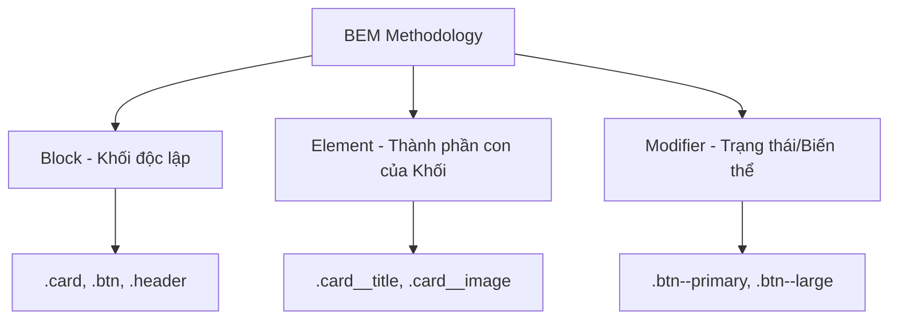

## I. KHÁI QUÁT

Khi một dự án web lớn lên, số lượng file CSS và các class sẽ tăng theo cấp số nhân. Nếu không có một hệ thống tổ chức rõ ràng, CSS sẽ trở thành "một mớ bòng bong" (spaghetti code):
- Các rule ghi đè lẫn nhau một cách khó lường.
- Tính đặc trưng (Specificity) leo thang chóng mặt.
- Rất khó tái sử dụng code.
- Xóa một đoạn CSS có thể làm vỡ giao diện ở một nơi nào đó mà bạn không ngờ tới.

Để giải quyết vấn đề này, các "Phương pháp luận CSS" (CSS Methodologies) ra đời. Đây là những bộ quy tắc về cách đặt tên, tổ chức file, và cấu trúc kiến trúc CSS sao cho dễ bảo trì, dễ mở rộng, và làm việc nhóm hiệu quả.

> [!IMPORTANT]
> Không có phương pháp nào là "đúng nhất" cho mọi dự án. BEM phù hợp với các dự án tĩnh/truyền thống hoặc làm việc với SCSS. CSS Modules hoặc CSS-in-JS thường được ưu tiên trong các hệ sinh thái framework như React/Vue. Utility-First (như Tailwind) đang trở thành xu hướng mạnh mẽ hiện nay.

## II. CHI TIẾT KỸ THUẬT

### 1. BEM (Block, Element, Modifier)

BEM là phương pháp luận phổ biến nhất và được coi là tiêu chuẩn công nghiệp cho việc viết CSS thuần.

**Cú pháp:** `.block__element--modifier`



#### a) Block (Khối)
Một thành phần giao diện đứng độc lập, có ý nghĩa tự thân (vd: `header`, `container`, `menu`, `button`, `card`). Tên block chỉ bao gồm các chữ cái Latin, số, gạch ngang.
- Tốt: `.card {}`
- Xấu: `.red-text {}` (Quá cụ thể về giao diện, mất tính độc lập)

#### b) Element (Phần tử)
Một thành phần của block, không có ý nghĩa khi đứng một mình và bị ràng buộc về mặt ngữ cảnh với block đó. Được phân cách bằng 2 dấu gạch dưới `__`.
- Ví dụ: `.card__image`, `.card__title`, `.card__description`.

#### c) Modifier (Bộ sửa đổi)
Một cờ (flag) trên block hoặc element, thay đổi vẻ bề ngoài hoặc hành vi của nó (trạng thái, kích thước, màu sắc). Phân cách bằng 2 dấu gạch ngang `--`.
- Ví dụ: `.btn--primary`, `.btn--disabled`, `.card--highlighted`.

### 2. OOCSS (Object-Oriented CSS)

Hướng tiếp cận mô phỏng lập trình hướng đối tượng. Nguyên tắc cốt lõi:
- **Tách biệt cấu trúc khỏi giao diện**: Không viết `width`, `height`, `margin` lẫn lộn với `background`, `border-color`.
- **Tách biệt container khỏi nội dung**: Tránh dựa vào HTML tag để style (`.sidebar h2 { ... }`). Thay vào đó dùng class.

OOCSS là nguồn cảm hứng cho các framework như Bootstrap (bạn có thẻ `.btn` chung, và `.btn-primary` riêng cho màu sắc).

### 3. SMACSS (Scalable and Modular Architecture for CSS)

SMACSS tập trung vào việc **phân loại các quy tắc CSS** thành 5 nhóm, giúp quản lý file hệ thống tốt hơn:
1. **Base**: Các thẻ mặc định (reset, typography cơ bản).
2. **Layout**: Các thành phần cấu trúc lớn (header, footer, grid). (Tiền tố `l-` hoặc `layout-`).
3. **Module**: Các thành phần giao diện nhỏ, tái sử dụng (giống Block trong BEM).
4. **State**: Trạng thái hiển thị (ẩn, hiện, active). (Tiền tố `is-`, `has-` như `.is-hidden`, `.has-error`).
5. **Theme**: Giao diện màu sắc tùy chỉnh.

## III. VÍ DỤ MINH HỌA

### BEM trong thực tế (Một Card Component)

**HTML:**
```html
<article class="product-card product-card--sale">
  
  <div class="product-card__content">
    <h2 class="product-card__title">Giày thể thao Nike</h2>
    <p class="product-card__price">
      <span class="product-card__price--old">$100</span>
      <span class="product-card__price--new">$75</span>
    </p>
    <button class="btn btn--primary product-card__btn">Mua ngay</button>
  </div>
</article>
```

**CSS:**
```css
/* Khối độc lập thứ nhất: Button */
.btn { display: inline-block; padding: 10px 20px; border-radius: 4px; }
.btn--primary { background: blue; color: white; }

/* Khối độc lập thứ hai: Product Card */
.product-card {
  border: 1px solid #ccc;
  border-radius: 8px;
  overflow: hidden;
}

/* Modifier làm nổi bật thẻ */
.product-card--sale {
  border-color: red;
  box-shadow: 0 4px 12px rgba(255, 0, 0, 0.2);
}

.product-card__image { width: 100%; display: block; }
.product-card__content { padding: 16px; }
.product-card__title { font-size: 1.25rem; font-weight: bold; margin-bottom: 8px; }

/* Các Modifier của Elements */
.product-card__price { display: flex; gap: 8px; }
.product-card__price--old { text-decoration: line-through; color: #888; }
.product-card__price--new { color: red; font-weight: bold; }

/* Mix class btn vào card để định vị */
.product-card__btn {
  width: 100%;
  margin-top: 16px;
}
```

## IV. LƯU Ý CẠM BẪY

> [!WARNING]
> **Vấn đề Element lồng nhau trong BEM (Grandchild Problem)**: Tránh việc đặt tên Element lồng nhau kiểu `.card__content__title`. BEM không đại diện cho cấu trúc DOM HTML, nó đại diện cho các thành phần độc lập trong một khối. Dù `title` nằm trong `content` trong DOM, tên class CSS chỉ nên là `.card__title`. Nó là con trực tiếp của Khối `card`.

> [!TIP]
> **Nguyên tắc độ ưu tiên (Specificity)**: BEM loại bỏ hoàn toàn vấn đề về specificity bằng cách ép buộc bạn chỉ dùng một cấp selector class duy nhất. KHÔNG bao giờ viết: `.product-card .product-card__title { ... }`. Chỉ viết: `.product-card__title { ... }`. Cấu trúc phẳng này giúp file CSS load nhanh hơn và dễ ghi đè nếu cần.

> [!CAUTION]
> BEM khiến file HTML trông có vẻ rất "xấu xí" và cồng kềnh với nhiều class dài lặp lại chữ `product-card__`. Nếu bạn sử dụng React, Vue, Svelte, nơi mà CSS có tính chất "Scoped" (được cô lập trong từng component), bạn không cần dùng BEM nữa. CSS Modules hoặc thư viện như Styled-components giải quyết bài toán đặt tên tự động.
