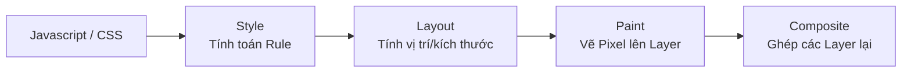

## I. KHÁI QUÁT

CSS có ảnh hưởng cực lớn đến thời gian tải trang và độ mượt mà của các hoạt ảnh (animation). Các quyết định viết CSS sai lầm có thể khiến trang web bị "chặn hiển thị" (render-blocking), làm rớt khung hình (jank) khi scroll, hoặc tiêu tốn quá nhiều pin trên thiết bị di động.

Để tối ưu hóa, ta cần hiểu **Critical Rendering Path (CRP - Luồng kết xuất tới hạn)** - các bước mà trình duyệt chuyển từ HTML, CSS thành các pixel trên màn hình.

> [!IMPORTANT]
> CSS mặc định là tài nguyên **Render-Blocking**. Trình duyệt sẽ trì hoãn việc vẽ (paint) bất cứ nội dung nào lên màn hình cho đến khi nó tải xong và phân tích xong TẤT CẢ các file CSS được liên kết ở `<head>`. 

## II. CHI TIẾT KỸ THUẬT VÀ LUỒNG RENDER

### 1. Rendering Pipeline (Luồng kết xuất của trình duyệt)

Khi vẽ một yếu tố lên màn hình, hoặc khi thuộc tính thay đổi (như hover, animation), trình duyệt chạy qua luồng này:



Mỗi khi bạn thay đổi một thuộc tính CSS:
- Thay đổi `width`, `height`, `margin`, `top`, `left`: Trình duyệt phải tính toán lại toán bộ Layout (Reflow), Paint, Composite. Quá trình này **rất nặng**.
- Thay đổi `color`, `background-color`: Trình duyệt bỏ qua Layout, chỉ thực hiện Paint và Composite (Repaint).
- Thay đổi `transform`, `opacity`: Trình duyệt bỏ qua cả Layout và Paint, chỉ thực hiện Composite bằng GPU (card đồ họa). Đây là **vô cùng nhẹ và mượt**.

### 2. Tối ưu hóa Animations

Nguyên tắc vàng: **Chỉ animate `transform` và `opacity`**.

- **Xấu (Jank, giật lag):**
  ```css
  .box { transition: all 0.3s; left: 0; position: absolute; }
  .box:hover { left: 100px; } /* Kích hoạt reflow liên tục */
  ```

- **Tốt (Mượt 60fps):**
  ```css
  .box { transition: transform 0.3s; transform: translateX(0); }
  .box:hover { transform: translateX(100px); } /* Kích hoạt GPU Composite */
  ```

### 3. Critical CSS (CSS Tới hạn)

Vì CSS chặn kết xuất (Render-blocking), nếu file `style.css` của bạn nặng 500KB, màn hình người dùng sẽ trắng tinh trong suốt thời gian tải file này.

Kỹ thuật Critical CSS:
1. Trích xuất chỉ những quy tắc CSS phục vụ cho phần giao diện hiển thị ngay trên màn hình đầu tiên (Above the fold) (như Header, Hero Banner).
2. Viết trực tiếp (Inline) số CSS này vào `<style>` tag trong phần `<head>` HTML.
3. Tải file `style.css` phần còn lại bất đồng bộ (Asynchronously) sử dụng Javascript hoặc `<link rel="preload">`.

### 4. Thuộc tính `will-change`

Báo trước cho trình duyệt rằng một yếu tố sẽ sớm thay đổi, để trình duyệt chuẩn bị sẵn tài nguyên hoặc đẩy yếu tố đó lên một Layer riêng chạy bằng GPU.

```css
.dropdown-menu {
  /* Báo cho trình duyệt biết chuẩn bị chuyển đổi transform và độ mờ */
  will-change: transform, opacity;
}
```

## III. VÍ DỤ MINH HỌA

### Cách viết CSS Animation chuẩn Hiệu năng

Một chiếc ngăn kéo trượt vào từ bên phải (Side Drawer / Off-canvas menu):

```css
/* --- CÁCH TỒI: Ảnh hưởng Layout --- */
.drawer-bad {
  position: fixed;
  right: -300px; /* Ẩn ngoài màn hình */
  width: 300px;
  transition: right 0.4s ease-out;
}
.drawer-bad.open {
  right: 0; /* Gây tính toán layout toàn bộ tài liệu */
}

/* --- CÁCH TỐT: Sử dụng GPU qua Transform --- */
.drawer-good {
  position: fixed;
  right: 0; /* Đặt thẳng vào vị trí đích */
  width: 300px;
  /* Đẩy ra khỏi màn hình bằng transform */
  transform: translateX(100%); 
  transition: transform 0.4s cubic-bezier(0.16, 1, 0.3, 1);
  /* Trình duyệt tối ưu trước */
  will-change: transform; 
}
.drawer-good.open {
  /* Kéo trở về vị trí 0 mượt mà bằng GPU */
  transform: translateX(0); 
}
```

### Cách tải file CSS Không chặn hiển thị (Non-blocking CSS)

Sử dụng thuộc tính `media` lừa trình duyệt để ưu tiên tải mà không chặn render.

```html
<!-- Chèn Inline Critical CSS cho màn hình đầu -->
<style>
  body { font-family: sans-serif; margin: 0; background: #fff; }
  .header { height: 60px; background: #333; color: white; display: flex; }
</style>

<!-- Tải file main.css một cách bất đồng bộ -->
<!-- Giải thích: Báo với trình duyệt stylesheet này dành cho 'print'.
     Trình duyệt tải nó, nhưng không ưu tiên chặn render.
     Sau khi tải xong (onload), đổi nó lại thành 'all' để áp dụng. -->
<link rel="stylesheet" 
      href="main.css" 
      media="print" 
      onload="this.media='all'">
<noscript>
  <link rel="stylesheet" href="main.css">
</noscript>
```

## IV. LƯU Ý CẠM BẪY

> [!WARNING]
> **Đừng lạm dụng `will-change`**: Việc đặt `will-change: transform` trên mọi phần tử sẽ tiêu tốn bộ nhớ VRAM của GPU một cách khủng khiếp, làm trang web chậm đi chứ không nhanh lên. Chỉ sử dụng cho những đối tượng mà người dùng sắp hoặc đang tương tác, và tốt nhất là gỡ bỏ thuộc tính này (bằng JS) khi animation hoàn tất.

> [!TIP]
> **Tránh Selector phức tạp**: Bộ chọn (Selector) trong CSS được trình duyệt đọc từ PHẢI sang TRÁI. Ví dụ: `.header .nav ul li a`. Trình duyệt sẽ tìm tất cả thẻ `<a>` trên toàn trang trước, sau đó lọc những thẻ nằm trong `li`... Điều này làm chậm quá trình matching. Tốt nhất dùng các Class phẳng và nông (BEM là một giải pháp hoàn hảo cho việc này).

> [!CAUTION]
> **Hạn chế dùng `@import` trong file CSS**: Cú pháp `@import url('style.css');` chặn quá trình tải song song của trình duyệt (trình duyệt phải tải xong file này rồi mới phát hiện có file tiếp theo để tải). Hãy luôn dùng `<link>` thẻ trong HTML để khai báo nhiều file CSS.
