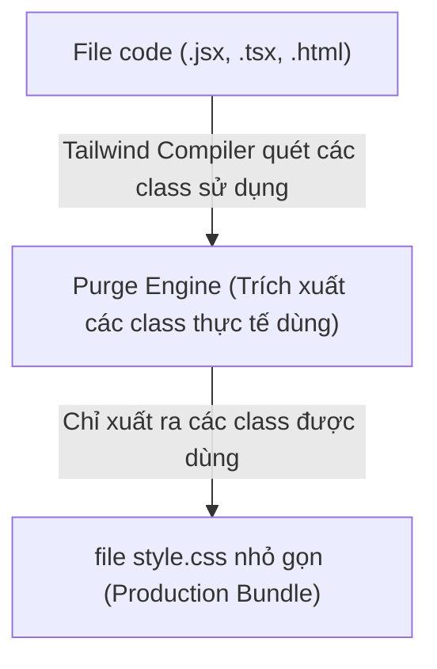

## I. KHÁI QUÁT (OVERVIEW)

### 1. Tại sao dùng Tailwind CSS?
Trong phát triển giao diện web truyền thống, bạn viết các quy tắc CSS tùy biến (custom CSS) trong các file `.css` riêng biệt và liên kết chúng với mã HTML qua các class. Cách làm này gặp phải các vấn đề:
*   **Phình to dung lượng tệp tin (Bundle Bloat):** Khi dự án lớn lên, file CSS phình to không ngừng vì lập trình viên liên tục viết thêm các class mới cho từng UI component.
*   **Khó bảo trì tên class (Class Naming Fatigue):** Mất quá nhiều thời gian để nghĩ ra tên class chuẩn chỉnh (`.card-wrapper`, `.card-inner-container`).
*   **Khó đồng bộ hóa:** Thay đổi CSS ở một nơi có thể vô tình làm vỡ giao diện ở trang khác.

**Tailwind CSS** giải quyết các vấn đề này bằng cách cung cấp một bộ khung **Utility-First** (tiện ích trước tiên) gồm hàng nghìn class nhỏ, đơn chức năng (như `flex`, `pt-4`, `text-center`). Bạn chỉ cần kết hợp các class này trực tiếp trong HTML/JSX để dựng giao diện mà không cần viết một dòng CSS tùy biến nào.



---

## II. CHI TIẾT KỸ THUẬT (DETAILED DEEP DIVE)

### 1. Cơ chế Quét và Tạo File CSS của Tailwind CSS
Tailwind CSS không tải toàn bộ hàng triệu utility classes vào trình duyệt. Thay vào đó, nó hoạt động dựa trên cơ chế biên dịch tĩnh (Just-In-Time Compiler - JIT):
1.  Nó quét toàn bộ mã nguồn của bạn (`.html`, `.js`, `.tsx`,...).
2.  Tìm kiếm các chuỗi ký tự khớp với class của Tailwind (ví dụ: `px-4`, `hover:bg-blue-600`).
3.  Trích xuất và biên dịch **chỉ những class được sử dụng thực tế** vào một file CSS đầu ra duy nhất.
*   *Kết quả:* Dung lượng file CSS production cực kỳ nhỏ gọn (thường dưới 10KB), không đổi cho dù dự án của bạn mở rộng thêm bao nhiêu trang.

> [!WARNING]
> **Không tạo class động bằng phép nối chuỗi (Dynamic Class Names):**
> Vì Tailwind quét mã nguồn dưới dạng text tĩnh trước khi chạy, nó sẽ không hiểu các class được tạo ra bằng phép nối chuỗi JavaScript.
> *   ❌ *Anti-pattern:* `<div className={`text-${error ? 'red' : 'green'}-600`}>`
> *   ✅ *Best practice:* Viết đầy đủ tên class rõ ràng: `<div className={error ? 'text-red-600' : 'text-green-600'}>`

---

### 2. Cấu trúc file cấu hình `tailwind.config.js`
Đây là tệp trung tâm để định nghĩa hệ thống thiết kế (Design System) của dự án.

```javascript
module.exports = {
  // 1. Chỉ định các file chứa code để Tailwind quét class
  content: [
    "./index.html",
    "./src/**/*.{js,ts,jsx,tsx}",
  ],
  theme: {
    // 2. Override hoàn toàn thiết lập mặc định của Tailwind
    screens: {
      'sm': '640px',
      'lg': '1024px',
    },
    extend: {
      // 3. Mở rộng (thêm mới) mà không làm mất các thiết lập mặc định
      colors: {
        brand: {
          light: '#3fbaeb',
          DEFAULT: '#0fa9e6',
          dark: '#0c87b8',
        }
      },
      spacing: {
        '128': '32rem',
      }
    },
  },
  plugins: [],
}
```

#### Phân biệt `theme` vs `theme.extend`
*   **Viết trực tiếp trong `theme`:** Sẽ xóa bỏ hoàn toàn cấu hình mặc định của Tailwind cho thuộc tính đó. Ví dụ: viết `theme: { screens: { ... } }` sẽ làm biến mất các breakpoint mặc định khác (`md`, `xl`, `2xl`).
*   **Viết trong `theme.extend`:** Sẽ giữ nguyên toàn bộ cấu hình mặc định và chỉ chèn thêm hoặc ghi đè các cấu hình tùy biến của bạn.

---

## III. VÍ DỤ MINH HỌA VÀ PHÂN TÍCH CODE (CODE EXAMPLES & ANALYSIS)

### 1. Cài đặt Tailwind CSS cho dự án React + Vite
Dưới đây là quy trình cài đặt và cấu hình chuẩn mực từng bước.

#### Bước 1: Cài đặt các gói npm cần thiết
```bash
npm install -D tailwindcss postcss autoprefixer
npx tailwindcss init -p
```
*   *Lưu ý:* Lệnh `init -p` sẽ tự động tạo ra cả hai file cấu hình: `tailwind.config.js` và `postcss.config.js`.

#### Bước 2: Cập nhật đường dẫn quét file trong `tailwind.config.js`
```javascript
// File: tailwind.config.js
/** @type {import('tailwindcss').Config} */
export default {
  content: [
    "./index.html",
    "./src/**/*.{js,ts,jsx,tsx}", // Quét tất cả file trong src
  ],
  theme: {
    extend: {},
  },
  plugins: [],
}
```

#### Bước 3: Thêm các chỉ thị Tailwind vào file CSS gốc
```css
/* File: src/index.css */
@tailwind base;     /* Chèn các CSS reset mặc định (Preflight) */
@tailwind components; /* Chèn các class dạng component của plugin */
@tailwind utilities;  /* Chèn toàn bộ các class tiện ích (utility classes) */
```

#### Bước 4: Viết Component kiểm thử
```tsx
// File: src/App.tsx
import React from 'react';

export const App: React.FC = () => {
  return (
    <div className="min-h-screen bg-slate-100 flex items-center justify-center">
      <div className="bg-white p-8 rounded-lg shadow-md max-w-sm text-center">
        <h1 className="text-2xl font-bold text-slate-800 mb-2">Tailwind Hoạt động!</h1>
        <p className="text-slate-600 mb-4">Hệ thống cấu hình Vite + Tailwind CSS đã được thiết lập thành công.</p>
        <button className="bg-blue-600 hover:bg-blue-700 text-white font-semibold px-4 py-2 rounded transition-colors">
          Bắt đầu học
        </button>
      </div>
    </div>
  );
};
```

---

## IV. LƯU Ý, CẠM BẪY VÀ QUY TẮC CỐT LÕI (PITFALLS & BEST PRACTICES)

### 1. Cạm bẫy Purge CSS khi deploy Production
*   **Vấn đề:** Khi build ra bản chạy production (`npm run build`), Tailwind quét text tĩnh để xóa bỏ (purge) các class không dùng. Nếu bạn tạo class bằng cách ghép biến chuỗi, css tương ứng của class đó sẽ hoàn toàn biến mất trong file build, làm vỡ giao diện trên Production mặc dù chạy ở Local vẫn ngon lành.
*   **Quy tắc:** Tuyệt đối giữ cho toàn bộ tên class Tailwind ở dạng chuỗi ký tự tĩnh, không dùng toán tử cộng chuỗi hoặc nội suy template string để tạo class động.

### 2. Override Reset CSS mặc định (Preflight)
*   Tailwind đi kèm với một bộ reset CSS mặc định gọi là **Preflight** (xóa margin, padding, đưa border về mặc định, đặt font-family kế thừa).
*   Nếu bạn cần thay đổi một thuộc tính toàn cục (ví dụ: đổi màu nền mặc định của body, hoặc chỉnh sửa mặc định của thẻ h1):
*   ✅ *Best practice:* Sử dụng `@layer base` trong file CSS gốc:
    ```css
    @layer base {
      body {
        @apply bg-slate-50 text-slate-900;
      }
      h1 {
        @apply text-3xl font-extrabold;
      }
    }
    ```

---

## 💡 5 QUY TẮC VÀNG KHI THIẾT LẬP TAILWIND CSS
1.  **Chỉ viết trong `extend` khi muốn giữ mặc định:** Không ghi đè trực tiếp trong `theme` nếu không muốn xóa sạch bộ màu hoặc spacing mặc định của Tailwind.
2.  **Tuyệt đối không ghép class động:** Luôn khai báo đầy đủ tên class rõ ràng để trình biên dịch JIT của Tailwind quét được.
3.  **Tận dụng `@layer` để tổ chức file CSS:** Dùng `@layer base` để reset, `@layer components` để đóng gói cụm style nếu thực sự cần thiết.
4.  **Khai báo đúng mảng `content`:** Đảm bảo toàn bộ các phần mở rộng của file chứa code (`.tsx`, `.jsx`, `.html`) đều được khai báo trong `tailwind.config.js`.
5.  **Cài đặt Tailwind CSS IntelliSense:** Luôn cài đặt extension này trên VS Code để được hỗ trợ tự động gợi ý tên class, hiển thị màu sắc trực quan và xem thuộc tính CSS thuần tương ứng.
