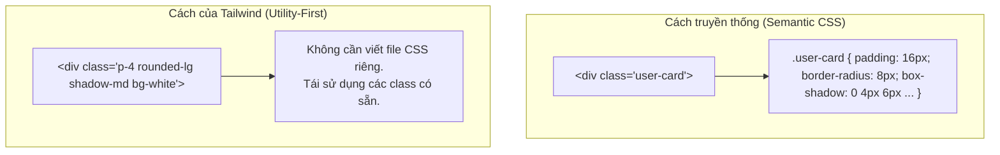

# Bài 02 - Utility-First Fundamentals (Nền tảng tư duy Utility-First)

## I. KHÁI QUÁT (OVERVIEW)

### 1. Triết lý Utility-First (Tiện ích trước tiên) là gì?
Phương pháp thiết kế UI truyền thống yêu cầu bạn đặt tên cho các thành phần giao diện (ví dụ: `.card-container`, `.author-badge`) và viết tất cả thuộc tính CSS bên trong class đó. 

**Utility-First** đi ngược lại hoàn toàn tư duy này. Thay vì cố gắng định nghĩa tên component, bạn xây dựng giao diện bằng cách áp dụng trực tiếp các class tiện ích nhỏ, đơn chức năng.



#### Ưu điểm vượt trội:
1.  **DX (Developer Experience) cực nhanh:** Không cần chuyển đổi liên tục giữa file HTML/JSX và file CSS. Không cần tốn năng lượng suy nghĩ đặt tên class.
2.  **Bundle CSS ổn định:** Dung lượng file CSS không tăng thêm khi viết thêm tính năng mới vì các class tiện ích được dùng đi dùng lại.
3.  **Tự tin Refactor:** Bạn xóa một component $\rightarrow$ CSS đi kèm biến mất theo mà không sợ để lại các class "rác" (unused CSS) trong dự án.

---

## II. CHI TIẾT KỸ THUẬT (DETAILED DEEP DIVE)

### 1. Hệ thống Spacing & Sizing (Khoảng cách & Kích thước)
Tailwind sử dụng một hệ thống tỉ lệ kích thước nhất quán dựa trên đơn vị **`rem`**. 
Mặc định, 1 đơn vị spacing của Tailwind tương đương với **`0.25rem`** (tức là `4px` nếu font-size gốc của trình duyệt là `16px`).

$$\text{Giá trị thực tế (pixels)} = \text{Chỉ số Tailwind} \times 4\text{px}$$

#### Spacing (Margin & Padding):
*   `p-{size}`: Padding cho tất cả các hướng (trên, dưới, trái, phải).
*   `px-{size}` / `py-{size}`: Padding theo trục ngang (trái/phải) hoặc trục dọc (trên/dưới).
*   `m-{size}`: Margin (tương tự như padding).
*   `space-x-{size}` / `space-y-{size}`: Tiện ích tạo khoảng cách giữa các phần tử con bên trong container.

#### Sizing (Width & Height):
*   `w-{size}` / `h-{size}`: Đặt chiều rộng và chiều cao cố định (ví dụ: `w-4` = `1rem` = `16px`).
*   `w-full`, `h-screen`: Đặt chiều rộng 100% hoặc chiều cao bằng khung nhìn màn hình (viewport).
*   `max-w-{size}`: Giới hạn chiều rộng tối đa (ví dụ: `max-w-md`, `max-w-7xl` rất hay dùng làm container).

---

### 2. Typography (Kiểu chữ) & Colors (Màu sắc)

#### a. Typography:
*   `text-{size}`: Đặt cỡ chữ kèm line-height tương ứng (ví dụ: `text-xs` = 12px, `text-base` = 16px, `text-4xl` = 36px).
*   `font-{weight}`: Đặt độ dày chữ (`font-normal`, `font-semibold`, `font-bold`).
*   `tracking-{spacing}`: Khoảng cách giữa các chữ (`tracking-tight`, `tracking-wide`).
*   `leading-{size}`: Độ rộng dòng (`leading-tight`, `leading-loose`).

#### b. Colors & Alpha Channel:
Hệ thống màu của Tailwind được phân cấp từ `50` (nhạt nhất) đến `950` (đậm nhất).
Bạn có thể dễ dàng chỉnh độ trong suốt (opacity) của màu bằng cách thêm dấu gạch chéo `/` kèm tỉ lệ phần trăm:
```html
<div class="bg-blue-500/20 text-blue-900/80">...</div>
<!-- bg-blue-500 với opacity 20%, màu chữ opacity 80% -->
```

---

## III. VÍ DỤ MINH HỌA VÀ PHÂN TÍCH CODE (CODE EXAMPLES & ANALYSIS)

### 1. So sánh chi tiết: Traditional CSS vs Tailwind CSS
Hãy dựng một Card sản phẩm bằng hai phương pháp để thấy rõ sự khác biệt trong tổ chức code.

#### Cách 1: Sử dụng Semantic CSS truyền thống
Mã HTML:
```html
<div class="product-card">
  
  <div class="product-content">
    <span class="product-tag">Mới</span>
    <h3 class="product-title">Bàn phím cơ không dây</h3>
    <p class="product-price">1.500.000đ</p>
  </div>
</div>
```
Mã CSS tương ứng:
```css
.product-card {
  background-color: #ffffff;
  border-radius: 12px;
  box-shadow: 0 4px 6px -1px rgba(0, 0, 0, 0.1);
  overflow: hidden;
  max-width: 320px;
}
.product-image {
  width: 100%;
  height: 200px;
  object-fit: cover;
}
.product-content {
  padding: 20px;
}
.product-tag {
  background-color: #dbeafe;
  color: #1e40af;
  font-size: 12px;
  font-weight: 700;
  padding: 4px 8px;
  border-radius: 9999px;
}
.product-title {
  font-size: 18px;
  font-weight: 600;
  margin-top: 10px;
  color: #1f2937;
}
.product-price {
  color: #059669;
  font-weight: 700;
  margin-top: 8px;
}
```

---

#### Cách 2: Sử dụng Tailwind CSS (Utility-First)
Bạn có thể dựng toàn bộ giao diện tương đương chỉ bằng một tệp HTML/JSX duy nhất mà không cần viết file CSS riêng:

```tsx
// File: src/components/ProductCard.tsx
import React from 'react';

export const ProductCard: React.FC = () => {
  return (
    <div className="max-w-xs bg-white rounded-xl shadow-md overflow-hidden border border-slate-100">
      
      <div className="p-5">
        <span className="bg-blue-100 text-blue-800 text-xs font-bold px-2.5 py-1 rounded-full">
          Mới
        </span>
        <h3 className="text-lg font-semibold text-slate-800 mt-3">
          Bàn phím cơ không dây TKL
        </h3>
        <p className="text-emerald-600 font-bold mt-2 text-base">
          1.500.000đ
        </p>
      </div>
    </div>
  );
};
```

---

## IV. LƯU Ý, CẠM BẪY VÀ QUY TẮC CỐT LÕI (PITFALLS & BEST PRACTICES)

### 1. Cạm bẫy viết các thẻ HTML quá dài (Class Soup / Spaghetti Markup)
*   **Vấn đề:** Khi component lớn, việc chèn hàng chục class vào thuộc tính `className` làm code HTML nhìn rất rối mắt và khó tìm thẻ đóng/mở.
*   ✅ *Best practice:*
    1.  **Chia nhỏ Component:** Nếu một thẻ HTML quá dài, khả năng cao là bạn nên tách nó ra thành các component con nhỏ hơn.
    2.  **Sử dụng biến trung gian:** Gom nhóm các class phức tạp vào một biến hoặc hằng số ngoài JSX.
        ```tsx
        const cardClass = "max-w-xs bg-white rounded-xl shadow-md overflow-hidden border border-slate-100";
        return <div className={cardClass}>...</div>
        ```

### 2. Sử dụng Arbitrary Values (Giá trị tự do) sai cách
Tailwind hỗ trợ viết các giá trị bất kỳ không có trong cấu hình mặc định bằng cách đặt trong ngoặc vuông: `w-[327px]`, `bg-[#1da1f2]`.
*   ❌ *Anti-pattern:* Lạm dụng `[value]` ở khắp mọi nơi khiến hệ thống thiết kế bị mất tính nhất quán.
*   ✅ *Best practice:* Chỉ dùng ngoặc vuông khi giải quyết các trường hợp đặc biệt không thể cấu hình trước (ví dụ: set background image từ một URL động). Còn lại, hãy định nghĩa màu sắc và spacing chung trong file `tailwind.config.js`.

---

## 💡 5 QUY TẮC VÀNG VỀ UTILITY-FIRST
1.  **Không tạo tên class tùy tiện:** Luôn ưu tiên dùng các spacing, sizing và colors có sẵn trong hệ thống chuẩn của Tailwind để giữ giao diện nhất quán.
2.  **Đặt tên class theo thứ tự logic:** Nên viết class theo thứ tự: Layout (flex, grid) $\rightarrow$ Sizing (w, h) $\rightarrow$ Spacing (p, m) $\rightarrow$ Typography (text, font) $\rightarrow$ Background/Borders $\rightarrow$ Effects/Interactions.
3.  **Tận dụng opacity modifier với gạch chéo `/`:** Dễ dàng tạo màu chữ và nền có độ trong suốt mà không cần khai báo thêm mã màu rgba tùy biến.
4.  **Tách nhỏ Component thay vì lạm dụng `@apply`:** Chỉ dùng `@apply` khi cần viết các reset css cơ bản hoặc style cho thư viện bên thứ 3. Không dùng `@apply` để gom nhóm class cho component React thông thường.
5.  **Dùng biến lưu trữ tên class phức tạp:** Giúp code JSX sạch sẽ, dễ đọc và dễ quản lý khi re-render.
