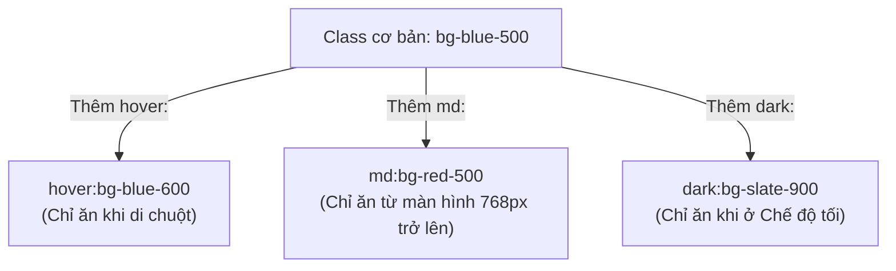

# Bài 03 - Responsive & State Modifiers (Đáp ứng & Bộ điều chỉnh trạng thái)

## I. KHÁI QUÁT (OVERVIEW)

### 1. Modifiers (Bộ điều chỉnh) trong Tailwind là gì?
Trong CSS truyền thống, để xử lý giao diện đáp ứng (Responsive) hoặc các trạng thái tương tác của phần tử (như hover, focus, dark mode), bạn phải viết các block code riêng biệt:
```css
@media (min-width: 768px) { ... }
.btn:hover { ... }
```

Tailwind CSS đơn giản hóa việc này bằng cách sử dụng các **Modifiers** (tiền tố). Bằng cách thêm tên modifier kèm dấu hai chấm `:` trước bất kỳ class tiện ích nào, class đó sẽ chỉ được kích hoạt khi phần tử rơi vào đúng trạng thái hoặc điều kiện tương ứng.



---

## II. CHI TIẾT KỸ THUẬT (DETAILED DEEP DIVE)

### 1. Thiết kế Giao diện Đáp ứng (Responsive Design)
Tailwind áp dụng triết lý thiết kế **Mobile-First** (ưu tiên di động). 
*   **Cơ chế hoạt động:** Bất kỳ class nào không có tiền tố modifier responsive (ví dụ: `w-full`) sẽ áp dụng cho tất cả các kích thước màn hình từ nhỏ nhất trở lên.
*   Các tiền tố như `sm:`, `md:`, `lg:` đóng vai trò là điểm đột phá tối thiểu (minimum breakpoint) tương đương với `@media (min-width: ... )`.

#### Các Breakpoints mặc định:
*   `sm`: `640px` $\rightarrow$ Áp dụng từ màn hình rộng 640px trở lên.
*   `md`: `768px` $\rightarrow$ Áp dụng từ màn hình rộng 768px trở lên (máy tính bảng).
*   `lg`: `1024px` $\rightarrow$ Áp dụng từ màn hình rộng 1024px trở lên (laptop).
*   `xl`: `1280px` $\rightarrow$ Áp dụng từ màn hình rộng 1280px trở lên (desktop).

> [!IMPORTANT]
> **Quy tắc thiết kế Mobile-First:**
> Đừng bao giờ viết `md:w-full` để đặt chiều rộng cho mobile. Hãy đặt `w-full` (mặc định cho mobile) và ghi đè bằng `md:w-1/2` nếu muốn hiển thị nửa màn hình trên máy tính bảng/PC.

---

### 2. Bộ điều chỉnh Trạng thái Tương tác (State Modifiers)
Tailwind hỗ trợ hầu hết các pseudo-classes và pseudo-elements của CSS:
*   `hover:`: Khi người dùng di chuột qua phần tử.
*   `focus:`: Khi phần tử nhận focus (như ô input được nhấp chọn).
*   `active:`: Khi phần tử đang được nhấn giữ.
*   `disabled:`: Khi phần tử HTML có thuộc tính `disabled`.

---

### 3. Bộ điều chỉnh Quan hệ phần tử: Group & Peer

#### a. Group Modifiers (`group`)
Sử dụng khi bạn muốn thay đổi style của một phần tử con dựa trên trạng thái (như hover) của **phần tử cha**.
*   *Cách dùng:* Đặt class `group` ở thẻ cha, và đặt `group-hover:class` ở thẻ con.

#### b. Peer Modifiers (`peer`)
Sử dụng khi bạn muốn thay đổi style của một phần tử dựa trên trạng thái của **phần tử anh em nằm ngay trước nó**.
*   *Cách dùng:* Đặt class `peer` ở thẻ trước, và đặt `peer-focus:class` hoặc `peer-invalid:class` ở thẻ sau.

---

## III. VÍ DỤ MINH HỌA VÀ PHÂN TÍCH CODE (CODE EXAMPLES & ANALYSIS)

### 1. Ứng dụng Group và Peer Modifiers thực tế
Dưới đây là ví dụ về một Card thông báo (sử dụng `group-hover` để đổi màu icon khi hover vào card) và một Input Form (sử dụng `peer-invalid` để hiển thị lỗi động mà không cần dùng JavaScript).

```tsx
// File: src/components/InteractionShowcase.tsx
import React from 'react';

export const InteractionShowcase: React.FC = () => {
  return (
    <div className="space-y-8 p-6 bg-slate-50 min-h-screen">
      
      {/* 1. Ví dụ về Group Hover */}
      <div className="group max-w-sm bg-white p-6 rounded-lg shadow-sm border border-slate-100 hover:bg-indigo-600 hover:shadow-md transition-all duration-300 cursor-pointer">
        <div className="flex items-center space-x-4">
          {/* Icon sẽ đổi màu từ indigo sang white khi HOVER VÀO CARD CHA (group) */}
          <div className="p-3 rounded-full bg-indigo-100 text-indigo-600 group-hover:bg-indigo-500 group-hover:text-white transition-colors duration-300">
            ⚡
          </div>
          <div>
            <h3 className="text-lg font-bold text-slate-800 group-hover:text-white transition-colors">
              Học Tailwind CSS
            </h3>
            <p className="text-slate-500 text-sm group-hover:text-indigo-200 transition-colors">
              Di chuột vào card này để thấy hiệu ứng đổi màu nhóm.
            </p>
          </div>
        </div>
      </div>

      {/* 2. Ví dụ về Peer Modifiers (Tự động hiển thị lỗi input bằng CSS) */}
      <div className="max-w-sm">
        <label className="block text-sm font-semibold text-slate-700 mb-1">
          Địa chỉ Email:
        </label>
        
        {/* Đặt class peer ở input */}
        <input 
          type="email" 
          placeholder="nhap@email.com" 
          className="peer w-full px-4 py-2 border border-slate-300 rounded-md focus:outline-none focus:ring-2 focus:ring-blue-500 invalid:border-pink-500 invalid:text-pink-600 focus:invalid:ring-pink-500"
        />
        
        {/* Thẻ hiển thị lỗi sẽ tự xuất hiện dựa vào trạng thái invalid của peer ở trên */}
        <p className="mt-2 text-sm text-pink-600 invisible peer-invalid:visible">
          Vui lòng nhập đúng định dạng email.
        </p>
      </div>

    </div>
  );
};
```

---

## IV. LƯU Ý, CẠM BẪY VÀ QUY TẮC CỐT LÕI (PITFALLS & BEST PRACTICES)

### 1. Cạm bẫy về thứ tự xếp chồng Modifier (Modifier Stacking)
*   Bạn có thể kết hợp nhiều modifier trên cùng một class (ví dụ: vừa responsive vừa hover vừa dark mode).
*   **Quy tắc:** Thứ tự viết modifier rất quan trọng.
*   *Đúng:* `dark:hover:md:bg-blue-600` (Viết responsive ngoài cùng thường được khuyên dùng để dễ quản lý: `md:dark:hover:bg-blue-600`).
*   Đảm bảo bạn viết modifier theo trình tự nhất quán để dễ đọc code.

### 2. Cạm bẫy về độ ưu tiên của Class (Class Order Pitfall)
*   Nhiều lập trình viên nghĩ rằng viết class sau trong `className` sẽ đè được class trước.
*   *Sai lầm:* `<div className="p-4 p-8">` $\rightarrow$ Không chắc chắn box sẽ nhận padding 8 hay 4. Trình duyệt quyết định độ ưu tiên dựa trên **thứ tự xuất hiện của class trong file CSS được biên dịch**, không phải thứ tự bạn viết trong HTML.
*   ✅ *Best practice:* Sử dụng thư viện `tailwind-merge` khi viết code có tính chất tùy biến class (ví dụ: làm component UI nhận custom className).

---

## 💡 5 QUY TẮC VÀNG VỀ MODIFIERS TRONG TAILWIND
1.  **Luôn tư duy Mobile-First:** Thiết kế giao diện cho màn hình điện thoại trước tiên bằng các class cơ bản, sau đó dùng `md:`, `lg:` để mở rộng bố cục trên PC.
2.  **Đặt tiền tố Responsive ngoài cùng:** Ví dụ: viết `md:hover:bg-blue-500` để đảm bảo hiệu ứng hover chỉ kích hoạt từ màn hình máy tính bảng trở lên.
3.  **Tận dụng `group` cho các hiệu ứng tương tác khối:** Giúp giao diện sinh động hơn mà không cần viết các đoạn code JavaScript quản lý state hover phức tạp.
4.  **Dùng `peer` cho form input validation nhanh:** Tối ưu hiệu năng render bằng cách tận dụng tối đa sức mạnh CSS thuần của trình duyệt để ẩn/hiển thị cảnh báo lỗi.
5.  **Dọn dẹp xung đột class bằng tailwind-merge:** Luôn bọc các biến class động qua hàm `twMerge()` để tránh tình trạng ghi đè style bị lỗi.
