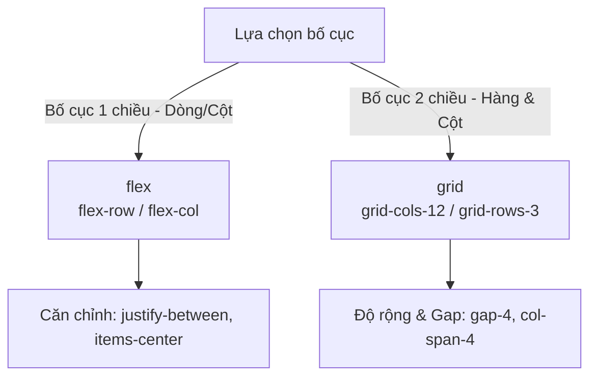

## I. KHÁI QUÁT (OVERVIEW)

### 1. Dựng Layout hiện đại không cần viết Custom CSS
Trước khi có Flexbox và Grid, việc dựng layout trang web dựa trên các thuộc tính `float` hoặc `table-cell` rất phức tạp và dễ gặp lỗi hiển thị.
CSS hiện đại cung cấp hai công cụ bố cục mạnh mẽ:
*   **Flexbox:** Bố cục một chiều (1D), tối ưu cho việc xếp hàng phần tử theo chiều ngang hoặc chiều dọc (ví dụ: thanh Navbar, cụm Button).
*   **Grid:** Bố cục hai chiều (2D), tối ưu cho việc dựng các hệ thống khung lưới phức tạp gồm cả hàng và cột (ví dụ: trang Dashboard, danh sách sản phẩm E-commerce).

Tailwind CSS đóng gói toàn bộ các thuộc tính của Flexbox và Grid thành các class tiện ích trực quan, giúp bạn dựng khung giao diện phức tạp chỉ trong vài giây ngay trên tệp HTML/JSX.



---

## II. CHI TIẾT KỸ THUẬT (DETAILED DEEP DIVE)

### 1. Làm chủ Flexbox với Tailwind
Để biến một phần tử thành Flex Container, bạn chỉ cần dùng class `flex`.

#### Các thuộc tính điều khiển dòng chảy & căn chỉnh:
*   **Hướng (`flex-direction`):** `flex-row` (mặc định - xếp ngang), `flex-col` (xếp dọc).
*   **Ngắt dòng (`flex-wrap`):** `flex-wrap` (tự động xuống dòng khi thiếu chỗ), `flex-nowrap` (mặc định - không xuống dòng).
*   **Căn chỉnh trục chính (`justify-content`):** `justify-start`, `justify-end`, `justify-center`, `justify-between` (dãn đều khoảng cách ở giữa).
*   **Căn chỉnh trục phụ (`align-items`):** `items-start`, `items-center` (căn giữa theo chiều dọc), `items-stretch`.
*   **Khoảng cách (`gap`):** `gap-{size}` (thiết lập khoảng cách giữa các phần tử con tự động).

---

### 2. Làm chủ Grid System với Tailwind
Để biến một phần tử thành Grid Container, sử dụng class `grid`.

#### Các thuộc tính cấu hình lưới:
*   **Cột (`grid-template-columns`):** `grid-cols-{n}` (định nghĩa số cột bằng nhau, hỗ trợ từ `grid-cols-1` đến `grid-cols-12`).
*   **Hàng (`grid-template-rows`):** `grid-rows-{n}`.
*   **Gộp cột (`grid-column-span`):** Đặt class `col-span-{n}` ở phần tử con (Grid Item) để chỉ định nó chiếm bao nhiêu ô (ví dụ: `col-span-4` sẽ chiếm 4/12 cột).
*   **Bắt đầu/Kết thúc (`grid-column-start/end`):** `col-start-{n}`, `col-end-{n}` để định vị trí chính xác của item trên lưới.

---

## III. VÍ DỤ MINH HỌA VÀ PHÂN TÍCH CODE (CODE EXAMPLES & ANALYSIS)

### 1. Dựng Layout Dashboard Responsive hoàn chỉnh
Dưới đây là một ví dụ thực tế về trang Dashboard gồm thanh Sidebar bên trái và khu vực Nội dung chính bên phải. Layout sẽ tự động co giãn từ Mobile (dọc) lên PC (ngang) và sử dụng Grid để chia các thẻ thống kê.

```tsx
// File: src/components/DashboardLayout.tsx
import React from 'react';

export const DashboardLayout: React.FC = () => {
  return (
    // 1. Layout tổng dùng Flexbox, mặc định xếp dọc trên mobile, xếp ngang (flex-row) từ màn hình md trở lên
    <div className="min-h-screen bg-slate-100 flex flex-col md:flex-row">
      
      {/* 2. Sidebar Sidebar bên trái */}
      <aside className="w-full md:w-64 bg-slate-900 text-slate-300 p-6 flex flex-col justify-between">
        <div>
          <div className="text-white text-xl font-extrabold mb-8">ADMIN BOARD</div>
          <nav className="space-y-4">
            <a href="#" className="block py-2.5 px-4 rounded bg-slate-800 text-white">Tổng quan</a>
            <a href="#" className="block py-2.5 px-4 rounded hover:bg-slate-800 hover:text-white transition-colors">Người dùng</a>
            <a href="#" className="block py-2.5 px-4 rounded hover:bg-slate-800 hover:text-white transition-colors">Cài đặt</a>
          </nav>
        </div>
        <div className="text-sm text-slate-500">Phiên bản 1.0.0</div>
      </aside>

      {/* 3. Khu vực nội dung chính bên phải */}
      <main className="flex-1 p-6 md:p-8">
        
        {/* Header dùng Flexbox để căn chỉnh logo/avatar */}
        <header className="flex justify-between items-center mb-8 bg-white p-4 rounded-lg shadow-sm">
          <h1 className="text-2xl font-bold text-slate-800">Báo cáo Hoạt động</h1>
          <div className="w-10 h-10 rounded-full bg-indigo-600 text-white flex items-center justify-center font-bold">
            AD
          </div>
        </header>

        {/* 
          Grid System chia khung thống kê:
          - Mặc định trên Mobile: 1 cột (grid-cols-1)
          - Màn hình Tablet (sm): 2 cột (sm:grid-cols-2)
          - Màn hình Laptop (lg): 4 cột (lg:grid-cols-4)
        */}
        <section className="grid grid-cols-1 sm:grid-cols-2 lg:grid-cols-4 gap-6 mb-8">
          
          <div className="bg-white p-6 rounded-lg shadow-sm border border-slate-100">
            <div className="text-slate-500 text-sm">Doanh thu ngày</div>
            <div className="text-2xl font-bold text-slate-800 mt-2">15,000,000đ</div>
          </div>

          <div className="bg-white p-6 rounded-lg shadow-sm border border-slate-100">
            <div className="text-slate-500 text-sm">Đơn hàng mới</div>
            <div className="text-2xl font-bold text-slate-800 mt-2">124 đơn</div>
          </div>

          <div className="bg-white p-6 rounded-lg shadow-sm border border-slate-100">
            <div className="text-slate-500 text-sm">Khách hàng mới</div>
            <div className="text-2xl font-bold text-slate-800 mt-2">+45 thành viên</div>
          </div>

          <div className="bg-white p-6 rounded-lg shadow-sm border border-slate-100">
            <div className="text-slate-500 text-sm">Tỉ lệ chuyển đổi</div>
            <div className="text-2xl font-bold text-slate-800 mt-2">3.2%</div>
          </div>

        </section>

        {/* Grid chia hai khu vực biểu đồ lớn & danh sách phụ */}
        <section className="grid grid-cols-1 lg:grid-cols-3 gap-6">
          {/* Chiếm 2/3 cột trên màn hình lớn */}
          <div className="lg:col-span-2 bg-white p-6 rounded-lg shadow-sm h-64 flex items-center justify-center text-slate-400 border border-slate-100">
            Khu vực vẽ Biểu đồ Doanh thu (Chart)
          </div>
          
          {/* Chiếm 1/3 cột còn lại */}
          <div className="bg-white p-6 rounded-lg shadow-sm border border-slate-100">
            <h3 className="font-bold text-slate-800 mb-4">Lịch sử tác vụ</h3>
            <ul className="space-y-3 text-sm text-slate-600">
              <li>• Admin cập nhật hệ thống</li>
              <li>• Người dùng A đăng ký</li>
              <li>• Đơn hàng #1243 hoàn tất</li>
            </ul>
          </div>
        </section>

      </main>
    </div>
  );
};
```

---

## IV. LƯU Ý, CẠM BẪY VÀ QUY TẮC CỐT LÕI (PITFALLS & BEST PRACTICES)

### 1. Cạm bẫy dùng Flexbox thay thế cho Grid (và ngược lại)
*   **Sai lầm phổ biến:** Cố gắng dựng một hệ thống lưới 2D phức tạp (nhiều hàng, nhiều cột) bằng cách sử dụng các thẻ Flexbox lồng nhau và tự tính toán phần trăm width cho từng item (`w-1/3`, `w-1/4`).
*   **Hậu quả:** Code cực kỳ rối, khó xử lý khoảng cách (`gap`) chuẩn xác giữa các item và dễ bị lệch hàng khi nội dung chữ có độ dài khác nhau.
*   ✅ *Best practice:* Dùng **Grid** khi cần căn chỉnh cả hàng và cột đồng bộ; dùng **Flexbox** khi chỉ cần sắp xếp các phần tử chạy dọc hoặc chạy ngang một chiều tự nhiên.

### 2. Quên sử dụng `min-w-0` hoặc `truncate` trong Flex Item
*   Trong Flexbox, các phần tử con mặc định có thuộc tính `min-width: auto`. Nếu bên trong flex item có chứa một chuỗi text quá dài hoặc hình ảnh kích thước lớn, nó sẽ làm phình to flex item vượt quá chiều rộng của container cha, gây lỗi vỡ layout.
*   ✅ *Best practice:* Luôn thêm class `min-w-0` vào thẻ cha trực tiếp chứa thẻ text có class `truncate` để trình duyệt thực hiện cắt chữ chính xác.

---

## 💡 5 QUY TẮC VÀNG VỀ LAYOUT TAILWIND
1.  **Dùng class `gap` thay cho margin:** Sử dụng tiện ích `gap` trên Grid/Flex container để quản lý khoảng cách giữa các con thay vì tự đặt margin thủ công cho từng con.
2.  **Thiết lập `flex-col md:flex-row` làm chuẩn responsive:** Cách nhanh nhất để chuyển đổi giao diện từ bố cục cột dọc trên điện thoại sang hàng ngang trên máy tính.
3.  **Tận dụng lưới 12 cột (`grid-cols-12`):** Đây là tỉ lệ lưới tiêu chuẩn vàng giúp bạn chia trang thành các phân đoạn `1/2` (`col-span-6`), `1/3` (`col-span-4`), `1/4` (`col-span-3`) cực kỳ linh hoạt.
4.  **Luôn bọc `flex` khi cần căn giữa tuyệt đối:** Sử dụng tổ hợp class kinh điển `flex items-center justify-center` để đưa một phần tử con vào chính giữa của hộp cha.
5.  **Dùng `flex-1` để chiếm phần không gian còn lại:** Sử dụng `flex-1` hoặc `flex-grow` cho phần nội dung chính để nó tự động giãn nở lấp đầy diện tích thừa bên cạnh các sidebar cố định kích thước.
