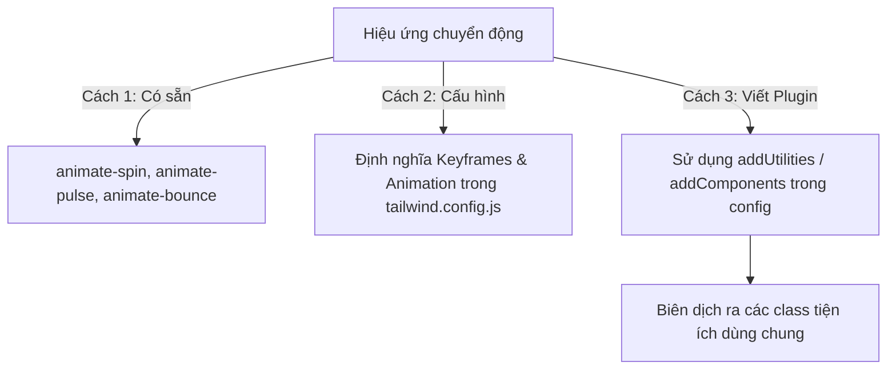

# Bài 06 - Animation & Custom Plugins (Hoạt hình & Plugin tuỳ biến)

## I. KHÁI QUÁT (OVERVIEW)

### 1. Vai trò của hiệu ứng chuyển động (Animation)
Trong thiết kế UI/UX hiện đại, **Transitions** (chuyển tiếp) và **Animations** (hoạt hình) không chỉ giúp trang web trông sinh động, bắt mắt hơn mà còn là công cụ quan trọng để cải thiện trải nghiệm người dùng (UX):
*   Cung cấp phản hồi thị giác ngay lập tức khi click/hover (Visual Feedback).
*   Định hướng sự chú ý của người dùng vào các thay đổi trạng thái (ví dụ: thông báo lỗi rung lắc, Skeleton Loading cho biết dữ liệu đang tải).

Tailwind cung cấp sẵn các class hoạt hình thông dụng và cho phép bạn viết thêm các **Custom Plugins** để mở rộng hệ thống class mặc định theo nhu cầu riêng của dự án mà không cần phá vỡ cấu trúc tiện ích.



---

## II. CHI TIẾT KỸ THUẬT (DETAILED DEEP DIVE)

### 1. Làm chủ Transitions (Hiệu ứng chuyển tiếp) trong Tailwind
Để các thay đổi về màu sắc, kích thước, hoặc độ mờ diễn ra mượt mà thay vì giật cục lập tức, bạn sử dụng tổ hợp class:
```html
<button class="transition-all duration-300 ease-in-out hover:scale-105">...</button>
```
*   `transition-{property}`: Chỉ định thuộc tính nào sẽ chuyển tiếp (`colors`, `opacity`, `transform`, `all`).
*   `duration-{time}`: Thời gian chuyển động (`duration-150` = 150ms, `duration-300` = 300ms).
*   `ease-{timing-function}`: Hàm phân bổ thời gian gia tốc (`ease-in`, `ease-out`, `ease-in-out`, hoặc `ease-linear`).
*   `delay-{time}`: Thời gian chờ trước khi chuyển động.

---

### 2. Viết Custom Plugins trong Tailwind CSS
Hệ thống plugin của Tailwind cho phép bạn đăng ký thêm các class tùy biến trực tiếp vào file cấu hình. Bạn sử dụng các API do Tailwind cung cấp sẵn:
1.  **`addBase`**: Đăng ký các style mặc định cho thẻ HTML gốc (như `@layer base`).
2.  **`addUtilities`**: Đăng ký các class tiện ích đơn giản (như `@layer utilities`).
3.  **`addComponents`**: Đăng ký các component class phức tạp (như nút bấm, thẻ card - tương đương `@layer components`).

---

## III. VÍ DỤ MINH HỌA VÀ PHÂN TÍCH CODE (CODE EXAMPLES & ANALYSIS)

### 1. Tạo hiệu ứng Skeleton Loading & Custom Keyframes trong Config
Dưới đây là cách cấu hình một hiệu ứng hoạt hình tùy biến dạng "lượn sóng" (shimmer effect) rất phổ biến trong các bộ xương tải trang (Skeleton Loaders).

```javascript
// File: tailwind.config.js
const plugin = require('tailwindcss/plugin');

module.exports = {
  content: ["./src/**/*.{html,js,tsx}"],
  theme: {
    extend: {
      // 1. Định nghĩa các keyframes hoạt hình tùy biến
      keyframes: {
        shimmer: {
          '100%': { transform: 'translateX(100%)' },
        },
        wiggle: {
          '0%, 100%': { transform: 'rotate(-3deg)' },
          '50%': { transform: 'rotate(3deg)' },
        }
      },
      // 2. Ánh xạ keyframe vào tên class hoạt hình của Tailwind
      animation: {
        shimmer: 'shimmer 2s infinite',
        wiggle: 'wiggle 0.5s ease-in-out infinite',
      }
    },
  },
  plugins: [
    // 3. Tự viết một Custom Plugin để tạo hiệu ứng phủ thủy tinh (Glassmorphism)
    plugin(function({ addComponents, addUtilities }) {
      // Thêm class tiện ích mới
      addUtilities({
        '.text-shadow-sm': {
          'text-shadow': '1px 1px 2px rgba(0, 0, 0, 0.1)',
        },
      });
      
      // Thêm component class mới
      addComponents({
        '.glass-card': {
          'background': 'rgba(255, 255, 255, 0.2)',
          'backdrop-filter': 'blur(8px)',
          '-webkit-backdrop-filter': 'blur(8px)',
          'border': '1px solid rgba(255, 255, 255, 0.3)',
          'box-shadow': '0 4px 30px rgba(0, 0, 0, 0.1)',
        }
      });
    })
  ],
}
```

---

### 2. Sử dụng class Animation & Skeleton Loader trong React
Dưới đây là một ví dụ sử dụng class hoạt hình vừa tạo để tạo UI Skeleton Loader.

```tsx
// File: src/components/SkeletonLoader.tsx
import React from 'react';

export const SkeletonLoader: React.FC = () => {
  return (
    <div className="max-w-sm w-full mx-auto p-4 bg-white border border-slate-100 rounded-xl shadow-sm space-y-4">
      {/* Hình ảnh giả lập đang tải */}
      <div className="relative overflow-hidden bg-slate-200 h-48 w-full rounded-lg">
        {/* Lớp phủ shimmer lướt qua */}
        <div className="absolute inset-0 -translate-x-full bg-gradient-to-r from-transparent via-white/40 to-transparent animate-shimmer" />
      </div>

      {/* Dòng tiêu đề giả lập đang tải */}
      <div className="space-y-3">
        <div className="relative overflow-hidden bg-slate-200 h-6 w-3/4 rounded">
          <div className="absolute inset-0 -translate-x-full bg-gradient-to-r from-transparent via-white/40 to-transparent animate-shimmer" />
        </div>
        <div className="relative overflow-hidden bg-slate-200 h-4 w-1/2 rounded">
          <div className="absolute inset-0 -translate-x-full bg-gradient-to-r from-transparent via-white/40 to-transparent animate-shimmer" />
        </div>
      </div>
    </div>
  );
};
```

---

## IV. LƯU Ý, CẠM BẪY VÀ QUY TẮC CỐT LÕI (PITFALLS & BEST PRACTICES)

### 1. Vấn đề hiệu năng khi lạm dụng hiệu ứng chuyển động
*   **Cảnh báo:** Việc chạy quá nhiều animations đồng thời (nhất là các thuộc tính làm thay đổi layout hình học như `width`, `height`, `top`, `left`) sẽ ép trình duyệt phải Reflow liên tục, gây sụt giảm FPS (giật lag màn hình).
*   **Giải pháp:** Chỉ làm hoạt hình các thuộc tính được tối ưu hóa bằng phần cứng (GPU Accelerated) như **`transform`** (`translate`, `scale`, `rotate`) và **`opacity`**.

### 2. Tôn trọng tùy chọn giảm chuyển động của người dùng (A11y)
*   Một số người dùng bị chứng rối loạn tiền đình và cảm thấy buồn nôn khi nhìn các hiệu ứng chuyển động nhanh trên màn hình. Hệ điều hành cung cấp tùy chọn "Reduce Motion" để giảm bớt các hiệu ứng này.
*   ✅ *Best practice:* Sử dụng tiền tố **`motion-reduce:`** để tắt hoạt hình tương ứng:
    ```html
    <div class="animate-spin motion-reduce:animate-none">...</div>
    ```

---

## 💡 5 QUY TẮC VÀNG VỀ ANIMATION TRONG TAILWIND
1.  **Chỉ làm hoạt hình Transform & Opacity:** Giúp hoạt hình chạy mượt mà ở mức 60 FPS nhờ tận dụng card đồ họa (GPU).
2.  **Đặt thời gian chuyển tiếp hợp lý:** Thời gian transition tốt nhất cho tương tác micro-interaction (hover button, tooltip) là từ **150ms đến 300ms**. Quá lâu sẽ tạo cảm giác ứng dụng bị phản hồi chậm.
3.  **Tắt hoạt hình bằng `motion-reduce`:** Đảm bảo khả năng tiếp cận (Accessibility) tốt nhất cho những người dùng nhạy cảm với chuyển động.
4.  **Viết plugin để tái sử dụng style chung:** Gom nhóm các thuộc tính CSS nâng cao (như shadow đặc biệt, gradient phức tạp) thành plugin để giữ sạch code JSX.
5.  **Dùng `will-change` cho hoạt hình siêu nặng:** Thêm class `will-change-transform` hoặc `will-change-opacity` để báo trước cho trình duyệt chuẩn bị tài nguyên phần cứng, nâng cao hiệu năng hoạt hình.
