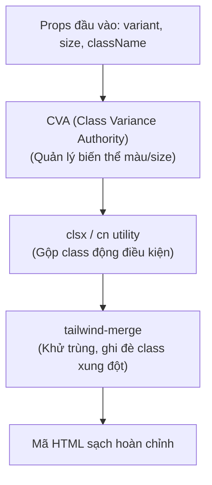

## I. KHÁI QUÁT (OVERVIEW)

### 1. Thách thức khi viết Reusable Components bằng Tailwind CSS
Khi bạn đóng gói các style của Tailwind CSS vào các React Component có khả năng tái sử dụng (như nút bấm `<Button>`, ô nhập liệu `<Input>`), bạn sẽ gặp phải các bài toán thiết kế:
*   **Giải quyết xung đột class:** Làm thế nào để cho phép Component nhận thêm class tùy biến từ bên ngoài (`className` prop) và ghi đè chính xác các class mặc định mà không bị lỗi ưu tiên CSS?
*   **Quản lý nhiều biến thể (Variants):** Một button có thể có nhiều biến thể (`primary`, `secondary`, `danger`), nhiều kích cỡ (`sm`, `md`, `lg`), và nhiều trạng thái (`disabled`, `loading`).
*   **Tránh lạm dụng `@apply`:** Nhiều lập trình viên từ CSS truyền thống chuyển sang có xu hướng lạm dụng `@apply` để gom nhóm class trong file CSS, làm mất đi hoàn toàn lợi ích của tư duy Utility-First (tiện ích trước tiên).

Bài học này hướng dẫn các mẫu thiết kế và công cụ tiêu chuẩn công nghiệp (**tailwind-merge**, **clsx**, **CVA**) để giải quyết triệt để các thách thức trên.



---

## II. CHI TIẾT KỸ THUẬT (DETAILED DEEP DIVE)

### 1. Giải quyết xung đột class bằng `tailwind-merge` & `clsx`

#### a. Vấn đề của phép cộng chuỗi thông thường:
Nếu bạn viết code nối chuỗi class:
```typescript
const Button = ({ className }) => {
  return <button className={`px-4 py-2 bg-blue-500 ${className}`} />;
}
```
Khi gọi: `<Button className="px-6 bg-red-500" />`
Mã HTML nhận được sẽ là `class="px-4 py-2 bg-blue-500 px-6 bg-red-500"`.
Do độ ưu tiên CSS được quyết định bởi thứ tự xuất hiện trong file stylesheet được build chứ không phải thứ tự bạn viết trong chuỗi class, trình duyệt có thể vẫn áp dụng `px-4` và `bg-blue-500` đè lên giá trị mới của bạn.

#### b. Giải pháp: `tailwind-merge`
Thư viện `tailwind-merge` sẽ tự động phân tích cú pháp chuỗi class, nhận diện các class thuộc cùng một thuộc tính (như padding, background color) và thực hiện **giữ lại class cuối cùng**, loại bỏ các class cũ bị trùng lặp.
*   *Đầu vào:* `twMerge('px-4 py-2 bg-blue-500 px-6 bg-red-500')`
*   *Đầu ra:* `'py-2 px-6 bg-red-500'` (Tối ưu tuyệt đối!).

---

### 2. Quản lý biến thể với Class Variance Authority (CVA)
**CVA** là thư viện mạnh mẽ giúp bạn khai báo cấu trúc biến thể của Component dưới dạng mã JavaScript cực kỳ sạch sẽ và dễ đọc, tránh việc viết các câu lệnh `if-else` hay toán tử ba ngôi lồng nhau chằng chịt để gán class.

---

## III. VÍ DỤ MINH HỌA VÀ PHÂN TÍCH CODE (CODE EXAMPLES & ANALYSIS)

### 1. Thiết kế Component Button vạn năng (Reusable Button)
Dưới đây là mã nguồn hoàn chỉnh của một Component Button tiêu chuẩn doanh nghiệp, tích hợp đầy đủ TypeScript, tailwind-merge, clsx, và CVA.

#### Bước 1: Tạo hàm helper `cn` (gộp clsx và twMerge)
Hàm tiện ích này được dùng chung cho toàn bộ dự án để gộp class.
```typescript
// File: src/utils/cn.ts
import { clsx, type ClassValue } from 'clsx';
import { twMerge } from 'tailwind-merge';

export function cn(...inputs: ClassValue[]) {
  return twMerge(clsx(inputs));
}
```

#### Bước 2: Dựng Component Button bằng CVA
```tsx
// File: src/components/Button.tsx
import React from 'react';
import { cva, type VariantProps } from 'class-variance-authority';
import { cn } from '../utils/cn';

// 1. Định nghĩa cấu trúc biến thể bằng CVA
const buttonVariants = cva(
  // Các class mặc định áp dụng cho tất cả các nút
  "inline-flex items-center justify-center rounded-lg text-sm font-semibold transition-colors duration-200 focus:outline-none focus:ring-2 focus:ring-offset-2 disabled:opacity-50 disabled:pointer-events-none",
  {
    variants: {
      variant: {
        primary: "bg-blue-600 text-white hover:bg-blue-700 focus:ring-blue-500",
        secondary: "bg-slate-100 text-slate-900 hover:bg-slate-200 focus:ring-slate-500",
        danger: "bg-red-600 text-white hover:bg-red-700 focus:ring-red-500",
        outline: "border border-slate-300 bg-transparent text-slate-700 hover:bg-slate-50 focus:ring-slate-500",
      },
      size: {
        sm: "h-9 px-3 text-xs",
        md: "h-10 px-4 py-2",
        lg: "h-11 px-8 rounded-md text-base",
      }
    },
    // Các giá trị mặc định nếu người dùng không truyền props
    defaultVariants: {
      variant: "primary",
      size: "md",
    }
  }
);

// 2. Kế thừa các thuộc tính HTML chuẩn của thẻ button kết hợp với CVA Variants
export interface ButtonProps
  extends React.ButtonHTMLAttributes<HTMLButtonElement>,
    VariantProps<typeof buttonVariants> {}

export const Button: React.FC<ButtonProps> = ({
  className,
  variant,
  size,
  ...props
}) => {
  return (
    <button
      // Sử dụng hàm cn để gộp class của CVA và class tùy biến từ bên ngoài
      className={cn(buttonVariants({ variant, size }), className)}
      {...props}
    />
  );
};
```

---

## IV. LƯU Ý, CẠM BẪY VÀ QUY TẮC CỐT LÕI (PITFALLS & BEST PRACTICES)

### 1. Cạm bẫy lạm dụng tiền chỉ thị `@apply`
*   **Lỗi thường gặp:** Lập trình viên lười gõ class trong HTML nên viết lại CSS theo kiểu cũ:
    ```css
    .btn-submit {
      @apply px-4 py-2 bg-blue-500 text-white rounded;
    }
    ```
*   **Hậu quả:**
    1.  Làm tăng dung lượng file CSS được build vì Tailwind không thể tối ưu hóa và tái sử dụng class.
    2.  Làm mất đi tính linh hoạt của Utility-First. Khi bạn cần đổi màu nền nút submit khi hover hoặc responsive, bạn lại phải mở file CSS ra viết thêm quy tắc.
*   ✅ *Best practice:* Hãy tạo component React (ví dụ: `<Button>`) để gom nhóm class ở cấp độ component logic, thay vì gom nhóm class ở cấp độ file CSS bằng `@apply`.

---

## 💡 5 QUY TẮC VÀNG VỀ COMPONENT TAILWIND
1.  **Luôn bọc class bằng hàm `cn`:** Kết hợp `clsx` và `twMerge` để dọn dẹp các class trùng lặp và hỗ trợ gộp class có điều kiện an toàn.
2.  **Sử dụng CVA để quản lý Variants:** Tránh xa các cấu trúc gán class thủ công bằng logic ba ngôi rắc rối, nâng cao tính trực quan và khả năng mở rộng component.
3.  **Hạn chế tối đa `@apply`:** Chỉ dùng `@apply` cho các style base toàn cục. Hãy đóng gói UI bằng React Component thay vì viết class CSS tùy biến.
4.  **Kế thừa thuộc tính HTML chuẩn:** Đảm bảo sử dụng `React.ButtonHTMLAttributes` hoặc tương ứng để component của bạn hỗ trợ đầy đủ các props chuẩn như `onClick`, `disabled`, `type`.
5.  **Thiết lập Default Variants rõ ràng:** Giúp lập trình viên gọi component nhanh mà không cần khai báo quá nhiều props cấu hình kích thước hoặc màu sắc.
