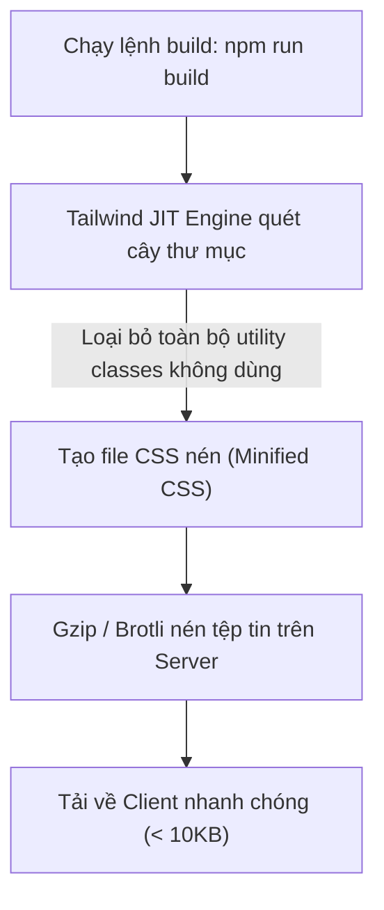

# Bài 08 - Tailwind in Production (Tối ưu Tailwind cho sản phẩm thực tế)

## I. KHÁI QUÁT (OVERVIEW)

### 1. Tại sao cần tối ưu hóa Tailwind CSS cho Production?
Mặc dù ở môi trường phát triển (Development), Tailwind CSS cung cấp một file CSS lớn chứa đầy đủ tất cả các class để lập trình viên gõ đến đâu ăn đến đó, nhưng khi triển khai sản phẩm thực tế (**Production**), chúng ta bắt buộc phải tối ưu hóa dung lượng tệp tin tải về để:
*   Tăng tốc độ tải trang khởi tạo (giảm chỉ số **FCP** - First Contentful Paint).
*   Giảm băng thông tiêu thụ của máy chủ và người dùng.
*   Cải thiện điểm số đánh giá hiệu năng (Lighthouse score).

Tailwind CSS tích hợp các cơ chế biên dịch tĩnh thông minh để đảm bảo file CSS đầu ra đạt độ nhỏ gọn tối đa, hầu như không chứa bất kỳ dòng code dư thừa nào.



---

## II. CHI TIẾT KỸ THUẬT (DETAILED DEEP DIVE)

### 1. Cơ chế hoạt động của Just-In-Time (JIT) Engine
Trước phiên bản 3, Tailwind tạo ra tất cả class trước rồi mới dùng PurgeCSS để lọc bỏ. Từ phiên bản 3 trở đi, công cụ **JIT (Just-In-Time) Engine** được kích hoạt mặc định:
*   JIT không tạo sẵn bất kỳ class nào trong bộ nhớ.
*   Khi bạn thay đổi file code (ví dụ thêm class `bg-indigo-900`), JIT ngay lập tức phát hiện thay đổi, biên dịch class đó sang CSS tương ứng và đẩy vào trình duyệt theo thời gian thực (Hot Reload).
*   *Lợi ích:* Tốc độ build cực nhanh, hỗ trợ viết class tự do dạng `w-[350px]` và loại bỏ hoàn toàn các class thừa ngay từ pha phát triển.

---

### 2. Thiết lập Công cụ Định dạng Code (Prettier Plugin)
Khi viết Tailwind CSS, các thẻ HTML có thể chứa hàng chục class, gây khó khăn cho việc đọc và bảo trì. Để giữ mã nguồn sạch sẽ, đội ngũ Tailwind cung cấp một plugin định dạng mã nguồn tự động dành cho **Prettier**.
*   **Cơ chế hoạt động:** Plugin sẽ tự động sắp xếp lại thứ tự các class Tailwind theo một trật tự logic nhất định (từ layout, sizing, spacing đến màu sắc) mỗi khi bạn lưu file (Save).

#### Thứ tự sắp xếp mặc định của Plugin:
1.  Các class cấu trúc layout (`flex`, `grid`, `block`).
2.  Kích thước (`w-*`, `h-*`).
3.  Khoảng cách (`p-*`, `m-*`).
4.  Màu sắc & Typography (`text-*`, `bg-*`).
5.  Trạng thái Modifiers (`hover:`, `md:`, `dark:`).

---

## III. VÍ DỤ MINH HỌA VÀ PHÂN TÍCH CODE (CODE EXAMPLES & ANALYSIS)

### 1. Quy trình Cài đặt & Cấu hình Prettier tự động sắp xếp Class
Dưới đây là các bước thiết lập để tự động hóa việc định dạng code Tailwind CSS trong dự án của bạn.

#### Bước 1: Cài đặt Prettier và Plugin Tailwind
```bash
npm install -D prettier prettier-plugin-tailwindcss
```

#### Bước 2: Tạo file cấu hình `.prettierrc`
Tạo file `.prettierrc` tại thư mục gốc của dự án và khai báo plugin:
```json
{
  "plugins": ["prettier-plugin-tailwindcss"],
  "semi": true,
  "singleQuote": true,
  "tabWidth": 2,
  "trailingComma": "es5"
}
```

#### Bước 3: Xem hiệu quả định dạng tự động
Trước khi lưu file (code lộn xộn):
```tsx
// Code lộn xộn do gõ nhanh
<button className="text-white hover:bg-blue-700 bg-blue-600 rounded-lg p-4 font-bold flex items-center">
  Gửi thông tin
</button>
```

Sau khi nhấn Lưu file (`Ctrl + S` / Auto-format):
```tsx
// Code tự động được sắp xếp lại theo trật tự chuẩn khoa học
<button className="flex items-center rounded-lg bg-blue-600 p-4 font-bold text-white hover:bg-blue-700">
  Gửi thông tin
</button>
```
*   *Phân tích:* `flex` và `items-center` (layout) được đưa lên đầu, `p-4` (spacing) nằm giữa, màu sắc và hover modifiers được đưa ra phía sau. Việc này giúp tất cả các thành viên trong đội ngũ phát triển viết code có cấu trúc giống hệt nhau, dễ dàng rà soát và review code.

---

## IV. LƯU Ý, CẠM BẪY VÀ QUY TẮC CỐT LÕI (PITFALLS & BEST PRACTICES)

### 1. Cạm bẫy cấu hình sai Content Paths
*   **Vấn đề:** Khai báo thiếu đường dẫn thư mục chứa code trong mảng `content` của `tailwind.config.js`.
*   **Hậu quả:** Khi bạn build production, Tailwind không quét được các file thiếu đó và sẽ hiểu lầm rằng các class viết trong các file đó không được sử dụng. Nó sẽ tiến hành xóa bỏ sạch sẽ các class này, làm trang web bị vỡ giao diện hoàn toàn khi deploy lên Server.
*   ✅ *Best practice:* Luôn kiểm tra kỹ mảng `content` để bao phủ toàn bộ các thư mục chứa code UI:
    ```javascript
    content: [
      "./index.html",
      "./src/**/*.{js,ts,jsx,tsx}", // Quét đúp vào tất cả thư mục con
    ]
    ```

---

## 💡 5 QUY TẮC VÀNG KHI ĐƯA TAILWIND LÊN PRODUCTION
1.  **Luôn dùng Prettier Plugin Tailwind:** Đảm bảo tất cả các file code của dự án đều có cấu trúc class được sắp xếp đồng bộ, dễ bảo trì.
2.  **Rà soát kỹ mảng Content trước khi Build:** Đảm bảo không bỏ sót bất kỳ file `.tsx`, `.jsx` hay `.html` nào để tránh lỗi mất class khi purge.
3.  **Tận dụng nén Gzip/Brotli trên Web Server:** Cấu hình Web Server (Nginx, Apache, Vercel) nén file CSS trước khi gửi xuống client để giảm dung lượng tải xuống tối đa.
4.  **Bật Tailwind CSS IntelliSense trên IDE:** Tăng tốc độ viết code và hạn chế tối đa việc gõ sai chính tả tên class.
5.  **Tránh lạm dụng Arbitrary Classes (`[...]`):** Giới hạn tối đa việc viết class tự do để bảo toàn tính đồng bộ của hệ thống thiết kế tổng thể.
