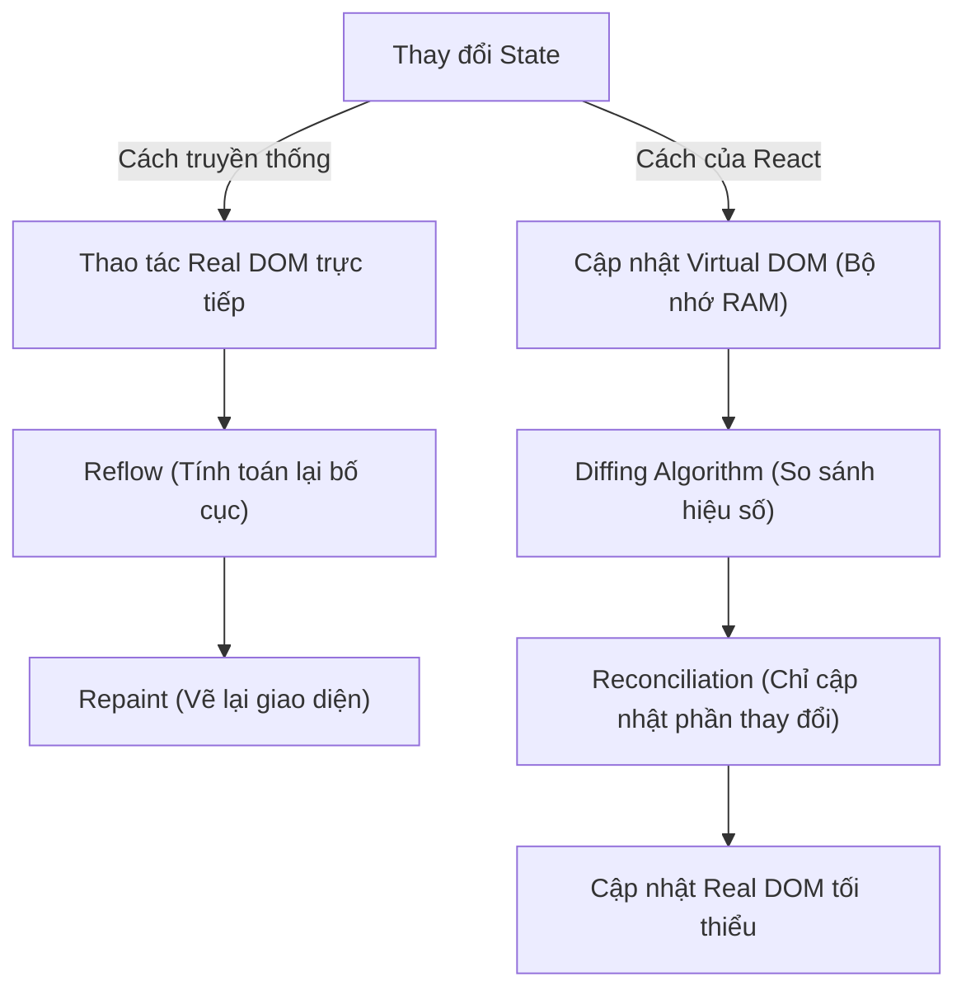
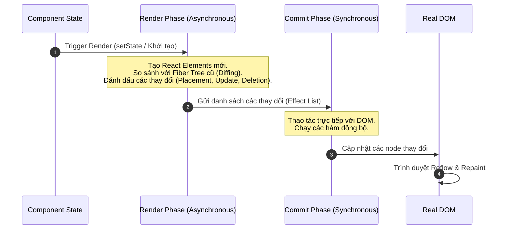

## I. KHÁI QUÁT (OVERVIEW)

### 1. Tại sao React sử dụng Virtual DOM?
Trong phát triển web truyền thống, việc cập nhật giao diện người dùng (UI) yêu cầu thao tác trực tiếp trên **Real DOM** (Document Object Model) của trình duyệt. 
Thao tác này cực kỳ tốn kém về mặt hiệu năng vì mỗi khi DOM thay đổi, trình duyệt phải tính toán lại bố cục hình học (**Reflow/Layout**) và vẽ lại giao diện trên màn hình (**Repaint**).



**Virtual DOM** (DOM ảo) ra đời như một bản sao bằng JSON cực nhẹ của Real DOM, được lưu trữ hoàn toàn trên bộ nhớ RAM. React không ngăn chặn việc Reflow/Repaint của trình duyệt, nhưng nó giúp **tối thiểu hóa** số lần Real DOM phải thay đổi thông qua cơ chế so sánh hiệu số giữa hai phiên bản DOM ảo.

### 2. Triết lý thiết kế: Declarative (Khai báo) vs Imperative (Mệnh lệnh)
*   **Imperative (Mệnh lệnh):** Bạn phải chỉ ra từng bước để thay đổi UI (ví dụ: tìm phần tử, tạo thẻ mới, gán text, append vào cha).
*   **Declarative (Khai báo):** Bạn chỉ cần mô tả giao diện trông như thế nào tương ứng với từng trạng thái (`State`). Khi State thay đổi, React sẽ tự động lo phần cập nhật UI tương ứng.

---

## II. CHI TIẾT KỸ THUẬT (DETAILED DEEP DIVE)

### 1. Luồng Render của React (React Render Pipeline)
Quá trình render của React kể từ phiên bản 16 (với kiến trúc **React Fiber**) được chia thành 2 giai đoạn chính:



#### a. Giai đoạn 1: Render Phase (Không đồng bộ - Asynchronous)
*   React sẽ duyệt qua cây Component từ trên xuống dưới để xác định xem component nào cần được render.
*   Nó sẽ gọi hàm của component để lấy về kết quả JSX, chuyển đổi JSX thành các đối tượng React Element (Virtual DOM).
*   **Diffing Algorithm (Thuật toán so sánh):** React so sánh cây Virtual DOM mới tạo với cây Virtual DOM cũ để tìm ra sự khác biệt.
*   *Đặc điểm:* Giai đoạn này hoàn toàn chạy ngầm trong bộ nhớ RAM, có thể bị tạm dừng, hủy bỏ hoặc ưu tiên lại bởi React Scheduler (cơ chế xử lý đồng thời - Concurrent Mode).

#### b. Giai đoạn 2: Commit Phase (Đồng bộ - Synchronous)
*   React áp dụng các thay đổi đã được tính toán từ Render Phase lên Real DOM (sử dụng các API như `appendChild`, `removeChild`, `setAttribute`).
*   *Đặc điểm:* Chạy đồng bộ và không thể bị ngắt quãng để tránh tình trạng giao diện bị hiển thị nửa chừng (đứt gãy UI).

---

### 2. Thuật toán Diffing (Diffing Algorithm) & O(N) Complexity
Thuật toán so sánh hai cây thông thường có độ phức tạp là $O(N^3)$. Với một trang web có 1000 phần tử, trình duyệt cần thực hiện tới 1 tỷ phép so sánh $\rightarrow$ Không khả thi trong thực tế.

React đã áp dụng một thuật toán heuristic có độ phức tạp tuyến tính **$O(N)$** dựa trên 2 giả định cốt lõi:
1.  **Khác kiểu phần tử (Different Types):** Hai phần tử thuộc hai kiểu khác nhau (ví dụ: `<div>` chuyển thành `<span>`) sẽ tạo ra hai cây hoàn toàn khác nhau. React sẽ hủy bỏ toàn bộ cây cũ (unmount) và dựng lại cây mới từ đầu.
2.  **Khóa của danh sách (Keys in Lists):** Lập trình viên có thể cung cấp thuộc tính `key` để báo cho React biết phần tử nào được giữ nguyên giữa các lần render.

> [!WARNING]
> **Hiệu ứng Domino khi thay đổi thẻ cha:**
> Nếu bạn thay đổi thẻ bao bọc từ `<div class="wrapper">` thành `<section class="wrapper">`, dù toàn bộ các component con bên trong không hề thay đổi cấu trúc, React vẫn sẽ hủy (unmount) toàn bộ các con và khởi tạo lại chúng từ đầu. Điều này có thể gây sụt giảm hiệu năng nghiêm trọng nếu cây con chứa nhiều logic phức tạp.

---

## III. VÍ DỤ MINH HỌA VÀ PHÂN TÍCH CODE (CODE EXAMPLES & ANALYSIS)

### 1. Cách React biểu diễn Virtual DOM bằng Object
Khi bạn viết mã JSX:
```tsx
// File: src/components/Badge.tsx
const Badge = ({ text }: { text: string }) => {
  return (
    <div className="badge" id="special-badge">
      <span>{text}</span>
    </div>
  );
};
```

Sau khi qua trình biên dịch (như Babel hoặc SWC), đoạn mã trên thực chất sẽ trở thành các lệnh gọi hàm JavaScript thuần túy:
```javascript
// File biên dịch (React 17+ sử dụng JSX Transform mới)
import { jsx as _jsx } from "react/jsx-runtime";

const Badge = ({ text }) => {
  return _jsx("div", {
    className: "badge",
    id: "special-badge",
    children: _jsx("span", {
      children: text
    })
  });
};
```

Kết quả trả về của hàm `_jsx` là một Plain JavaScript Object đại diện cho một node Virtual DOM:
```json
{
  "type": "div",
  "props": {
    "className": "badge",
    "id": "special-badge",
    "children": {
      "type": "span",
      "props": {
        "children": "Thông tin Badge"
      }
    }
  },
  "key": null,
  "ref": null
}
```

---

### 2. Sự nguy hiểm của việc dùng Index làm Key trong danh sách
Dưới đây là một ví dụ minh họa trực quan tại sao việc sử dụng chỉ số mảng (`index`) làm thuộc tính `key` lại gây ra lỗi hiển thị hoặc sụt giảm hiệu năng khi danh sách bị xáo trộn hoặc thêm/bớt phần tử.

```tsx
// File: src/components/TodoList.tsx
import React, { useState } from 'react';

interface Todo {
  id: string;
  text: string;
}

export const TodoList: React.FC = () => {
  const [todos, setTodos] = useState<Todo[]>([
    { id: '1', text: 'Học React Rendering' },
    { id: '2', text: 'Học NestJS Architecture' }
  ]);

  const addAtStart = () => {
    // Thêm một item mới vào ĐẦU danh sách
    setTodos([
      { id: Date.now().toString(), text: 'Bài tập CSS Box Model' },
      ...todos
    ]);
  };

  return (
    <div>
      <button onClick={addAtStart}>Thêm vào đầu</button>
      
      {/* ❌ ANTI-PATTERN: Sử dụng index làm key */}
      <ul>
        {todos.map((todo, index) => (
          <li key={index}>
            <input type="text" defaultValue={todo.text} />
          </li>
        ))}
      </ul>

      {/* ✅ BEST PRACTICE: Sử dụng id duy nhất làm key */}
      <ul>
        {todos.map((todo) => (
          <li key={todo.id}>
            <input type="text" defaultValue={todo.text} />
          </li>
        ))}
      </ul>
    </div>
  );
};
```

#### Phân tích lỗi (Index as Key):
1.  Khi danh sách ban đầu gồm: `[A (key: 0), B (key: 1)]`.
2.  Sau khi thêm `C` vào đầu, danh sách mới là: `[C (key: 0), A (key: 1), B (key: 2)]`.
3.  React so sánh các phần tử theo key:
    *   Nó thấy `key: 0` cũ (A) và `key: 0` mới (C) $\rightarrow$ React nghĩ rằng phần tử tại đây chỉ bị thay đổi nội dung chứ không phải phần tử mới. Nó giữ lại DOM element của ô `<input>` cũ và gán giá trị mới đè lên.
    *   Tương tự với các phần tử sau.
    *   Hậu quả: Trạng thái nội bộ của các ô input (như giá trị người dùng đang gõ dở) sẽ bị xáo trộn lung tung, không đi kèm với đúng dữ liệu của nó.

---

## IV. LƯU Ý, CẠM BẪY VÀ QUY TẮC CỐT LÕI (PITFALLS & BEST PRACTICES)

### 1. Render không đồng nghĩa với Vẽ lên màn hình (Painting)
*   **Hiểu lầm phổ biến:** Mỗi khi một component "render" tức là trình duyệt phải vẽ lại DOM trên màn hình.
*   **Thực tế:** Render chỉ là quá trình chạy hàm component và thực hiện so sánh Virtual DOM. Nếu kết quả so sánh không có thay đổi nào so với trước đó, React sẽ không chạm vào Real DOM, trình duyệt hoàn toàn không phải vẽ lại (no paint/no layout).

### 2. Tránh thay đổi cấu trúc thẻ HTML một cách tùy tiện
*   Khi cần ẩn/hiển thị một phần tử, tránh đổi tag của phần tử cha để giữ nguyên luồng render của cây con.
*   ❌ *Anti-pattern:*
    ```tsx
    showSection ? (
      <section><MyComponent /></section>
    ) : (
      <div><MyComponent /></div>
    )
    ```
*   ✅ *Best practice:* Giữ nguyên thẻ cha, chỉ thay đổi class hoặc điều kiện render của con:
    ```tsx
    <div className={showSection ? "section-style" : "div-style"}>
      <MyComponent />
    </div>
    ```

---

## 💡 5 QUY TẮC VÀNG VỀ REACT RENDERING
1.  **Luôn dùng Key duy nhất & không đổi:** Tuyệt đối không dùng `Math.random()` hoặc `index` của mảng làm key nếu danh sách có tính chất thêm, sửa, xóa hoặc sắp xếp lại.
2.  **Giữ Component Pure:** Hàm component phải là pure function, không được thay đổi biến toàn cục hoặc thực hiện side effects trực tiếp trong quá trình render (phải đưa vào `useEffect`).
3.  **Tách nhỏ Component hợp lý:** Khi một state thay đổi, toàn bộ component chứa nó và các con của nó sẽ bị re-render. Hãy tách nhỏ các phần chứa state thay đổi thường xuyên (như ô Input, Timer) thành component riêng để cô lập phạm vi re-render.
4.  **Tư duy khai báo trạng thái:** Thiết kế state tối giản, tránh lưu trữ các state có thể tính toán được từ các state khác (ví dụ: không lưu `fullNameState` nếu đã có `firstNameState` và `lastNameState`).
5.  **Tôn trọng Immutability:** Luôn tạo bản sao mới khi thay đổi State kiểu đối tượng hoặc mảng (`setObject({ ...object })`). Nếu mutate trực tiếp (`object.name = 'new'`), React sẽ không nhận biết được sự thay đổi để kích hoạt quá trình render.
