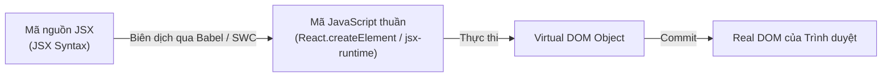

# Bài 02 - JSX Deep Dive (Phân tích sâu cú pháp JSX)

## I. KHÁI QUÁT (OVERVIEW)

### 1. JSX là gì và Tại sao lại cần JSX?
**JSX** (JavaScript XML) là một phần mở rộng cú pháp (syntax extension) cho JavaScript, cho phép bạn viết mã có cấu trúc tương tự như HTML ngay bên trong tệp tin JavaScript.

*   **Trước khi có JSX:** Các nhà phát triển phải tạo UI bằng cách nối chuỗi HTML thủ công hoặc sử dụng các hàm lồng nhau phức tạp (`document.createElement`).
*   **Triết lý của React:** UI và Logic xử lý UI thực chất liên quan chặt chẽ với nhau (gắn kết logic sự kiện, quản lý trạng thái hiển thị). Thay vì chia tách nhân tạo bằng cách để HTML ở một file và JS ở một file khác, React gộp chúng lại thành các khối xây dựng gọi là **Components**.



> [!IMPORTANT]
> Trình duyệt **không hiểu** cú pháp JSX. JSX bắt buộc phải được biên dịch (compile) sang mã JavaScript tiêu chuẩn trước khi chạy trên trình duyệt.

---

## II. CHI TIẾT KỸ THUẬT (DETAILED DEEP DIVE)

### 1. Quá trình biên dịch JSX (Under the Hood)
Trước React 17, trình biên dịch (như Babel) sẽ chuyển đổi toàn bộ mã JSX thành các lệnh gọi hàm `React.createElement()`.

#### Ví dụ biên dịch kiểu cũ (React < 17):
Mã JSX:
```tsx
const element = <h1 className="title">Hello World</h1>;
```
Babel sẽ dịch sang:
```javascript
const element = React.createElement("h1", { className: "title" }, "Hello World");
```

#### Cơ chế biên dịch kiểu mới (React 17+ & React 19):
React giới thiệu **JSX Transform** mới. Trình biên dịch sẽ tự động import các hàm đặc biệt từ thư viện con `react/jsx-runtime` của React. Bạn không cần phải viết `import React from 'react'` ở đầu mỗi file nữa.

Mã JSX:
```tsx
const element = <h1 className="title">Hello World</h1>;
```
Biên dịch sang:
```javascript
import { jsx as _jsx } from "react/jsx-runtime";

const element = _jsx("h1", {
  className: "title",
  children: "Hello World"
});
```

---

### 2. Các quy tắc cú pháp cốt lõi của JSX

#### a. Chỉ được trả về một phần tử gốc duy nhất (Single Root Element)
Do một hàm JavaScript chỉ có thể trả về một giá trị duy nhất (hoặc một mảng/đối tượng đơn lẻ), JSX yêu cầu toàn bộ mã phải được bao bọc trong một phần tử gốc duy nhất.
Nếu không muốn thêm thẻ `<div>` dư thừa làm bẩn cây DOM, bạn phải dùng **React Fragment** (`<></>` hoặc `<React.Fragment>`):

```tsx
// ✅ ĐÚNG CHUẨN
const UserProfile = () => {
  return (
    <>
      <h1>Nguyễn Văn A</h1>
      <p>Lập trình viên Frontend</p>
    </>
  );
};
```

#### b. Đóng toàn bộ các thẻ (Self-Closing Tags)
Tất cả các thẻ trong JSX bắt buộc phải có thẻ đóng. Các thẻ không chứa con (như ``, `<input>`, `<br>`) phải được viết ở dạng tự đóng:
```tsx

<input type="text" />
<br />
```

#### c. Đặt tên thuộc tính theo kiểu camelCase
Vì JSX được dịch sang JavaScript, các thuộc tính của nó sẽ trở thành các key trong Object. Do đó, tên thuộc tính HTML phải tuân thủ chuẩn đặt tên camelCase của JavaScript.
*   `class` $\rightarrow$ `className` (tránh trùng từ khóa `class` của JS).
*   `onclick` $\rightarrow$ `onClick`.
*   `tabindex` $\rightarrow$ `tabIndex`.
*   `for` (trong thẻ label) $\rightarrow$ `htmlFor`.

---

### 3. Đưa biểu thức JavaScript vào JSX
Bạn có thể nhúng bất kỳ biểu thức JavaScript hợp lệ nào vào JSX bằng cách đặt nó bên trong cặp ngoặc nhọn `{}`.

| Loại biểu thức | Ví dụ trong JSX | Kết quả hiển thị |
| :--- | :--- | :--- |
| **Biến/Thuộc tính** | `<span>{user.name}</span>` | Tên của user |
| **Tính toán / Hàm** | `<span>Tổng: {price * quantity}</span>` | Kết quả số |
| **Gọi hàm** | `<div>{formatDate(new Date())}</div>` | Chuỗi ngày đã định dạng |
| **Mảng JSX Elements**| `<ul>{[<li key="1">A</li>, <li key="2">B</li>]}</ul>` | Danh sách A, B |

---

## III. VÍ DỤ MINH HỌA VÀ PHÂN TÍCH CODE (CODE EXAMPLES & ANALYSIS)

### 1. Phân tích các kỹ thuật Render có điều kiện (Conditional Rendering)

Dưới đây là 3 cách phổ biến nhất để xử lý ẩn/hiển thị UI dựa trên điều kiện trong React thực tế:

```tsx
// File: src/components/AuthStatus.tsx
import React from 'react';

interface AuthStatusProps {
  isLoggedIn: boolean;
  userRole: 'admin' | 'user' | 'guest';
}

export const AuthStatus: React.FC<AuthStatusProps> = ({ isLoggedIn, userRole }) => {
  
  // Cách 1: Sử dụng toán tử điều kiện 3 ngôi (Ternary Operator)
  // Phù hợp khi muốn thay đổi giữa 2 UI khác nhau rõ rệt
  const loginButton = isLoggedIn ? (
    <button className="btn-logout">Đăng xuất</button>
  ) : (
    <button className="btn-login">Đăng nhập</button>
  );

  // Cách 2: Sử dụng toán tử logic && (Short-circuit Evaluation)
  // Phù hợp khi chỉ muốn hiển thị UI nếu điều kiện ĐÚNG, ngược lại không hiển thị gì cả
  const adminPanel = isLoggedIn && userRole === 'admin' && (
    <div className="admin-alert">
      <p>Chào mừng Admin! Bạn có quyền cấu hình hệ thống.</p>
    </div>
  );

  // Cách 3: Sử dụng câu lệnh Switch-Case hoặc If-Else ngoài khối return
  // Phù hợp cho logic rẽ nhiều nhánh phức tạp
  const renderDashboard = () => {
    switch (userRole) {
      case 'admin':
        return <AdminDashboard />;
      case 'user':
        return <UserDashboard />;
      default:
        return <GuestView />;
    }
  };

  return (
    <div className="auth-container">
      {loginButton}
      {adminPanel}
      <main className="dashboard-area">
        {renderDashboard()}
      </main>
    </div>
  );
};

// Các component con giả lập
const AdminDashboard = () => <div>Admin Dashboard</div>;
const UserDashboard = () => <div>User Dashboard</div>;
const GuestView = () => <div>Guest View</div>;
```

---

### 2. Thuộc tính dynamic và Kỹ thuật JSX Spread Attributes
Khi bạn muốn truyền một tập hợp nhiều thuộc tính từ một object vào một phần tử JSX, thay vì gõ từng cái, bạn có thể sử dụng toán tử spread `...`.

```tsx
// File: src/components/CustomButton.tsx
import React from 'react';

interface ButtonProps extends React.ButtonHTMLAttributes<HTMLButtonElement> {
  variant: 'primary' | 'secondary';
}

export const CustomButton: React.FC<ButtonProps> = ({ variant, ...restProps }) => {
  // Tách biệt thuộc tính 'variant' riêng, các thuộc tính chuẩn còn lại của button
  // (như onClick, type, disabled, id, className...) sẽ nằm trong object 'restProps'
  
  const baseClassName = variant === 'primary' ? 'btn-primary' : 'btn-secondary';

  return (
    <button className={baseClassName} {...restProps}>
      {restProps.children}
    </button>
  );
};

// Cách sử dụng bên ngoài:
const App = () => {
  return (
    <CustomButton 
      variant="primary" 
      type="submit" 
      onClick={() => console.log('Clicked!')}
      disabled={false}
    >
      Gửi thông tin
    </CustomButton>
  );
};
```

---

## IV. LƯU Ý, CẠM BẪY VÀ QUY TẮC CỐT LÕI (PITFALLS & BEST PRACTICES)

### 1. Cạm bẫy với số 0 khi sử dụng toán tử logic `&&`
*   **Hành vi nguy hiểm:** Khi giá trị kiểm tra phía trước toán tử `&&` trả về số `0` (kiểu số), React sẽ không ẩn nó đi mà sẽ **hiển thị số 0 lên màn hình**.
*   ❌ *Anti-pattern:*
    ```tsx
    const items = [];
    return <div>{items.length && <p>Bạn có sản phẩm!</p>}</div>
    // Màn hình sẽ hiển thị: 0
    ```
*   ✅ *Best practice:* Ép kiểu về boolean một cách tường minh hoặc sử dụng so sánh lớn hơn:
    ```tsx
    return <div>{items.length > 0 && <p>Bạn có sản phẩm!</p>}</div>
    // Hoặc:
    return <div>{!!items.length && <p>Bạn có sản phẩm!</p>}</div>
    ```

### 2. Sự khác biệt lớn giữa JSX và String/Template Literals
*   Nhiều người mới học nhầm lẫn JSX là một chuỗi ký tự JavaScript.
*   **Thực tế:** Chuỗi ký tự chỉ là text thuần túy. Còn JSX sau khi thực thi sẽ trả về một **JavaScript Object** có cấu trúc cụ thể, mô tả các thuộc tính của element. Bạn không thể truyền trực tiếp chuỗi HTML thô vào JSX mà mong nó render ra element, ngoại trừ trường hợp dùng thuộc tính nguy hiểm `dangerouslySetInnerHTML`.

---

## 💡 5 QUY TẮC VÀNG KHI VIẾT JSX
1.  **Luôn bọc Fragment khi trả về nhiều tag sibling:** Tránh chèn các thẻ `<div>` vô nghĩa làm phình to cây DOM và gây lỗi khi làm việc với Flexbox/Grid CSS.
2.  **Đặt tên Component viết hoa chữ cái đầu (PascalCase):** React dựa vào chữ cái đầu tiên để phân biệt thẻ HTML chuẩn (như `<div>`, `<section>` - viết thường) và Custom Component của bạn (như `<Button />`, `<Card />` - viết hoa).
3.  **Tách logic tính toán ra ngoài JSX:** Không viết các biểu thức xử lý logic hoặc tính toán quá phức tạp ngay trong cặp ngoặc nhọn `{}` của return. Hãy xử lý nó ở phần thân component trước khi return.
4.  **Bảo vệ mã chống XSS:** Mặc định, React sẽ tự động mã hóa (sanitize) toàn bộ các giá trị chuỗi trước khi render ra màn hình để phòng chống tấn công XSS. Không bao giờ tắt tính năng này trừ khi thực sự hiểu rủi ro.
5.  **Dùng toán tử spread một cách kiểm soát:** Việc lạm dụng `{...props}` có thể vô tình truyền các thuộc tính không hợp lệ xuống HTML element, gây ra các cảnh báo lỗi trên console của trình duyệt.
