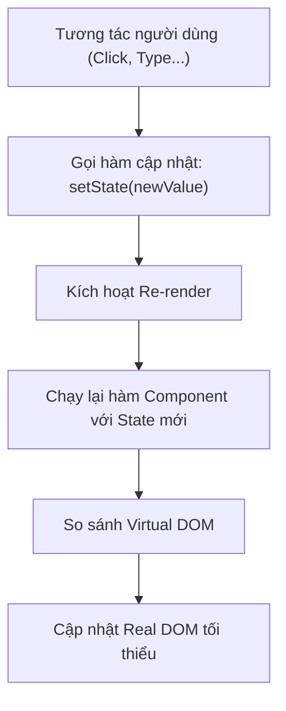

## I. KHÁI QUÁT (OVERVIEW)

### 1. State là gì? Tại sao phải cần State?
Nếu **Props** đại diện cho dữ liệu bên ngoài truyền vào và không thể thay đổi (bất biến), thì **State** (Trạng thái) đại diện cho dữ liệu nội bộ của một Component, có thể thay đổi theo thời gian thông qua các tương tác của người dùng hoặc các tác vụ bất đồng bộ.

*   **Nguyên lý kích hoạt re-render:** Khi State của một Component thay đổi, React sẽ tự động kích hoạt (trigger) quá trình render lại (re-render) Component đó và toàn bộ các Component con của nó để cập nhật giao diện hiển thị mới nhất.



---

## II. CHI TIẾT KỸ THUẬT (DETAILED DEEP DIVE)

### 1. Cơ chế hoạt động của Hook `useState` (Under the Hood)
Khi bạn gọi `const [state, setState] = useState(initialValue)`, React sẽ lưu trữ trạng thái này trong một cấu trúc danh sách liên kết đơn (Linked List) nằm ngoài Component.
Mỗi node trong danh sách đại diện cho một Hook của Component đó, được sắp xếp theo **thứ tự gọi Hook**.

```text
Component Fiber Node
    │
    └── memoizedState ──> [ Hook 1 (useState) ] ──> [ Hook 2 (useEffect) ] ──> [ Hook 3 (useState) ]
                               │                                                 │
                               └── state: 0                                      └── state: "light"
```

> [!IMPORTANT]
> **Quy tắc vàng của Hooks (Rules of Hooks):**
> Do React dựa hoàn toàn vào thứ tự gọi Hook để ánh xạ đúng State, bạn **tuyệt đối không được** gọi Hook bên trong câu lệnh điều kiện (`if`), vòng lặp (`for`), hoặc các hàm lồng nhau. Thứ tự gọi các Hook phải luôn luôn đồng nhất giữa mọi lần render.

---

### 2. Quy tắc Bất biến của State (State Immutability)
Trong JavaScript, các kiểu dữ liệu tham chiếu (Object, Array) được lưu trữ bằng địa chỉ vùng nhớ. Khi cập nhật State là một Object hoặc Array, React thực hiện so sánh nông (**Shallow Comparison**) bằng toán tử `Object.is`.
Nếu bạn thay đổi trực tiếp thuộc tính của đối tượng:
```javascript
state.name = "New Name";
setState(state); // ❌ React sẽ không kích hoạt render lại!
```
Vì địa chỉ vùng nhớ của `state` không hề thay đổi, React nghĩ rằng trạng thái cũ và mới trùng nhau.

#### Quy tắc cập nhật chuẩn (Tạo bản sao mới):
```javascript
setState({ ...state, name: "New Name" }); // ✅ Tạo vùng nhớ mới, React nhận biết được thay đổi
```

---

### 3. Cơ chế Gom cụm Cập nhật (Automatic Batching)
Để tối ưu hóa hiệu năng, React không re-render ngay lập tức mỗi khi bạn gọi `setState`. Thay vào đó, nó áp dụng cơ chế **Batching** (Gom cụm): Gộp nhiều lần gọi `setState` trong cùng một sự kiện lại và chỉ thực hiện re-render một lần duy nhất ở cuối.

#### Ví dụ cơ chế Batching:
```typescript
const [count, setCount] = useState(0);

const handleClick = () => {
  setCount(count + 1);
  setCount(count + 1);
  setCount(count + 1);
};
// Kết quả sau khi click: count chỉ tăng lên 1, không phải 3!
```
*   **Giải thích:** Trong mỗi lần gọi `setCount`, giá trị `count` vẫn là `0` (vì quá trình render chưa diễn ra). Ba câu lệnh thực chất là `setCount(0 + 1)`.

#### Giải pháp: Sử dụng Functional Update (Cập nhật dạng hàm)
Nếu trạng thái mới phụ thuộc trực tiếp vào trạng thái trước đó, bạn phải truyền một callback function vào `setState`:
```typescript
setCount(prevCount => prevCount + 1);
setCount(prevCount => prevCount + 1);
setCount(prevCount => prevCount + 1);
// Kết quả: count tăng lên 3 chính xác!
```

---

### 4. Vòng đời của Component (Component Lifecycle)
Trong Function Components, chúng ta không còn các phương thức vòng đời truyền thống của Class Components (như `componentDidMount`, `componentWillUnmount`). Thay vào đó, chúng ta tư duy theo các giai đoạn trạng thái thông qua các Hooks:

| Giai đoạn | Cơ chế trong Function Component |
| :--- | :--- |
| **Mounting** (Khởi tạo) | Hàm component chạy lần đầu, thực thi lazy state initialization, `useEffect` chạy lần đầu. |
| **Updating** (Cập nhật) | Re-render khi State/Props thay đổi, chạy cleanup của effect cũ và chạy effect mới. |
| **Unmounting** (Hủy bỏ) | Chạy hàm cleanup của `useEffect` (dependency array rỗng `[]`). |

---

### 5. Tại sao Hook chạy 2 lần trong StrictMode?
Khi bật chế độ StrictMode (`<React.StrictMode>`), React sẽ cố tình gọi hàm Component, các hàm khởi tạo State và các effect **2 lần** trong môi trường Development.
*   **Mục đích:** Giúp phát hiện các hàm không thuần túy (Side Effects) hoặc rò rỉ bộ nhớ (Memory Leaks) trước khi deploy lên Production. Chế độ này hoàn toàn không ảnh hưởng khi build production.

---

## III. VÍ DỤ MINH HỌA VÀ PHÂN TÍCH CODE (CODE EXAMPLES & ANALYSIS)

### 1. Lazy State Initialization (Khởi tạo State lười biếng)
Nếu giá trị khởi tạo của `useState` cần được tính toán thông qua một tác vụ nặng (như đọc dữ liệu từ `localStorage` hoặc giải mã JSON), việc truyền trực tiếp lệnh gọi hàm vào `useState` sẽ khiến tác vụ đó bị chạy lại vô ích ở **mỗi lần component re-render**.

```tsx
// File: src/components/Settings.tsx
import React, { useState } from 'react';

const getInitialTheme = (): string => {
  console.log('Tác vụ nặng đọc LocalStorage đang chạy...');
  return localStorage.getItem('app-theme') || 'light';
};

export const Settings: React.FC = () => {
  // ❌ ANTI-PATTERN: Hàm getInitialTheme() bị gọi ở mỗi lần re-render
  // const [theme, setTheme] = useState(getInitialTheme());

  // ✅ BEST PRACTICE: Truyền một callback function (Lazy Initialization)
  // Hàm này chỉ chạy DUY NHẤT một lần khi component mount lần đầu
  const [theme, setTheme] = useState<string>(() => getInitialTheme());

  const toggleTheme = () => {
    setTheme(prev => {
      const nextTheme = prev === 'light' ? 'dark' : 'light';
      localStorage.setItem('app-theme', nextTheme);
      return nextTheme;
    });
  };

  return (
    <div className={`settings-page ${theme}`}>
      <p>Theme hiện tại: {theme}</p>
      <button onClick={toggleTheme}>Đổi Theme</button>
    </div>
  );
};
```

---

## IV. LƯU Ý, CẠM BẪY VÀ QUY TẮC CỐT LÕI (PITFALLS & BEST PRACTICES)

### 1. Đồng bộ hóa State sai cách (Stale State)
*   **Cạm bẫy:** Sử dụng giá trị State ngay sau khi vừa gọi hàm `setState`.
*   ❌ *Anti-pattern:*
    ```tsx
    const [user, setUser] = useState({ name: 'A' });
    const updateName = () => {
      setUser({ name: 'B' });
      console.log(user.name); // ❌ Màn hình console vẫn in ra 'A', không phải 'B'
    };
    ```
*   **Giải thích:** `setUser` là tác vụ bất đồng bộ. Giá trị `user` chỉ thay đổi ở lần render tiếp theo, không phải ngay lập tức ở dòng code dưới.
*   ✅ *Best practice:* Nếu cần dùng giá trị mới ngay lập tức, hãy tạo một biến trung gian hoặc sử dụng `useEffect` để lắng nghe sự thay đổi của State.

---

## 💡 5 QUY TẮC VÀNG VỀ STATE & LIFECYCLE
1.  **Tuyệt đối không mutate State trực tiếp:** Luôn tuân thủ nguyên tắc bất biến bằng cách tạo bản sao mới thông qua toán tử spread (`...`) hoặc thư viện `Immer`.
2.  **Sử dụng Functional Updates khi cần tích lũy:** Luôn truyền callback `prev => prev + 1` nếu state mới phụ thuộc trực tiếp vào giá trị của state cũ.
3.  **Áp dụng Lazy Initialization cho tác vụ nặng:** Chỉ truyền callback `() => getHeavyData()` vào `useState` để tránh tính toán lại vô ích khi re-render.
4.  **Giữ nguyên vị trí gọi Hooks:** Tuyệt đối không đặt `useState` bên trong câu lệnh điều kiện hoặc vòng lặp.
5.  **Không đồng bộ state dư thừa:** Nếu một giá trị có thể tính toán được từ props hoặc từ các state hiện có, hãy tính trực tiếp nó trong phần render thay vì tạo thêm một state mới.
