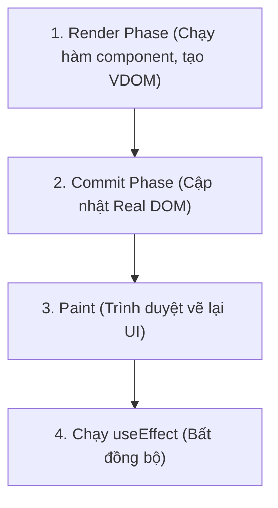
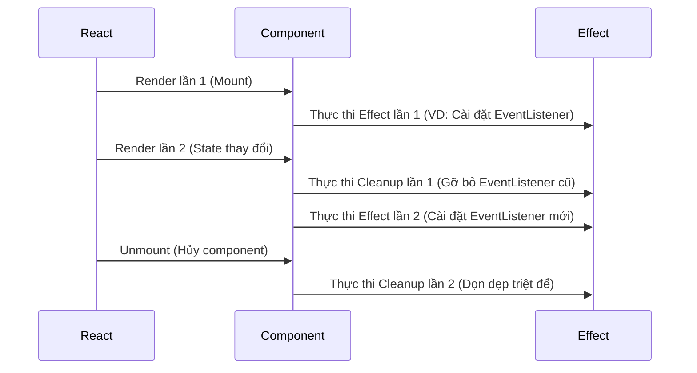

# Bài 05 - useEffect & Side Effects (Hiệu ứng phụ & Đồng bộ hóa)

## I. KHÁI QUÁT (OVERVIEW)

### 1. Side Effect là gì?
Trong lập trình hàm, một hàm được gọi là thuần túy (**Pure Function**) nếu nó luôn trả về cùng một kết quả cho cùng một tham số đầu vào và không gây ra bất kỳ tác động nào ra bên ngoài phạm vi của nó.
Tuy nhiên, một ứng dụng web thực tế không thể chỉ có các hàm thuần túy. Chúng ta cần tương tác với thế giới bên ngoài:
*   Gọi API lấy dữ liệu (Data fetching).
*   Thao tác thủ công với DOM.
*   Thiết lập bộ hẹn giờ (`setTimeout`, `setInterval`).
*   Lắng nghe các sự kiện toàn cục (Event Listeners trên `window` hoặc `document`).

Tất cả các tác vụ tương tác với thế giới bên ngoài này được gọi chung là **Side Effects** (Hiệu ứng phụ).

### 2. Vai trò của `useEffect`
React Component thiết kế phần render như một Pure Function để chuyển đổi Props/State thành UI. Do đó, bạn không được phép thực hiện Side Effects trực tiếp trong quá trình render.
Hook **`useEffect`** ra đời để giúp bạn thiết lập một cơ chế **đồng bộ hóa** giữa Component với thế giới bên ngoài sau khi quá trình render đã hoàn tất và giao diện đã được vẽ lên màn hình.



---

## II. CHI TIẾT KỸ THUẬT (DETAILED DEEP DIVE)

### 1. Mô hình Tư duy của `useEffect` (Mental Model)
Nhiều lập trình viên chuyển từ Class Components sang Function Components thường cố gắng ánh xạ `useEffect` sang các phương thức vòng đời:
*   `useEffect(..., [])` $\approx$ `componentDidMount`
*   `useEffect(..., [dep])` $\approx$ `componentDidUpdate`
*   `useEffect(() => { return cleanup }, [])` $\approx$ `componentWillUnmount`

> [!IMPORTANT]
> **Tư duy đồng bộ hóa thay vì Vòng đời:**
> Lối suy nghĩ trên không sai nhưng cực kỳ hạn chế và dễ dẫn đến bug. Hãy tư duy theo hướng **Đồng bộ hóa**:
> *Effect định nghĩa cách đồng bộ hóa UI với một hệ thống bên ngoài (API, DOM, Window) dựa trên sự thay đổi của các phụ thuộc (Dependencies).*

---

### 2. Các trạng thái cấu hình của Dependency Array

```javascript
useEffect(() => {
  // Thực hiện Side Effect tại đây
  return () => {
    // Hàm Cleanup (Dọn dẹp)
  };
}, [dependency1, dependency2]);
```

1.  **Không truyền mảng Dependency (`undefined`):**
    *   *Hành vi:* Effect chạy ở **mọi lần render** của component.
    *   *Cảnh báo:* Cực kỳ tốn hiệu năng, hầu như không bao giờ nên dùng.
2.  **Truyền mảng rỗng `[]`:**
    *   *Hành vi:* Effect chỉ chạy duy nhất **1 lần** sau khi component mount lần đầu.
    *   *Ứng dụng:* Thích hợp để fetch data khởi tạo, cài đặt sự kiện toàn cục.
3.  **Truyền mảng có phần tử `[dep1, dep2]`:**
    *   *Hành vi:* Effect sẽ chạy lại bất cứ khi nào giá trị của `dep1` hoặc `dep2` thay đổi (so sánh bằng `Object.is`).

---

### 3. Cơ chế hoạt động của Cleanup Function (Hàm dọn dẹp)
Hàm dọn dẹp (trả về từ `useEffect`) không chỉ chạy khi component bị hủy (unmount).
*   **Thực tế:** Cleanup function sẽ chạy **trước mỗi lần Effect chạy lại** để dọn dẹp tài nguyên của Effect cũ, và chạy lần cuối cùng khi Component bị hủy hẳn khỏi cây DOM.



---

## III. VÍ DỤ MINH HỌA VÀ PHÂN TÍCH CODE (CODE EXAMPLES & ANALYSIS)

### 1. Race Condition (Cạnh tranh tài nguyên) khi Fetch Data bằng useEffect
Một cạm bẫy kinh điển khi fetch data bằng `useEffect` là người dùng thay đổi tham số nhanh hơn tốc độ phản hồi của mạng. Các request bất đồng bộ có thể trở về sai thứ tự, dẫn đến dữ liệu cũ đè lên dữ liệu mới trên UI.

```tsx
// File: src/components/UserProfile.tsx
import React, { useState, useEffect } from 'react';

interface UserData {
  name: string;
  email: string;
}

export const UserProfile: React.FC<{ userId: string }> = ({ userId }) => {
  const [data, setData] = useState<UserData | null>(null);
  const [loading, setLoading] = useState(false);

  useEffect(() => {
    // Biến cờ hiệu để kiểm soát trạng thái active của effect hiện tại
    let isCurrentRequest = true;

    const fetchData = async () => {
      setLoading(true);
      try {
        const response = await fetch(`https://api.example.com/users/${userId}`);
        const result = await response.json();
        
        // Chỉ cập nhật state nếu effect này vẫn là effect mới nhất (chưa bị cleanup)
        if (isCurrentRequest) {
          setData(result);
          setLoading(false);
        }
      } catch (error) {
        if (isCurrentRequest) {
          setLoading(false);
        }
      }
    };

    fetchData();

    // Cleanup function: Đánh dấu request hiện tại là lỗi thời nếu userId thay đổi trước khi fetch xong
    return () => {
      isCurrentRequest = false;
    };
  }, [userId]); // Chạy lại effect bất cứ khi nào userId thay đổi

  if (loading) return <div>Đang tải dữ liệu...</div>;
  if (!data) return <div>Không tìm thấy người dùng.</div>;

  return (
    <div>
      <h3>{data.name}</h3>
      <p>{data.email}</p>
    </div>
  );
};
```

#### Phân tích luồng xử lý:
1.  `userId` thay đổi từ `1` sang `2`.
2.  React kích hoạt cleanup của lần render cũ (`userId = 1`) $\rightarrow$ Gán `isCurrentRequest = false`.
3.  Request của `userId = 1` trở về muộn hơn request của `userId = 2`.
4.  Khi request `userId = 1` hoàn thành, nó kiểm tra thấy `isCurrentRequest` đã là `false` $\rightarrow$ Bỏ qua không gọi `setData`, ngăn chặn bug hiển thị sai dữ liệu của user 1 đè lên user 2.

---

### 2. useEffect vs Event Handlers: Đặt logic ở đâu cho đúng?
Nhiều lập trình viên có thói quen lạm dụng `useEffect` cho mọi logic xử lý sự kiện.

*   ❌ *Anti-pattern:*
    ```tsx
    const handleButtonClick = () => {
      setSubmitted(true);
    };
    
    useEffect(() => {
      if (submitted) {
        sendDataToAPI(); // ❌ Logic gửi API đặt ở đây là SAI
        setSubmitted(false);
      }
    }, [submitted]);
    ```
*   *Lý do sai:* Logic gửi API xảy ra do hành động **Click của người dùng** (User Interaction), không phải là đồng bộ hóa UI với hệ thống bên ngoài.
*   ✅ *Best practice:* Đưa logic trực tiếp vào Event Handler:
    ```tsx
    const handleButtonClick = async () => {
      // 1. Gửi dữ liệu ngay lập tức
      await sendDataToAPI();
      // 2. Cập nhật UI
      setSubmitted(true);
    };
    ```

---

## IV. LƯU Ý, CẠM BẪY VÀ QUY TẮC CỐT LÕI (PITFALLS & BEST PRACTICES)

### 1. Cạm bẫy Vòng lặp Vô tận (Infinite Loops)
*   **Cách kích hoạt:** Thay đổi một state ngay bên trong `useEffect`, trong khi state đó lại nằm trong mảng dependency của chính effect đó.
*   ❌ *Anti-pattern:*
    ```tsx
    const [count, setCount] = useState(0);
    useEffect(() => {
      setCount(count + 1); // ❌ re-render -> effect chạy -> re-render -> sập tab
    }, [count]);
    ```

### 2. Cú hích StrictMode Development
*   Trong môi trường development, React StrictMode sẽ chạy effect $\rightarrow$ chạy cleanup $\rightarrow$ chạy lại effect một lần nữa ngay khi component mount.
*   Nếu bạn thấy các API của mình bị gọi 2 lần, hoặc các EventListener được cài đặt 2 lần $\rightarrow$ Đừng cố tìm cách tắt StrictMode. Hãy đảm bảo bạn đã viết hàm **cleanup** tương ứng để dọn dẹp các sự kiện/kết nối đó sạch sẽ.

---

## 💡 5 QUY TẮC VÀNG KHI DÙNG USEEFFECT
1.  **Luôn viết Cleanup Function:** Dọn dẹp triệt để mọi timer, event listener, subscription, hoặc socket connection khi kết thúc effect.
2.  **Khai báo đầy đủ Dependencies:** Mọi biến, props hoặc state được đọc bên trong effect bắt buộc phải được khai báo trong mảng dependency (trừ khi dùng reference ổn định như `dispatch` hoặc `ref`).
3.  **Tránh đồng bộ hóa dữ liệu từ trên xuống:** Thay vì dùng `useEffect` lắng nghe props để cập nhật state nội bộ, hãy sử dụng tính năng tính toán trực tiếp trong quá trình render hoặc nâng state lên cha.
4.  **Tách nhỏ các Effect độc lập:** Không gom nhiều Side Effects không liên quan vào chung một `useEffect`. Hãy viết nhiều `useEffect` riêng biệt cho từng nhiệm vụ đồng bộ cụ thể.
5.  **Dùng React Query / SWR cho Data Fetching phức tạp:** Đối với dự án lớn, hãy tránh viết fetch data thủ công trong `useEffect` để hạn chế các lỗi về caching, loading states, retry, và race conditions.
