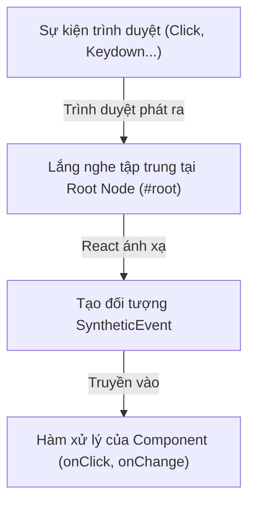

# Bài 07 - Event Handling & Forms (Xử lý sự kiện & Biểu mẫu)

## I. KHÁI QUÁT (OVERVIEW)

### 1. Cơ chế Xử lý Sự kiện trong React
Trong phát triển web truyền thống, bạn bắt các sự kiện bằng cách thêm bộ lắng nghe (`addEventListener`) trực tiếp vào các phần tử DOM. 
React không làm như vậy. Để tối ưu hóa hiệu năng và đảm bảo tính nhất quán đa nền tảng, React sử dụng một hệ thống sự kiện trung gian được gọi là **SyntheticEvent** (Sự kiện tổng hợp).



---

## II. CHI TIẾT KỸ THUẬT (DETAILED DEEP DIVE)

### 1. Hệ thống Sự kiện Tổng hợp (SyntheticEvent System)
**SyntheticEvent** là một lớp bao bọc (wrapper) đa trình duyệt xung quanh sự kiện gốc của trình duyệt. Nó có cùng giao diện API như sự kiện gốc (bao gồm `preventDefault()` và `stopPropagation()`) nhưng hoạt động nhất quán trên tất cả các trình duyệt.

#### Cơ chế Ủy quyền Sự kiện (Event Delegation)
React không gắn các bộ lắng nghe sự kiện trực tiếp vào các nút DOM được tạo ra. Thay vào đó, nó gắn **duy nhất một bộ lắng nghe sự kiện** tại phần tử root của ứng dụng (trong React 17+ là thẻ `#root`, React 16 là `document`).
Khi một sự kiện xảy ra (ví dụ: click chuột vào nút bấm):
1.  Sự kiện nổi lên (bubbles up) đến node `#root`.
2.  React bắt sự kiện này và ánh xạ nó đến đúng component tương ứng trong cây ảo để gọi hàm xử lý.
*   *Lợi ích:* Tiết kiệm bộ nhớ RAM cực lớn khi trang web có hàng nghìn nút bấm, và tăng tốc độ khởi tạo trang.

---

### 2. Thành phần điều khiển (Controlled) vs Thành phần không điều khiển (Uncontrolled)

Khi xử lý các form input trong React, có hai trường phái thiết kế chính:

| Tiêu chí | Controlled Components | Uncontrolled Components |
| :--- | :--- | :--- |
| **Nơi lưu trữ dữ liệu** | Trạng thái React (`State`) | DOM thực tế của trình duyệt |
| **Cách truy cập dữ liệu** | Đọc từ biến `state` | Sử dụng `ref.current.value` |
| **Cơ chế cập nhật** | Chạy hàm `onChange` ở mỗi phím gõ | Đọc một lần khi submit form |
| **Độ phức tạp** | Cao hơn (nhiều boilerplate code) | Thấp hơn (gần giống HTML truyền thống) |
| **Phù hợp nhất với** | Validation thời gian thực, điều khiển nhập liệu | Form đơn giản, không cần tương tác động |

---

### 3. Vấn đề Hiệu năng của Form lớn & Giải pháp React Hook Form
Đối với các form lớn chứa hàng chục ô input, việc sử dụng Controlled Component truyền thống sẽ gặp vấn đề hiệu năng nghiêm trọng:
*   Mỗi phím người dùng gõ $\rightarrow$ Kích hoạt `onChange` $\rightarrow$ Cập nhật State $\rightarrow$ Re-render **toàn bộ Form** và các ô input khác. Điều này gây giật lag (input lag) khi gõ chữ.

#### Giải pháp: Thư viện React Hook Form
React Hook Form hoạt động theo cơ chế **Uncontrolled Component** dưới dạng mặc định, sử dụng Ref để đọc dữ liệu và chỉ re-render những ô input thực sự thay đổi trạng thái validation. Điều này giúp tối ưu hiệu năng tuyệt đối cho các biểu mẫu phức tạp.

---

## III. VÍ DỤ MINH HỌA VÀ PHÂN TÍCH CODE (CODE EXAMPLES & ANALYSIS)

### 1. Thiết kế Form Controlled chuẩn mực có Validation thời gian thực
Dưới đây là cách triển khai một biểu mẫu đăng ký tiêu chuẩn sử dụng Controlled Component để thực hiện kiểm tra lỗi (validation) ngay khi người dùng gõ phím.

```tsx
// File: src/components/RegisterForm.tsx
import React, { useState } from 'react';

interface FormFields {
  email: string;
  age: number;
}

interface FormErrors {
  email?: string;
  age?: string;
}

export const RegisterForm: React.FC = () => {
  const [fields, setFields] = useState<FormFields>({ email: '', age: 18 });
  const [errors, setErrors] = useState<FormErrors>({});

  // Hàm xử lý chung cho toàn bộ các ô input
  const handleChange = (e: React.ChangeEvent<HTMLInputElement>) => {
    const { name, value, type } = e.target;
    
    // Chuyển đổi kiểu dữ liệu tương ứng
    const finalValue = type === 'number' ? Number(value) : value;

    setFields((prev) => ({
      ...prev,
      [name]: finalValue
    }));

    // Xóa lỗi của trường tương ứng khi người dùng bắt đầu sửa
    if (errors[name as keyof FormErrors]) {
      setErrors((prev) => ({ ...prev, [name]: undefined }));
    }
  };

  const validateForm = (): boolean => {
    const newErrors: FormErrors = {};
    
    if (!fields.email.includes('@')) {
      newErrors.email = 'Email không hợp lệ (thiếu ký tự @).';
    }
    if (fields.age < 18) {
      newErrors.age = 'Bạn phải từ 18 tuổi trở lên để đăng ký.';
    }

    setErrors(newErrors);
    return Object.keys(newErrors).length === 0;
  };

  const handleSubmit = (e: React.FormEvent<HTMLFormElement>) => {
    // Ngăn chặn trình duyệt reload lại trang
    e.preventDefault();

    if (validateForm()) {
      console.log('Dữ liệu gửi lên Server:', fields);
      // Thực hiện gọi API đăng ký tại đây
    }
  };

  return (
    <form onSubmit={handleSubmit} className="register-form" noValidate>
      <div>
        <label htmlFor="email">Email:</label>
        <input
          type="email"
          id="email"
          name="email"
          value={fields.email}
          onChange={handleChange}
        />
        {errors.email && <span className="error-text">{errors.email}</span>}
      </div>

      <div>
        <label htmlFor="age">Tuổi:</label>
        <input
          type="number"
          id="age"
          name="age"
          value={fields.age}
          onChange={handleChange}
        />
        {errors.age && <span className="error-text">{errors.age}</span>}
      </div>

      <button type="submit">Đăng ký tài khoản</button>
    </form>
  );
};
```

---

### 2. Tích hợp React Hook Form & Zod cho Form Phức tạp
Cách tiếp cận chuyên nghiệp sử dụng **React Hook Form** kết hợp thư viện **Zod** để tự động validate dữ liệu theo Schema chặt chẽ.

```tsx
// File: src/components/LoginForm.tsx
import React from 'react';
import { useForm } from 'react-hook-form';
import { z } from 'zod';
import { zodResolver } from '@hookform/resolvers/zod';

// 1. Định nghĩa Schema Validation bằng Zod
const loginSchema = z.object({
  email: z.string().email('Định dạng Email không hợp lệ.'),
  password: z.string().min(6, 'Mật khẩu phải chứa ít nhất 6 ký tự.')
});

// Trích xuất kiểu dữ liệu từ Zod Schema
type LoginFormInputs = z.infer<typeof loginSchema>;

export const LoginForm: React.FC = () => {
  // 2. Cấu hình useForm kết hợp zodResolver
  const {
    register,
    handleSubmit,
    formState: { errors, isSubmitting }
  } = useForm<LoginFormInputs>({
    resolver: zodResolver(loginSchema),
    defaultValues: { email: '', password: '' }
  });

  const onSubmit = async (data: LoginFormInputs) => {
    // Giả lập gọi API bất đồng bộ
    await new Promise((resolve) => setTimeout(resolve, 1000));
    console.log('Xác thực thành công:', data);
  };

  return (
    <form onSubmit={handleSubmit(onSubmit)} className="login-form">
      <div>
        <label>Email:</label>
        {/* Đăng ký input thông qua hàm register */}
        <input type="email" {...register('email')} />
        {errors.email && <p className="error">{errors.email.message}</p>}
      </div>

      <div>
        <label>Mật khẩu:</label>
        <input type="password" {...register('password')} />
        {errors.password && <p className="error">{errors.password.message}</p>}
      </div>

      <button type="submit" disabled={isSubmitting}>
        {isSubmitting ? 'Đang xử lý...' : 'Đăng nhập'}
      </button>
    </form>
  );
};
```

---

## IV. LƯU Ý, CẠM BẪY VÀ QUY TẮC CỐT LÕI (PITFALLS & BEST PRACTICES)

### 1. Cạm bẫy với hàm bất đồng bộ trong Submit
*   **Vấn đề:** Không vô hiệu hóa (disable) nút submit trong quá trình gửi request.
*   **Hậu quả:** Người dùng có thể click liên tục nhiều lần vào nút Đăng ký/Thanh toán, khiến hệ thống gửi lên hàng loạt request trùng lặp (Double Submission).
*   ✅ *Best practice:* Luôn sử dụng trạng thái `isSubmitting` hoặc một biến state loading để disable nút Submit ngay khi bắt đầu gửi request.

### 2. Sự biến mất của Event Pooling trong React 17+
*   Trong React 16 trở về trước, React tái sử dụng (reuse) các đối tượng `SyntheticEvent` để tiết kiệm bộ nhớ. Bạn không thể đọc các thuộc tính của sự kiện (như `e.target`) bên trong các hàm callback bất đồng bộ (`setTimeout`) trừ khi gọi `e.persist()`.
*   **Từ React 17:** Cơ chế Event Pooling này đã **bị loại bỏ hoàn toàn**. Bạn có thể truy cập `e.target` trong bất kỳ luồng bất đồng bộ nào một cách bình thường.

---

## 💡 5 QUY TẮC VÀNG VỀ XỬ LÝ FORM & EVENT
1.  **Luôn gọi `e.preventDefault()` đầu tiên:** Khi xử lý sự kiện submit của thẻ `<form>`, luôn gọi hàm này để ngăn chặn hành vi reload trang mặc định của trình duyệt.
2.  **Đa dạng hóa sự lựa chọn (Controlled vs Uncontrolled):** Dùng Controlled cho form nhỏ cần tương tác động; dùng Uncontrolled (hoặc React Hook Form) cho form lớn có nhiều trường dữ liệu để tối ưu hiệu năng.
3.  **Tích hợp Zod/Yup để quản lý Schema:** Tách biệt hoàn toàn logic validate dữ liệu ra khỏi UI bằng các schema để dễ dàng tái sử dụng và kiểm thử.
4.  **Bảo vệ nút Submit:** Luôn thiết lập thuộc tính `disabled={isLoading}` cho nút gửi biểu mẫu để chống spam click từ phía người dùng.
5.  **Thiết lập kiểu dữ liệu chuẩn xác cho Event:** Khi viết TypeScript, hãy chỉ định rõ kiểu sự kiện tương ứng (ví dụ: `React.ChangeEvent<HTMLInputElement>`, `React.FormEvent<HTMLFormElement>`) để được gợi ý code tốt nhất.
