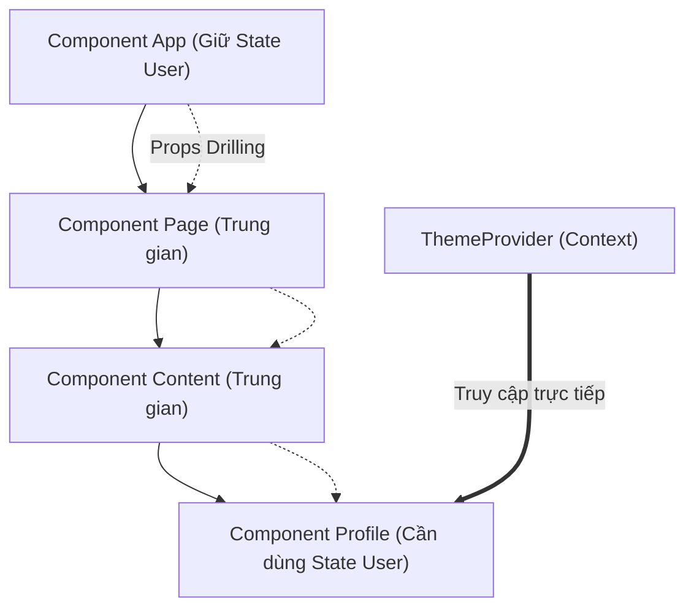

## I. KHÁI QUÁT (OVERVIEW)

### 1. Vấn đề truyền Props quá sâu (Prop Drilling)
Trong các ứng dụng React lớn, việc chia sẻ dữ liệu giữa các component không có quan hệ cha-con trực tiếp thường dẫn đến hiện tượng **Prop Drilling** (Khoan Props).
*   **Prop Drilling là gì:** Bạn phải truyền một prop qua nhiều tầng component trung gian chỉ để đưa nó đến một component con ở rất sâu phía dưới, mặc dù các component trung gian đó hoàn toàn không sử dụng đến prop này.



**Context API** ra đời để giải quyết vấn đề này bằng cách cung cấp một cơ chế **Dependency Injection** (Tiêm phụ thuộc). Nó cho phép Component con truy cập trực tiếp vào dữ liệu chung được lưu trữ ở cấp cao mà không cần thông qua Props của các tầng trung gian.

---

## II. CHI TIẾT KỸ THUẬT (DETAILED DEEP DIVE)

### 1. Cơ chế hoạt động của Context API
Hệ thống Context API được cấu thành từ 3 phần chính:
1.  **Context Object:** Được tạo ra bằng hàm `createContext()`. Nó đóng vai trò là "cổng giao dịch" chứa giá trị mặc định.
2.  **Provider (Nhà cung cấp):** Một React Component đặc biệt (`<MyContext.Provider>`) dùng để bao bọc cây con và thiết lập giá trị thực tế muốn chia sẻ thông qua prop `value`.
3.  **Consumer / useContext (Người dùng):** Hook `useContext(MyContext)` được Component con gọi để đọc giá trị hiện tại từ Provider gần nhất phía trên nó.

---

### 2. Vấn đề Re-render của Context & Giải pháp Tối ưu
Một trong những cạm bẫy lớn nhất khi sử dụng Context API là hiệu năng.

> [!WARNING]
> **Hiệu ứng Re-render Toàn bộ Cây Con:**
> Mặc định, bất kỳ thay đổi nào đối với prop `value` của Provider sẽ ép buộc **tất cả** các Component con sử dụng `useContext(MyContext)` re-render lại từ đầu. React không tự động so sánh xem Component con có thực sự dùng thuộc tính bị thay đổi trong Context đó hay không.

#### Giải pháp 1: Chia tách Context (Context Splitting)
Nếu bạn có một Context chứa cả dữ liệu và hàm thay đổi dữ liệu:
```typescript
const ThemeContext = createContext({ theme: 'light', toggleTheme: () => {} });
```
Mỗi khi `theme` thay đổi, các component chỉ cần dùng hàm `toggleTheme` (vốn là hàm ổn định) vẫn bị ép re-render lại vô ích.
👉 **Khắc phục:** Chia làm 2 Context độc lập:
*   `ThemeStateContext`: Chỉ chứa dữ liệu `theme`.
*   `ThemeDispatchContext`: Chỉ chứa hàm cập nhật `toggleTheme`.

#### Giải pháp 2: Sử dụng useMemo cho Value
Luôn bọc đối tượng truyền vào prop `value` bằng `useMemo` để đảm bảo địa chỉ vùng nhớ của object không bị khởi tạo lại ở mỗi lần Component cha re-render:
```tsx
const value = useMemo(() => ({ theme, toggleTheme }), [theme]);
return <ThemeContext.Provider value={value}>...</ThemeContext.Provider>;
```

---

### 3. Context + useReducer = Mini Redux
Bằng cách kết hợp `useReducer` (để quản lý logic state phức tạp) và `Context API` (để truyền hàm `dispatch` xuống cây con), bạn sẽ có một kiến trúc quản lý state toàn cục hoàn chỉnh gần tương tự như thư viện Redux mà không cần cài đặt thêm bất kỳ gói dependencies nào.

---

## III. VÍ DỤ MINH HỌA VÀ PHÂN TÍCH CODE (CODE EXAMPLES & ANALYSIS)

### 1. Triển khai Hệ thống Theme Light/Dark Mode tối ưu hiệu năng
Dưới đây là một ví dụ chuẩn chỉnh về việc tạo lập một Theme Provider sạch sẽ, có chia tách Context để tối ưu hóa hiệu năng render.

```tsx
// File: src/context/ThemeContext.tsx
import React, { createContext, useContext, useState, useMemo, useCallback } from 'react';

// 1. Định nghĩa kiểu dữ liệu cho Context
type Theme = 'light' | 'dark';

// 2. Tạo 2 Context độc lập để thực hiện Context Splitting
const ThemeStateContext = createContext<Theme | undefined>(undefined);
const ThemeDispatchContext = createContext<(() => void) | undefined>(undefined);

// 3. Xây dựng Custom Provider Component
export const ThemeProvider: React.FC<{ children: React.ReactNode }> = ({ children }) => {
  const [theme, setTheme] = useState<Theme>('light');

  // Sử dụng useCallback để hàm toggleTheme ổn định địa chỉ vùng nhớ
  const toggleTheme = useCallback(() => {
    setTheme((prev) => (prev === 'light' ? 'dark' : 'light'));
  }, []);

  // ThemeStateContext chỉ re-render khi giá trị theme thay đổi thực sự
  return (
    <ThemeStateContext.Provider value={theme}>
      <ThemeDispatchContext.Provider value={toggleTheme}>
        {children}
      </ThemeDispatchContext.Provider>
    </ThemeStateContext.Provider>
  );
};

// 4. Xây dựng các Custom Hooks để Component con sử dụng dễ dàng và an toàn
export const useTheme = () => {
  const context = useContext(ThemeStateContext);
  if (context === undefined) {
    throw new Error('useTheme phải được sử dụng bên trong ThemeProvider');
  }
  return context;
};

export const useThemeToggle = () => {
  const context = useContext(ThemeDispatchContext);
  if (context === undefined) {
    throw new Error('useThemeToggle phải được sử dụng bên trong ThemeProvider');
  }
  return context;
};
```

```tsx
// File: src/components/ThemeButton.tsx
import React from 'react';
import { useTheme, useThemeToggle } from '../context/ThemeContext';

export const ThemeButton: React.FC = () => {
  // Đọc dữ liệu từ 2 Context riêng biệt
  const theme = useTheme();
  const toggleTheme = useThemeToggle();

  console.log('Button render!'); // Chỉ render lại khi theme thực sự thay đổi

  return (
    <button onClick={toggleTheme} className={`btn-${theme}`}>
      Đổi sang chế độ {theme === 'light' ? 'Dark' : 'Light'}
    </button>
  );
};
```

---

## IV. LƯU Ý, CẠM BẪY VÀ QUY TẮC CỐT LÕI (PITFALLS & BEST PRACTICES)

### 1. Sử dụng Context cho các dữ liệu thay đổi quá thường xuyên (High-frequency state)
*   **Cảnh báo:** Tránh dùng Context API để quản lý các state thay đổi liên tục hàng mili-giây (như tọa độ chuột, giá trị gõ phím của ô input, dữ liệu real-time stream).
*   **Hậu quả:** Toàn bộ ứng dụng của bạn sẽ bị re-render liên tục gây giật lag nghiêm trọng do cơ chế re-render thô sơ của Context.
*   ✅ *Best practice:* Sử dụng các thư viện chuyên dụng như **Zustand**, **Redux**, hoặc **Jotai** cho các state thay đổi tần suất cao vì chúng hỗ trợ cơ chế selector tối ưu.

### 2. Quên kiểm tra Lỗi Context nằm ngoài Provider
*   Khi gọi `useContext`, nếu component gọi nó nằm ngoài phạm vi bao bọc của thẻ `<Provider>`, React sẽ trả về giá trị mặc định (thường là `undefined`). Nếu không kiểm tra lỗi, ứng dụng sẽ bị crash ngay lập tức khi cố truy cập các thuộc tính của nó.
*   Luôn viết logic kiểm tra lỗi trong Custom Hook như ở ví dụ phần III.

---

## 💡 5 QUY TẮC VÀNG VỀ CONTEXT API
1.  **Dùng Context cho dữ liệu tĩnh / thay đổi ít:** Thích hợp nhất cho: cấu hình ngôn ngữ (i18n), cấu hình theme (dark/light), thông tin người dùng đăng nhập hiện tại (Auth User).
2.  **Luôn áp dụng Context Splitting:** Tách biệt Context lưu trữ dữ liệu (State) và Context lưu trữ hàm thay đổi dữ liệu (Dispatch) để tối ưu hiệu năng re-render.
3.  **Bọc giá trị Context trong useMemo/useCallback:** Tránh truyền object literal trực tiếp vào prop `value` để bảo toàn địa chỉ vùng nhớ qua các lần re-render của Component cha.
4.  **Viết Custom Hooks để truy cập Context:** Che giấu API thô `useContext` và tự động kiểm tra lỗi nằm ngoài Provider để bảo vệ ứng dụng khỏi bị crash.
5.  **Tập hợp thành phần (Composition) trước khi dùng Context:** Đôi khi chỉ cần áp dụng kỹ thuật truyền component con qua prop `children` là đã giải quyết được vấn đề Prop Drilling mà không cần tạo thêm Context phức tạp.
