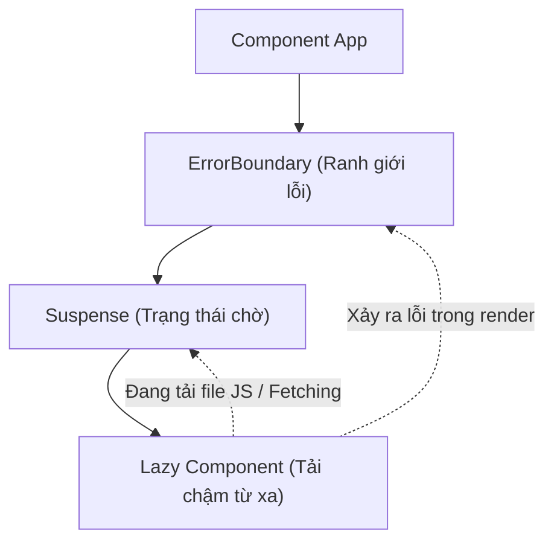

# Bài 11 - Error Boundaries & Suspense (Ranh giới lỗi & Trạng thái chờ)

## I. KHÁI QUÁT (OVERVIEW)

### 1. Tại sao cần Error Boundaries và Suspense?
Trong các phiên bản React cũ, một lỗi JavaScript xảy ra ở bất kỳ đâu bên trong một component (ví dụ: truy cập thuộc tính của `undefined` khi render) sẽ khiến **toàn bộ ứng dụng React bị crash** và biến mất khỏi màn hình, để lại giao diện trắng xóa (White Screen of Death). Điều này đem lại trải nghiệm người dùng cực kỳ tốn kém.

*   **Error Boundaries (Ranh giới lỗi):** Đóng vai trò như một bộ khung `try-catch` bao bọc xung quanh các Component, giúp cô lập lỗi xảy ra bên trong cây con của nó và hiển thị một giao diện thay thế (Fallback UI) thay vì làm sập toàn bộ trang web.
*   **Suspense (Trạng thái chờ):** Cung cấp một cơ chế khai báo cho phép Component "chờ" một tác vụ bất đồng bộ (như tải code JS, fetch data từ server) hoàn thành, trong lúc chờ sẽ hiển thị một giao diện tạm thời (như Spinner, Skeleton loading).



---

## II. CHI TIẾT KỸ THUẬT (DETAILED DEEP DIVE)

### 1. Ranh giới lỗi (Error Boundaries) hoạt động ra sao?
Một điểm đặc biệt trong React hiện tại là **Error Boundary bắt buộc phải viết dưới dạng Class Component**. Trình duyệt chưa hỗ trợ viết Error Boundary bằng Function Component thông thường do chưa có hàm tương đương với các phương thức vòng đời đặc biệt:
*   `static getDerivedStateFromError(error)`: Hàm này chạy ngay sau khi có lỗi xảy ra ở cây con. Trả về một đối tượng state mới để cập nhật trạng thái hiển thị Fallback UI.
*   `componentDidCatch(error, errorInfo)`: Dùng để thực hiện các side effects liên quan đến lỗi, ví dụ: gửi báo cáo lỗi lên các dịch vụ giám sát (Sentry, LogRocket).

> [!CAUTION]
> **Giới hạn của Error Boundary:**
> Error Boundary **KHÔNG** bắt được lỗi xảy ra trong các trường hợp sau:
> 1.  Hàm xử lý sự kiện (Event Handlers) - (Ví dụ: lỗi xảy ra bên trong hàm click nút).
> 2.  Tác vụ bất đồng bộ (`setTimeout`, `requestAnimationFrame`).
> 3.  Quá trình Server-side rendering (SSR).
> 4.  Lỗi xảy ra trong chính bản thân Error Boundary đó (chứ không phải con của nó).

---

### 2. Suspense & Code Splitting (Tải chậm thành phần)
Mặc định, khi biên dịch dự án React, toàn bộ code sẽ được gộp vào một file Javascript lớn duy nhất (bundle). Khi người dùng truy cập trang, trình duyệt phải tải hết file này về mới có thể chạy ứng dụng.
*   **Giải pháp:** Sử dụng `React.lazy` kết hợp `<Suspense>` để thực hiện **Code Splitting** (Tách mã). Trình duyệt chỉ tải code của component khi nó thực sự được gọi hiển thị trên màn hình.

---

## III. VÍ DỤ MINH HỌA VÀ PHÂN TÍCH CODE (CODE EXAMPLES & ANALYSIS)

### 1. Triển khai Class-based Error Boundary hoàn chỉnh có chức năng Reset
Dưới đây là một ví dụ chuẩn chỉnh về cách thiết lập một Error Boundary có thể sử dụng lại nhiều lần trong dự án, cho phép người dùng click nút để reset lại trạng thái (thử lại tác vụ) sau khi có lỗi xảy ra.

```tsx
// File: src/components/ErrorBoundary.tsx
import React, { Component, ErrorInfo, ReactNode } from 'react';

interface Props {
  fallback: ReactNode | ((error: Error, reset: () => void) => ReactNode);
  children: ReactNode;
}

interface State {
  hasError: boolean;
  error: Error | null;
}

export class ErrorBoundary extends Component<Props, State> {
  public state: State = {
    hasError: false,
    error: null
  };

  // 1. Chạy ngay khi có lỗi, cập nhật state để hiển thị Fallback UI
  public static getDerivedStateFromError(error: Error): State {
    return { hasError: true, error };
  }

  // 2. Chạy để ghi nhận thông tin lỗi lên Sentry / Analytics
  public componentDidCatch(error: Error, errorInfo: ErrorInfo) {
    console.error('Đã bắt được lỗi hệ thống:', error, errorInfo);
    // Gửi log lỗi lên server tại đây:
    // logErrorToMyService(error, errorInfo);
  }

  // 3. Hàm reset lại trạng thái lỗi để người dùng thử lại
  public handleReset = () => {
    this.setState({ hasError: false, error: null });
  };

  public render() {
    if (this.state.hasError && this.state.error) {
      // Nếu fallback là một hàm, truyền error và hàm reset vào
      if (typeof this.props.fallback === 'function') {
        return this.props.fallback(this.state.error, this.handleReset);
      }
      return this.props.fallback;
    }

    return this.props.children;
  }
}
```

#### Cách sử dụng trong App:
```tsx
// File: src/App.tsx
import React from 'react';
import { ErrorBoundary } from './components/ErrorBoundary';

const BrokenComponent = () => {
  // Giả lập lỗi runtime
  throw new Error('Kết nối cơ sở dữ liệu thất bại!');
};

export const App = () => {
  return (
    <div className="app-container">
      <h2>Trang chủ Hệ thống</h2>
      
      <ErrorBoundary
        fallback={(error, reset) => (
          <div className="error-card">
            <h4>Đã xảy ra sự cố ngoài ý muốn</h4>
            <p>{error.message}</p>
            <button onClick={reset}>Thử lại tác vụ</button>
          </div>
        )}
      >
        <BrokenComponent />
      </ErrorBoundary>
    </div>
  );
};
```

---

### 2. Tích hợp React.lazy & Suspense cho Routing
Dưới đây là mô hình phân luồng code splitting cho các trang trong hệ thống, giúp giảm dung lượng tải trang khởi tạo ban đầu.

```tsx
// File: src/routes/AppRoutes.tsx
import React, { Suspense, lazy } from 'react';

// Sử dụng lazy loading để tải chậm các trang
const Home = lazy(() => import('../pages/Home'));
const AnalyticsDashboard = lazy(() => import('../pages/AnalyticsDashboard'));

export const AppRoutes: React.FC = () => {
  return (
    <div className="layout">
      <header>Thanh điều hướng chung</header>
      
      {/* 
        Mọi component con được lazy load bên trong Suspense 
        sẽ hiển thị fallback UI trong lúc file bundle của trang đó được tải về.
      */}
      <Suspense fallback={<div className="loader">Đang tải trang...</div>}>
        <Routes>
          <Route path="/" element={<Home />} />
          <Route path="/analytics" element={<AnalyticsDashboard />} />
        </Routes>
      </Suspense>
    </div>
  );
};

// Component Routes giả lập cho cấu trúc ví dụ
const Routes = ({ children }: any) => <div>{children}</div>;
const Route = ({ element }: any) => element;
```

---

## IV. LƯU Ý, CẠM BẪY VÀ QUY TẮC CỐT LÕI (PITFALLS & BEST PRACTICES)

### 1. Phân cấp nhiều tầng Error Boundary (Nested Boundaries)
*   **Lời khuyên:** Đừng bọc duy nhất một Error Boundary toàn cục ngoài cùng của ứng dụng. Hãy chia nhỏ và bọc xung quanh các widget độc lập (ví dụ: Sidebar, ChatWidget, ProductList).
*   *Lợi ích:* Nếu ChatWidget bị lỗi crash, chỉ có khu vực Chat hiển thị giao diện fallback báo lỗi, người dùng vẫn có thể duyệt sản phẩm và thực hiện mua hàng bình thường trên phần còn lại của trang web.

### 2. Cạm bẫy với hàm xử lý sự kiện trong Error Boundary
*   Nhắc lại: Error Boundary không bắt được lỗi trong Event Handler. Nếu bạn viết `onClick={() => { throw new Error() }}`, Error Boundary sẽ bỏ qua lỗi này.
*   ✅ *Best practice:* Sử dụng khối lệnh `try-catch` truyền thống bên trong các hàm xử lý sự kiện của bạn.

---

## 💡 5 QUY TẮC VÀNG VỀ ERROR BOUNDARY & SUSPENSE
1.  **ErrorBoundary bắt buộc dùng Class Component:** Sử dụng các phương thức `getDerivedStateFromError` và `componentDidCatch` để quản lý trạng thái lỗi.
2.  **Chia nhỏ ranh giới lỗi:** Thiết lập Error Boundary cho từng vùng tính năng độc lập trên trang để tránh lỗi cục bộ làm sập toàn bộ ứng dụng.
3.  **Luôn có cơ chế thử lại (Reset/Retry):** Cung cấp nút bấm thử lại trong giao diện fallback để người dùng tự khôi phục trạng thái mà không cần reload trang.
4.  **Tách mã ở cấp độ Route:** Áp dụng `React.lazy` và `<Suspense>` cho các trang định tuyến lớn để tối ưu chỉ số **LCP** (Largest Contentful Paint) của website.
5.  **Ghi nhận log lỗi tự động:** Luôn cấu hình hàm `componentDidCatch` gửi báo cáo lỗi tự động về các công cụ quản lý chất lượng (Sentry, Datadog) để kịp thời khắc phục lỗi trong môi trường thực tế.
