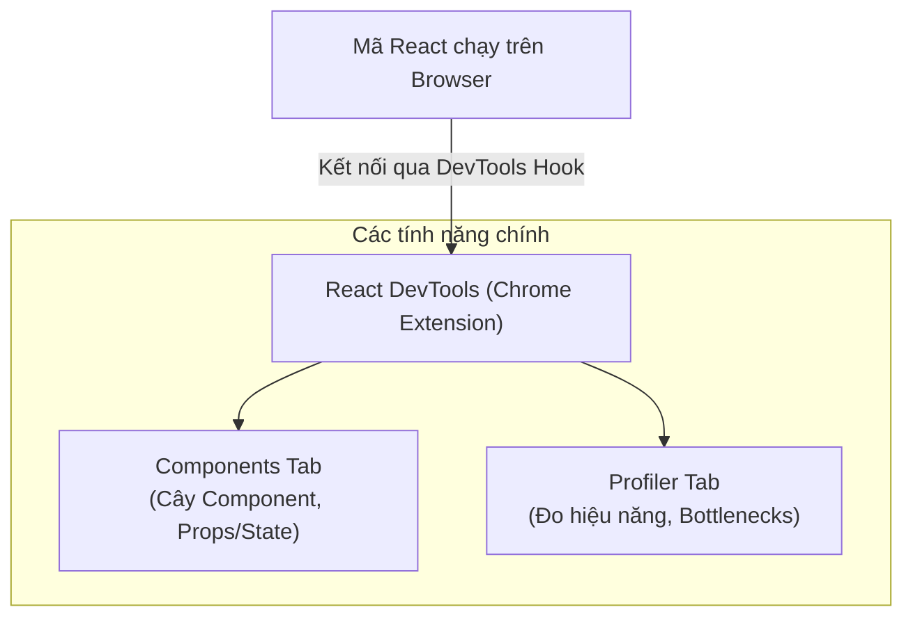

## I. KHÁI QUÁT (OVERVIEW)

### 1. Tại sao việc Debug trong React lại đặc thù?
Do React hoạt động dựa trên cơ chế đồng bộ hóa trạng thái ngầm (Virtual DOM) và các bản cập nhật UI chạy tự động theo luồng Render, việc sử dụng các công cụ debug JavaScript truyền thống (như `console.log` hay debugger thô) thường gặp nhiều khó khăn:
*   Bạn khó biết chính xác tại sao một component bị re-render.
*   Khó đo đạc thời gian render thực tế của từng node trên cây.
*   Khó kiểm soát trạng thái State/Props động của các Component lồng nhau.

Để giải quyết vấn đề này, đội ngũ phát triển React đã cung cấp bộ công cụ **React Developer Tools** (React DevTools) dạng Chrome Extension, đóng vai trò như một kính hiển vi giúp bạn nhìn thấu toàn bộ cấu trúc và hiệu năng của ứng dụng.



---

## II. CHI TIẾT KỸ THUẬT (DETAILED DEEP DIVE)

### 1. Tab Components (Kiểm tra Cây Component)
Tab **Components** hiển thị cấu trúc cây của các React Component được render thực tế trên trang web.

#### Các tính năng quan trọng:
*   **Search (Tìm kiếm):** Cho phép bạn tìm kiếm nhanh các Component theo tên.
*   **Xem & Sửa Props/State trực tiếp:** Bạn có thể nhấp chuột vào một component trên cây, xem giá trị hiện tại của các props, state và hooks của nó ở cột bên phải, đồng thời gõ thay đổi trực tiếp các giá trị này để xem UI phản hồi thế nào mà không cần sửa code.
*   **Trace Render Source:** Nhìn thấy component nào là cha đã kích hoạt việc render của component hiện tại.

---

### 2. Tab Profiler (Đo đạc và tối ưu hiệu năng)
Tab **Profiler** là công cụ tối quan trọng dùng để chẩn đoán các sự cố giật lag, re-render thừa thãi trong ứng dụng.

#### Quy trình sử dụng Profiler:
1.  Nhấp vào nút **Record** (Hình tròn đỏ) trong tab Profiler.
2.  Thực hiện các hành động trên trang web của bạn (ví dụ: gõ chữ vào ô input, click nút mua hàng).
3.  Nhấp nút **Stop Recording** để dừng đo.

#### Các biểu đồ hiển thị kết quả (Flame Chart & Ranked Chart):
*   **Flame Chart (Biểu đồ ngọn lửa):** Hiển thị trạng thái render của các component theo cấu trúc cây.
    *   *Màu sắc:* Màu xám có nghĩa là component không re-render trong commit đó. Các màu khác (Vàng, Cam, Xanh) thể hiện component có re-render. Màu càng thiên về **màu vàng/cam** thể hiện thời gian render càng lâu.
*   **Ranked Chart (Biểu đồ xếp hạng):** Sắp xếp các component theo thứ tự thời gian render từ lâu nhất đến nhanh nhất, giúp bạn tìm ra ngay thủ phạm gây nghẽn (bottleneck).

---

### 3. Tìm hiểu thư viện `@welldone-software/why-did-you-render`
Bên cạnh DevTools, thư viện **why-did-you-render** (WDYR) là một công cụ cực kỳ đắc lực. Khi được cài đặt, nó sẽ tự động giám sát toàn bộ ứng dụng trong môi trường Development và in ra màn hình console lý do cụ thể tại sao một component bị re-render (ví dụ: do props `onClick` bị thay đổi địa chỉ vùng nhớ mặc dù code giống hệt).

---

## III. VÍ DỤ MINH HỌA VÀ PHÂN TÍCH CODE (CODE EXAMPLES & ANALYSIS)

### 1. Quy trình thiết lập why-did-you-render cho dự án React + TypeScript
Dưới đây là cách cấu hình thư viện để tự động cảnh báo các lỗi re-render thừa trong môi trường phát triển (Development).

```typescript
// File: src/wdyr.ts
/// <reference types="@welldone-software/why-did-you-render" />
import React from 'react';

// Chỉ kích hoạt WDYR trong môi trường Development
if (process.env.NODE_ENV === 'development') {
  const whyDidYouRender = require('@welldone-software/why-did-you-render');
  
  whyDidYouRender(React, {
    trackAllPureComponents: true, // Tự động theo dõi các Pure Component hoặc React.memo
    trackHooks: true, // Theo dõi thay đổi của State/Hooks
    logOwnerReasons: true // In ra thông tin component cha nào đã kích hoạt render
  });
}
```

Import tệp tin cấu hình này ở **dòng đầu tiên** của file entry point trước khi import React DOM:
```tsx
// File: src/main.tsx
import './wdyr'; // Bắt buộc phải import đầu tiên!
import React from 'react';
import ReactDOM from 'react-dom/client';
import { App } from './App';

ReactDOM.createRoot(document.getElementById('root')!).render(
  <React.StrictMode>
    <App />
  </React.StrictMode>
);
```

#### Ví dụ kích hoạt theo dõi cụ thể trên một Component:
```tsx
// File: src/components/HeavyList.tsx
import React from 'react';

export const HeavyList: React.FC<{ items: string[] }> = React.memo(({ items }) => {
  return (
    <ul>
      {items.map((item, idx) => <li key={idx}>{item}</li>)}
    </ul>
  );
});

// Kích hoạt theo dõi chi tiết cho component này
if (process.env.NODE_ENV === 'development') {
  HeavyList.whyDidYouRender = true;
}
```

---

## IV. LƯU Ý, CẠM BẪY VÀ QUY TẮC CỐT LÕI (PITFALLS & BEST PRACTICES)

### 1. Bật tính năng Highlight Re-renders
*   Trong phần cấu hình (Settings - biểu tượng bánh răng) của React DevTools, hãy bật tùy chọn **"Highlight updates when components render."** (Tô sáng các thay đổi khi component render).
*   *Cách sử dụng:* Khi bạn tương tác với trang, các component bị re-render sẽ xuất hiện một đường viền màu xanh lá/vàng bao quanh. Nếu bạn click một nút ở góc màn hình mà thấy toàn bộ trang web bị viền vàng nhấp nháy $\rightarrow$ Bạn phát hiện ngay lỗi re-render diện rộng cần tối ưu.

### 2. Sự khác biệt về hiệu năng giữa Dev và Prod
*   Luôn nhớ rằng thời gian render đo được trong tab Profiler ở môi trường Development luôn lớn hơn gấp 2-5 lần so với Production do React phải chạy các logic debug, cảnh báo và kiểm tra StrictMode. Đừng quá lo lắng về các con số cụ thể, hãy tập trung vào **số lượng lần re-render** và sự chênh lệch hiệu năng tương đối giữa các component.

---

## 💡 5 QUY TẮC VÀNG KHI DEBUG VÀ TỐI ƯU REACT
1.  **Luôn bật Highlight Re-renders khi code:** Nhận biết trực quan phạm vi ảnh hưởng của re-render ngay khi vừa viết xong tính năng.
2.  **Sử dụng Profiler trước khi tối ưu:** Tuyệt đối không tối ưu hóa sớm (Premature Optimization) khi chưa có số liệu đo đạc thực tế từ tab Profiler để tránh làm phức tạp hóa code vô ích.
3.  **Tận dụng WDYR để săn tìm re-render thừa:** Cấu hình thư viện why-did-you-render ở pha phát triển để tự động phát hiện các lỗi thay đổi địa chỉ vùng nhớ của object/hàm truyền qua props.
4.  **Kiểm tra Owner Component:** Sử dụng cột bên phải của Tab Components để xem chính xác component nào đã trigger render cho component hiện tại.
5.  **Tận dụng Strict Mode:** Không tắt Strict Mode trong môi trường Development; hãy dựa vào hành vi re-render 2 lần của nó để làm sạch toàn bộ side effects và rò rỉ bộ nhớ.
