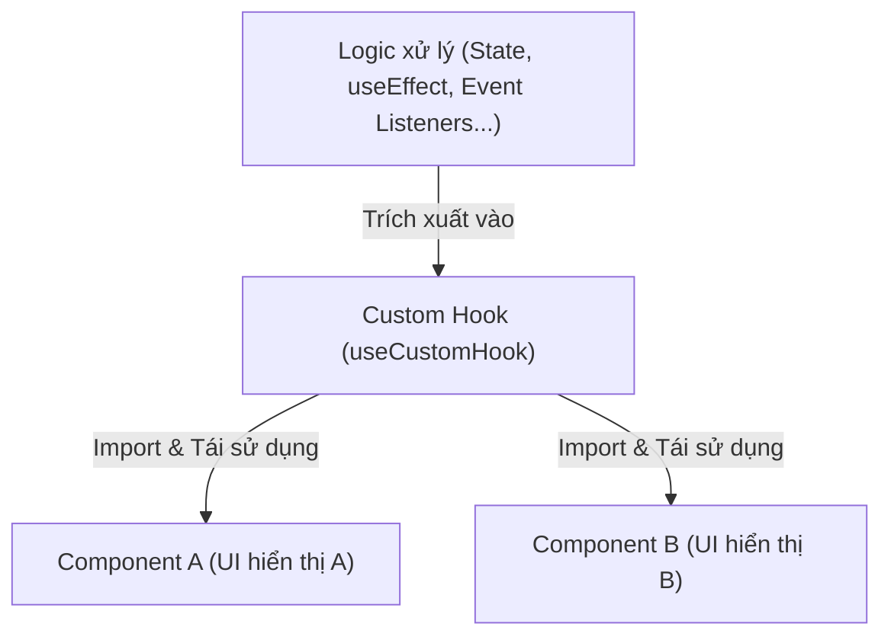

# Bài 01 - Custom Hooks (Tự thiết kế Hook tuỳ biến)

## I. KHÁI QUÁT (OVERVIEW)

### 1. Tại sao cần Custom Hooks?
Trong React, các component của bạn có hai phần chính: Giao diện hiển thị (UI) và Logic xử lý (Business Logic).
Khi ứng dụng của bạn lớn lên, bạn sẽ nhận thấy nhiều component khác nhau có chung một logic xử lý (ví dụ: cùng cần gọi API lấy dữ liệu, cùng cần quản lý việc click ra ngoài để đóng modal, hoặc cùng cần kiểm tra xem màn hình hiện tại là mobile hay desktop).

Trước đây, React giải quyết vấn đề chia sẻ logic này bằng các kỹ thuật phức tạp như **HOC** (Higher-Order Components) hoặc **Render Props**. Các kỹ thuật này làm thay đổi cấu trúc cây DOM, gây ra lỗi lồng nhau quá nhiều tầng (Wrapper Hell).

**Custom Hooks** (Hook tùy biến) ra đời để giải quyết triệt để bài toán chia sẻ logic này bằng cách cho phép bạn trích xuất logic xử lý trạng thái ra thành các hàm JavaScript thông thường, có thể tái sử dụng ở bất kỳ đâu mà không làm thay đổi cấu trúc UI.



> [!IMPORTANT]
> **Custom Hooks chỉ chia sẻ Logic trạng thái, không chia sẻ State thực tế:**
> Mỗi lần một component gọi một Custom Hook, tất cả các state và effects bên trong hook đó sẽ được cô lập hoàn toàn cho component đó. Hai component gọi chung một Hook sẽ có hai trạng thái độc lập, không ảnh hưởng gì đến nhau.

---

## II. CHI TIẾT KỸ THUẬT (DETAILED DEEP DIVE)

### 1. Quy tắc thiết kế Custom Hooks
Để React nhận diện và quản lý chính xác trạng thái bên trong Custom Hook, bạn cần tuân thủ nghiêm ngặt các quy tắc:
1.  **Quy tắc đặt tên:** Tên của Custom Hook **bắt buộc** phải bắt đầu bằng từ khóa **`use`** (ví dụ: `useFetch`, `useAuth`, `useLocalStorage`). Nếu không đặt tên đúng chuẩn, các công cụ kiểm tra lỗi (linters) của React sẽ không thể phát hiện các lỗi vi phạm quy tắc Hooks thông thường của bạn.
2.  **Kế thừa quy tắc của Hooks:** Bên trong Custom Hook, bạn có thể gọi các Hook chuẩn khác của React (như `useState`, `useEffect`, `useRef`). Nhưng bạn vẫn không được phép gọi chúng bên trong câu lệnh điều kiện hay vòng lặp.

---

## III. VÍ DỤ MINH HỌA VÀ PHÂN TÍCH CODE (CODE EXAMPLES & ANALYSIS)

### 1. Thiết kế Custom Hook `useLocalStorage`
Hook này giúp đồng bộ hóa trạng thái của component trực tiếp với bộ nhớ trình duyệt `localStorage`, tự động nạp dữ liệu cũ khi load trang và cập nhật dữ liệu mới khi state thay đổi.

```tsx
// File: src/hooks/useLocalStorage.ts
import { useState, useEffect, useCallback } from 'react';

export function useLocalStorage<T>(key: string, initialValue: T): [T, (value: T | ((val: T) => T)) => void] {
  
  // 1. Khởi tạo state bằng Lazy Initialization để tránh đọc ổ đĩa nhiều lần
  const [storedValue, setStoredValue] = useState<T>(() => {
    try {
      const item = window.localStorage.getItem(key);
      return item ? JSON.parse(item) : initialValue;
    } catch (error) {
      console.warn('Lỗi đọc localStorage:', error);
      return initialValue;
    }
  });

  // 2. Sử dụng useCallback để hàm setValue ổn định địa chỉ vùng nhớ
  const setValue = useCallback((value: T | ((val: T) => T)) => {
    try {
      // Hỗ trợ trường hợp cập nhật dạng hàm (Functional Update) giống useState chuẩn
      const valueToStore = value instanceof Function ? value(storedValue) : value;
      
      setStoredValue(valueToStore);
      window.localStorage.setItem(key, JSON.stringify(valueToStore));
    } catch (error) {
      console.warn('Lỗi ghi localStorage:', error);
    }
  }, [key, storedValue]);

  return [storedValue, setValue];
}
```

---

### 2. Thiết kế Custom Hook `useOnClickOutside`
Hook cực kỳ phổ biến để phát hiện hành động người dùng click ra ngoài một phần tử (dùng để đóng Modal, Dropdown, hoặc Combobox).

```tsx
// File: src/hooks/useOnClickOutside.ts
import { useEffect, RefObject } from 'react';

export function useOnClickOutside<T extends HTMLElement>(
  ref: RefObject<T | null>,
  handler: (event: MouseEvent | TouchEvent) => void
) {
  useEffect(() => {
    const listener = (event: MouseEvent | TouchEvent) => {
      const el = ref?.current;
      
      // Nếu không có phần tử DOM hoặc click trúng phần tử đó -> Bỏ qua
      if (!el || el.contains(event.target as Node)) {
        return;
      }

      // Gọi hàm callback xử lý (ví dụ: đóng modal)
      handler(event);
    };

    // Lắng nghe cả sự kiện click chuột và chạm màn hình (mobile)
    document.addEventListener('mousedown', listener);
    document.addEventListener('touchstart', listener);

    // Bắt buộc phải dọn dẹp sự kiện khi component unmount
    return () => {
      document.removeEventListener('mousedown', listener);
      document.removeEventListener('touchstart', listener);
    };
  }, [ref, handler]); // Chạy lại nếu ref hoặc hàm handler thay đổi
}
```

#### Cách sử dụng `useOnClickOutside` trong Component:
```tsx
// File: src/components/Dropdown.tsx
import React, { useState, useRef } from 'react';
import { useOnClickOutside } from '../hooks/useOnClickOutside';

export const Dropdown: React.FC = () => {
  const [isOpen, setIsOpen] = useState(false);
  const dropdownRef = useRef<HTMLDivElement>(null);

  // Đăng ký hook: khi click ra ngoài dropdownRef, set isOpen về false
  useOnClickOutside(dropdownRef, () => setIsOpen(false));

  return (
    <div ref={dropdownRef} className="relative inline-block text-left">
      <button onClick={() => setIsOpen(!isOpen)} className="px-4 py-2 bg-blue-600 text-white rounded">
        Tùy chọn menu
      </button>

      {isOpen && (
        <div className="absolute right-0 mt-2 w-48 bg-white border border-slate-200 rounded shadow-lg p-2">
          <a href="#" className="block px-4 py-2 hover:bg-slate-100">Thông tin tài khoản</a>
          <a href="#" className="block px-4 py-2 hover:bg-slate-100">Cài đặt</a>
        </div>
      )}
    </div>
  );
};
```

---

## IV. LƯU Ý, CẠM BẪY VÀ QUY TẮC CỐT LÕI (PITFALLS & BEST PRACTICES)

### 1. Cạm bẫy tạo hàm callback liên tục trong Hook dependencies
*   Khi bạn viết Custom Hook nhận vào một hàm callback làm đối số (như `useOnClickOutside(ref, () => setIsOpen(false))`), nếu ở Component cha bạn không bọc hàm callback đó bằng `useCallback`, trình duyệt sẽ tạo ra địa chỉ hàm mới ở mỗi lần render.
*   **Hậu quả:** `useEffect` bên trong Custom Hook sẽ bị kích hoạt chạy lại liên tục (tháo và gắn lại event listener liên tục), gây sụt giảm hiệu năng.
*   ✅ *Best practice:* Hãy hướng dẫn người dùng bọc callback trong `useCallback` ở cha, hoặc sử dụng kỹ thuật **Latest Ref Pattern** bên trong Hook để lưu trữ callback mà không cần thêm nó vào dependency array.

---

## 💡 5 QUY TẮC VÀNG VỀ CUSTOM HOOKS
1.  **Tên bắt đầu bằng `use`:** Luôn tuân thủ quy tắc đặt tên của React để được hỗ trợ kiểm tra lỗi tĩnh từ ESLint.
2.  **Chia sẻ logic, không chia sẻ state:** Hiểu rõ mỗi lần gọi hook là một lần tạo ra các vùng nhớ state độc lập.
3.  **Tối ưu dependency array của Effect trong Hook:** Đảm bảo không tạo ra các vòng lặp re-render vô tận do sự không ổn định địa chỉ của mảng/đối tượng/hàm truyền vào.
4.  **Tận dụng Ref cho các giá trị động:** Sử dụng ref để lưu trữ các giá trị cần truy cập tức thì mà không muốn kích hoạt re-render hoặc chạy lại effect.
5.  **Tách biệt hoàn toàn Business Logic:** Đưa toàn bộ các hàm gọi API, lưu trữ cục bộ, xử lý sự kiện mạng ra khỏi phần UI của Component và gói gọn trong Custom Hooks để mã nguồn sạch sẽ nhất.
