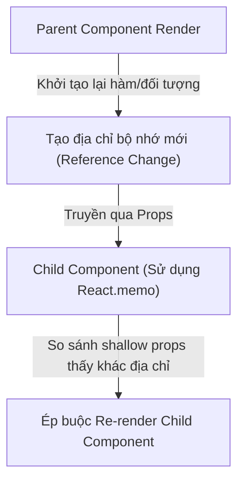

# Bài 02 - useMemo & useCallback (Ghi nhớ giá trị & Hàm callback)

## I. KHÁI QUÁT (OVERVIEW)

### 1. Vấn đề về So sánh Tham chiếu (Referential Equality) trong React
Trong JavaScript, các kiểu dữ liệu cơ bản (Primitives: `string`, `number`, `boolean`) được so sánh theo giá trị. Trong khi đó, các kiểu dữ liệu phức tạp (Objects, Arrays, Functions) được so sánh theo **địa chỉ vùng nhớ** (Referential Equality).
```javascript
{} === {} // false
(() => {}) === (() => {}) // false
```

Mỗi lần một React Component re-render:
*   Tất cả các biến kiểu Object/Array khai báo trong thân component sẽ được khởi tạo lại với **địa chỉ bộ nhớ mới**.
*   Tất cả các hàm khai báo trong component cũng được định nghĩa lại với **địa chỉ bộ nhớ mới**.

Điều này dẫn đến 2 vấn đề lớn về hiệu năng:
1.  **Tính toán lại tác vụ nặng (Expensive Computations):** Phép toán phức tạp (lọc danh sách 10.000 items) bị chạy lại vô ích cho dù dữ liệu đầu vào không hề thay đổi.
2.  **Kích hoạt re-render chuỗi ở con:** Component con nhận props là một object/hàm có địa chỉ bộ nhớ thay đổi liên tục sẽ bị ép re-render lại, làm hỏng tối ưu hiệu năng của `React.memo`.



Hook **`useMemo`** và **`useCallback`** ra đời để giúp bạn **giữ ổn định địa chỉ vùng nhớ** của đối tượng hoặc hàm qua các lần re-render, chỉ khởi tạo lại khi các giá trị phụ thuộc (dependencies) thực sự thay đổi.

---

## II. CHI TIẾT KỸ THUẬT (DETAILED DEEP DIVE)

### 1. Phân biệt: `useMemo` vs `useCallback`

*   **`useMemo`:** Ghi nhớ **kết quả** trả về của một hàm.
    *   *Cú pháp:* `const memoizedValue = useMemo(() => computeExpensiveValue(a, b), [a, b]);`
*   **`useCallback`:** Ghi nhớ **chính bản thân** hàm callback đó.
    *   *Cú pháp:* `const memoizedCallback = useCallback(() => { doSomething(a, b); }, [a, b]);`

$$\text{useCallback}(f, d) \equiv \text{useMemo}(() \rightarrow f, d)$$

---

### 2. Khi nào nên dùng và khi nào KHÔNG nên dùng?

> [!CAUTION]
> **Cạm bẫy Lạm dụng Memoization (Over-memoization):**
> Việc bọc tất cả mọi thứ trong `useMemo` và `useCallback` là một sai lầm phổ biến. Bản thân việc kiểm tra dependency array ở mỗi lần render cũng tốn CPU. Nếu tác vụ của bạn siêu nhẹ (như cộng hai số), việc dùng `useMemo` thậm chí còn làm ứng dụng chạy chậm hơn và làm code trở nên cực kỳ rắc rối.

#### Trường hợp Cần dùng:
1.  **Tác vụ tính toán nặng thực sự:** Các phép toán lọc, sắp xếp, biến đổi mảng dữ liệu lớn, hoặc các thuật toán đệ quy tốn nhiều mili-giây.
2.  **Giữ ổn định tham chiếu cho Component con:** Khi truyền object/hàm xuống component con có sử dụng `React.memo` để ngăn chặn con re-render vô ích.
3.  **Làm Dependency cho Hook khác:** Khi truyền hàm/object làm dependency cho một `useEffect` khác bên trong.

#### Trường hợp KHÔNG nên dùng:
1.  Các phép toán cơ bản, nhẹ nhàng (ví dụ: gộp chuỗi, tính toán cơ bản).
2.  Truyền props xuống thẻ HTML chuẩn (như `<button onClick={callback}>`) - thẻ HTML chuẩn không có cơ chế `React.memo` nên việc giữ địa chỉ hàm không mang lại bất kỳ lợi ích nào.

---

## III. VÍ DỤ MINH HỌA VÀ PHÂN TÍCH CODE (CODE EXAMPLES & ANALYSIS)

### 1. Tối ưu hóa hiệu năng danh sách với useMemo & useCallback
Dưới đây là một ví dụ thực tế về bộ lọc danh sách người dùng. Chúng ta sử dụng `useMemo` để lưu bộ lọc dữ liệu nặng và `useCallback` để giữ ổn định hàm click truyền xuống các Component con đã được bọc qua `React.memo`.

```tsx
// File: src/components/UserSearch.tsx
import React, { useState, useMemo, useCallback } from 'react';

interface User {
  id: number;
  name: string;
}

// Component con hiển thị thông tin User, được bọc trong React.memo để tối ưu
const UserItem = React.memo(({ user, onDelete }: { user: User; onDelete: (id: number) => void }) => {
  console.log(`UserItem Render: ${user.name}`);
  return (
    <li className="flex justify-between p-2 border-b">
      <span>{user.name}</span>
      <button onClick={() => onDelete(user.id)} className="text-red-500">Xóa</button>
    </li>
  );
});

export const UserSearch: React.FC = () => {
  const [query, setQuery] = useState('');
  const [users, setUsers] = useState<User[]>([
    { id: 1, name: 'Nguyễn Văn A' },
    { id: 2, name: 'Trần Thị B' },
    { id: 3, name: 'Lê Văn C' }
  ]);

  // 1. Dùng useMemo để tránh lọc lại mảng dữ liệu khi gõ chữ không liên quan
  // Mảng lọc chỉ chạy lại khi 'users' hoặc 'query' thay đổi
  const filteredUsers = useMemo(() => {
    console.log('Đang thực hiện lọc danh sách...');
    return users.filter(user => user.name.toLowerCase().includes(query.toLowerCase()));
  }, [users, query]);

  // 2. Dùng useCallback để giữ ổn định địa chỉ hàm onDelete truyền xuống component con
  // Tránh việc UserItem bị re-render lại vô ích khi người dùng gõ vào ô tìm kiếm
  const handleDelete = useCallback((id: number) => {
    setUsers((prevUsers) => prevUsers.filter(user => user.id !== id));
  }, []); // Mảng dependency rỗng vì dùng functional update (prevUsers)

  return (
    <div className="p-6 max-w-md mx-auto bg-white rounded-lg shadow">
      <input
        type="text"
        placeholder="Tìm kiếm thành viên..."
        value={query}
        onChange={(e) => setQuery(e.target.value)}
        className="w-full px-4 py-2 border rounded mb-4"
      />

      <ul>
        {filteredUsers.map(user => (
          <UserItem key={user.id} user={user} onDelete={handleDelete} />
        ))}
      </ul>
    </div>
  );
};
```

---

## IV. LƯU Ý, CẠM BẪY VÀ QUY TẮC CỐT LÕI (PITFALLS & BEST PRACTICES)

### 1. React Compiler (React Forget) trong tương lai (React 19)
*   **Thông tin công nghệ mới:** Nhận thấy việc bắt lập trình viên tự quản lý `useMemo`/`useCallback` thủ công quá phức tạp và dễ gây ra lỗi, đội ngũ React đang phát triển **React Compiler** (tên mã cũ là React Forget).
*   **Cơ chế:** Trình biên dịch sẽ tự động phân tích cú pháp code JavaScript ở build-time và tự động chèn cơ chế memoization cho tất cả các phần tử, hàm, object mà không cần bạn phải viết `useMemo` hay `useCallback` nữa. Tuy nhiên, cho đến khi React Compiler được áp dụng rộng rãi, việc hiểu và viết tốt 2 hook này vẫn là kỹ năng bắt buộc của senior dev.

---

## 💡 5 QUY TẮC VÀNG VỀ MEMOIZATION
1.  **Chỉ tối ưu khi có số liệu đo đạc:** Sử dụng tab Profiler của React DevTools để đo đạc thời gian render thực tế trước khi thêm `useMemo`/`useCallback`.
2.  **Bắt buộc dùng kèm `React.memo` cho con:** `useCallback` truyền xuống con sẽ hoàn toàn vô tác dụng nếu Component con đó không được bọc trong `React.memo`.
3.  **Luôn khai báo đầy đủ Dependencies:** Đảm bảo toàn bộ các biến ngoài scope đọc bên trong callback đều được khai báo đầy đủ trong mảng dependency để tránh lỗi Stale State.
4.  **Ưu tiên dùng Functional Updates cho state:** Giúp giảm bớt các dependencies cần khai báo trong `useCallback` (ví dụ: dùng `setUsers(prev => ...)` thay vì đưa `users` vào mảng dependency).
5.  **Không bọc các phép toán siêu nhẹ:** Tránh làm rối code và tiêu tốn CPU kiểm tra dependency vô ích cho các tác vụ tính toán đơn giản.
