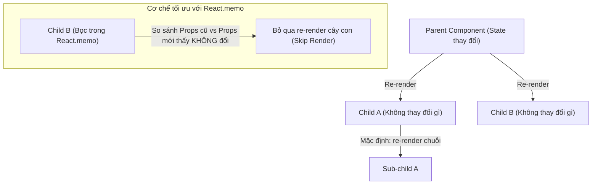

## I. KHÁI QUÁT (OVERVIEW)

### 1. Tại sao React Component re-render?
Mặc định trong React, khi trạng thái (`State`) hoặc thuộc tính (`Props`) của một Component thay đổi, Component đó và **toàn bộ các Component con** nằm trong cây DOM của nó sẽ bị re-render lại một cách đệ quy từ trên xuống dưới.



Trong thực tế, nhiều component con hoàn toàn không nhận props nào đổi mới nhưng vẫn bị re-render chuỗi chỉ vì cha của chúng thay đổi state. Việc này gây lãng phí tài nguyên CPU nghiêm trọng trong các ứng dụng lớn.

**`React.memo`** là một Higher-Order Component (HOC) được sử dụng để tối ưu hiệu năng bằng cách ghi nhớ (memoize) kết quả render của component con, bỏ qua việc re-render nếu props của nó không có sự thay đổi.

---

## II. CHI TIẾT KỸ THUẬT (DETAILED DEEP DIVE)

### 1. Cơ chế So sánh Nông (Shallow Comparison) của React.memo
Mặc định, `React.memo` thực hiện một phép so sánh nông (**Shallow Comparison**) đối với các thuộc tính trong đối tượng props.
*   **Tham trị (Primitive props):** So sánh bằng giá trị (`a === b`). Nếu giá trị giống nhau $\rightarrow$ Bỏ qua render.
*   **Tham chiếu (Object/Array/Function props):** So sánh địa chỉ vùng nhớ. Nếu địa chỉ thay đổi $\rightarrow$ Kích hoạt re-render.

#### Custom Comparison Function (Hàm so sánh tùy biến)
Nếu props truyền vào là một object phức tạp lồng nhau và bạn muốn tự quyết định xem khi nào cần re-render, bạn có thể truyền tham số thứ hai là một hàm so sánh tùy biến vào `React.memo`:

```javascript
const MyComponent = React.memo(
  (props) => { /* render logic */ },
  (prevProps, nextProps) => {
    // Trả về true nếu muốn BỎ QUA render (Props bằng nhau)
    // Trả về false nếu muốn KÍCH HOẠT render (Props khác nhau)
    return prevProps.user.id === nextProps.user.id;
  }
);
```

---

### 2. Các kỹ thuật tối ưu hiệu năng không cần dùng `React.memo`
Đôi khi, bạn có thể tối ưu hiệu năng re-render bằng cách thay đổi cấu trúc thiết kế component (Component Design Patterns) mà không cần viết thêm `React.memo` hay `useCallback`.

#### Kỹ thuật 1: Đẩy State xuống dưới (Moving State Down)
Nếu một state chỉ ảnh hưởng đến một phần nhỏ của giao diện, hãy tách riêng phần đó thành một component con và lưu trữ state trực tiếp bên trong nó, giải phóng component cha khỏi việc re-render.

#### Kỹ thuật 2: Truyền Component con qua prop `children` (Children as Props)
Nếu component cha chỉ làm nhiệm vụ bố cục (layout) và chứa một state thay đổi thường xuyên, hãy truyền cây component con qua prop `children`. React sẽ nhận biết cây con là không đổi và bỏ qua việc re-render nó.

---

## III. VÍ DỤ MINH HỌA VÀ PHÂN TÍCH CODE (CODE EXAMPLES & ANALYSIS)

### 1. Tối ưu hóa bằng Kỹ thuật Children as Props
Dưới đây là một ví dụ thực tế về một Box Cuộn Chuột (Scroll Box) chứa danh sách rất nặng. Nếu đặt state cuộn ở cha, mỗi pixel cuộn chuột sẽ làm re-render toàn bộ danh sách. Chúng ta sẽ giải quyết bằng cách truyền danh sách qua `children`.

```tsx
// File: src/components/ScrollContainer.tsx
import React, { useState } from 'react';

// Component con giả lập danh sách rất nặng
const HeavyList = () => {
  console.log('HeavyList Render! (Tác vụ cực kỳ nặng)');
  const items = Array.from({ length: 5000 }, (_, i) => `Thành phần thứ ${i}`);
  return (
    <ul>
      {items.map((item, idx) => <li key={idx}>{item}</li>)}
    </ul>
  );
};

// ❌ CÁCH THIẾT KẾ TỒI: Re-render HeavyList ở mỗi lần cuộn chuột
export const BadLayout: React.FC = () => {
  const [scrollY, setScrollY] = useState(0);

  return (
    <div 
      onScroll={(e) => setScrollY(e.currentTarget.scrollTop)}
      className="h-64 overflow-y-auto border"
    >
      <p>Vị trí cuộn: {scrollY}px</p>
      <HeavyList /> {/* Bị re-render liên tục gây giật lag */}
    </div>
  );
};

// ==============================================================

// ✅ CÁCH THIẾT KẾ TỐT: Sử dụng Component Composition (Children as Props)
interface GoodLayoutProps {
  children: React.ReactNode;
}

const ScrollBox: React.FC<GoodLayoutProps> = ({ children }) => {
  const [scrollY, setScrollY] = useState(0);

  return (
    <div 
      onScroll={(e) => setScrollY(e.currentTarget.scrollTop)}
      className="h-64 overflow-y-auto border"
    >
      <p>Vị trí cuộn: {scrollY}px</p>
      {/* 
        React nhận biết 'children' được truyền từ bên ngoài vào. 
        Khi ScrollBox thay đổi state scrollY, nó chỉ chạy lại hàm render của chính nó 
        mà không chạy lại hàm của children (HeavyList) vì children không đổi địa chỉ.
      */}
      {children}
    </div>
  );
};

export const App = () => {
  return (
    <ScrollBox>
      <HeavyList /> {/* Chỉ render duy nhất 1 lần khởi tạo! */}
    </ScrollBox>
  );
};
```

---

## IV. LƯU Ý, CẠM BẪY VÀ QUY TẮC CỐT LÕI (PITFALLS & BEST PRACTICES)

### 1. Cạm bẫy sử dụng `React.memo` bừa bãi
*   **Vấn đề:** Bọc tất cả mọi component trong `React.memo` một cách vô tội vạ.
*   **Hậu quả:** Làm chậm ứng dụng. `React.memo` phải thực hiện so sánh nông các thuộc tính props ở mỗi lần render. Nếu component con của bạn siêu nhẹ (ví dụ chỉ hiển thị một đoạn văn ngắn), hoặc component con đó **luôn nhận props thay đổi** (ví dụ nhận props mới ở mọi lần render) $\rightarrow$ Phép so sánh props của `React.memo` trở nên hoàn toàn vô ích và lãng phí tài nguyên CPU.
*   ✅ *Best practice:* Chỉ dùng `React.memo` cho các component con có UI lớn, phức tạp, nhận các props ít thay đổi hoặc có tần suất re-render từ cha rất cao.

---

## 💡 5 QUY TẮC VÀNG VỀ TỐI ƯU HIỆU NĂNG RENDER
1.  **Thiết kế cấu trúc tốt trước khi dùng Hooks:** Áp dụng kỹ thuật "Moving State Down" và "Children as Props" trước tiên để tối ưu tự nhiên mà không cần viết logic so sánh phức tạp.
2.  **Chỉ bọc Component nặng trong `React.memo`:** Không lạm dụng cho các component nhẹ để tránh hao phí tài nguyên so sánh props vô ích.
3.  **Bảo toàn địa chỉ props truyền xuống:** Luôn sử dụng `useMemo` cho props là Object/Array và `useCallback` cho props là Hàm khi truyền xuống component đã bọc `React.memo`.
4.  **Cẩn thận với Custom Comparison Function:** Đảm bảo hàm so sánh tùy biến xử lý chính xác tất cả các trường hợp để tránh lỗi Stale Props (con không cập nhật giao diện mới do hàm so sánh trả về true sai lệch).
5.  **Sử dụng Profiler để kiểm chứng:** Luôn đo đạc và so sánh thời gian render trước và sau khi tối ưu để đảm bảo việc thêm `React.memo` thực sự mang lại hiệu quả tốt hơn.
