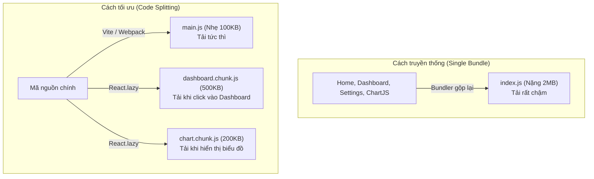

## I. KHÁI QUÁT (OVERVIEW)

### 1. Tại sao phải tách mã (Code Splitting)?
Khi bạn xây dựng một ứng dụng React SPA (Single Page Application) sử dụng các công cụ đóng gói (bundlers) như Vite, Webpack hoặc Rollup, toàn bộ mã nguồn JavaScript của bạn và các thư viện bên thứ ba (node_modules) mặc định sẽ được gộp chung vào một tệp tin duy nhất gọi là **Main Bundle** (ví dụ: `index.js`).

#### Điểm yếu chí mạng:
*   **Thời gian tải trang ban đầu (Initial Load Time) cực lâu:** Người dùng chỉ muốn vào trang Đăng nhập, nhưng trình duyệt của họ bắt buộc phải tải về toàn bộ code của trang Dashboard, các trang biểu đồ thống kê nặng và thư viện liên quan.
*   Làm giảm nghiêm trọng chỉ số **LCP** (Largest Contentful Paint) và tăng tỷ lệ thoát trang của người dùng.



**Code Splitting** (Tách mã) và **Lazy Loading** (Tải chậm) là kỹ thuật chia nhỏ tệp tin bundle lớn này thành nhiều tệp nhỏ hơn (chunks). Trình duyệt của người dùng chỉ tải về các tệp tin chứa code của trang hiện tại, và sẽ tự động tải thêm các tệp tin khác khi người dùng chuyển trang hoặc click kích hoạt tính năng tương ứng.

---

## II. CHI TIẾT KỸ THUẬT (DETAILED DEEP DIVE)

### 1. Cơ chế hoạt động của `React.lazy` và `Suspense`

#### a. Dynamic Import (Nhập khẩu động)
Nền tảng của tách mã trong JavaScript hiện đại là cú pháp `import()` động. Khác với `import` tĩnh ở đầu file, `import()` trả về một **Promise** và chỉ thực thi tải file về từ server khi dòng lệnh đó được chạy.
```javascript
import("./math").then(math => {
  console.log(math.add(16, 26));
});
```

#### b. `React.lazy`
`React.lazy` là một hàm của React nhận vào một callback gọi `import()` động và trả về một **React Component** đặc biệt có thể render bình thường như các component tĩnh.
```tsx
const HeavyComponent = React.lazy(() => import('./HeavyComponent'));
```

#### c. `<Suspense>` Boundary
Vì `React.lazy` tải file JS bất đồng bộ từ internet, sẽ có một khoảng thời gian chờ (delay). React yêu cầu bạn phải bao bọc component lazy bên trong thẻ `<Suspense>` và cung cấp prop `fallback` để hiển thị giao diện tạm thời (như loading spinner) trong lúc chờ đợi tải file JS hoàn tất.

---

### 2. Các chiến lược Tách mã phổ biến
1.  **Route-based Splitting (Tách mã theo định tuyến):** Đây là chiến lược phổ biến và dễ triển khai nhất. Bạn tách mã theo từng trang của hệ thống (ví dụ: Trang chủ, Trang Cá nhân, Trang Cài đặt).
2.  **Component-based Splitting (Tách mã theo thành phần):** Áp dụng cho các component siêu nặng nằm trên cùng một trang nhưng không hiển thị ngay từ đầu (như cửa sổ Chatbox, bảng vẽ đồ thị ChartJS, trình biên soạn văn bản Rich Text Editor chỉ hiển thị khi click nút).

---

## III. VÍ DỤ MINH HỌA VÀ PHÂN TÍCH CODE (CODE EXAMPLES & ANALYSIS)

### 1. Triển khai Component-based Lazy Loading trong React
Dưới đây là một ví dụ thực tế về việc tải chậm một Thư viện Đồ thị nặng (ChartComponent) chỉ khi người dùng click vào tab "Báo cáo".

```tsx
// File: src/components/ReportViewer.tsx
import React, { useState, Suspense, lazy } from 'react';

// 1. Tải chậm Component vẽ đồ thị bằng React.lazy
const HeavyChart = lazy(() => import('./HeavyChartComponent'));

export const ReportViewer: React.FC = () => {
  const [showChart, setShowChart] = useState(false);

  return (
    <div className="p-6 max-w-2xl mx-auto bg-white rounded-xl shadow-md space-y-4 border">
      <h2 className="text-xl font-bold text-slate-800">Báo cáo kinh doanh</h2>
      <p className="text-slate-600 text-sm">
        Trang này chứa dữ liệu thống kê cơ bản. Phần đồ thị phân tích chi tiết rất nặng và chỉ được tải về khi bạn yêu cầu.
      </p>

      {!showChart ? (
        <button
          onClick={() => setShowChart(true)}
          className="px-4 py-2 bg-indigo-600 text-white rounded hover:bg-indigo-700 transition-colors"
        >
          Xem đồ thị phân tích chi tiết
        </button>
      ) : (
        // 2. Bao bọc Component lazy trong Suspense để hiển thị Skeleton Loading
        <Suspense 
          fallback={
            <div className="h-64 bg-slate-100 rounded-lg flex items-center justify-center animate-pulse text-slate-400">
              Đang tải module đồ thị thống kê...
            </div>
          }
        >
          <HeavyChart />
        </Suspense>
      )}
    </div>
  );
};
```

---

## IV. LƯU Ý, CẠM BẪY VÀ QUY TẮC CỐT LÕI (PITFALLS & BEST PRACTICES)

### 1. Lỗi tải file chunk thất bại (Chunk Load Error)
*   **Vấn đề:** Khi bạn deploy phiên bản mới của trang web lên máy chủ, tên các file chunk cũ sẽ bị thay đổi (ví dụ do hash thay đổi: `dashboard.a1b2c3.js` $\rightarrow$ `dashboard.d4e5f6.js`). Nếu người dùng đang mở trang web phiên bản cũ và click chuyển trang, trình duyệt của họ sẽ cố gắng tải file chunk cũ và gặp lỗi **404 Not Found / ChunkLoadError**, làm ứng dụng bị crash trắng xóa.
*   ✅ *Best practice:* Bọc toàn bộ các Component được lazy load bên trong một **ErrorBoundary** chuyên dụng để bắt lỗi tải file chunk thất bại và tự động reload lại trang web phiên bản mới cho người dùng.
    ```tsx
    <ErrorBoundary fallback={<p>Đang làm mới ứng dụng để cập nhật phiên bản mới...</p>}>
      <Suspense fallback={<Loader />}>
        <LazyComponent />
      </Suspense>
    </ErrorBoundary>
    ```

---

## 💡 5 QUY TẮC VÀNG VỀ CODE SPLITTING
1.  **Tách mã ở cấp độ Route lớn trước:** Đây là cách nhanh nhất và hiệu quả nhất để giảm ngay dung lượng tải trang ban đầu (LCP) mà không cần thay đổi cấu trúc code.
2.  **Luôn bọc lazy component trong Suspense:** React sẽ báo lỗi ngay lập tức trong quá trình render nếu thiếu thẻ cha `<Suspense>`.
3.  **Bọc ErrorBoundary bảo vệ Chunk Load:** Phòng tránh lỗi crash trắng trang do trình duyệt tải file chunk cũ bị xóa sau khi deploy phiên bản mới.
4.  **Tách các thư viện bên thứ ba cực nặng:** Sử dụng dynamic import cho các thư viện nặng (như `lodash`, `moment`, `pdfjs`) chỉ khi thực sự cần dùng đến chúng trong logic xử lý.
5.  **Tối ưu hóa tên Export mặc định:** Hàm `React.lazy` chỉ hỗ trợ import các Component được xuất mặc định (`export default`). Đảm bảo file được lazy load có cấu trúc export phù hợp.
