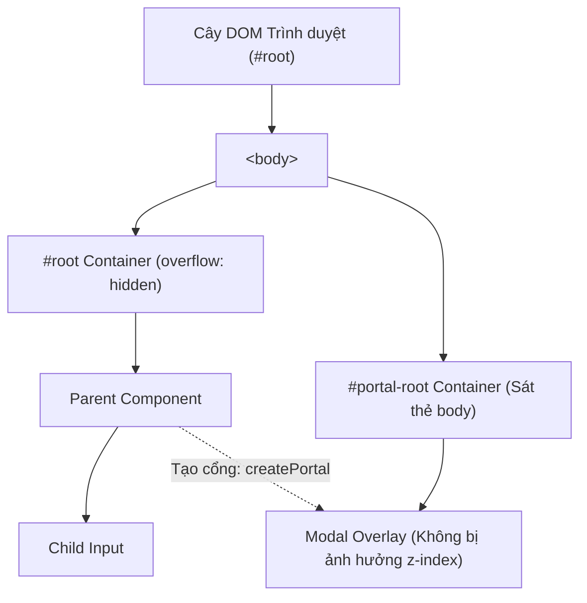

# Bài 05 - Portals & Modal Patterns (Cổng render & Mẫu Modal)

## I. KHÁI QUÁT (OVERVIEW)

### 1. Vấn đề của cấu trúc lồng nhau của cây DOM
Trong React, giao diện của bạn là một cây Component lồng nhau. Mặc định, khi một Component con render ra thẻ HTML, thẻ đó sẽ được chèn trực tiếp vào vị trí phân cấp của Component cha trong cây DOM thực tế của trình duyệt.

Tuy nhiên, đối với các thành phần giao diện dạng nổi trên màn hình như **Modals** (hộp thoại), **Tooltips**, **Popovers**, hoặc **Toast Notifications**:
*   **Vấn đề CSS Overflow:** Nếu một trong các Component cha của nó thiết lập thuộc tính CSS `overflow: hidden` hoặc `clip`, giao diện của Modal con sẽ bị cắt đứt một phần.
*   **Vấn đề Z-Index:** Nếu Component cha có thuộc tính `z-index` thấp hoặc nằm trong một stacking context riêng, Modal con sẽ bị đè bên dưới các phần tử khác trên trang web cho dù bạn có gán `z-index: 9999` cho nó.



**React Portals** ra đời để giải quyết vấn đề này bằng cách cho phép bạn render một Component con ra một vị trí DOM hoàn toàn khác nằm ngoài phạm vi bao bọc của Component cha (thường là nằm sát thẻ `<body>`), trong khi vẫn duy trì đầy đủ dòng chảy sự kiện (event bubbling) và kết nối React Context như bình thường.

---

## II. CHI TIẾT KỸ THUẬT (DETAILED DEEP DIVE)

### 1. Cơ chế hoạt động của React Portals
Bạn sử dụng API `createPortal` từ thư viện `react-dom` để tạo một cổng render:
```javascript
import { createPortal } from 'react-dom';

createPortal(childJSX, domNode);
```
*   `childJSX`: Khối giao diện muốn hiển thị (ví dụ: Modal).
*   `domNode`: Phần tử DOM thực tế của trình duyệt nơi bạn muốn chèn khối giao diện đó vào (ví dụ: `document.getElementById('portal-root')`).

#### Dòng chảy sự kiện qua Portal (Event Bubbling)
Mặc dù phần tử HTML được đặt ở vị trí khác trên cây DOM thực tế, React vẫn bảo toàn dòng chảy sự kiện logic theo phân cấp cây Component của React.
*   *Ý nghĩa:* Một sự kiện Click xảy ra bên trong Modal nằm sát thẻ body vẫn sẽ nổi lên (bubble up) đến Component cha chứa lệnh gọi Portal đó, giúp bạn quản lý sự kiện tập trung dễ dàng.

---

### 2. Thiết kế Modal chuẩn tiếp cận (A11y Modal Pattern)
Một Modal đạt tiêu chuẩn chất lượng cao và thân thiện với khả năng tiếp cận (Accessibility) cần đảm bảo các yếu tố:
1.  **Scroll Locking (Khóa cuộn):** Khi Modal mở ra, người dùng không thể cuộn chuột trang web phía sau.
2.  **Keyboard Navigation (Phím Esc để đóng):** Nhấn phím `Escape` sẽ tự động đóng Modal.
3.  **Focus Trap (Bẫy tiêu điểm):** Khi di chuyển bằng phím `Tab`, tiêu điểm (focus) của bàn phím chỉ được di chuyển vòng quanh các nút trong Modal mà không được bay ra ngoài các liên kết ẩn phía sau.

---

## III. VÍ DỤ MINH HỌA VÀ PHÂN TÍCH CODE (CODE EXAMPLES & ANALYSIS)

### 1. Triển khai Modal vạn năng tối ưu A11y bằng React Portal
Dưới đây là một Component Modal chuẩn chỉnh tích hợp đầy đủ Portal, khóa cuộn, bắt sự kiện phím Esc, và click overlay để đóng.

```tsx
// File: src/components/Modal.tsx
import React, { useEffect, useRef } from 'react';
import { createPortal } from 'react-dom';

interface ModalProps {
  isOpen: boolean;
  onClose: () => void;
  title: string;
  children: React.ReactNode;
}

export const Modal: React.FC<ModalProps> = ({ isOpen, onClose, title, children }) => {
  const overlayRef = useRef<HTMLDivElement>(null);

  // 1. Quản lý Khóa cuộn trang (Scroll Locking) và Phím ESC
  useEffect(() => {
    if (!isOpen) return;

    // Khóa cuộn của body
    const originalStyle = window.getComputedStyle(document.body).overflow;
    document.body.style.overflow = 'hidden';

    // Lắng nghe phím ESC để đóng modal
    const handleKeyDown = (e: KeyboardEvent) => {
      if (e.key === 'Escape') {
        onClose();
      }
    };
    window.addEventListener('keydown', handleKeyDown);

    // Cleanup: Khôi phục lại trạng thái cũ khi đóng modal hoặc unmount
    return () => {
      document.body.style.overflow = originalStyle;
      window.removeEventListener('keydown', handleKeyDown);
    };
  }, [isOpen, onClose]);

  if (!isOpen) return null;

  // 2. Click ra ngoài (overlay) để đóng modal
  const handleOverlayClick = (e: React.MouseEvent<HTMLDivElement>) => {
    if (e.target === overlayRef.current) {
      onClose();
    }
  };

  // 3. Tạo Portal kết nối tới phần tử #portal-root (thường được định nghĩa trong file index.html)
  const portalRoot = document.getElementById('portal-root') || document.body;

  return createPortal(
    <div 
      ref={overlayRef}
      onClick={handleOverlayClick}
      className="fixed inset-0 z-[9999] bg-black/50 backdrop-blur-sm flex items-center justify-center p-4"
    >
      <div className="bg-white rounded-xl shadow-xl max-w-md w-full overflow-hidden border border-slate-100 animate-in fade-in zoom-in-95 duration-200">
        {/* Header của Modal */}
        <header className="px-6 py-4 border-b flex justify-between items-center">
          <h3 className="text-lg font-bold text-slate-800">{title}</h3>
          <button 
            onClick={onClose}
            className="text-slate-400 hover:text-slate-600 text-2xl focus:outline-none"
            aria-label="Đóng cửa sổ"
          >
            &times;
          </button>
        </header>

        {/* Nội dung Modal */}
        <div className="px-6 py-4 text-slate-600 text-sm">
          {children}
        </div>

        {/* Footer chứa nút thao tác */}
        <footer className="px-6 py-4 bg-slate-50 border-t flex justify-end space-x-3">
          <button 
            onClick={onClose}
            className="px-4 py-2 text-sm font-semibold text-slate-600 hover:bg-slate-100 rounded-lg transition-colors"
          >
            Hủy bỏ
          </button>
          <button 
            onClick={() => {
              console.log('Xác nhận hành động!');
              onClose();
            }}
            className="px-4 py-2 text-sm font-semibold text-white bg-blue-600 hover:bg-blue-700 rounded-lg transition-colors"
          >
            Xác nhận
          </button>
        </footer>
      </div>
    </div>,
    portalRoot
  );
};
```

---

## IV. LƯU Ý, CẠM BẪY VÀ QUY TẮC CỐT LÕI (PITFALLS & BEST PRACTICES)

### 1. Quên dọn dẹp Scroll Lock khi xảy ra lỗi (Unmount Error)
*   **Vấn đề:** Nếu component chứa modal bị unmount bất ngờ do lỗi runtime (không qua trigger `onClose`), thuộc tính `overflow: hidden` có thể vẫn bị kẹt ở thẻ `<body>`.
*   **Hậu quả:** Người dùng bị kẹt màn hình và không thể cuộn chuột trang web được nữa cho dù đã tải lại dữ liệu động.
*   ✅ *Best practice:* Luôn đảm bảo hàm cleanup trong `useEffect` (như ở ví dụ trên) khôi phục lại thuộc tính `overflow` cũ trong mọi trường hợp component bị hủy.

### 2. Thiết lập điểm đích Portal (#portal-root) sạch sẽ
*   Đảm bảo phần tử đích của Portal (ví dụ: `<div id="portal-root"></div>`) đã được khai báo sẵn trong file `index.html` của dự án ngay dưới thẻ `#root`. Điều này giúp trình duyệt chuẩn bị sẵn DOM node trước khi React khởi chạy.

---

## 💡 5 QUY TẮC VÀNG VỀ PORTALS & MODALS
1.  **Dùng Portal cho toàn bộ các UI dạng nổi (Overlay):** Ngăn ngừa triệt để các lỗi vỡ layout do z-index và `overflow: hidden` của component cha.
2.  **Khóa cuộn body an toàn:** Luôn lưu giữ trạng thái overflow cũ và khôi phục sạch sẽ trong hàm cleanup của `useEffect`.
3.  **Hỗ trợ phím ESC và Click Overlay:** Giúp trải nghiệm người dùng tự nhiên nhất (tự đóng cửa sổ khi click ra vùng xám hoặc nhấn phím ESC).
4.  **Bảo toàn dòng chảy sự kiện (Event Bubbling):** Nhớ rằng sự kiện click trong Portal vẫn nổi lên cha bình thường theo cây component React.
5.  **Cung cấp nhãn aria phục vụ khả năng tiếp cận:** Đặt thuộc tính `role="dialog"` và `aria-modal="true"` trên container để các thiết bị hỗ trợ người khiếm thị nhận diện chính xác cửa sổ hội thoại.
