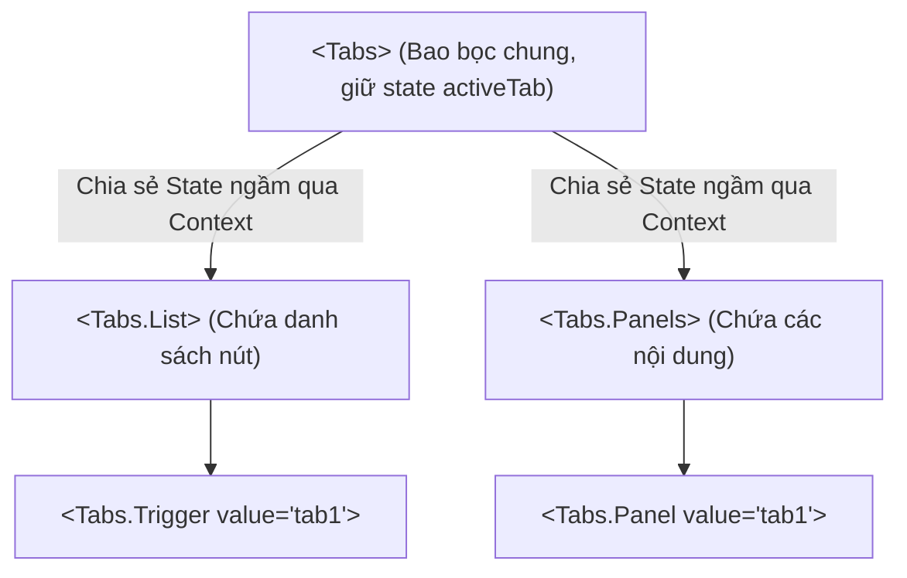

## I. KHÁI QUÁT (OVERVIEW)

### 1. Thử thách về Tính tùy biến của Component UI
Khi bạn thiết kế các Component UI phức tạp có tính chất tái sử dụng (như Accordion, Tabs, Dropdown, Select):
*   **Vấn đề của cách thiết kế thông thường (Config props):** Bạn cố gắng tạo ra một component duy nhất nhận hàng tá props cấu hình (ví dụ: `items`, `activeTab`, `onTabChange`, `renderTabTitle`, `renderTabContent`).
*   **Hậu quả:** Component trở nên cực kỳ cồng kềnh, khó bảo trì. Lập trình viên sử dụng component bị bó buộc trong cấu trúc UI cứng mà bạn đã định nghĩa trước, hầu như không thể tùy biến vị trí hoặc chèn thêm thẻ HTML tùy ý vào giữa các thành phần con.

**Compound Components** (Thành phần phức hợp) là một mẫu thiết kế nâng cao trong React, cho phép bạn chia tách một Component lớn thành một nhóm các component con có nhiệm vụ phối hợp với nhau để quản lý trạng thái chung.



*   *Lợi ích:* Đem lại khả năng tùy biến UI tối đa (người dùng có thể tự sắp xếp vị trí các thẻ con, chèn thêm icon, text vào bất kỳ đâu), trong khi toàn bộ logic quản lý trạng thái (active tab nào, ẩn/hiển thị ra sao) vẫn được xử lý tự động ngầm bên trong.

---

## II. CHI TIẾT KỸ THUẬT (DETAILED DEEP DIVE)

### 1. Cơ chế hoạt động của Compound Components
Mẫu thiết kế này hoạt động dựa trên cơ chế **Chia sẻ State ngầm (Implicit State Sharing)** thông qua **React Context**:
1.  Component cha (`<Tabs>`) tạo ra một Context lưu trữ state hiện tại (`activeTab`) và hàm cập nhật state (`setActiveTab`).
2.  Component cha render ra prop `children` để người dùng tự do bố trí layout.
3.  Các Component con (`<Tabs.Trigger>`, `<Tabs.Panel>`) khi được gọi sẽ tự động kết nối (consume) Context của cha để đọc state và thực hiện hành vi tương ứng (nút kích hoạt click, panel ẩn/hiển thị).

---

### 2. So sánh các mẫu thiết kế tái sử dụng code (Composition Patterns)

| Tiêu chí | Compound Components | Render Props | slots Pattern |
| :--- | :--- | :--- | :--- |
| **Cách truyền dữ liệu** | Ngầm qua React Context | Qua hàm callback nhận đối số | Qua các ReactNode được đặt tên |
| **Tính linh hoạt UI** | Cao nhất (người dùng tự do sắp đặt HTML) | Rất cao | Trung bình (định vị trí sẵn) |
| **Boilerplate Code** | Rất ít | Nhiều (phải viết hàm lồng trong JSX) | Rất ít |
| **Phù hợp nhất với** | UI nhóm (Tabs, Select, Accordion) | Share logic (như Fetch, MouseTracker) | Layouts có phân vùng (Header, Sidebar) |

---

## III. VÍ DỤ MINH HỌA VÀ PHÂN TÍCH CODE (CODE EXAMPLES & ANALYSIS)

### 1. Triển khai Hệ thống Tabs vạn năng bằng Compound Component
Dưới đây là cách triển khai hoàn chỉnh một hệ thống Tabs bằng TypeScript, cho phép người dùng tùy biến giao diện tối đa.

```tsx
// File: src/components/Tabs.tsx
import React, { useState, createContext, useContext } from 'react';

// 1. Định nghĩa kiểu dữ liệu cho Context
interface TabsContextProps {
  activeTab: string;
  setActiveTab: (value: string) => void;
}

const TabsContext = createContext<TabsContextProps | undefined>(undefined);

// 2. Component cha điều phối chính
interface TabsProps {
  defaultValue: string;
  children: React.ReactNode;
}

export const Tabs: React.FC<TabsProps> & {
  List: React.FC<{ children: React.ReactNode }>;
  Trigger: React.FC<{ value: string; children: React.ReactNode }>;
  Panel: React.FC<{ value: string; children: React.ReactNode }>;
} = ({ defaultValue, children }) => {
  const [activeTab, setActiveTab] = useState(defaultValue);

  return (
    <TabsContext.Provider value={{ activeTab, setActiveTab }}>
      <div className="tabs-container w-full max-w-md bg-white rounded-xl shadow p-4 border border-slate-100">
        {children}
      </div>
    </TabsContext.Provider>
  );
};

// Hàm Helper để các component con kết nối Context an toàn
const useTabsContext = () => {
  const context = useContext(TabsContext);
  if (!context) throw new Error('Các component con của Tabs phải được đặt bên trong thẻ <Tabs>');
  return context;
};

// 3. Component con: List (Chứa thanh điều hướng)
Tabs.List = ({ children }) => {
  return (
    <div className="flex border-b border-slate-200 pb-2 mb-4 space-x-2">
      {children}
    </div>
  );
};

// 4. Component con: Trigger (Nút bấm chuyển tab)
Tabs.Trigger = ({ value, children }) => {
  const { activeTab, setActiveTab } = useTabsContext();
  const isActive = activeTab === value;

  return (
    <button
      onClick={() => setActiveTab(value)}
      className={`px-4 py-2 text-sm font-semibold rounded-lg transition-all ${
        isActive 
          ? 'bg-blue-600 text-white shadow-sm' 
          : 'text-slate-600 hover:bg-slate-50'
      }`}
    >
      {children}
    </button>
  );
};

// 5. Component con: Panel (Nội dung hiển thị)
Tabs.Panel = ({ value, children }) => {
  const { activeTab } = useTabsContext();
  
  if (activeTab !== value) return null; // Ẩn nếu không hoạt động

  return (
    <div className="tab-panel-content text-slate-600 text-sm animate-in fade-in duration-200">
      {children}
    </div>
  );
};
```

#### Cách sử dụng linh hoạt bên ngoài:
```tsx
// File: src/App.tsx
import React from 'react';
import { Tabs } from './components/Tabs';

export const App = () => {
  return (
    <div className="p-8 flex justify-center">
      <Tabs defaultValue="account">
        {/* Người dùng tự do tùy biến cấu trúc và chèn HTML */}
        <Tabs.List>
          <Tabs.Trigger value="account">Tài khoản</Tabs.Trigger>
          <Tabs.Trigger value="security">Bảo mật</Tabs.Trigger>
        </Tabs.List>

        <div className="my-2 text-xs text-slate-400">
          * Thông tin bảo mật được mã hóa
        </div>

        <Tabs.Panel value="account">
          <p>Đây là nội dung cấu hình Tài khoản của bạn.</p>
        </Tabs.Panel>
        
        <Tabs.Panel value="security">
          <p>Mật khẩu của bạn đã được cập nhật cách đây 3 ngày.</p>
        </Tabs.Panel>
      </Tabs>
    </div>
  );
};
```

---

## IV. LƯU Ý, CẠM BẪY VÀ QUY TẮC CỐT LÕI (PITFALLS & BEST PRACTICES)

### 1. Cạm bẫy phá vỡ ranh giới Context do lồng thẻ cha trung gian quá sâu
*   **Vấn đề:** Nếu người dùng bọc các Component con của bạn bên trong một Component cha trung gian khác có tính chất chặn render hoặc cản trở dòng chảy JSX (như một số thư viện layout cũ), React Context vẫn truyền được nhưng cấu trúc render tĩnh có thể gặp khó khăn nếu bạn sử dụng kỹ thuật duyệt `React.Children.map` thay vì Context.
*   ✅ *Best practice:* Luôn sử dụng **React Context** để chia sẻ dữ liệu thay vì duyệt qua cây `React.Children` thủ công. Context đảm bảo dữ liệu truyền xuyên suốt qua mọi tầng HTML trung gian mà không sợ bị đứt gãy.

---

## 💡 5 QUY TẮC VÀNG VỀ COMPOUND COMPONENTS
1.  **Dùng Context để chia sẻ State ngầm:** Không dùng duyệt cây con thủ công (`React.Children`) để đảm bảo tính linh hoạt chèn thẻ HTML trung gian của người dùng.
2.  **Đặt tên các thẻ con gắn liền với cha:** Gán các component con trực tiếp làm thuộc tính của component cha (như `Tabs.List`, `Tabs.Trigger`) để mã nguồn sạch và dễ import.
3.  **Viết Hook kiểm tra phạm vi Context:** Luôn kiểm tra `context === undefined` để đưa ra cảnh báo lỗi rõ ràng nếu lập trình viên khác gọi nhầm component con ngoài phạm vi bọc của cha.
4.  **Cung cấp Default Values hợp lý:** Thiết lập giá trị mặc định (như `defaultValue` của Tabs) để component có thể chạy được ngay mà không cần nhiều thiết lập bắt buộc.
5.  **Tập hợp (Composition) thay vì tham số (Configuration):** Thiết kế API hướng tới việc cho phép người dùng tự lắp ghép giao diện bằng thẻ mở/đóng thay vì bắt họ truyền mảng cấu hình JSON.
