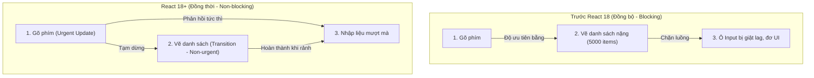

# Bài 07 - Concurrent Features (Tính năng xử lý đồng thời)

## I. KHÁI QUÁT (OVERVIEW)

### 1. Vấn đề nghẽn luồng xử lý đơn (Single-thread Bottleneck) của React
Trong JavaScript, luồng xử lý giao diện (UI thread) hoạt động đơn luồng. Khi trình duyệt bận thực hiện một tác vụ JavaScript nặng (ví dụ: render một danh sách gồm 5.000 phần tử hoặc xử lý lượng dữ liệu khổng lồ), nó hoàn toàn không thể phản hồi các hành động của người dùng (như click chuột, gõ phím). 

#### Trước React 18:
*   Mọi bản cập nhật giao diện đều có độ ưu tiên bằng nhau và được thực hiện đồng bộ, không thể ngắt quãng (Synchronous Rendering).
*   *Hậu quả:* Khi người dùng gõ chữ vào ô tìm kiếm và React cùng lúc phải lọc và render danh sách lớn phía dưới, ô input sẽ bị giật lag nghiêm trọng (input lag) vì React bận vẽ danh sách và chặn luồng gõ chữ của người dùng.



Từ phiên bản 18, React giới thiệu **Concurrent Features** (Tính năng xử lý đồng thời) dựa trên bộ điều phối thông minh (**Scheduler**). Nó cho phép React phân tách các bản cập nhật UI theo các mức độ ưu tiên khác nhau, sẵn sàng tạm dừng hoặc hủy bỏ việc render các thành phần nặng nếu người dùng phát sinh hành động khẩn cấp hơn (như click/gõ phím).

---

## II. CHI TIẾT KỸ THUẬT (DETAILED DEEP DIVE)

### 1. Phân cấp Độ ưu tiên Cập nhật (Priority-based Updates)
React chia các bản cập nhật trạng thái thành 2 nhóm chính:
1.  **Urgent Updates (Cập nhật khẩn cấp):** Phản ánh tương tác trực tiếp của người dùng (như gõ chữ, click nút, chọn menu). Người dùng cần thấy phản hồi ngay lập tức để cảm giác ứng dụng mượt mà.
2.  **Transition Updates (Cập nhật chuyển tiếp / Không khẩn cấp):** Các thay đổi giao diện phụ (như chuyển trang, tải danh sách kết quả lọc). Trễ vài trăm mili-giây vẫn chấp nhận được.

---

### 2. Các Hooks xử lý đồng thời chủ lực

#### a. `useTransition`
Cho phép bạn khai báo một bản cập nhật state là không khẩn cấp (transition).
```typescript
const [isPending, startTransition] = useTransition();
```
*   `startTransition(callback)`: Bao bọc các hàm cập nhật state không khẩn cấp bên trong callback này.
*   `isPending`: Trả về `true` trong lúc React đang chuẩn bị dữ liệu ngầm cho transition, giúp bạn hiển thị loader phù hợp.

#### b. `useDeferredValue`
Tương tự như `useTransition` nhưng áp dụng cho việc trì hoãn cập nhật một **giá trị** (value) thay vì trì hoãn một hàm cập nhật state. Rất thích hợp để hoãn render cây con nặng nhận props từ cha.
```typescript
const deferredQuery = useDeferredValue(query);
```

---

## III. VÍ DỤ MINH HỌA VÀ PHÂN TÍCH CODE (CODE EXAMPLES & ANALYSIS)

### 1. Tối ưu hóa ô tìm kiếm bộ lọc nặng bằng useTransition
Dưới đây là một ví dụ thực tế về cách sử dụng `useTransition` để đảm bảo ô nhập liệu tìm kiếm hoạt động siêu mượt mà ngay cả khi danh sách kết quả hiển thị bên dưới rất nặng.

```tsx
// File: src/components/ConcurrentSearch.tsx
import React, { useState, useTransition } from 'react';

// Tạo danh sách giả lập cực kỳ nặng để kiểm thử hiệu năng
const dummyProducts = Array.from({ length: 10000 }, (_, i) => `Sản phẩm công nghệ #${i + 1}`);

export const ConcurrentSearch: React.FC = () => {
  const [query, setQuery] = useState('');
  const [filteredProducts, setFilteredProducts] = useState(dummyProducts);
  
  // Khai báo useTransition
  const [isPending, startTransition] = useTransition();

  const handleInputChange = (e: React.ChangeEvent<HTMLInputElement>) => {
    const value = e.target.value;
    
    // 1. Cập nhật khẩn cấp: hiển thị ngay chữ người dùng gõ vào ô input
    setQuery(value);

    // 2. Cập nhật không khẩn cấp: Lọc danh sách 10.000 items
    // startTransition báo cho React biết tác vụ này có thể tạm dừng nếu người dùng gõ phím tiếp theo
    startTransition(() => {
      const filtered = dummyProducts.filter(item => 
        item.toLowerCase().includes(value.toLowerCase())
      );
      setFilteredProducts(filtered);
    });
  };

  return (
    <div className="p-6 max-w-lg mx-auto bg-white rounded-xl shadow-md border border-slate-100">
      <h2 className="text-xl font-bold text-slate-800 mb-4">Tìm kiếm Sản phẩm</h2>
      
      <div className="relative">
        <input
          type="text"
          value={query}
          onChange={handleInputChange}
          placeholder="Nhập tên thiết bị..."
          className="w-full px-4 py-2 border rounded-lg focus:ring-2 focus:ring-blue-500 focus:outline-none"
        />
        
        {/* Hiển thị hiệu ứng mờ nhạt báo hiệu danh sách đang được lọc ngầm */}
        {isPending && (
          <span className="absolute right-3 top-2.5 text-xs text-blue-500 animate-pulse">
            Đang lọc...
          </span>
        )}
      </div>

      <ul className={`mt-4 space-y-2 max-h-60 overflow-y-auto ${isPending ? 'opacity-50' : ''}`}>
        {filteredProducts.map((product, idx) => (
          <li key={idx} className="p-2 bg-slate-50 rounded text-sm text-slate-700">
            {product}
          </li>
        ))}
      </ul>
    </div>
  );
};
```

#### Phân tích hiệu năng:
*   Nếu không có `useTransition`, khi người dùng gõ phím liên tục, trình duyệt sẽ bị giật lag và chữ hiển thị trong ô input bị trễ vì luồng JS bận chạy hàm `filter`.
*   Với `useTransition`, React sẽ ưu tiên xử lý `setQuery` trước để hiển thị chữ. Phép toán lọc danh sách sẽ chạy ngầm. Nếu người dùng gõ phím tiếp theo khi phép lọc cũ chưa xong, React sẽ **hủy bỏ tiến trình lọc cũ** và bắt đầu tiến trình lọc mới tương ứng với ký tự mới nhất $\rightarrow$ Ô input hoạt động mượt mà ở mức 60 FPS.

---

## IV. LƯU Ý, CẠM BẪY VÀ QUY TẮC CỐT LÕI (PITFALLS & BEST PRACTICES)

### 1. Cạm bẫy sử dụng `startTransition` cho các input đồng bộ trực tiếp
*   Tránh bao bọc trực tiếp hàm kiểm soát giá trị của ô input (như `setQuery`) bên trong `startTransition`.
*   **Hậu quả:** Trình duyệt sẽ trì hoãn hiển thị chữ trong ô input, người dùng sẽ cảm giác phím gõ của họ không ăn hoặc bị chậm. Chỉ bao bọc các hàm cập nhật state xử lý kết quả gián tiếp.

### 2. Sự khác biệt giữa `useTransition` và Debounce/Throttle
*   **Debounce/Throttle:** Trì hoãn việc gọi hàm bằng cách hẹn giờ (`setTimeout`). Nó vẫn chạy đồng bộ và chặn UI khi thời gian chờ kết thúc.
*   **useTransition:** Không trì hoãn việc chạy hàm mà chạy ngầm lập tức với độ ưu tiên thấp. Phép toán có thể bị ngắt quãng tự động ở cấp độ CPU nhờ cơ chế Scheduler của React. Đây là giải pháp tối ưu hiệu năng tận gốc của React.

---

## 💡 5 QUY TẮC VÀNG VỀ CONCURRENT FEATURES
1.  **Chỉ hoãn các tác vụ không khẩn cấp:** Luôn giữ cho các tương tác gõ phím, click menu được phản hồi lập tức.
2.  **Dùng `isPending` để nâng cao UX:** Luôn hiển thị hiệu ứng mờ (opacity) hoặc spinner nhỏ để người dùng biết hệ thống đang xử lý ngầm, tránh cảm giác ứng dụng bị đơ.
3.  **Tận dụng `useDeferredValue` cho component con nhận props nặng:** Thích hợp khi bạn không có quyền can thiệp vào hàm thay đổi state của cha nhưng vẫn muốn hoãn re-render con.
4.  **Không bọc các xử lý bất đồng bộ thô:** `startTransition` phải chứa các hàm cập nhật state đồng bộ. Tránh bọc các lệnh gọi `fetch` hay `promise` trực tiếp bên trong nó.
5.  **Dùng Concurrent Mode làm giải pháp cuối cùng:** Luôn cố gắng tối ưu hóa giải thuật, phân trang (pagination) hoặc ảo hóa danh sách (virtualized list) trước khi cầu cứu đến `useTransition`.
