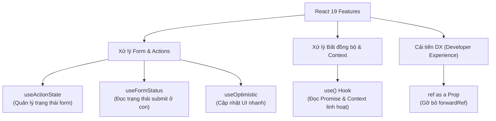

## I. KHÁI QUÁT (OVERVIEW)

### 1. Sự tiến hóa của React 19
Phiên bản **React 19** đánh dấu bước chuyển mình lớn của React từ một thư viện UI thuần túy phía Client thành một framework hỗ trợ sâu các tính năng Fullstack. 
React 19 tập trung vào việc giảm thiểu mã nguồn rườm rà (boilerplate code) khi xử lý các tác vụ bất đồng bộ, tối ưu hóa form dữ liệu và chuẩn bị cho sự ra mắt của trình biên dịch tự động **React Compiler**.



---

## II. CHI TIẾT KỸ THUẬT (DETAILED DEEP DIVE)

### 1. Cơ chế Actions mới
Trong các phiên bản cũ, bạn phải tự quản lý trạng thái loading, error khi gửi dữ liệu từ Form:
```typescript
const [pending, setPending] = useState(false);
const handleSubmit = async () => {
  setPending(true);
  await sendData();
  setPending(false);
}
```
React 19 hỗ trợ sử dụng **async functions** trực tiếp làm thuộc tính của thẻ form (gọi là **Actions**). React sẽ tự động quản lý vòng đời bất đồng bộ, tự thiết lập trạng thái loading và tự động reset form sau khi hoàn thành.

---

### 2. Sự đột phá của Hook `use()`
Đây là một Hook đặc biệt của React 19 có khả năng đọc các tài nguyên bất đồng bộ (như một Promise) hoặc Context ngay trong quá trình render.
*   **Điểm khác biệt lớn nhất:** Khác với tất cả các Hook truyền thống, `use()` **có thể gọi bên trong các câu lệnh điều kiện `if` và vòng lặp `for`**.

```typescript
// Đọc Context có điều kiện
if (showTheme) {
  const theme = use(ThemeContext);
}
```

---

### 3. Gỡ bỏ `forwardRef`
Lập trình viên React lâu năm đều ghét sự rườm rà của `React.forwardRef` khi cần truyền ref xuống component con.
*   **Trong React 19:** `ref` đã trở thành một **prop thông thường** giống như `className` hay `id`. Bạn chỉ cần nhận `ref` từ danh sách props và truyền vào thẻ con trực tiếp.

---

## III. VÍ DỤ MINH HỌA VÀ PHÂN TÍCH CODE (CODE EXAMPLES & ANALYSIS)

### 1. Quản lý Form Actions & Optimistic UI bằng useActionState và useOptimistic
Dưới đây là một ví dụ thực tế về danh sách tin nhắn. Khi người dùng gửi tin nhắn mới, hệ thống sử dụng `useOptimistic` để chèn ngay tin nhắn đó vào danh sách trên UI ở trạng thái "Đang gửi" (optimistic state) để tạo cảm giác mượt mà tức thì, trong khi form thực tế sử dụng `useActionState` để gửi API ngầm.

```tsx
// File: src/components/MessageBox.tsx
import React, { useActionState, useOptimistic } from 'react';

interface Message {
  id: string;
  text: string;
  sending?: boolean;
}

// Giả lập gọi API gửi tin nhắn bất đồng bộ
const sendMessageAPI = async (text: string): Promise<Message> => {
  await new Promise((resolve) => setTimeout(resolve, 1500)); // Trễ 1.5s
  return { id: Date.now().toString(), text };
};

export const MessageBox: React.FC = () => {
  // 1. Quản lý trạng thái danh sách tin nhắn
  const [messages, setMessages] = React.useState<Message[]>([
    { id: '1', text: 'Chào bạn, chúc một ngày tốt lành!' }
  ]);

  // 2. Cấu hình useOptimistic để cập nhật nhanh UI trước khi API hoàn thành
  const [optimisticMessages, addOptimisticMessage] = useOptimistic(
    messages,
    (state, newText: string) => [
      ...state,
      { id: 'temp_id', text: newText, sending: true } // Thêm tin nhắn ảo có cờ sending
    ]
  );

  // 3. Cấu hình useActionState (thay thế useFormState cũ) để quản lý form action
  const [state, formAction, isPending] = useActionState(
    async (prevState: any, formData: FormData) => {
      const messageText = formData.get('message') as string;
      if (!messageText) return null;

      // Kích hoạt cập nhật UI ảo tức thì
      addOptimisticMessage(messageText);

      try {
        const newMessage = await sendMessageAPI(messageText);
        // Cập nhật lại state thật khi API thành công
        setMessages((prev) => [...prev, newMessage]);
        return { success: true };
      } catch (err) {
        return { success: false, error: 'Gửi tin nhắn thất bại.' };
      }
    },
    null
  );

  return (
    <div className="max-w-md mx-auto p-6 bg-white rounded-xl shadow-md border">
      <h3 className="font-bold text-slate-800 mb-4">Chat Box</h3>
      
      {/* Danh sách tin nhắn hiển thị từ state ảo (optimisticMessages) */}
      <ul className="space-y-3 h-64 overflow-y-auto mb-4 p-2 bg-slate-50 rounded">
        {optimisticMessages.map((msg) => (
          <li 
            key={msg.id} 
            className={`p-2 rounded text-sm max-w-xs ${
              msg.sending 
                ? 'bg-slate-300 text-slate-600 self-end opacity-70 animate-pulse' 
                : 'bg-blue-500 text-white'
            }`}
          >
            {msg.text} {msg.sending && ' (Đang gửi...)'}
          </li>
        ))}
      </ul>

      {/* Form Action của React 19 */}
      <form action={formAction} className="flex gap-2">
        <input
          type="text"
          name="message"
          placeholder="Nhập tin nhắn..."
          className="flex-1 px-3 py-2 border rounded-md focus:outline-none"
        />
        <button
          type="submit"
          disabled={isPending}
          className="px-4 py-2 bg-blue-600 text-white rounded-md hover:bg-blue-700 disabled:opacity-50"
        >
          Gửi
        </button>
      </form>
      {state?.error && <p className="text-red-500 text-xs mt-2">{state.error}</p>}
    </div>
  );
};
```

---

## IV. LƯU Ý, CẠM BẪY VÀ QUY TẮC CỐT LÕI (PITFALLS & BEST PRACTICES)

### 1. Cạm bẫy sử dụng `use()` bừa bãi trong các Component lớn
*   **Vấn đề:** Khi bạn dùng `use(Promise)` để fetch dữ liệu trực tiếp trong quá trình render, mỗi lần Promise đó được gọi, nó sẽ ném ra một ngoại lệ để báo cho thẻ `<Suspense>` cha biết trạng thái chờ. Điều này làm Component chứa nó bị đình chỉ (suspend). Nếu bạn đặt `use(Promise)` quá cao trong một Component chứa nhiều logic/state khác, toàn bộ component đó sẽ bị khóa và re-render lại từ đầu khi promise hoàn thành.
*   ✅ *Best practice:* Hãy đặt `use(Promise)` ở component con nhỏ nhất có thể, hoặc sử dụng các thư viện quản lý data fetching chuyên nghiệp (như TanStack Query) để có cơ chế cache và cập nhật state tối ưu hơn.

---

## 💡 5 QUY TẮC VÀNG VỀ REACT 19
1.  **Gỡ bỏ `forwardRef`:** Không viết `React.forwardRef` cho component con mới nữa, hãy nhận `ref` trực tiếp từ props.
2.  **Sử dụng Form Actions:** Tận dụng thuộc tính `action` của thẻ `<form>` để React tự động quản lý trạng thái loading và reset form bất đồng bộ.
3.  **Dùng `useActionState` thay thế useFormState:** Quản lý state của form đơn giản và sạch sẽ hơn.
4.  **Tối ưu UX với `useOptimistic`:** Luôn cập nhật giao diện ảo tức thì cho các hành động có tỉ lệ thành công cao (like, gửi tin nhắn, xóa item) để nâng cao cảm giác phản hồi nhanh.
5.  **Dùng `use()` để gọi Context linh hoạt:** Giúp giảm bớt sự lồng ghép của các thẻ Provider và cho phép đọc dữ liệu cấu hình có điều kiện ngay trong khối lệnh `if`.
