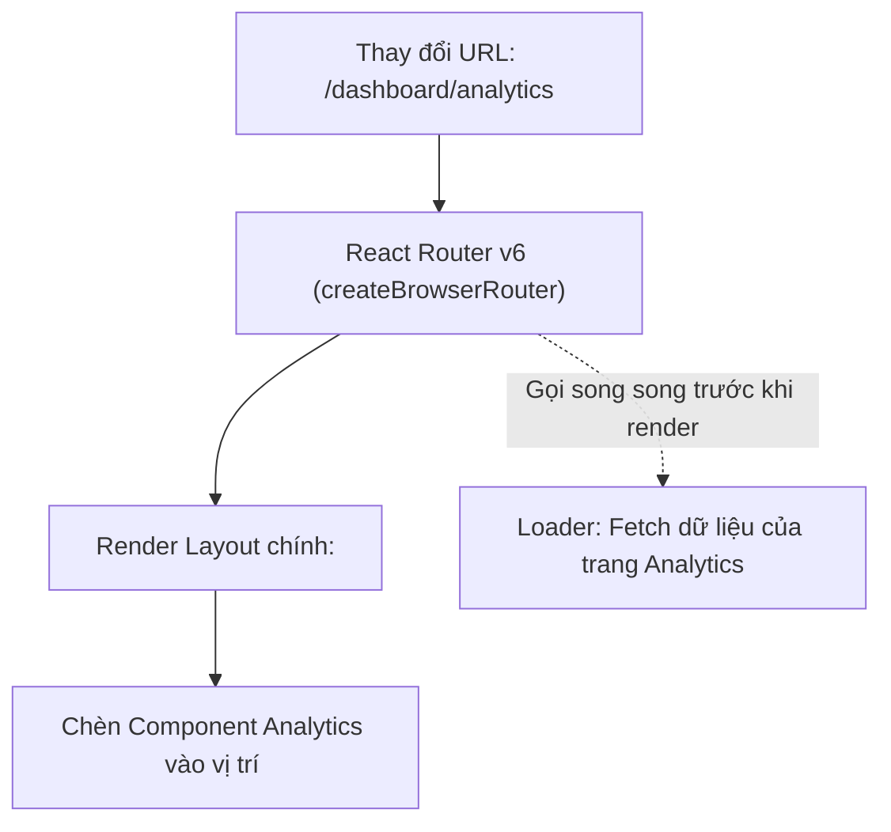

## I. KHÁI QUÁT (OVERVIEW)

### 1. Tại sao cần thư viện định tuyến trong Single Page Application (SPA)?
Trong kiến trúc **SPA**, trình duyệt chỉ tải về duy nhất một tệp HTML khởi tạo. Khi người dùng nhấp vào các liên kết để chuyển trang, chúng ta không được phép để trình duyệt reload lại toàn bộ trang web (hành vi mặc định). Thay vào đó, chúng ta cần một công cụ điều phối phía Client để:
*   Theo dõi sự thay đổi của thanh địa chỉ URL.
*   Hủy bỏ component của trang cũ và render component của trang mới tương ứng mà không reload trang.
*   Bảo toàn lịch sử duyệt trang (Back/Forward) của trình duyệt.

**React Router v6** (phiên bản hiện tại sử dụng **Data APIs**) là thư viện định tuyến tiêu chuẩn vàng cho các ứng dụng React, cung cấp cơ chế định tuyến mạnh mẽ, nested routes (định tuyến lồng nhau), và tự động tải dữ liệu song song (Data Loaders).



---

## II. CHI TIẾT KỸ THUẬT (DETAILED DEEP DIVE)

### 1. Kiến trúc Định tuyến Dữ liệu (Data Routers)
Từ phiên bản 6.4 trở đi, React Router khuyên dùng cú pháp định tuyến bằng hàm **`createBrowserRouter`** thay vì viết các thẻ `<Routes>` dạng khai báo trong JSX.
*   *Lý do:* Cơ chế định tuyến dữ liệu mới cho phép React Router kích hoạt việc tải dữ liệu từ API (**Data Loaders**) song song ngay trong lúc file bundle của component trang đó đang được lazy load về, loại bỏ hoàn toàn tình trạng nghẽn cổ chai (waterfall requests) của ứng dụng.

---

### 2. Các khái niệm cốt lõi của React Router v6

#### a. Nested Routes & `<Outlet>`
Cho phép bạn xây dựng cấu trúc layout lồng nhau. Component cha định nghĩa khung giao diện chung (như Sidebar, Navbar) và đặt thẻ `<Outlet />` làm vị trí đánh dấu nơi các component con (như Analytics, Settings) sẽ được chèn vào tùy theo URL.

#### b. Loaders & Actions
*   **`loader`:** Một hàm chạy **trước khi** component trang được render. Dùng để fetch dữ liệu từ API. Component đọc dữ liệu này qua hook `useLoaderData()`.
*   **`action`:** Hàm xử lý gửi dữ liệu (form submission). Khi action hoàn thành, React Router sẽ tự động chạy lại toàn bộ các loader trên trang hiện tại để cập nhật dữ liệu mới nhất (automatic revalidation).

---

## III. VÍ DỤ MINH HỌA VÀ PHÂN TÍCH CODE (CODE EXAMPLES & ANALYSIS)

### 1. Thiết lập Hệ thống Định tuyến lồng nhau có Protected Route & Data Loaders
Dưới đây là một ví dụ thực tế hoàn chỉnh cấu hình router bằng `createBrowserRouter` chứa trang Dashboard yêu cầu đăng nhập (Protected Route) và tự động fetch data trước khi vào trang.

```tsx
// File: src/router.tsx
import { createBrowserRouter, RouterProvider, Navigate, Outlet, useLoaderData } from 'react-router-dom';
import React from 'react';

// Giả lập kiểm tra token đăng nhập
const isAuthenticated = () => !!localStorage.getItem('token');

// Giả lập Loader: Fetch dữ liệu trước khi render trang Profile
const userProfileLoader = async () => {
  const response = await fetch('https://api.example.com/me', {
    headers: { Authorization: `Bearer ${localStorage.getItem('token')}` }
  });
  if (!response.ok) throw new Error('Không thể tải hồ sơ cá nhân.');
  return response.json();
};

// 1. Component bảo vệ Route (Protected Route Wrapper)
const ProtectedLayout: React.FC = () => {
  if (!isAuthenticated()) {
    // Nếu chưa đăng nhập, tự động chuyển hướng về trang login
    return <Navigate to="/login" replace />;
  }

  return (
    <div className="flex h-screen bg-slate-100">
      <aside className="w-64 bg-slate-900 text-white p-6">Menu Sidebar</aside>
      <main className="flex-1 p-8 overflow-y-auto">
        {/* Thẻ <Outlet /> là nơi các Route con (như Profile) sẽ render */}
        <Outlet />
      </main>
    </div>
  );
};

// 2. Cấu hình hệ thống Route bằng createBrowserRouter
export const router = createBrowserRouter([
  {
    path: "/login",
    element: <div className="p-8">Màn hình Đăng nhập</div>
  },
  {
    // Bọc toàn bộ các route bảo vệ bên trong ProtectedLayout
    element: <ProtectedLayout />,
    errorElement: <div className="p-8 text-red-500">Đã xảy ra lỗi hệ thống!</div>,
    children: [
      {
        path: "/",
        element: <div>Chào mừng đến với trang quản trị.</div>
      },
      {
        path: "/profile",
        element: <UserProfilePage />,
        loader: userProfileLoader // Đăng ký loader tải dữ liệu trước
      }
    ]
  }
]);

// 3. Component hiển thị thông tin User
function UserProfilePage() {
  // Đọc dữ liệu đã được fetch sẵn từ loader
  const userData = useLoaderData() as { name: string; email: string };

  return (
    <div className="bg-white p-6 rounded-lg shadow-sm max-w-md">
      <h2 className="text-xl font-bold mb-4">Hồ sơ cá nhân</h2>
      <p>Họ tên: {userData.name}</p>
      <p>Email: {userData.email}</p>
    </div>
  );
}
```

Import router và render trong file main:
```tsx
// File: src/main.tsx
import React from 'react';
import ReactDOM from 'react-dom/client';
import { RouterProvider } from 'react-router-dom';
import { router } from './router';

ReactDOM.createRoot(document.getElementById('root')!).render(
  <React.StrictMode>
    <RouterProvider router={router} />
  </React.StrictMode>
);
```

---

## IV. LƯU Ý, CẠM BẪY VÀ QUY TẮC CỐT LÕI (PITFALLS & BEST PRACTICES)

### 1. Cạm bẫy Request Waterfall khi fetch data trong useEffect của Route con
*   **Vấn đề:** Nếu bạn viết code định tuyến kiểu cũ lồng nhau (`<Routes>`) và mỗi trang con tự gọi API trong `useEffect` khi mount:
*   **Hậu quả:** Trình duyệt phải tải file bundle JS của cha $\rightarrow$ render cha $\rightarrow$ tải file bundle JS của con $\rightarrow$ render con $\rightarrow$ bắt đầu gọi API. Dữ liệu bị load trễ dây chuyền (Waterfall).
*   ✅ *Best practice:* Sử dụng tính năng **Loaders** của `createBrowserRouter`. React Router sẽ gọi API của tất cả các route trùng khớp đồng thời trong khi đang tải file bundle JS, loại bỏ hoàn toàn thời gian trễ.

---

## 💡 5 QUY TẮC VÀNG VỀ ĐỊNH TUYẾN
1.  **Luôn dùng createBrowserRouter:** Tận dụng tối đa các Data APIs thế hệ mới để tăng hiệu năng load trang.
2.  **Sử dụng `<Outlet />` cho cấu trúc Layout:** Giữ nguyên các thành phần UI chung (Header, Footer) không bị re-render khi chuyển trang.
3.  **Tách logic bảo mật bằng Route Guards:** Sử dụng component bọc ngoài để quản lý tập trung quyền truy cập (Authentication/Authorization) thay vì kiểm tra token ở từng trang riêng lẻ.
4.  **Khai báo `errorElement` cho từng nhánh:** Giúp bắt lỗi runtime cục bộ của trang đó và hiển thị giao diện báo lỗi thân thiện mà không làm hỏng các phần layout dùng chung của trang web.
5.  **Tận dụng `useNavigate` cho các sự kiện chuyển trang:** Dùng liên kết `Link` cho SEO và trải nghiệm click thông thường; dùng `useNavigate` khi muốn chuyển trang sau khi thực thi xong một logic (như sau khi gửi form thành công).
