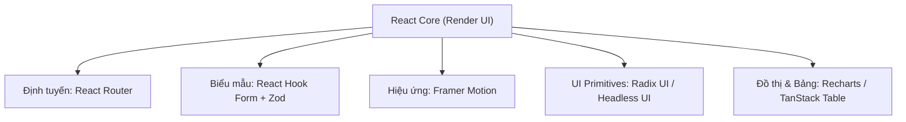

# Bài 10 - React Ecosystem & Libraries (Hệ sinh thái & Thư viện phổ biến)

## I. KHÁI QUÁT (OVERVIEW)

### 1. Sức mạnh đến từ Hệ sinh thái của React
Khác với Angular (một Framework lớn tích hợp sẵn tất cả các công cụ từ Router, Form đến HTTP Client), React đi theo triết lý **tối giản** (tập trung duy nhất vào việc render giao diện). 
*   **Mô hình của React:** Cung cấp bộ thư viện nhân cốt lõi (Core Library) và trao quyền lựa chọn các công cụ bổ trợ (router, state management, form, animation, UI components) cho cộng đồng phát triển.

Điều này tạo ra một **hệ sinh thái (ecosystem)** khổng lồ gồm hàng chục nghìn thư viện chất lượng cao. Tuy nhiên, thách thức lớn nhất của lập trình viên là:
1.  Làm thế nào để chọn lựa được thư viện chất lượng, ổn định và hiệu năng cao?
2.  Hiểu rõ các thư viện tiêu chuẩn ngành (Industry-standard libraries) cho từng bài toán thiết kế.



---

## II. CHI TIẾT KỸ THUẬT (DETAILED DEEP DIVE)

### 1. Bảng phân vùng và Đề xuất Thư viện Tiêu chuẩn Ngành

Dưới đây là danh sách các thư viện được tin dùng nhiều nhất trong các dự án thực tế doanh nghiệp hiện nay:

| Phân Vùng Bài Toán | Thư Viện Đề Xuất | Ưu Điểm Nổi Bật | Thay Thế Phổ Biến |
| :--- | :--- | :--- | :--- |
| **Quản lý Form & Validation** | **React Hook Form + Zod** | Không gây re-render toàn bộ form, validate bằng schema chặt chẽ. | Formik + Yup |
| **Hiệu ứng chuyển động** | **Framer Motion** | Cú pháp khai báo trực quan, hỗ trợ sâu layout animations, exit animations. | GSAP, React Spring |
| **Xử lý thời gian** | **date-fns** | Modular (chỉ import hàm cần dùng để tối ưu bundle), bất biến (immutable). | DayJS, Moment.js (Legacy) |
| **UI Component Primitives** | **Radix UI / Headless UI** | Unstyled components (không định sẵn style, chỉ có logic A11y), dễ dàng kết hợp Tailwind. | Material UI, Ant Design |
| **Bảng dữ liệu phức tạp** | **TanStack Table** | Không có UI đi kèm (headless), quản lý filter, sort, pagination cực kỳ tối ưu. | AG Grid (Nặng hơn) |
| **Đồ thị (Data Visualization)**| **Recharts** | Dựng biểu đồ hoàn toàn bằng các React Components, cấu trúc responsive tốt. | Chart.js, D3.js (Phức tạp hơn) |
| **Bộ Icon** | **Lucide React** | Bộ icon vector svg sạch, hỗ trợ tốt tree-shaking để tối ưu dung lượng build. | FontAwesome, React Icons |

---

### 2. Tiêu chí Đánh giá và Chọn lựa Thư viện (Library Evaluation Matrix)
Trước khi cài đặt bất kỳ thư viện nào qua `npm install`, bạn cần đánh giá qua các chỉ số:
1.  **Dung lượng Bundle (Bundle Size):** Sử dụng trang web [Bundlephobia](https://bundlephobia.com) để kiểm tra dung lượng khi cài đặt. Ưu tiên thư viện hỗ trợ **Tree-shaking** (chỉ lấy phần code được import thực tế).
2.  **Mức độ Active (Bảo trì):** Xem lịch sử commit trên GitHub, số lượng issues được giải quyết, số lượng download hàng tuần trên npm.
3.  **Khả năng tương thích A11y (Accessibility):** Có hỗ trợ phím di chuyển, nhãn aria hay không.

---

## III. VÍ DỤ MINH HỌA VÀ PHÂN TÍCH CODE (CODE EXAMPLES & ANALYSIS)

### 1. Kết hợp Framer Motion để làm hiệu ứng xuất hiện danh sách động
Dưới đây là một ví dụ thực tế về việc dựng danh sách sản phẩm. Khi tải trang hoặc khi danh sách thay đổi, các card sẽ tự động xuất hiện với hiệu ứng trượt nhẹ (Fade-in & Slide-up) xen kẽ độ trễ (staggered animation) bằng thư viện **Framer Motion**.

```tsx
// File: src/components/AnimatedList.tsx
import React from 'react';
import { motion } from 'framer-motion';

interface Item {
  id: string;
  title: string;
}

const listContainerVariants = {
  hidden: { opacity: 0 },
  show: {
    opacity: 1,
    transition: {
      staggerChildren: 0.1 // Tạo độ trễ xuất hiện 100ms giữa các con
    }
  }
};

const itemVariants = {
  hidden: { opacity: 0, y: 20 }, // Bắt đầu ở vị trí dịch xuống 20px và mờ
  show: { 
    opacity: 1, 
    y: 0, 
    transition: { type: 'spring', stiffness: 100 } // Chuyển động đàn hồi
  }
};

export const AnimatedList: React.FC<{ items: Item[] }> = ({ items }) => {
  return (
    // 1. Container bao bọc sử dụng motion.ul
    <motion.ul
      variants={listContainerVariants}
      initial="hidden"
      animate="show"
      className="space-y-3 p-4 bg-slate-50 rounded-xl max-w-sm"
    >
      {items.map((item) => (
        // 2. Mỗi item sử dụng motion.li để tự động nhận variants từ cha
        <motion.li
          key={item.id}
          variants={itemVariants}
          className="p-4 bg-white rounded-lg shadow-sm border border-slate-100 font-medium text-slate-700 hover:shadow-md transition-shadow cursor-pointer"
        >
          {item.title}
        </motion.li>
      ))}
    </motion.ul>
  );
};
```

---

## IV. LƯU Ý, CẠM BẪY VÀ QUY TẮC CỐT LÕI (PITFALLS & BEST PRACTICES)

### 1. Cạm bẫy sử dụng các thư viện UI Component có sẵn quá nặng (UI Bloat)
*   **Vấn đề:** Cài đặt các thư viện UI component nguyên khối (như Material UI, Ant Design) chỉ để sử dụng vài nút bấm hoặc một modal đơn giản.
*   **Hậu quả:** Dung lượng bundle phình to thêm hàng trăm KB, kéo tụt nghiêm trọng hiệu năng load trang.
*   ✅ *Best practice:* Sử dụng các thư viện **Headless UI** (Radix UI, Headless UI) kết hợp với **Tailwind CSS**. Kỹ thuật này giúp bạn giữ toàn quyền kiểm soát thiết kế giao diện (không bị gò bó style thư viện) trong khi vẫn tận dụng được logic A11y được test kỹ lưỡng và dung lượng build cực kỳ nhẹ.

---

## 💡 5 QUY TẮC VÀNG VỀ HỆ SINH THÁI REACT
1.  **Kiểm tra Bundlephobia trước khi cài đặt:** Luôn cân nhắc kỹ dung lượng và khả năng hỗ trợ tree-shaking của thư viện mới.
2.  **Ưu tiên giải pháp Headless UI:** Tách biệt logic hoạt động và giao diện hiển thị để dễ dàng tùy biến bằng Tailwind CSS.
3.  **Tránh lạm dụng moment.js:** Chuyển hoàn toàn sang `date-fns` hoặc `dayjs` để giảm tải dung lượng tệp tin build.
4.  **Tích hợp Zod Schema cho mọi dữ liệu ngoài:** Sử dụng Zod để validate tính đúng đắn của dữ liệu trả về từ API trước khi đẩy vào ứng dụng.
5.  **Giữ số lượng thư viện ở mức tối giản:** Chỉ cài đặt thư viện khi bài toán quá phức tạp và việc tự code tốn quá nhiều thời gian/tiền bạc để tự bảo trì.
