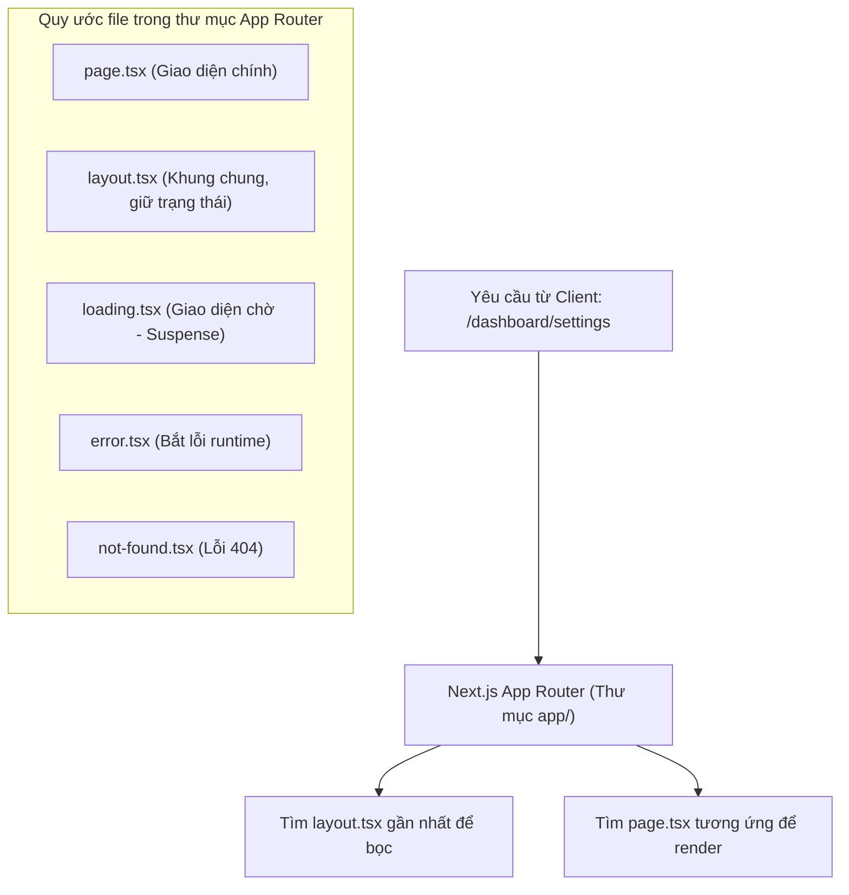

# Bài 01 - Next.js Architecture & App Router (Kiến trúc & Hệ thống định tuyến)

## I. KHÁI QUÁT (OVERVIEW)

### 1. Tại sao cần Next.js bên cạnh React?
React là một thư viện UI tuyệt vời cho việc xây dựng các ứng dụng Single Page Application (SPA). Tuy nhiên, các ứng dụng React SPA thuần túy chạy hoàn toàn ở phía Client (Client-Side Rendering - CSR) có 2 điểm yếu lớn:
1.  **SEO (Tối ưu hóa công cụ tìm kiếm) rất kém:** Khi các bot tìm kiếm (Googlebot, Bingbot) quét trang web, chúng chỉ nhận về một file HTML trắng trống trơn và một file JS lớn. Nếu bot không chạy JavaScript, chúng sẽ không thấy bất kỳ nội dung nào để lập chỉ mục (index).
2.  **FCP (First Contentful Paint) chậm:** Người dùng phải chờ trình duyệt tải toàn bộ file bundle JS về và thực thi xong thì giao diện mới hiển thị $\rightarrow$ Trải nghiệm người dùng kém trên thiết bị yếu hoặc mạng chậm.

**Next.js** là một Framework React Fullstack tiêu chuẩn công nghiệp, cung cấp giải pháp render trang ở phía Server (Server-Side Rendering), tạo trang tĩnh (Static Site Generation), định tuyến tự động dựa trên thư mục, và tối ưu hóa tài nguyên hình ảnh, font chữ tự động.



---

## II. CHI TIẾT KỸ THUẬT (DETAILED DEEP DIVE)

### 1. Cấu trúc định tuyến dựa trên Thư mục (File-System Routing)
Trong App Router của Next.js (bắt đầu từ Next.js 13), mọi thư mục con nằm trong thư mục `/app` sẽ đại diện cho một phân đoạn đường dẫn (URL segment).
*   Chỉ các file có tên quy ước chính xác là **`page.tsx`** mới có thể truy cập công khai qua URL. Các file phụ trợ (như component, style, test) có thể đặt chung trong thư mục đó mà không sợ bị lộ thành route.

---

### 2. Các quy ước file cốt lõi (File Conventions)
Next.js sử dụng các tên file đặc biệt để tự động thiết lập các hành vi của trang web:
1.  **`layout.tsx`**: Khung giao diện chung cho một phân đoạn và các con của nó. Khi chuyển trang giữa các con, layout này **không bị re-render** (giúp giữ trạng thái của thanh tìm kiếm, menu cuộn).
2.  **`template.tsx`**: Tương tự layout nhưng sẽ **tạo mới instance** ở mỗi lần chuyển trang (chạy lại useEffect, rất thích hợp cho các hiệu ứng chuyển trang Page Transitions).
3.  **`loading.tsx`**: Tự động bọc component trang bên trong một thẻ `<Suspense>` của React để hiển thị giao diện loading ngay lập tức trong lúc server đang render trang hoặc fetch dữ liệu.
4.  **`error.tsx`**: Tự động bọc nhánh trang trong một Error Boundary của React để bắt lỗi và hiển thị giao diện báo lỗi cục bộ mà không làm sập toàn bộ website.

---

### 3. Các kỹ thuật định tuyến nâng cao

#### a. Route Groups - Nhóm định tuyến không đổi URL: `(name)`
Khi bạn đặt tên thư mục trong ngoặc đơn, ví dụ `/app/(auth)/login/page.tsx`, phân đoạn `(auth)` sẽ bị Next.js bỏ qua trên URL.
*   *URL truy cập:* `/login` (không phải `/(auth)/login`).
*   *Ứng dụng:* Dùng để nhóm các trang có chung mục đích để áp dụng chung một `layout.tsx` (ví dụ nhóm toàn bộ trang đăng nhập, đăng ký vào chung nhóm để dùng chung giao diện nền).

#### b. Dynamic Segments - Định tuyến động: `[id]`
Sử dụng ngoặc vuông để tạo trang động. Ví dụ `/app/blog/[slug]/page.tsx` sẽ bắt được mọi URL như `/blog/hoc-nextjs`, `/blog/react-19`.
*   Giá trị `slug` được truyền vào props `params` của component.

---

## III. VÍ DỤ MINH HỌA VÀ PHÂN TÍCH CODE (CODE EXAMPLES & ANALYSIS)

### 1. Thiết kế Hệ thống Route lồng nhau hoàn chỉnh trong Next.js App Router
Dưới đây là cấu trúc thư mục và mã nguồn chi tiết minh họa một trang quản trị Dashboard có trang danh sách sản phẩm động và trang con.

#### Cấu trúc thư mục:
```text
app/
├── layout.tsx             (Giao diện khung ngoài cùng của toàn bộ web)
├── page.tsx               (Trang chủ công cộng)
└── dashboard/
    ├── layout.tsx         (Khung dashboard chứa Sidebar và Header)
    ├── loading.tsx        (Giao diện xương skeleton khi tải dashboard)
    ├── page.tsx           (Trang tổng quan dashboard: /dashboard)
    └── products/
        ├── page.tsx       (Trang danh sách sản phẩm: /dashboard/products)
        └── [id]/
            └── page.tsx   (Trang chi tiết sản phẩm: /dashboard/products/123)
```

#### File: `/app/dashboard/layout.tsx` (Khung Dashboard dùng chung)
```tsx
import React from 'react';

export default function DashboardLayout({
  children,
}: {
  children: React.ReactNode;
}) {
  return (
    <div className="flex h-screen bg-slate-50">
      {/* Sidebar cố định bên trái */}
      <aside className="w-64 bg-slate-950 text-slate-200 p-6 flex flex-col justify-between">
        <div>
          <div className="text-white font-extrabold text-xl mb-6">NEXT CONSOLE</div>
          <nav className="space-y-2">
            <a href="/dashboard" className="block py-2 px-4 rounded hover:bg-slate-800">Tổng quan</a>
            <a href="/dashboard/products" className="block py-2 px-4 rounded hover:bg-slate-800">Sản phẩm</a>
          </nav>
        </div>
      </aside>

      {/* Khu vực nội dung động bên phải */}
      <div className="flex-1 flex flex-col overflow-hidden">
        <header className="h-16 bg-white border-b flex items-center px-8 justify-between">
          <span className="font-semibold text-slate-700">Trang quản trị</span>
        </header>
        <main className="flex-1 p-8 overflow-y-auto">
          {/* Thẻ children chính là nơi page.tsx của các route con được chèn vào */}
          {children}
        </main>
      </div>
    </div>
  );
}
```

#### File: `/app/dashboard/products/[id]/page.tsx` (Đọc tham số URL động)
```tsx
import React from 'react';

interface ProductDetailPageProps {
  params: Promise<{
    id: string;
  }>;
}

// Next.js 19 yêu cầu params phải được xử lý như một Promise bất đồng bộ
export default async function ProductDetailPage({ params }: ProductDetailPageProps) {
  const resolvedParams = await params;
  const productId = resolvedParams.id;

  return (
    <div className="bg-white p-6 rounded-xl shadow-sm border max-w-md">
      <h2 className="text-lg font-bold text-slate-800 mb-2">Chi tiết sản phẩm</h2>
      <p className="text-slate-600 text-sm">
        Bạn đang xem sản phẩm có mã định danh (Product ID): 
        <strong className="text-indigo-600 ml-1">{productId}</strong>
      </p>
    </div>
  );
}
```

---

## IV. LƯU Ý, CẠM BẪY VÀ QUY TẮC CỐT LÕI (PITFALLS & BEST PRACTICES)

### 1. Cạm bẫy sử dụng thẻ Link sai thư viện
*   **Vấn đề:** Sử dụng thẻ `<a>` truyền thống hoặc thẻ `Link` của thư viện `react-router-dom` để chuyển trang trong Next.js.
*   **Hậu quả:** Thẻ `<a>` sẽ kích hoạt trình duyệt thực hiện reload lại toàn bộ trang web (phá vỡ hoàn toàn lợi ích SPA).
*   ✅ *Best practice:* Luôn import thẻ Link từ thư viện **`next/link`**:
    ```tsx
    import Link from 'next/link';
    // ...
    <Link href="/dashboard">Đi tới Dashboard</Link>
    ```

---

## 💡 5 QUY TẮC VÀNG VỀ NEXT.JS APP ROUTER
1.  **Dùng `next/link` cho chuyển hướng:** Đảm bảo chuyển trang mượt mà không reload và được tự động tải trước (prefetch) tài nguyên ngầm.
2.  **Tách cấu trúc Layout hợp lý:** Đặt các giao diện chung như Sidebar, Navbar vào `layout.tsx` để tối ưu hiệu năng không bị re-render lại khi chuyển route con.
3.  **Tận dụng Route Groups `(group)` để nhóm sạch:** Nhóm các route cùng chung phân vùng (như admin, guest, auth) để dễ quản lý layout và file cấu trúc.
4.  **Xử lý `params` bất đồng bộ ở Next.js 19:** Luôn nhớ giải mã `await params` trước khi sử dụng các giá trị định tuyến động để tương thích chuẩn mới.
5.  **Luôn khai báo `loading.tsx`:** Cung cấp trải nghiệm phản hồi tức thì (Instant Loading States) bằng các khung xương Skeleton Loader trong lúc server xử lý dữ liệu.
