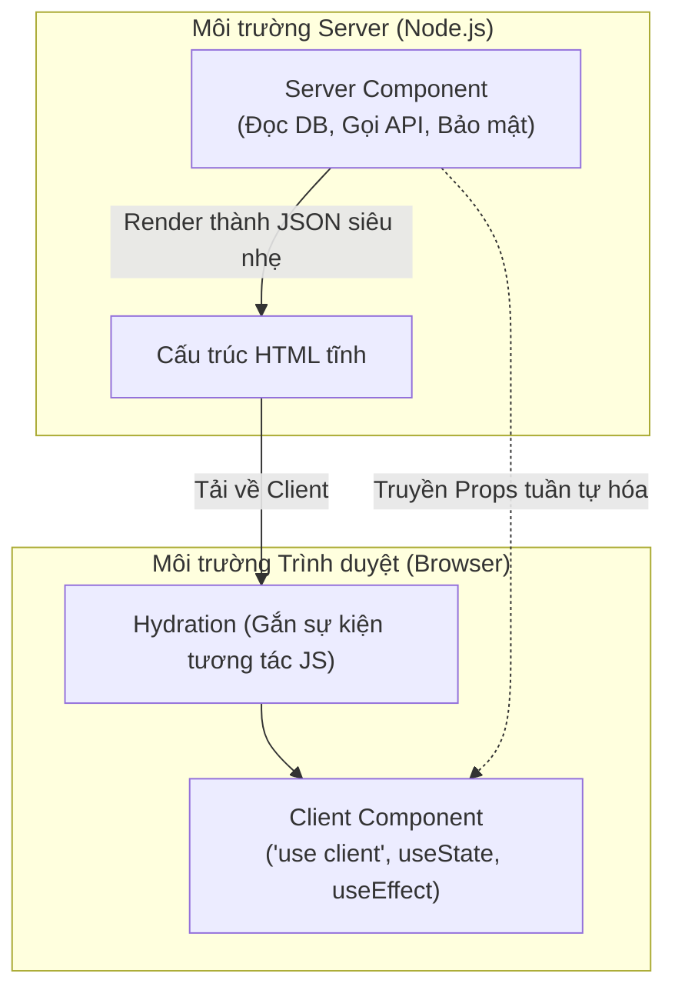

# Bài 02 - Server Components vs Client Components (Thành phần Server vs Client)

## I. KHÁI QUÁT (OVERVIEW)

### 1. Cuộc cách mạng React Server Components (RSC)
Trước Next.js 13 và React 18, tất cả các React Component mặc định đều chạy ở phía Client. Trình duyệt phải tải toàn bộ mã nguồn của chúng về, thực thi JavaScript để dựng cây DOM, và gắn các sự kiện tương tác (quá trình này gọi là **Hydration**).

**React Server Components (RSC)** giới thiệu một mô hình kiến trúc mới, chia cây Component thành 2 khu vực vận hành độc lập:
1.  **Server Components (Thành phần Server):** Chạy và render thành cấu trúc tĩnh (JSON/HTML) hoàn toàn ở phía Server.
2.  **Client Components (Thành phần Client):** Hoạt động giống như React truyền thống, chạy và tương tác động ở phía trình duyệt (Client).



> [!IMPORTANT]
> **Next.js App Router mặc định mọi Component là Server Component:**
> Khi bạn tạo một tệp tin mới trong App Router, Next.js sẽ coi đó là Server Component. Bạn chỉ chuyển nó thành Client Component khi chủ động viết chỉ thị **`'use client'`** ở dòng đầu tiên của tệp tin.

---

## II. CHI TIẾT KỸ THUẬT (DETAILED DEEP DIVE)

### 1. Bản chất và So sánh chi tiết

| Tiêu chí | Server Components (Mặc định) | Client Components (`'use client'`) |
| :--- | :--- | :--- |
| **Nơi thực thi** | Chỉ chạy ở phía Server | Chạy ở Server (Prerender) & Chạy ở Client |
| **Dung lượng JS tải về**| **0 KB** (không gửi code JS của component xuống client) | Gửi đầy đủ file JS xuống trình duyệt để tương tác |
| **Truy cập tài nguyên** | Đọc trực tiếp DB, File System, Private Keys | Chỉ gọi qua HTTP API public |
| **Tương tác động (Interactivity)**| Không hỗ trợ (không dùng được click, hover, DOM) | Hỗ trợ đầy đủ các sự kiện JS |
| **React Hooks** | Không sử dụng được (`useState`, `useEffect`...) | Sử dụng bình thường |

---

### 2. Quy tắc Tổ hợp Cây Component (Composition Rules)
Bạn có thể kết hợp cả hai loại component này trên cùng một trang web, nhưng phải tuân thủ nghiêm ngặt quy tắc ranh giới tuần tự hóa (**Serialization Boundary**):

1.  **Server Component có thể import và render Client Component:**
    ```tsx
    // Hợp lệ
    import MyClientComponent from './MyClientComponent';
    export default function MyServerPage() {
      return <MyClientComponent />;
    }
    ```
2.  **Client Component KHÔNG THỂ import trực tiếp Server Component:**
    *   *Lý do:* Client Component chạy trên trình duyệt, không có môi trường Node.js để thực thi code của Server Component.
    *   *Giải pháp:* Truyền Server Component làm prop **`children`** vào Client Component.

```tsx
// ✅ CÁCH LÀM ĐÚNG (Children Pattern)
// File: src/components/ClientWrapper.tsx (Client Component)
'use client';
export default function ClientWrapper({ children }: { children: React.ReactNode }) {
  return <div className="border p-4">{children}</div>;
}

// File: src/app/page.tsx (Server Component)
import ClientWrapper from '@/components/ClientWrapper';
import ServerList from '@/components/ServerList'; // Server Component

export default function Page() {
  return (
    <ClientWrapper>
      <ServerList /> {/* Hợp lệ: Server Component được lồng dưới dạng children */}
    </ClientWrapper>
  );
}
```

---

## III. VÍ DỤ MINH HỌA VÀ PHÂN TÍCH CODE (CODE EXAMPLES & ANALYSIS)

### 1. Phân tách ranh giới Server/Client trong trang Danh mục sản phẩm
Dưới đây là một ví dụ thực tế về trang danh sách sản phẩm. Trang chính (Server Component) sẽ đọc trực tiếp từ Database để lấy dữ liệu nhanh và bảo mật, còn cụm nút thích sản phẩm (Like Button) cần tương tác click sẽ được tách thành Client Component riêng biệt để tối ưu dung lượng JS.

#### File: `/src/components/LikeButton.tsx` (Client Component)
```tsx
// 1. Chỉ thị bắt buộc để chạy các tính năng tương tác ở trình duyệt
'use client';

import React, { useState } from 'react';

export default function LikeButton({ productId }: { productId: string }) {
  const [liked, setLiked] = useState(false);

  console.log('LikeButton render ở Client!'); // Log này sẽ in ở Console của trình duyệt

  return (
    <button
      onClick={() => setLiked(!liked)}
      className={`px-3 py-1.5 rounded-lg text-xs font-bold transition-colors ${
        liked 
          ? 'bg-red-500 text-white' 
          : 'bg-slate-100 text-slate-700 hover:bg-slate-200'
      }`}
    >
      {liked ? '❤️ Đã thích' : '🤍 Thích'}
    </button>
  );
}
```

#### File: `/src/app/products/page.tsx` (Server Component - Mặc định)
```tsx
import React from 'react';
import LikeButton from '@/components/LikeButton';

interface Product {
  id: string;
  name: string;
  price: string;
}

// Giả lập đọc trực tiếp từ Database ở phía Server (không cần gọi qua fetch API)
async function getProductsFromDB(): Promise<Product[]> {
  // const data = await db.query("SELECT * FROM products");
  return [
    { id: '1', name: 'Bàn phím cơ', price: '1.200.000đ' },
    { id: '2', name: 'Chuột không dây', price: '800.000đ' }
  ];
}

// Đây là Server Component chạy môi trường Node.js
export default async function ProductsPage() {
  const products = await getProductsFromDB();

  console.log('ProductsPage render ở Server!'); // Log này chỉ in ở Terminal Server, KHÔNG in ở trình duyệt

  return (
    <div className="p-8 max-w-xl mx-auto space-y-6">
      <h2 className="text-2xl font-bold text-slate-800">Cửa hàng công nghệ</h2>
      <ul className="space-y-4">
        {products.map((product) => (
          <li key={product.id} className="p-4 bg-white rounded-xl shadow-sm border flex justify-between items-center">
            <div>
              <h4 className="font-bold text-slate-800">{product.name}</h4>
              <p className="text-slate-500 text-sm">{product.price}</p>
            </div>
            {/* Tích hợp Client Component vào cây DOM của Server Component */}
            <LikeButton productId={product.id} />
          </li>
        ))}
      </ul>
    </div>
  );
}
```

---

## IV. LƯU Ý, CẠM BẪY VÀ QUY TẮC CỐT LÕI (PITFALLS & BEST PRACTICES)

### 1. Cạm bẫy truyền Props không thể tuần tự hóa (Non-serializable Props)
*   **Vấn đề:** Khi Server Component truyền props xuống Client Component, các dữ liệu này bắt buộc phải **tuần tự hóa được** (serializable) thành dạng JSON.
*   **Hậu quả:** Bạn không được phép truyền các giá trị như **Hàm (Functions)**, **Lớp (Class Instances)**, hoặc **Date Objects** qua ranh giới này. Trình duyệt sẽ báo lỗi crash ngay lập tức.
*   ❌ *Anti-pattern:* `<MyClientComponent onSubmit={() => {}} date={new Date()} />`
*   ✅ *Best practice:* Chỉ truyền các kiểu dữ liệu thuần túy (strings, numbers, booleans, plain objects/arrays). Nếu cần truyền ngày tháng, hãy ép kiểu về chuỗi ISO string (`date.toISOString()`).

### 2. Sử dụng thư viện `server-only` bảo vệ an toàn mã nguồn
*   Nếu bạn viết một file chứa các hàm kết nối trực tiếp DB hoặc chứa API keys bí mật, bạn tuyệt đối không được để một file client component nào đó vô tình import file này (làm lộ thông tin bảo mật xuống trình duyệt).
*   ✅ *Best practice:* Cài đặt và sử dụng gói `server-only`:
    ```bash
    npm install server-only
    ```
    Đặt dòng `import 'server-only'` ở dòng đầu tiên của tệp bảo mật. Trình biên dịch của Next.js sẽ báo lỗi ngay ở build-time nếu có bất kỳ file client nào cố tình import file này.

---

## 💡 5 QUY TẮC VÀNG VỀ SERVER & CLIENT COMPONENTS
1.  **Mặc định là Server Component:** Luôn bắt đầu thiết kế bằng Server Component để giảm dung lượng file JS tải xuống client tối đa.
2.  **Đẩy `'use client'` xuống sâu nhất có thể:** Chỉ bọc các component lá (như nút bấm, thanh trượt, ô input) làm Client Component để cô lập phạm vi tải JS.
3.  **Sử dụng Children Pattern để lồng ngược:** Truyền Server Component làm prop `children` của Client Component nếu cần lồng cấu trúc.
4.  **Chỉ truyền dữ liệu tuần tự hóa (Serializable):** Tránh truyền các hàm hoặc class instances qua ranh giới Server/Client.
5.  **Bảo vệ mã nguồn bí mật bằng `server-only`:** Ngăn chặn tuyệt đối việc vô tình đóng gói (bundle) các đoạn code nhạy cảm gửi xuống trình duyệt của người dùng.
