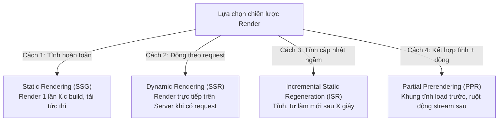

## I. KHÁI QUÁT (OVERVIEW)

### 1. Sự đa dạng của các chiến lược kết xuất giao diện
Một trong những điểm mạnh vượt trội nhất của Next.js so với React SPA thuần túy là khả năng hỗ trợ linh hoạt nhiều chiến lược kết xuất (**Rendering Strategies**) khác nhau trên cùng một ứng dụng.

Trước đây, bạn phải lựa chọn giữa:
*   Dựng trang hoàn toàn tĩnh lúc build (Static Site Generation - SSG) $\rightarrow$ Tốc độ tải trang siêu nhanh nhưng dữ liệu bị cũ, không cập nhật được.
*   Render động trên server ở mỗi request (Server-Side Rendering - SSR) $\rightarrow$ Dữ liệu luôn mới nhưng server bị quá tải, thời gian phản hồi chậm hơn.

Next.js xóa nhòa ranh giới này bằng cách hỗ trợ cấu hình các chiến lược kết xuất ở cấp độ **từng trang (per-route basis)**, thậm chí kết hợp cả tĩnh và động trên cùng một trang web thông qua cơ chế kết xuất từng phần (**Partial Prerendering**).



---

## II. CHI TIẾT KỸ THUẬT (DETAILED DEEP DIVE)

### 1. Phân tích Chi tiết 4 Chiến lược Render Chủ lực

#### a. Static Rendering (SSG - Static Site Generation)
*   **Cơ chế:** Next.js render HTML tĩnh của trang web **duy nhất một lần** trong quá trình build dự án (`npm run build`). File HTML tĩnh này sau đó được đẩy lên mạng lưới CDN (Content Delivery Network) toàn cầu để phục vụ người dùng tức thì.
*   *Phù hợp với:* Các trang ít thay đổi dữ liệu (Trang giới thiệu công ty, trang điều khoản, trang tin tức tĩnh).

#### b. Dynamic Rendering (SSR - Server-Side Rendering)
*   **Cơ chế:** Khi có yêu cầu (request) từ người dùng gửi tới, Next.js sẽ chạy code render trực tiếp trên máy chủ Node.js để tạo ra file HTML mới nhất và trả về cho trình duyệt.
*   *Phù hợp với:* Trang cá nhân người dùng, trang quản trị thống kê real-time, trang tìm kiếm sản phẩm.

#### c. Incremental Static Regeneration (ISR)
*   **Cơ chế:** Cho phép bạn cập nhật các trang tĩnh ngầm mà không cần phải chạy lại toàn bộ tiến trình build dự án. Bạn chỉ định thời gian hết hạn (ví dụ `revalidate: 60` - 60 giây).
    *   Người dùng đầu tiên sau 60 giây truy cập sẽ thấy trang cũ.
    *   Next.js kích hoạt một tiến trình build ngầm trên server để cập nhật dữ liệu mới cho trang.
    *   Người dùng tiếp theo truy cập sẽ nhận được trang mới tinh.
*   *Phù hợp với:* Trang blog tin tức, danh sách sản phẩm cửa hàng.

#### d. Partial Prerendering (PPR - Kết xuất từng phần)
*   *Công nghệ mới của Next.js:* Cho phép kết hợp SSG và SSR trên cùng một trang. 
*   Ví dụ: Khung ngoài (Header, Sidebar) được render tĩnh (SSG) tải lên tức thì. Trong khi phần ruột giỏ hàng (SSR - động) được bao bởi thẻ `<Suspense>` sẽ được máy chủ truyền dữ liệu về sau dưới dạng luồng trực tiếp (**Streaming**).

---

### 2. Bảng so sánh các chiến lược Render

| Chiến lược | Thời gian Render | Tốc độ load (TTFB) | Tải cho Server | Tính cập nhật dữ liệu |
| :--- | :--- | :--- | :--- | :--- |
| **SSG** | Build-time | Cực nhanh (mili-giây) | Rất nhẹ (đọc từ CDN) | Lỗi thời (cần rebuild) |
| **SSR** | Request-time | Chậm hơn | Nặng (render liên tục) | Tức thời (luôn mới nhất) |
| **ISR** | Build-time + Revalidate | Nhanh | Nhẹ | Cập nhật ngầm có độ trễ |
| **PPR** | Kết hợp cả hai | Cực nhanh | Vừa phải | Trực quan (Streaming UI) |

---

## III. VÍ DỤ MINH HỌA VÀ PHÂN TÍCH CODE (CODE EXAMPLES & ANALYSIS)

### 1. Triển khai cấu hình các chiến lược Render trong Next.js App Router
Dưới đây là cách khai báo code thực tế để định nghĩa các chiến lược render khác nhau cho từng file page.

#### Ví dụ 1: Cấu hình Static Rendering (SSG)
Next.js tự động chọn SSG nếu trang của bạn không sử dụng các hàm động (như đọc cookie, headers) hoặc fetch dữ liệu không cấu hình cache.
```tsx
// File: /app/about/page.tsx
import React from 'react';

export default function AboutPage() {
  return (
    <div className="p-8">
      <h1>Giới thiệu công ty</h1>
      <p>Trang này tĩnh hoàn toàn, được render lúc build hệ thống.</p>
    </div>
  );
}
```

#### Ví dụ 2: Cấu hình Dynamic Rendering (SSR)
Bằng cách khai báo biến cấu hình tĩnh `dynamic = 'force-dynamic'` hoặc sử dụng hàm đọc cookie, Next.js sẽ ép buộc trang này luôn render động ở mỗi request.
```tsx
// File: /app/dashboard/page.tsx
import React from 'react';
import { cookies } from 'next/headers';

// Ép buộc chiến lược SSR động
export const dynamic = 'force-dynamic';

export default async function DashboardPage() {
  // Hàm cookies() của Next.js chỉ chạy được ở phía server trong môi trường request-time
  const cookieStore = await cookies();
  const userToken = cookieStore.get('token');

  return (
    <div className="p-8 bg-slate-50">
      <h2>Báo cáo Admin</h2>
      <p>Token hiện tại của bạn: {userToken?.value || 'Chưa đăng nhập'}</p>
    </div>
  );
}
```

#### Ví dụ 3: Cấu hình Incremental Static Regeneration (ISR)
Bạn có thể thiết lập tần suất tự động cập nhật ngầm của trang tĩnh bằng cách export biến `revalidate`.
```tsx
// File: /app/blog/page.tsx
import React from 'react';

// Cấu hình ISR: Tự động cập nhật trang tĩnh ngầm sau mỗi 3600 giây (1 tiếng)
export const revalidate = 3600;

interface Post {
  id: number;
  title: string;
}

export default async function BlogPage() {
  // Fetch dữ liệu có gắn tag cấu hình cache
  const res = await fetch('https://api.example.com/posts', {
    next: { revalidate: 3600 }
  });
  const posts: Post[] = await res.json();

  return (
    <div className="p-8 max-w-xl mx-auto">
      <h2 className="text-2xl font-bold mb-4">Tin tức công nghệ (ISR)</h2>
      <ul className="space-y-3">
        {posts.map(post => (
          <li key={post.id} className="p-4 bg-white rounded border">
            {post.title}
          </li>
        ))}
      </ul>
    </div>
  );
}
```

---

## IV. LƯU Ý, CẠM BẪY VÀ QUY TẮC CỐT LÕI (PITFALLS & BEST PRACTICES)

### 1. Cạm bẫy vô tình làm mất tính năng Static (SSG) của cả trang
*   **Vấn đề:** Chỉ cần một component con ở rất sâu bên trong trang gọi một hàm động (như `cookies()`, `headers()`, hoặc `useSearchParams()` mà không bọc trong thẻ `<Suspense>`), Next.js sẽ tự động chuyển **toàn bộ trang web** đó từ SSG sang render động SSR.
*   **Hậu quả:** Tốc độ tải trang giảm sút ngoài ý muốn.
*   ✅ *Best practice:* Luôn bọc các Client Component có sử dụng hook đọc URL như `useSearchParams()` bên trong một ranh giới `<Suspense>` để cô lập phạm vi động.

---

## 💡 5 QUY TẮC VÀNG VỀ RENDERING STRATEGIES
1.  **Mặc định dùng SSG:** Tận dụng tối đa tốc độ tải trang cực nhanh từ mạng lưới CDN toàn cầu.
2.  **Dùng ISR cho các trang tin tức/cửa hàng:** Đảm bảo trang tải nhanh như tĩnh nhưng dữ liệu vẫn được cập nhật tự động ngầm.
3.  **Ép buộc SSR bằng `force-dynamic` khi cần bảo mật:** Chỉ sử dụng SSR động khi trang web chứa thông tin nhạy cảm của người dùng (cần đọc cookie/token xác thực).
4.  **Bọc Suspense cho các thành phần URL động:** Ngăn chặn việc làm mất tính năng static của toàn bộ trang do sử dụng các hook đọc thanh địa chỉ ở client.
5.  **Tận dụng Streaming SSR:** Chia nhỏ luồng dữ liệu trả về từ server, cho phép hiển thị trước khung giao diện tĩnh trong lúc chờ fetch dữ liệu động nặng.
