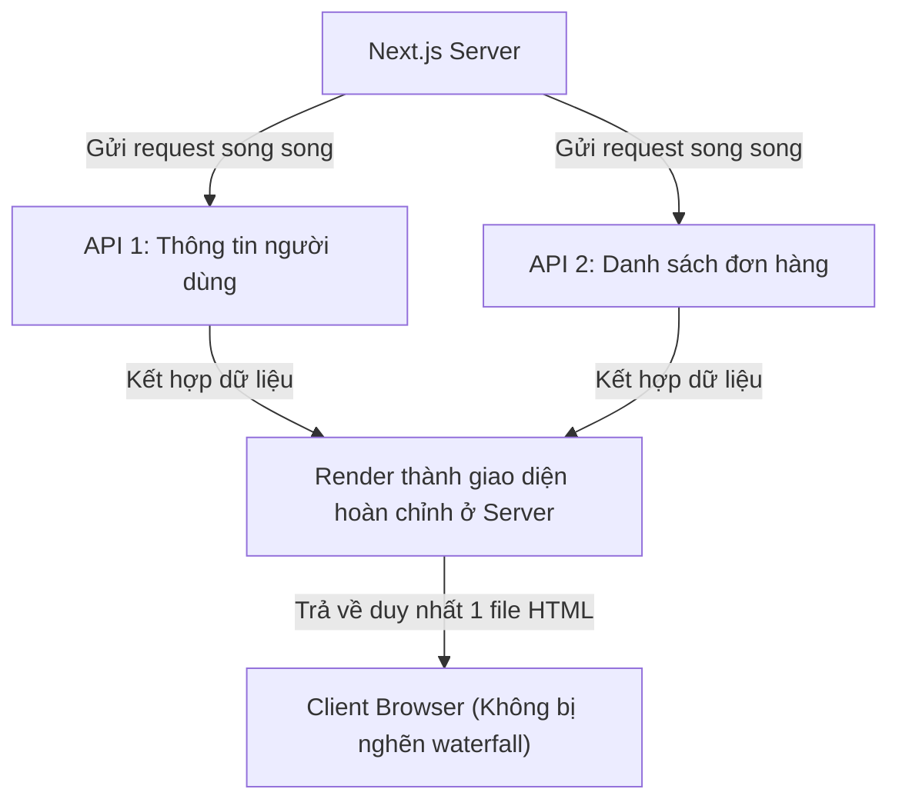

## I. KHÁI QUÁT (OVERVIEW)

### 1. Sự khác biệt về Data Fetching trong Next.js
Trong ứng dụng React SPA truyền thống chạy ở Client, bạn phải lấy dữ liệu bằng cách sử dụng `useEffect` kết hợp `fetch`/`axios` sau khi component đã mount. Cách làm này có nhiều hạn chế:
*   **Request Waterfalls (Nghẽn cổ chai dây chuyền):** Component cha render $\rightarrow$ bắt đầu fetch $\rightarrow$ nhận kết quả $\rightarrow$ render component con $\rightarrow$ con bắt đầu fetch. Trang web của bạn sẽ bị hiển thị chớp tắt liên tục với nhiều trạng thái loading rời rạc.
*   **Bảo mật kém:** Lộ đường dẫn API nội bộ và token xác thực xuống trình duyệt.

Next.js tận dụng kiến trúc **React Server Components** để cho phép bạn thực hiện data fetching **ngay trên Server** (Server-side Fetching).



---

## II. CHI TIẾT KỸ THUẬT (DETAILED DEEP DIVE)

### 1. Cơ chế Caching của hàm `fetch` trong Next.js
Next.js mở rộng hàm `fetch` mặc định của Web API để tự động tích hợp hệ thống **Data Cache** mạnh mẽ.

#### Các tùy chọn cấu hình Cache:
1.  **Force Cache (Mặc định):**
    ```javascript
    fetch('https://api...', { cache: 'force-cache' })
    ```
    Next.js sẽ lưu kết quả vào bộ nhớ cache vĩnh viễn. Các request sau sẽ đọc trực tiếp từ cache mà không gọi lại API thực tế.
2.  **No Store (Động hoàn toàn):**
    ```javascript
    fetch('https://api...', { cache: 'no-store' })
    ```
    Bỏ qua cache, luôn luôn gửi request mới lên máy chủ ở mỗi lần gọi.
3.  **Revalidate (ISR cho dữ liệu):**
    ```javascript
    fetch('https://api...', { next: { revalidate: 3600 } })
    ```
    Lưu cache trong vòng 3600 giây (1 tiếng), sau đó tự động làm mới ngầm.

---

### 2. Tránh hiện tượng Nghẽn cổ chai (Request Waterfalls)

#### a. Fetch tuần tự (Sequential Fetching - Tệ):
Component con phải chờ component cha fetch xong mới bắt đầu tải dữ liệu.
```typescript
const user = await getUser(userId);
const posts = await getPosts(user.id); // Bị nghẽn chờ getUser xong
```

#### b. Fetch song song (Parallel Fetching - Tốt):
Gửi đồng thời các request độc lập bằng hàm `Promise.all`:
```typescript
const userPromise = getUser(userId);
const postsPromise = getPosts(userId);

// Gửi đồng thời cả 2 request lên mạng
const [user, posts] = await Promise.all([userPromise, postsPromise]);
```

---

### 3. Hàm `cache()` của React và `unstable_cache` của Next.js
*   **React `cache()` (Request Memoization):** Dùng để ghi nhớ kết quả của các hàm gọi dữ liệu trong **cùng một vòng đời request (single request render pass)**. Ví dụ: Nếu 3 component con cùng gọi hàm `getCurrentUser()`, React chỉ thực hiện duy nhất 1 request API thực tế.
*   **Next.js `unstable_cache` (Data Cache):** Dùng để lưu trữ dữ liệu bền vững qua **nhiều request khác nhau** (giữa các người dùng khác nhau), tương tự như cơ chế cache của `fetch` nhưng áp dụng cho các hàm đọc database trực tiếp (như Prisma, Drizzle, mongoose).

---

## III. VÍ DỤ MINH HỌA VÀ PHÂN TÍCH CODE (CODE EXAMPLES & ANALYSIS)

### 1. Thiết kế Hệ thống Fetch dữ liệu song song & Tích hợp Prisma trong Server Component
Dưới đây là một ví dụ thực tế về trang cá nhân Admin. Trang web sẽ fetch song song thông tin cấu hình và thống kê đơn hàng từ database (sử dụng Prisma) một cách an toàn và tối ưu hiệu năng.

```tsx
// File: src/app/admin/profile/page.tsx
import React, { Suspense } from 'react';
import { db } from '@/lib/db'; // Kết nối Prisma Client giả lập
import { cache } from 'react';

// 1. Sử dụng React cache() để Memoize kết quả đọc DB trong cùng 1 request
const getCachedUser = cache(async (userId: string) => {
  console.log('Đang đọc thông tin User từ Database...');
  return db.user.findUnique({ where: { id: userId } });
});

// Giả lập lấy thông tin thống kê đơn hàng
async function getOrderStats() {
  await new Promise((resolve) => setTimeout(resolve, 1000)); // Giả lập trễ mạng 1s
  return { totalOrders: 1540, revenue: '120.000.000đ' };
}

export default async function AdminProfilePage() {
  const userId = 'admin_01';

  // 2. Gửi SONG SONG cả hai luồng xử lý (Parallel Fetching)
  // Khởi tạo Promise trước, KHÔNG viết await ngay lập tức
  const userPromise = getCachedUser(userId);
  const statsPromise = getOrderStats();

  // Chạy đồng thời cả 2 tác vụ, tiết kiệm 50% thời gian chờ đợi
  const [user, stats] = await Promise.all([userPromise, statsPromise]);

  if (!user) return <div>Không tìm thấy quản trị viên.</div>;

  return (
    <div className="p-8 max-w-2xl mx-auto space-y-6">
      <div className="bg-white p-6 rounded-xl shadow-sm border border-slate-100">
        <h2 className="text-xl font-bold text-slate-800">Thông tin cá nhân</h2>
        <p className="text-slate-600 mt-2">Họ tên: {user.name}</p>
        <p className="text-slate-600">Email: {user.email}</p>
      </div>

      <div className="grid grid-cols-2 gap-4">
        <div className="bg-white p-6 rounded-xl shadow-sm border border-slate-100">
          <span className="text-sm text-slate-500">Tổng đơn hàng</span>
          <h4 className="text-2xl font-bold mt-1 text-slate-800">{stats.totalOrders}</h4>
        </div>
        <div className="bg-white p-6 rounded-xl shadow-sm border border-slate-100">
          <span className="text-sm text-slate-500">Doanh thu tháng</span>
          <h4 className="text-2xl font-bold mt-1 text-emerald-600">{stats.revenue}</h4>
        </div>
      </div>
    </div>
  );
}
```

---

## IV. LƯU Ý, CẠM BẪY VÀ QUY TẮC CỐT LÕI (PITFALLS & BEST PRACTICES)

### 1. Cạm bẫy để lộ Secret Tokens khi fetch ở Client
*   Nếu bạn buộc phải fetch data ở Client Component (sử dụng `'use client'`), tuyệt đối không được nhúng các private keys (như `STRIPE_SECRET_KEY`) vào mã nguồn. Next.js sẽ báo lỗi hoặc giấu các biến này đi trừ khi bạn tiền tố bằng `NEXT_PUBLIC_`.
*   ✅ *Best practice:* Luôn thực hiện các tác vụ nhạy cảm (như thanh toán, đọc dữ liệu mật) ở **Server Component** hoặc thông qua **Route Handlers** (API nội bộ).

---

## 💡 5 QUY TẮC VÀNG VỀ DATA FETCHING
1.  **Fetch ở Server làm mặc định:** Tối ưu hóa SEO, bảo mật API keys tốt nhất và giảm tải JS cho client.
2.  **Sử dụng `Promise.all` để fetch song song:** Loại bỏ triệt để lỗi nghẽn cổ chai waterfall làm gián đoạn tải trang.
3.  **Tận dụng React `cache()` cho các hàm đọc lặp:** Tránh việc gọi đi gọi lại cùng một API/DB trong các component con của cùng một trang.
4.  **Bọc `unstable_cache` cho database queries:** Tối ưu hoá tốc độ truy xuất dữ liệu động tĩnh kết hợp bằng cơ chế lưu cache bền vững của Next.js.
5.  **Cấu hình cache rõ ràng:** Luôn chỉ định rõ tùy chọn `{ cache: 'no-store' }` cho các dữ liệu cần cập nhật liên tục ở môi trường thực tế.
