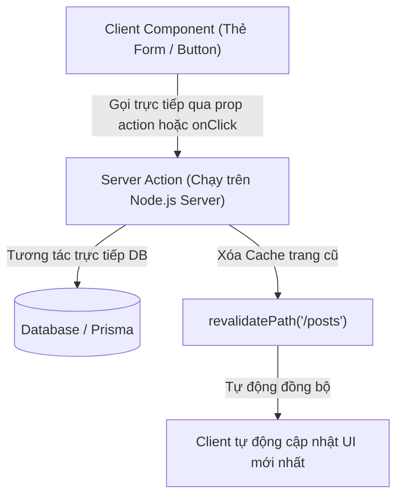

## I. KHÁI QUÁT (OVERVIEW)

### 1. Sự phức tạp khi thay đổi dữ liệu (Mutations) theo kiểu cũ
Trong kiến trúc Web SPA truyền thống, để gửi hoặc thay đổi dữ liệu trên Server (ví dụ: tạo bài viết mới, cập nhật hồ sơ):
1.  Bạn phải viết một API endpoint ở phía Backend (ví dụ `/api/posts` dùng để nhận POST request).
2.  Viết hàm gọi API ở Client (sử dụng `fetch` hoặc `axios` gửi body JSON).
3.  Quản lý trạng thái loading, lỗi (error) thủ công ở Client.
4.  Khi dữ liệu thay đổi thành công, bạn lại phải kích hoạt (trigger) cơ chế tải lại dữ liệu mới nhất (Revalidation) trên UI của client.

Kiến trúc này đòi hỏi viết rất nhiều boilerplate code và dễ gây đồng bộ sai lệch trạng thái giữa Client và Server.

**Server Actions** là tính năng cốt lõi của Next.js (dựa trên các tính năng xử lý Form của React 19), cho phép bạn định nghĩa các hàm chạy **hoàn toàn ở phía Server** nhưng có thể được **gọi trực tiếp từ Client Component** giống như các hàm JavaScript thông thường.



---

## II. CHI TIẾT KỸ THUẬT (DETAILED DEEP DIVE)

### 1. Chỉ thị `'use server'`
Để khai báo một Server Action, bạn sử dụng chỉ thị **`'use server'`** ở dòng đầu tiên của hàm (nếu viết inline) hoặc dòng đầu tiên của tệp tin độc lập (nếu gom nhóm các actions).

> [!CAUTION]
> **Sự khác biệt lớn giữa `'use client'` và `'use server'`:**
> *   `'use client'`: Báo cho Next.js biết component này cần được đóng gói JS gửi xuống trình duyệt để chạy tương tác.
> *   `'use server'`: Báo cho Next.js biết các hàm xuất ra từ file này là các **Server Actions** chỉ được chạy ở Server. **Tuyệt đối không** nhầm lẫn `'use server'` là dùng để khai báo Server Component.

---

### 2. Các cơ chế Revalidation (Làm mới dữ liệu)
Sau khi Server Action cập nhật Database thành công, bạn cần thông báo cho Next.js xóa bỏ các cache trang cũ để hiển thị dữ liệu mới nhất cho người dùng. Next.js cung cấp 2 hàm chính:

1.  **`revalidatePath(path)`**: Xóa cache của một đường dẫn cụ thể (ví dụ: `revalidatePath('/products')` sẽ làm mới dữ liệu trang sản phẩm).
2.  **`revalidateTag(tag)`**: Xóa cache của các request API cụ thể được đánh nhãn (tag). Thích hợp khi bạn muốn làm mới dữ liệu ở nhiều trang khác nhau cùng dùng chung một nguồn API.

---

## III. VÍ DỤ MINH HỌA VÀ PHÂN TÍCH CODE (CODE EXAMPLES & ANALYSIS)

### 1. Triển khai form Thêm sản phẩm chuẩn bảo mật bằng Server Actions
Dưới đây là một ví dụ thực tế hoàn chỉnh. Chúng ta định nghĩa các Server Actions ở file riêng để dễ quản lý, sau đó gọi từ Form ở Client Component. Hệ thống tích hợp kiểm tra dữ liệu bằng Zod và tự động cập nhật trang tĩnh.

#### File: `/src/app/actions/productActions.ts` (Định nghĩa Actions ở Server)
```typescript
'use server';

import { db } from '@/lib/db'; // Kết nối Prisma Client giả lập
import { revalidatePath } from 'next/cache';
import { z } from 'zod';

// Định nghĩa Schema Validation bằng Zod ở Server
const productSchema = z.object({
  name: z.string().min(2, 'Tên sản phẩm phải từ 2 ký tự trở lên.'),
  price: z.number().positive('Giá sản phẩm phải lớn hơn 0.')
});

export async function createProductAction(prevState: any, formData: FormData) {
  // 1. Đọc dữ liệu từ form gửi lên
  const name = formData.get('name') as string;
  const price = Number(formData.get('price'));

  // 2. Validate chặt chẽ ở phía Server để chống giả mạo dữ liệu
  const result = productSchema.safeParse({ name, price });

  if (!result.success) {
    // Trả về lỗi chi tiết cho client hiển thị
    return {
      success: false,
      errors: result.error.flatten().fieldErrors
    };
  }

  try {
    // 3. Ghi trực tiếp vào Database
    await db.product.create({
      data: { name, price }
    });

    // 4. Xóa cache trang danh sách sản phẩm để ép buộc load dữ liệu mới nhất
    revalidatePath('/products');

    return { success: true, errors: {} };
  } catch (error) {
    return {
      success: false,
      errors: { global: 'Lỗi kết nối cơ sở dữ liệu.' }
    };
  }
}
```

#### File: `/src/app/products/AddProductForm.tsx` (Client Component gọi Action)
```tsx
'use client';

import React, { useActionState } from 'react';
import { createProductAction } from '../actions/productActions';

export default function AddProductForm() {
  // Sử dụng useActionState của React 19 để quản lý trạng thái action của Form
  const [state, formAction, isPending] = useActionState(createProductAction, {
    success: false,
    errors: {}
  });

  return (
    <form action={formAction} className="max-w-sm bg-white p-6 rounded-xl shadow-sm border space-y-4">
      <h3 className="font-bold text-slate-800">Thêm sản phẩm mới</h3>
      
      <div>
        <label className="block text-sm text-slate-600 mb-1">Tên sản phẩm:</label>
        <input 
          type="text" 
          name="name" 
          className="w-full px-3 py-2 border rounded-md focus:outline-none"
        />
        {state.errors?.name && (
          <p className="text-red-500 text-xs mt-1">{state.errors.name[0]}</p>
        )}
      </div>

      <div>
        <label className="block text-sm text-slate-600 mb-1">Giá bán (VNĐ):</label>
        <input 
          type="number" 
          name="price" 
          className="w-full px-3 py-2 border rounded-md focus:outline-none"
        />
        {state.errors?.price && (
          <p className="text-red-500 text-xs mt-1">{state.errors.price[0]}</p>
        )}
      </div>

      <button
        type="submit"
        disabled={isPending}
        className="w-full py-2 bg-blue-600 hover:bg-blue-700 text-white rounded-md font-semibold disabled:opacity-50 transition-colors"
      >
        {isPending ? 'Đang lưu sản phẩm...' : 'Lưu sản phẩm'}
      </button>

      {state.success && (
        <p className="text-emerald-600 text-sm text-center">Đã thêm sản phẩm thành công!</p>
      )}
    </form>
  );
}
```

---

## IV. LƯU Ý, CẠM BẪY VÀ QUY TẮC CỐT LÕI (PITFALLS & BEST PRACTICES)

### 1. Cạm bẫy Bỏ qua Xác thực và Phân quyền (Security Considerations)
*   **Cảnh báo cực kỳ quan trọng:** Server Action thực chất hoạt động giống như một POST API công khai. Bất kỳ ai cũng có thể kích hoạt gọi hàm này từ trình duyệt.
*   **Hậu quả:** Nếu bạn viết hàm `deleteProduct(id)` mà không kiểm tra quyền admin bên trong hàm đó, kẻ xấu có thể gọi trực tiếp hàm này qua Console để xóa sạch DB của bạn.
*   ✅ *Best practice:* Luôn kiểm tra token/session của người dùng ngay bên trong thân hàm Server Action trước khi thực thi bất kỳ thay đổi nào xuống Database.
    ```typescript
    export async function deleteProductAction(id: string) {
      const session = await getSession();
      if (!session || session.user.role !== 'admin') {
        throw new Error('Không có quyền thực hiện hành động này.');
      }
      // logic xóa DB...
    }
    ```

---

## 💡 5 QUY TẮC VÀNG VỀ SERVER ACTIONS
1.  **Luôn validate dữ liệu ở Server:** Dùng Zod để kiểm tra tính hợp lệ của dữ liệu nhận được từ Form gửi lên để chống tấn công SQL injection hoặc dữ liệu ảo.
2.  **Luôn kiểm tra phân quyền bên trong Action:** Không tin tưởng bất kỳ client nào, luôn check quyền admin/user ngay đầu hàm action.
3.  **Gom nhóm Actions vào thư mục riêng:** Viết các file action riêng (như `productActions.ts` có chứa `'use server'` ở đầu file) để tăng khả năng bảo trì và tái sử dụng.
4.  **Tối ưu hóa cache bằng `revalidatePath`:** Luôn làm mới các trang liên quan sau khi thay đổi dữ liệu để người dùng thấy giao diện cập nhật ngay lập tức.
5.  **Dùng `useActionState` để quản lý trạng thái form:** Tối ưu hóa UI phản hồi trạng thái loading, lỗi (errors) mà không cần tạo nhiều biến state dư thừa.
