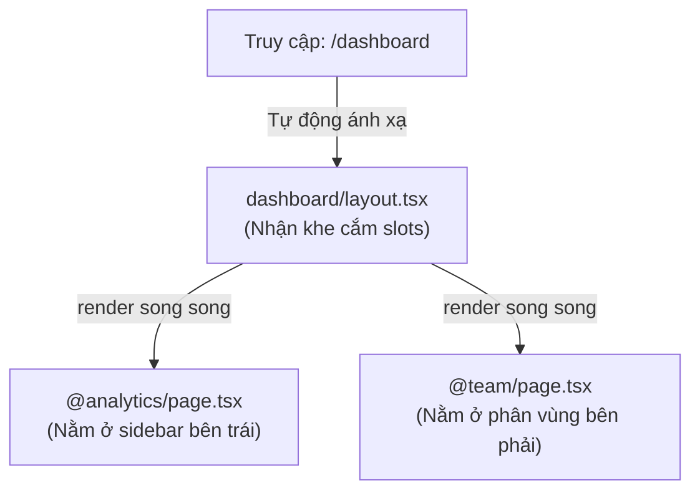

# Bài 06 - Dynamic Routes & Parallel Routes (Định tuyến động & Song song)

## I. KHÁI QUÁT (OVERVIEW)

### 1. Nhu cầu xây dựng giao diện đa luồng và động
Khi xây dựng các ứng dụng web phức tạp, định tuyến tĩnh cơ bản không đủ đáp ứng nhu cầu trải nghiệm người dùng nâng cao:
*   **Dynamic Routes (Định tuyến động):** Dựng trang chi tiết bài viết, trang sản phẩm dựa trên các ID thay đổi linh hoạt.
*   **Parallel Routes (Định tuyến song song):** Hiển thị nhiều trang web độc lập cùng lúc trên một màn hình chung (ví dụ: giao diện Dashboard chia làm 2 phân vùng độc lập, hoặc mở một cửa sổ phụ - Modal lồng trên trang hiện tại).
*   **Intercepting Routes (Định tuyến đánh chặn):** Cho phép bạn tải một trang web con ngay bên trong ngữ cảnh trang hiện tại mà không làm mất trạng thái cũ (ví dụ: click vào ảnh sản phẩm sẽ mở ra một Modal xem nhanh sản phẩm đó có URL riêng biệt, nhưng nếu F5 reload lại trang thì trình duyệt sẽ hiển thị trang chi tiết sản phẩm đầy đủ).

Next.js cung cấp bộ công cụ định tuyến mạnh mẽ để giải quyết toàn bộ các bài toán UX phức tạp trên một cách có cấu trúc rõ ràng.



---

## II. CHI TIẾT KỸ THUẬT (DETAILED DEEP DIVE)

### 1. Định tuyến động (Dynamic Routing) nâng cao
Ngoài cú pháp `[id]` cơ bản, Next.js hỗ trợ:
*   **Catch-all Segments `[...slug]`**: Bắt toàn bộ các URL con phía sau. Ví dụ `/app/shop/[...slug]/page.tsx` sẽ bắt được cả `/shop/clothes`, `/shop/clothes/tops/shirts`. Giá trị `params.slug` trả về là một mảng `['clothes', 'tops', 'shirts']`.
*   **Optional Catch-all `[[...slug]]`**: Tương tự như trên nhưng khớp cả URL cha không chứa tham số động (`/shop`).

#### generateStaticParams (Tối ưu hóa SSG cho trang động)
Đối với các trang động nhưng số lượng sản phẩm/bài viết giới hạn, bạn có thể định nghĩa hàm `generateStaticParams()` để báo cho Next.js build trước toàn bộ danh sách HTML tĩnh của các trang động này ở build-time.
```typescript
export async function generateStaticParams() {
  const posts = await getPosts();
  return posts.map((post) => ({
    slug: post.slug,
  }));
}
```

---

### 2. Định tuyến song song (Parallel Routes)
Parallel Routes cho phép bạn render đồng thời hoặc có điều kiện nhiều trang web khác nhau trên cùng một layout chung.
*   **Cú pháp:** Tạo thư mục có tiền tố `@` (gọi là các **slots** - khe cắm), ví dụ `@analytics`, `@team`.
*   **Cơ chế hoạt động:** Next.js sẽ tự động truyền các slots này làm **props** vào file `layout.tsx` cùng cấp của bạn.

---

### 3. Định tuyến đánh chặn (Intercepting Routes)
Dùng để "đánh chặn" hành vi điều hướng của trình duyệt để tải một route khác ngay trong layout hiện tại.
*   **Cú pháp:** Tạo thư mục có tiền tố giống như đường dẫn tương đối:
    *   `(.)`: Khớp phân đoạn cùng cấp.
    *   `(..)`: Khớp phân đoạn trên 1 cấp.
    *   `(...)`: Khớp phân đoạn từ root `/app`.

---

## III. VÍ DỤ MINH HỌA VÀ PHÂN TÍCH CODE (CODE EXAMPLES & ANALYSIS)

### 1. Dựng Layout Dashboard chia Phân vùng Song song (Parallel Routing)
Dưới đây là cách cấu hình một trang Dashboard nhận hai luồng dữ liệu độc lập (@analytics và @team) chạy song song trên cùng một màn hình để tối ưu hóa thời gian tải trang.

#### Cấu trúc thư mục:
```text
app/
└── dashboard/
    ├── @analytics/
    │   ├── page.tsx     (Trang con thống kê số liệu)
    │   └── default.tsx  (Trang fallback mặc định)
    ├── @team/
    │   ├── page.tsx     (Trang con quản lý đội nhóm)
    │   └── default.tsx
    ├── layout.tsx       (Dashboard Layout nhận @analytics và @team)
    └── page.tsx         (Trang tổng quan chính: /dashboard)
```

#### File: `/app/dashboard/layout.tsx` (Dashboard Layout nhận Slots)
```tsx
import React from 'react';

interface DashboardLayoutProps {
  children: React.ReactNode;
  analytics: React.ReactNode; // Nhận slot @analytics tự động từ Next.js
  team: React.ReactNode;      // Nhận slot @team tự động từ Next.js
}

export default function DashboardLayout({
  children,
  analytics,
  team
}: DashboardLayoutProps) {
  return (
    <div className="p-8 space-y-6 bg-slate-50 min-h-screen">
      <h1 className="text-3xl font-extrabold text-slate-900">Dashboard Hệ thống</h1>
      
      {/* Giao diện chính của Dashboard */}
      <div className="dashboard-main-content">
        {children}
      </div>

      {/* Dựng khung lưới render song song 2 phân vùng */}
      <div className="grid grid-cols-1 md:grid-cols-2 gap-6">
        <div className="bg-white p-6 rounded-xl shadow-sm border border-slate-100">
          <h3 className="font-bold text-slate-800 mb-4">Số liệu phân tích</h3>
          {analytics}
        </div>
        <div className="bg-white p-6 rounded-xl shadow-sm border border-slate-100">
          <h3 className="font-bold text-slate-800 mb-4">Quản lý Đội nhóm</h3>
          {team}
        </div>
      </div>
    </div>
  );
}
```

#### File: `/app/dashboard/@analytics/page.tsx` (Trang Analytics con)
```tsx
import React from 'react';

// Giả lập fetch dữ liệu chậm
async function getAnalyticsData() {
  await new Promise((resolve) => setTimeout(resolve, 1500)); // trễ 1.5s
  return { views: 45200, bounceRate: '24%' };
}

export default async function AnalyticsPage() {
  const data = await getAnalyticsData();

  return (
    <div className="space-y-2">
      <p className="text-slate-600 text-sm">Lượt truy cập trang: <strong>{data.views}</strong></p>
      <p className="text-slate-600 text-sm">Tỉ lệ thoát trang: <strong>{data.bounceRate}</strong></p>
    </div>
  );
}
```

---

## IV. LƯU Ý, CẠM BẪY VÀ QUY TẮC CỐT LÕI (PITFALLS & BEST PRACTICES)

### 1. Lỗi thiếu file `default.tsx` khi sử dụng Parallel Routes
*   **Vấn đề:** Khi bạn sử dụng Parallel Routes và thực hiện chuyển hướng hoặc reload trang web, Next.js cần biết phải hiển thị nội dung gì cho các slots khác nếu URL hiện tại không khớp trực tiếp với đường dẫn của slot đó.
*   **Hậu quả:** Nếu thiếu file `default.tsx`, Next.js sẽ báo lỗi **404 Not Found** hoặc crash trang khi reload.
*   ✅ *Best practice:* Luôn tạo file **`default.tsx`** làm fallback hiển thị giao diện mặc định cho từng slot thư mục `@slot`.

---

## 💡 5 QUY TẮC VÀNG VỀ DYNAMIC & PARALLEL ROUTES
1.  **Dùng `default.tsx` làm fallback:** Tránh lỗi 404 khi người dùng reload trang chứa Parallel Routes.
2.  **Tối ưu hóa trang động bằng `generateStaticParams`:** Đưa các trang động có dữ liệu giới hạn về trạng thái SSG tĩnh hoàn toàn để tăng tốc độ phản hồi.
3.  **Tận dụng Intercepting Routes cho trải nghiệm Modal:** Tạo trải nghiệm mở Modal xem nhanh nhưng vẫn giữ URL riêng biệt để người dùng dễ chia sẻ link.
4.  **Cô lập lỗi bằng `error.tsx` cục bộ:** Không để lỗi của một phân vùng song song (ví dụ: slot @analytics bị lỗi API) làm sập toàn bộ giao diện Dashboard chính.
5.  **Dùng Optional Catch-all `[[...slug]]` cho bộ lọc sản phẩm:** Xây dựng các route lọc danh mục nhiều cấp linh hoạt chỉ với một file page duy nhất.
