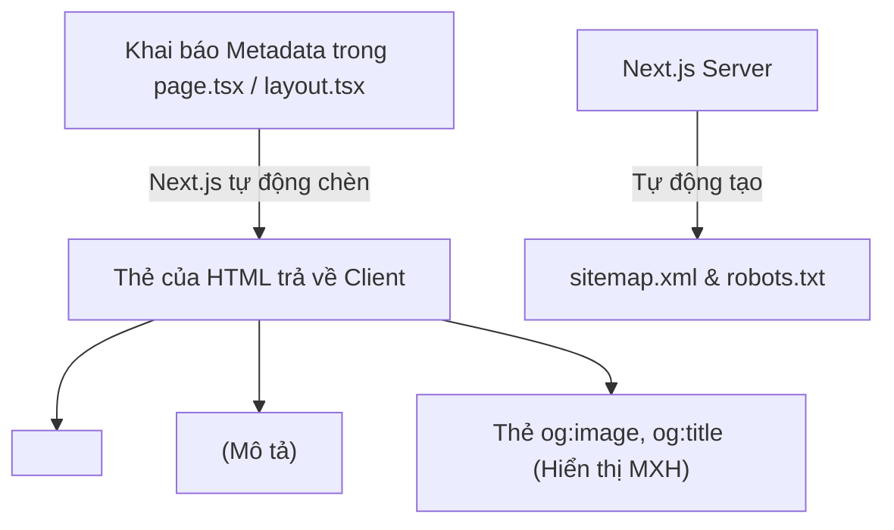

## I. KHÁI QUÁT (OVERVIEW)

### 1. Tại sao SEO là điểm mạnh tuyệt đối của Next.js?
Tối ưu hóa công cụ tìm kiếm (**SEO**) là yếu tố sống còn quyết định sự thành bại về mặt thương mại của một trang web (như trang thương mại điện tử, blog tin tức). Nếu trang web không xuất hiện trên trang đầu của Google, bạn sẽ mất đi lượng lớn khách hàng tiềm năng.

Next.js cung cấp một bộ API quản lý **Metadata** (siêu dữ liệu) tích hợp sẵn mạnh mẽ:
*   Cho phép khai báo thẻ tiêu đề (`title`), mô tả (`description`), cấu hình thẻ OpenGraph (cho hiển thị khi chia sẻ link lên Facebook/Zalo) và Twitter Cards dễ dàng.
*   Tự động chèn các mã định dạng dữ liệu có cấu trúc (**JSON-LD**) để Google hiển thị các kết quả tìm kiếm giàu tính năng (Rich Snippets).
*   Hỗ trợ tự động tạo file bản đồ trang web `sitemap.xml` và cấu hình file điều hướng bot `robots.txt` động.



---

## II. CHI TIẾT KỸ THUẬT (DETAILED DEEP DIVE)

### 1. Khai báo Metadata tĩnh (Static Metadata)
Với các trang có tiêu đề cố định, bạn chỉ cần export một hằng số đối tượng `metadata` có kiểu dữ liệu `Metadata` từ file `page.tsx` hoặc `layout.tsx`.
*   *Lưu ý:* Next.js sẽ tự động kế thừa cấu hình metadata từ layout cha xuống các trang con.

---

### 2. Khai báo Metadata động (Dynamic Metadata)
Đối với các trang động (ví dụ trang chi tiết sản phẩm, chi tiết bài viết), tiêu đề và hình ảnh OpenGraph phụ thuộc trực tiếp vào dữ liệu từ API. Bạn sử dụng hàm **`generateMetadata()`** để fetch dữ liệu và tạo metadata động trước khi render trang.

```typescript
export async function generateMetadata({ params }): Promise<Metadata> {
  const product = await getProduct(params.id);
  return {
    title: product.name,
    description: product.summary,
  };
}
```

---

### 3. Dữ liệu có cấu trúc (JSON-LD Structured Data)
JSON-LD là một định dạng chuẩn hóa giúp cung cấp thông tin chi tiết về trang web của bạn cho Googlebot hiểu (ví dụ: thông tin giá bán sản phẩm, đánh giá sao, tác giả bài viết).
*   *Cách triển khai:* Bạn chèn trực tiếp mã JSON-LD dưới dạng một thẻ `<script>` có thuộc tính `type="application/ld+json"` vào phần thân của trang.

---

## III. VÍ DỤ MINH HỌA VÀ PHÂN TÍCH CODE (CODE EXAMPLES & ANALYSIS)

### 1. Cấu hình SEO hoàn chỉnh cho trang Chi tiết Sản phẩm
Dưới đây là một trang chi tiết sản phẩm thực tế, cấu hình đầy đủ Dynamic Metadata (OpenGraph) và chèn dữ liệu cấu trúc Product JSON-LD chuẩn SEO.

```tsx
// File: src/app/products/[id]/page.tsx
import { Metadata } from 'next';
import React from 'react';

interface Product {
  id: string;
  name: string;
  description: string;
  price: number;
  imageUrl: string;
}

// Giả lập lấy dữ liệu sản phẩm từ API
async function getProductDetail(id: string): Promise<Product> {
  // const res = await fetch(`https://api.example.com/products/${id}`);
  return {
    id,
    name: 'Bàn phím cơ không dây TKL Pro',
    description: 'Bàn phím cơ cao cấp kết nối 3 chế độ mượt mà, keycap PBT chất lượng cao.',
    price: 1850000,
    imageUrl: 'https://images.example.com/products/keyboard.jpg'
  };
}

// 1. Định nghĩa Hàm tạo Metadata động chuẩn SEO
export async function generateMetadata({ 
  params 
}: { 
  params: Promise<{ id: string }> 
}): Promise<Metadata> {
  const resolvedParams = await params;
  const product = await getProductDetail(resolvedParams.id);

  return {
    title: `${product.name} | Cửa hàng công nghệ`,
    description: product.description,
    // Cấu hình hiển thị khi chia sẻ link lên Facebook/Zalo
    openGraph: {
      title: product.name,
      description: product.description,
      images: [
        {
          url: product.imageUrl,
          width: 800,
          height: 600,
          alt: product.name
        }
      ],
      type: 'website'
    }
  };
}

export default async function ProductDetailPage({ 
  params 
}: { 
  params: Promise<{ id: string }> 
}) {
  const resolvedParams = await params;
  const product = await getProductDetail(resolvedParams.id);

  // 2. Định nghĩa Schema JSON-LD cấu trúc dữ liệu cho Google
  const jsonLd = {
    '@context': 'https://schema.org',
    '@type': 'Product',
    name: product.name,
    image: product.imageUrl,
    description: product.description,
    offers: {
      '@type': 'Offer',
      price: product.price,
      priceCurrency: 'VND',
      availability: 'https://schema.org/InStock'
    }
  };

  return (
    <div className="p-8 max-w-xl mx-auto space-y-6">
      {/* Chèn mã JSON-LD an toàn */}
      <script
        type="application/ld+json"
        dangerouslySetInnerHTML={{ __html: JSON.stringify(jsonLd) }}
      />

      <div className="bg-white p-6 rounded-xl border">
        
        <h1 className="text-2xl font-bold text-slate-800">{product.name}</h1>
        <p className="text-emerald-600 font-bold text-lg mt-2">{product.price.toLocaleString('vi-VN')}đ</p>
        <p className="text-slate-600 text-sm mt-4">{product.description}</p>
      </div>
    </div>
  );
}
```

---

## IV. LƯU Ý, CẠM BẪY VÀ QUY TẮC CỐT LÕI (PITFALLS & BEST PRACTICES)

### 1. Lỗi trùng lặp URL do thiếu thẻ Canonical Link
*   **Vấn đề:** Một trang web có thể truy cập bằng nhiều cách khác nhau (ví dụ: `/products/123`, `/products/123?utm_source=fb`, `/products/123/`). Googlebot sẽ coi đây là các trang web trùng lặp nội dung (Duplicate Content) và tiến hành phạt hạ điểm SEO của bạn.
*   ✅ *Best practice:* Luôn định nghĩa thuộc tính **`alternates.canonical`** trong metadata của trang để chỉ định duy nhất 1 URL gốc chính thức cho Google lập chỉ mục:
    ```typescript
    metadata: {
      alternates: {
        canonical: 'https://example.com/products/123'
      }
    }
    ```

---

## 💡 5 QUY TẮC VÀNG VỀ METADATA & SEO
1.  **Luôn khai báo Metadata tĩnh cho trang tĩnh:** Tận dụng tính năng thừa kế của Next.js để định nghĩa tiêu đề gốc ở `layout.tsx` và ghi đè ở các `page.tsx` con.
2.  **Dùng `generateMetadata` cho trang động:** Đảm bảo tiêu đề và ảnh đại diện OpenGraph luôn khớp với dữ liệu thực tế của sản phẩm/bài viết.
3.  **Tích hợp JSON-LD cho các thực thể quan trọng:** Cung cấp thông tin cấu hình (Sản phẩm, Bài viết, Tổ chức) giúp Google hiển thị Rich Snippets đẹp mắt trên trang tìm kiếm.
4.  **Khai báo Canonical URL:** Phòng tránh lỗi phạt trùng lặp nội dung do các tham số UTM hoặc đường dẫn URL biến thể.
5.  **Cấu hình tự động Sitemap:** Sử dụng tính năng tạo sitemap động của Next.js (tệp `sitemap.ts`) để tự động cập nhật bản đồ liên kết của toàn bộ sản phẩm lên Google Search Console.
