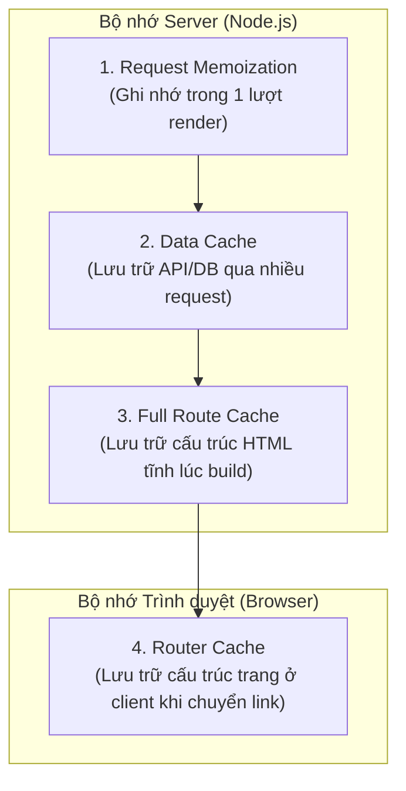

# Bài 08 - Next.js Caching Deep Dive (Phân tích sâu hệ thống Cache)

## I. KHÁI QUÁT (OVERVIEW)

### 1. Tại sao hệ thống Cache của Next.js lại phức tạp?
Next.js được thiết kế với mục tiêu tối ưu hóa hiệu năng ứng dụng web ở mức tối đa. Để làm được điều đó, Next.js xây dựng một hệ thống cache đa tầng cực kỳ mạnh mẽ gồm **4 lớp cache độc lập** hoạt động ở cả phía Server và Client.

Mặc dù giúp ứng dụng phản hồi nhanh như chớp, việc không hiểu rõ bản chất hoạt động của hệ thống cache này sẽ dẫn đến các lỗi khó chịu bậc nhất khi phát triển thực tế:
*   Dữ liệu cũ bị kẹt, không cập nhật khi người dùng F5 tải lại trang.
*   Next.js tự động lưu cache cho các dữ liệu cần động hoàn toàn.
*   Khó khăn khi debug vì không biết dữ liệu đang được đọc từ đâu.



---

## II. CHI TIẾT KỸ THUẬT (DETAILED DEEP DIVE)

### 1. Phân tích chi tiết 4 tầng Cache của Next.js

#### a. Tầng 1: Request Memoization (Ghi nhớ trong Request)
*   **Môi trường:** Server.
*   **Cơ chế:** Ghi nhớ các request API trùng lặp trong **cùng một vòng đời render cây component** (single request pass).
*   *Cách thức:* Tự động áp dụng cho hàm `fetch` mặc định hoặc hàm bọc qua `cache()` của React.
*   *Thời gian sống:* Bị hủy ngay lập tức sau khi server hoàn thành việc trả về HTML cho request hiện tại.

#### b. Tầng 2: Data Cache (Lưu trữ Dữ liệu Bền vững)
*   **Môi trường:** Server.
*   **Cơ chế:** Lưu trữ dữ liệu fetch từ ngoài bền vững **qua nhiều lượt request khác nhau** (giữa các người dùng khác nhau).
*   *Cách thức:* Điều khiển qua tùy chọn `{ cache: 'force-cache' }` hoặc `{ next: { revalidate: 3600 } }`.
*   *Thời gian sống:* Bền vững mãi mãi cho đến khi bị xoá chủ động (Revalidate) hoặc hết hạn thời gian.

#### c. Tầng 3: Full Route Cache (Lưu trữ Trang tĩnh)
*   **Môi trường:** Server.
*   **Cơ chế:** Lưu trữ toàn bộ nội dung HTML và payload dữ liệu tĩnh của trang web lúc build.
*   *Cách thức:* Tự động kích hoạt cho các trang được đánh giá là Tĩnh (Static Routes).
*   *Thời gian sống:* Chỉ bị xóa bỏ khi có bản cập nhật mới (rebuild ứng dụng) hoặc khi dữ liệu phụ thuộc của nó bị revalidate.

#### d. Tầng 4: Router Cache (Bộ nhớ đệm phía Client)
*   **Môi trường:** Client (Trình duyệt).
*   **Cơ chế:** Lưu trữ tạm thời cấu trúc cây trang (React Server Component Payload) trong bộ nhớ đệm của trình duyệt khi người dùng chuyển trang qua thẻ `<Link>`.
*   *Thời gian sống:* Xóa bỏ khi tải lại trang hoàn toàn (Hard Reload) hoặc tự động hết hạn sau 5 phút (cho trang tĩnh) hoặc 30 giây (cho trang động).

---

### 2. Các phương pháp Xóa bỏ Cache (Cache Invalidation)

Để bắt buộc Next.js xóa bỏ cache cũ và nạp lại dữ liệu mới nhất, bạn sử dụng 3 cách thức:
1.  **Revalidation theo thời gian (Time-based):** Sử dụng tùy chọn `revalidate` trong hàm `fetch` để tự động xóa cache sau một số giây cụ thể.
2.  **Revalidation theo đường dẫn (`revalidatePath`):** Gọi hàm này trong Server Action để xóa cache của toàn bộ trang web tương ứng ngay lập tức.
3.  **Revalidation theo thẻ nhãn (`revalidateTag`):** Gán tag cho request fetch, sau đó gọi `revalidateTag(tag)` để xóa cache chọn lọc.

---

## III. VÍ DỤ MINH HỌA VÀ PHÂN TÍCH CODE (CODE EXAMPLES & ANALYSIS)

### 1. Cấu hình Data Cache nâng cao sử dụng Tags & Revalidation
Dưới đây là một ví dụ thực tế về việc nạp danh sách tin tức. Chúng ta gán tag `news-list` cho hàm fetch, sau đó thiết lập một Server Action chuyên dụng để xóa cache khi admin đăng tin mới.

#### File: `/src/app/news/page.tsx` (Trang hiển thị tin tức)
```tsx
import React from 'react';

interface NewsItem {
  id: string;
  title: string;
}

async function getNews(): Promise<NewsItem[]> {
  // Gán tag cấu hình cache để dễ xóa sau này
  const res = await fetch('https://api.example.com/news', {
    next: { tags: ['news-list'] } // Gán nhãn cho request này
  });
  
  if (!res.ok) throw new Error('Không thể tải tin tức.');
  return res.json();
}

export default async function NewsPage() {
  const news = await getNews();

  return (
    <div className="p-8 max-w-xl mx-auto space-y-4">
      <h2 className="text-2xl font-bold text-slate-800">Tin tức trong ngày</h2>
      <ul className="space-y-3">
        {news.map((item) => (
          <li key={item.id} className="p-4 bg-white rounded border">
            {item.title}
          </li>
        ))}
      </ul>
    </div>
  );
}
```

#### File: `/src/app/actions/newsActions.ts` (Server Action xóa cache)
```typescript
'use server';

import { revalidateTag } from 'next/cache';

export async function addNewsAction(formData: FormData) {
  const title = formData.get('title') as string;

  // Giả lập lưu vào Database
  await fetch('https://api.example.com/news', {
    method: 'POST',
    body: JSON.stringify({ title }),
    headers: { 'Content-Type': 'application/json' }
  });

  // ❌ XÓA CACHE CHỌN LỌC:
  // Next.js sẽ xóa bỏ bộ nhớ đệm của toàn bộ các request fetch có gắn tag 'news-list'.
  // Trang NewsPage sẽ tự động tải lại dữ liệu mới nhất ở lượt truy cập sau.
  revalidateTag('news-list');
}
```

---

## IV. LƯU Ý, CẠM BẪY VÀ QUY TẮC CỐT LÕI (PITFALLS & BEST PRACTICES)

### 1. Cú pháp Tắt hoàn toàn Caching cho một Route (Opting Out)
*   **Vấn đề:** Đôi khi bạn muốn trang web của mình luôn luôn mới 100% ở mỗi lần truy cập (ví dụ trang hiển thị giá vàng, trang thanh toán).
*   ✅ *Best practice:* Sử dụng các phương pháp ép buộc Next.js bỏ qua lưu trữ cache:
    1.  Export biến cấu hình tĩnh:
        ```typescript
        export const dynamic = 'force-dynamic';
        ```
    2.  Sử dụng tùy chọn `{ cache: 'no-store' }` trong các hàm `fetch` quan trọng.

---

## 💡 5 QUY TẮC VÀNG VỀ NEXT.JS CACHING
1.  **Gán Tags cho các fetch API quan trọng:** Tận dụng `revalidateTag` để xóa cache chính xác và chọn lọc thay vì xóa sạch toàn bộ trang web.
2.  **Bọc `useMemo` / React `cache()` cho các hàm DB:** Đảm bảo không truy xuất trùng lặp database trong cùng một lượt render request.
3.  **Luôn khai báo `revalidatePath` trong Server Actions:** Đảm bảo dữ liệu UI hiển thị cho người dùng luôn đồng bộ ngay sau khi họ thực hiện gửi biểu mẫu.
4.  **Tắt cache cho dữ liệu thời gian thực (Real-time):** Sử dụng cấu hình `force-dynamic` hoặc `no-store` cho các trang giao dịch hoặc ví tiền.
5.  **Dùng hard reload để xóa Router Cache ở client:** Nhắc nhở người dùng tải lại trang hoàn toàn nếu muốn cập nhật các cấu hình tĩnh cục bộ được cache ở trình duyệt.
