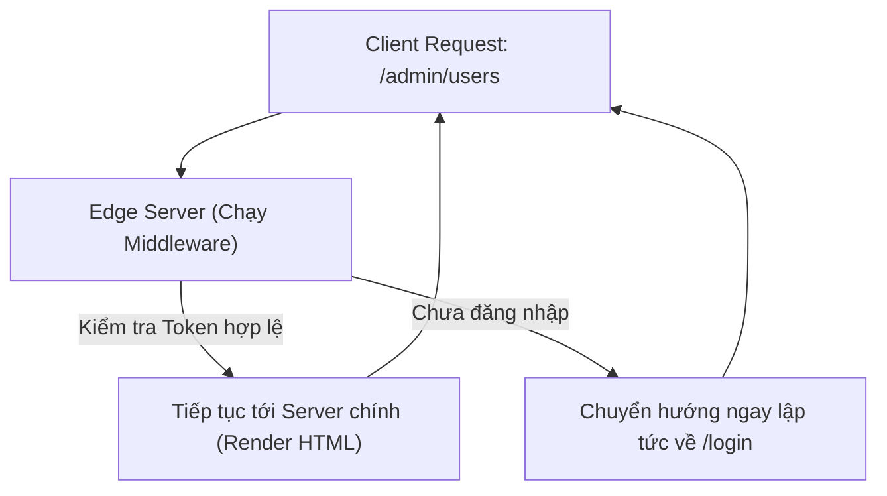

## I. KHÁI QUÁT (OVERVIEW)

### 1. Middleware là gì? Tại sao cần Middleware?
Trong kiến trúc web, **Middleware** (phần mềm trung gian) là một khối code chạy **trước khi** một yêu cầu (request) từ người dùng được xử lý hoàn toàn và trả về giao diện.

Đối với các bài toán bảo mật và định tuyến hệ thống:
*   **Bảo vệ Route (Authentication Guards):** Kiểm tra xem người dùng đã đăng nhập chưa trước khi cho phép họ truy cập trang Admin. Nếu kiểm tra thủ công ở từng file page.tsx, code sẽ bị lặp và kém an toàn.
*   **Chuyển hướng (Redirects):** Chuyển hướng người dùng từ `/old-url` sang `/new-url` hoặc phân luồng đa ngôn ngữ (i18n) tự động dựa trên vị trí địa lý.
*   **Phân luồng thử nghiệm (A/B Testing):** Chuyển 50% người dùng sang giao diện A và 50% sang giao diện B để đo đạc hiệu quả thiết kế.

Next.js cung cấp một tệp tin duy nhất **`middleware.ts`** chạy ở cấp độ cơ sở hạ tầng biên (**Edge Runtime**), giúp xử lý các bài toán trên với tốc độ cực nhanh trước khi request chạm vào máy chủ chính.



---

## II. CHI TIẾT KỸ THUẬT (DETAILED DEEP DIVE)

### 1. Node.js Runtime vs Edge Runtime

Next.js hỗ trợ chạy code trên hai môi trường máy chủ khác nhau:

| Tiêu chí | Node.js Runtime (Mặc định) | Edge Runtime |
| :--- | :--- | :--- |
| **Vị trí địa lý** | Chạy tại 1 máy chủ trung tâm duy nhất | Chạy phân tán tại hàng trăm trạm biên CDN gần người dùng nhất |
| **Tốc độ phản hồi** | Chậm hơn do khoảng cách địa lý | Siêu nhanh (Cold start gần như bằng 0) |
| **Kích thước API** | Đầy đủ toàn bộ thư viện Node.js | Giới hạn (không dùng được file system `fs`, `child_process`...) |
| **Phù hợp nhất với** | Nghiệp vụ nặng, kết nối DB trực tiếp | Định tuyến, bảo mật, lọc dữ liệu đầu vào |

---

### 2. Cấu hình file `middleware.ts`
Tệp tin `middleware.ts` bắt buộc phải đặt tại **thư mục gốc (root)** của dự án (cùng cấp với thư mục `/app` hoặc `/src`).

#### Bộ lọc Matcher (Matcher Configuration)
Theo mặc định, Middleware sẽ chạy ở mọi request của ứng dụng. Để tránh làm chậm các request tải tài nguyên tĩnh (hình ảnh, font chữ), bạn phải cấu hình bộ lọc `matcher` để chỉ chạy Middleware trên các đường dẫn mong muốn.

```typescript
export const config = {
  matcher: [
    // Chỉ chạy middleware cho các trang trong phân vùng admin
    '/admin/:path*',
    // Loại trừ các file tĩnh
    '/((?!api|_next/static|_next/image|favicon.ico).*)',
  ],
}
```

---

## III. VÍ DỤ MINH HỌA VÀ PHÂN TÍCH CODE (CODE EXAMPLES & ANALYSIS)

### 1. Triển khai Hệ thống Xác thực & Phân quyền tập trung trong Middleware
Dưới đây là một ví dụ thực tế về cách thiết lập Middleware để kiểm tra JWT Token lưu trong Cookie. Nếu chưa đăng nhập, tự động chuyển hướng về trang `/login` kèm theo tham số URL gốc (`callbackUrl`) để tự động quay lại sau khi đăng nhập thành công.

```tsx
// File: src/middleware.ts
import { NextResponse } from 'next/server';
import type { NextRequest } from 'next/server';

// 1. Cấu hình các route cần áp dụng Middleware
export const config = {
  matcher: ['/admin/:path*', '/dashboard/:path*']
};

// 2. Hàm xử lý Middleware chạy trên Edge Runtime
export function middleware(request: NextRequest) {
  // Đọc cookie 'auth-token' gửi kèm request
  const token = request.cookies.get('auth-token')?.value;
  const { pathname } = request.nextUrl;

  console.log(`[Middleware] Đang kiểm tra quyền truy cập đường dẫn: ${pathname}`);

  // 3. Nếu chưa đăng nhập (không có token), chuyển hướng ngay về /login
  if (!token) {
    const loginUrl = new URL('/login', request.url);
    
    // Lưu lại URL gốc để sau khi đăng nhập thành công tự động quay lại
    loginUrl.searchParams.set('callbackUrl', pathname);
    
    return NextResponse.redirect(loginUrl);
  }

  // 4. Nếu có token, cho phép request tiếp tục đi tiếp tới máy chủ chính
  return NextResponse.next();
}
```

---

## IV. LƯU Ý, CẠM BẪY VÀ QUY TẮC CỐT LÕI (PITFALLS & BEST PRACTICES)

### 1. Cạm bẫy sử dụng các thư viện Node.js nặng trong Middleware
*   **Vấn đề:** Do Middleware chạy trên **Edge Runtime** (vốn sử dụng nhân V8 engine siêu nhẹ giống như Cloudflare Workers), nó không hỗ trợ đầy đủ các module của Node.js.
*   **Hậu quả:** Nếu bạn import các thư viện kết nối DB trực tiếp (như Prisma, pg) hoặc các thư viện mã hóa nặng (như `bcrypt`) vào file `middleware.ts`, Next.js sẽ báo lỗi crash ngay khi compile.
*   ✅ *Best practice:* Sử dụng các thư viện mã hóa gọn nhẹ hỗ trợ chuẩn Web Crypto API (như **`jose`** thay cho `jsonwebtoken` để verify JWT token ở Edge).

---

## 💡 5 QUY TẮC VÀNG VỀ MIDDLEWARE
1.  **Chỉ viết duy nhất 1 file `middleware.ts`:** Đặt tại thư mục root hoặc thư mục `/src`. Next.js không hỗ trợ viết nhiều file middleware rải rác.
2.  **Cấu hình Matcher thông minh:** Loại trừ toàn bộ các tài nguyên tĩnh (`_next/static`, `images`, `favicon.ico`) để tránh suy giảm hiệu năng tải trang web.
3.  **Dùng `jose` để verify JWT ở Edge:** Tránh xa các thư viện mã hóa Node.js truyền thống không tương thích với môi trường Edge Runtime.
4.  **Lưu callbackUrl khi redirect:** Đảm bảo trải nghiệm người dùng liền mạch, tự động quay lại trang họ đang xem dở sau khi đăng nhập thành công.
5.  **Giữ cho Middleware nhẹ nhất có thể:** Tốc độ phản hồi của Middleware ảnh hưởng trực tiếp đến chỉ số **TTFB** (Time to First Byte) của toàn bộ website. Tránh thực hiện các phép toán phức tạp hoặc gọi API chậm ở đây.
