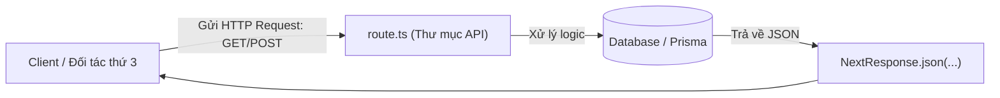

# Bài 10 - Route Handlers & API Design (Xử lý Route & Thiết kế API)

## I. KHÁI QUÁT (OVERVIEW)

### 1. Tại sao Next.js cần Route Handlers?
Mặc dù Next.js hỗ trợ cơ chế Server Components giúp fetch dữ liệu trực tiếp từ database, chúng ta vẫn cần xây dựng các API endpoint tiêu chuẩn để:
*   Cung cấp dữ liệu cho các ứng dụng khác (như ứng dụng di động React Native, đối tác tích hợp bên thứ ba).
*   Xử lý các hành động phản hồi ngược từ các dịch vụ bên ngoài (như nhận **Webhooks** thông báo thanh toán thành công của Stripe/Momo).
*   Tạo các endpoint tải tài nguyên hoặc xuất file báo cáo (PDF, Excel) động.

**Route Handlers** (trước đây gọi là API Routes trong Pages Router) cho phép bạn viết các RESTful API thuần túy chạy trên Server sử dụng các chuẩn Web Request/Response của trình duyệt.



> [!IMPORTANT]
> **Ranh giới đặt tên file:**
> Trong cùng một thư mục định tuyến, bạn **tuyệt đối không được** đặt file `page.tsx` và `route.ts` song song cùng cấp. Nếu làm vậy, Next.js sẽ báo lỗi xung đột định tuyến khi biên dịch.

---

## II. CHI TIẾT KỸ THUẬT (DETAILED DEEP DIVE)

### 1. Quy ước đặt tên file & HTTP Methods
Tệp tin Route Handler bắt buộc phải được đặt tên là **`route.ts`**.
Next.js hỗ trợ ánh xạ tự động các HTTP Method chuẩn thành các tên hàm tương ứng:
*   `GET`: Đọc dữ liệu.
*   `POST`: Tạo mới dữ liệu.
*   `PUT`/`PATCH`: Cập nhật dữ liệu.
*   `DELETE`: Xóa dữ liệu.

```typescript
import { NextResponse } from 'next/server';

export async function GET(request: Request) {
  return NextResponse.json({ message: "Hello World" });
}
```

---

### 2. Caching của Route Handlers
Mặc định, các hàm `GET` trong Route Handlers sẽ bị Next.js tự động lưu cache vĩnh viễn (SSG tĩnh) nếu:
1.  Chúng không sử dụng đối tượng request (`Request`).
2.  Không gọi các hàm động như `cookies()`, `headers()`.

#### Cách tắt Caching cho API (Đảm bảo dữ liệu luôn mới):
*   Sử dụng đối tượng `request` trong tham số của hàm:
    ```typescript
    export async function GET(request: Request) { ... }
    ```
*   Hoặc export biến cấu hình dynamic:
    ```typescript
    export const dynamic = 'force-dynamic';
    ```

---

## III. VÍ DỤ MINH HỌA VÀ PHÂN TÍCH CODE (CODE EXAMPLES & ANALYSIS)

### 1. Thiết kế API CRUD Quản lý Sản phẩm chuẩn RESTful
Dưới đây là một Route Handler hoàn chỉnh xử lý 2 phương thức `GET` (đọc danh sách sản phẩm) và `POST` (thêm mới sản phẩm có validate token auth và schema Zod).

#### File: `/src/app/api/products/route.ts` (API Endpoint)
```typescript
import { NextRequest, NextResponse } from 'next/server';
import { db } from '@/lib/db'; // Prisma Client giả lập
import { z } from 'zod';

// Định nghĩa schema validation đầu vào bằng Zod
const productSchema = z.object({
  name: z.string().min(2),
  price: z.number().positive()
});

// 1. Hàm GET: Đọc danh sách sản phẩm (Tắt cache bằng force-dynamic)
export const dynamic = 'force-dynamic';

export async function GET() {
  try {
    const products = await db.product.findMany();
    return NextResponse.json(products, { status: 200 });
  } catch (error) {
    return NextResponse.json({ error: 'Lỗi máy chủ nội bộ.' }, { status: 500 });
  }
}

// 2. Hàm POST: Thêm sản phẩm mới (Có kiểm tra quyền truy cập)
export async function POST(request: NextRequest) {
  try {
    // Đọc token từ header Authorization
    const authHeader = request.headers.get('authorization');
    if (!authHeader || !authHeader.startsWith('Bearer ')) {
      return NextResponse.json({ error: 'Không có quyền truy cập.' }, { status: 401 });
    }

    // Đọc dữ liệu từ body của Request
    const body = await request.json();

    // Validate dữ liệu bằng Zod
    const validation = productSchema.safeParse(body);
    if (!validation.success) {
      return NextResponse.json(
        { error: 'Dữ liệu không hợp lệ.', details: validation.error.format() },
        { status: 400 }
      );
    }

    // Ghi vào database
    const newProduct = await db.product.create({
      data: {
        name: validation.data.name,
        price: validation.data.price
      }
    });

    return NextResponse.json(newProduct, { status: 201 });
  } catch (error) {
    return NextResponse.json({ error: 'Lỗi xử lý request.' }, { status: 500 });
  }
}
```

---

## IV. LƯU Ý, CẠM BẪY VÀ QUY TẮC CỐT LÕI (PITFALLS & BEST PRACTICES)

### 1. Lỗi rò rỉ dữ liệu nhạy cảm do quên xử lý CORS
*   **Vấn đề:** Mặc định, các API endpoint của Next.js cho phép mọi tên miền khác truy cập (Cross-Origin Resource Sharing). Nếu bạn viết API chứa dữ liệu nội bộ và không chặn CORS, đối thủ có thể viết script JS gọi trực tiếp API này để lấy cắp thông tin.
*   ✅ *Best practice:* Thiết lập các Header bảo mật CORS chọn lọc trong `NextResponse` hoặc sử dụng Middleware để lọc domain truy cập.
    ```typescript
    const response = NextResponse.json(data);
    response.headers.set('Access-Control-Allow-Origin', 'https://mytrusteddomain.com');
    ```

---

## 💡 5 QUY TẮC VÀNG VỀ ROUTE HANDLERS
1.  **Tuyệt đối không để trùng page.tsx và route.ts:** Phân tách rõ ràng phân vùng hiển thị UI và phân vùng cung cấp REST API.
2.  **Luôn khai báo `force-dynamic` cho API động:** Tránh lỗi Next.js tự động lưu cache kết quả trả về của hàm GET lúc build-time.
3.  **Validate dữ liệu đầu vào nghiêm ngặt:** Sử dụng Zod schema để kiểm tra kiểu dữ liệu body của POST/PUT request trước khi tương tác với DB.
4.  **Bảo vệ API bằng Token Authentication:** Luôn check token JWT ở header `Authorization` ở các endpoint có hành động thêm/sửa/xóa.
5.  **Trả về đúng mã HTTP Status Code:** Tuân thủ chuẩn RESTful (`200 OK`, `201 Created`, `400 Bad Request`, `401 Unauthorized`, `500 Server Error`) để bên gọi API dễ dàng bắt lỗi.
