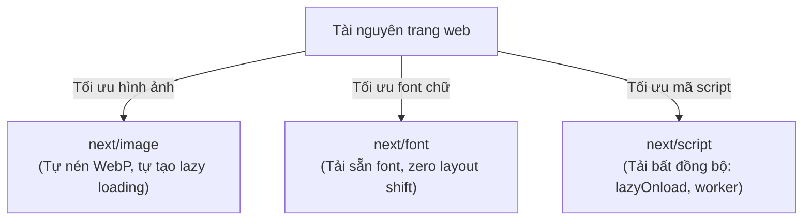

## I. KHÁI QUÁT (OVERVIEW)

### 1. Thách thức về Hiệu năng tải trang (Web Performance)
Dữ liệu từ Google cho biết, hơn **60% dung lượng trung bình** của một trang web đến từ các tệp tin hình ảnh. Font chữ tùy biến và các đoạn mã script bên thứ ba (như Google Analytics, Facebook Pixel, Chat SDK) là hai tác nhân lớn tiếp theo gây ra các vấn đề:
*   **CLS (Cumulative Layout Shift - Điểm dịch chuyển bố cục):** Trang web tải xong nhưng hình ảnh hoặc font chữ tải muộn làm các nút bấm bị đẩy lệch xuống dưới $\rightarrow$ Trải nghiệm người dùng cực tệ (người dùng bấm nhầm nút).
*   **Tải chậm (Blocking Render):** Script bên thứ ba chạy đồng bộ làm đóng băng luồng dựng trang, kéo dài thời gian phản hồi.

Next.js cung cấp bộ ba component tối ưu hóa tài nguyên cốt lõi: **`next/image`**, **`next/font`**, và **`next/script`** giúp tự động nén, tự động tính toán kích thước và phân phối tài nguyên tối ưu nhất mà không cần cấu hình phức tạp.



---

## II. CHI TIẾT KỸ THUẬT (DETAILED DEEP DIVE)

### 1. Tối ưu hóa Hình ảnh với `<Image />`
Thẻ `` truyền thống của HTML tải ảnh nguyên bản và không hỗ trợ thay đổi kích thước theo thiết bị. Component `<Image />` của Next.js giải quyết bằng cách:
1.  **Tự động chuyển đổi định dạng:** Tự nén và chuyển đổi các ảnh dạng PNG, JPEG sang các định dạng thế hệ mới nhẹ hơn nhiều như **WebP** hoặc **AVIF**.
2.  **Responsive Kích thước:** Tự động tạo ra các phiên bản ảnh có kích thước khác nhau (srcset) phù hợp cho từng thiết bị (Mobile, Tablet, Desktop).
3.  **Lazy Loading mặc định:** Chỉ tải hình ảnh khi chúng cuộn gần tới khung nhìn của người dùng (Viewport).
4.  **Blur Placeholder:** Hiển thị một ảnh mờ tạm thời trong lúc chờ tải ảnh chính để giao diện mượt mà hơn.

---

### 2. Tối ưu hóa Font chữ với `next/font`
Next.js tự động tải sẵn và self-host (tự lưu trữ) toàn bộ các font chữ Google Fonts cục bộ ngay lúc build.
*   *Lợi ích:* Trình duyệt không cần gửi request bổ sung tới máy chủ của Google để tải font khi người dùng mở trang $\rightarrow$ **Zero Layout Shift (CLS = 0)**.

---

### 3. Tối ưu hóa Script với `next/script`
Thẻ `<script>` mặc định có thể chặn tiến trình render của trình duyệt. `<Script />` của Next.js cung cấp thuộc tính `strategy` giúp bạn điều khiển thứ tự tải script thông minh:
*   `beforeInteractive`: Tải trước khi trang có thể tương tác (dành cho các thư viện cốt lõi như bảo mật).
*   `afterInteractive` (Mặc định): Tải ngay sau khi trang đã tương tác xong (thích hợp cho tag manager, chat widget).
*   `lazyOnload`: Tải chậm ở giai đoạn cuối cùng khi máy chủ rảnh rỗi (dành cho analytics, quảng cáo).

---

## III. VÍ DỤ MINH HỌA VÀ PHÂN TÍCH CODE (CODE EXAMPLES & ANALYSIS)

### 1. Dựng giao diện Banner sản phẩm tối ưu tuyệt đối CLS
Dưới đây là một ví dụ thực tế về việc dựng banner trang chủ. Chúng ta tích hợp font chữ Google Roboto tùy biến và tải ảnh đại diện từ CDN ngoài có cấu hình kích thước responsive an toàn.

#### Cấu hình Font chữ: `/src/app/layout.tsx` (File Layout gốc)
```tsx
import React from 'react';
import { Roboto } from 'next/font/google';
import './globals.css';

// Khởi tạo font Roboto với các tùy chọn subset
const roboto = Roboto({
  weight: ['400', '700'],
  subsets: ['vietnamese'],
  display: 'swap', // Cơ chế swap giúp hiển thị font dự phòng trước để tránh trắng màn hình
  variable: '--font-roboto', // Gán vào biến CSS để dùng trong Tailwind
});

export default function RootLayout({
  children,
}: {
  children: React.ReactNode;
}) {
  return (
    // Inject biến font vào body
    <html lang="vi" className={`${roboto.variable}`}>
      <body className="font-sans bg-slate-50">{children}</body>
    </html>
  );
}
```

#### Sử dụng Image & Script: `/src/app/page.tsx`
```tsx
import React from 'react';
import Image from 'next/image';
import Script from 'next/script';

export default function HomePage() {
  return (
    <div className="p-8 max-w-4xl mx-auto space-y-8">
      {/* Google Analytics Script tải chậm ở chế độ lazyOnload để không chặn render UI */}
      <Script
        src="https://www.googletagmanager.com/gtag/js?id=G-XXXXXX"
        strategy="lazyOnload"
        onLoad={() => console.log('Google Analytics đã được tải thành công!')}
      />

      <div className="bg-white rounded-2xl overflow-hidden shadow-sm border flex flex-col md:flex-row">
        
        {/* Khu vực chứa ảnh đại diện sản phẩm */}
        <div className="relative w-full md:w-1/2 h-64 md:h-auto min-h-[250px]">
          <Image
            // URL ảnh từ CDN bên ngoài
            src="https://images.example.com/banners/banner.jpg"
            alt="Banner sản phẩm công nghệ"
            fill // Tự động lấp đầy phần diện tích của thẻ cha (relative)
            sizes="(max-width: 768px) 100vw, 50vw" // Định nghĩa độ rộng ảnh hiển thị tương ứng thiết bị
            priority // Ép buộc tải ảnh này trước vì nó nằm ở đầu trang (LCP image)
            className="object-cover"
            placeholder="blur" // Bật hiệu ứng ảnh mờ lúc đang tải
            blurDataURL="data:image/png;base64,iVBORw0KGgoAAAANSUhEUgAAAAEAAAABCAYAAAAfFcSJAAAADUlEQVR42mNk+M9QDwADhgGAWjR9awAAAABJRU5ErkJggg==" // Ảnh base64 mờ tạm thời
          />
        </div>

        {/* Nội dung Banner */}
        <div className="p-8 md:w-1/2 flex flex-col justify-center space-y-4">
          <h2 className="text-3xl font-bold text-slate-800 font-sans">
            Thế hệ Máy tính mới 2026
          </h2>
          <p className="text-slate-600 text-sm">
            Hiệu năng vượt trội, tiết kiệm điện năng tối đa với vi xử lý nhân AI thế hệ mới.
          </p>
          <button className="px-6 py-2.5 bg-indigo-600 hover:bg-indigo-700 text-white rounded-lg font-semibold w-fit transition-colors">
            Mua ngay
          </button>
        </div>

      </div>
    </div>
  );
}
```

---

## IV. LƯU Ý, CẠM BẪY VÀ QUY TẮC CỐT LÕI (PITFALLS & BEST PRACTICES)

### 1. Cạm bẫy quên cấu hình Domain cho Ảnh từ CDN bên ngoài
*   **Vấn đề:** Khi bạn truyền một đường dẫn ảnh dạng URL tuyệt đối (`https://images.example.com/...`) vào thẻ `<Image />` mà không khai báo tên miền này trong file cấu hình.
*   **Hậu quả:** Next.js sẽ báo lỗi crash trang web ngay lập tức do cơ chế bảo mật chống hotlinking ảnh bừa bãi.
*   ✅ *Best practice:* Khai báo danh sách các domain được phép tải ảnh trong `next.config.js`:
    ```javascript
    const nextConfig = {
      images: {
        remotePatterns: [
          {
            protocol: 'https',
            hostname: 'images.example.com',
          },
        ],
      },
    };
    module.exports = nextConfig;
    ```

---

## 💡 5 QUY TẮC VÀNG VỀ TỐI ƯU HÓA TÀI NGUYÊN
1.  **Dùng `<Image />` cho mọi hình ảnh:** Thay thế hoàn toàn thẻ `` truyền thống để tự động nén định dạng WebP/AVIF.
2.  **Luôn khai báo thuộc tính `sizes`:** Giúp Next.js tính toán chính xác kích thước ảnh cần gửi xuống thiết bị mobile, tránh tải ảnh kích thước PC.
3.  **Gán `priority` cho các ảnh đầu trang:** Tăng tốc độ hiển thị chỉ số LCP của website đối với các banner lớn đầu trang.
4.  **Tự host Google Fonts bằng `next/font`:** Loại bỏ hoàn toàn thời gian trễ kết nối API của Google và lỗi dịch chuyển bố cục CLS.
5.  **Thiết lập `strategy="lazyOnload"` cho script phụ:** Tránh việc các script quảng cáo, analytics làm chậm tốc độ render giao diện chính của người dùng.
