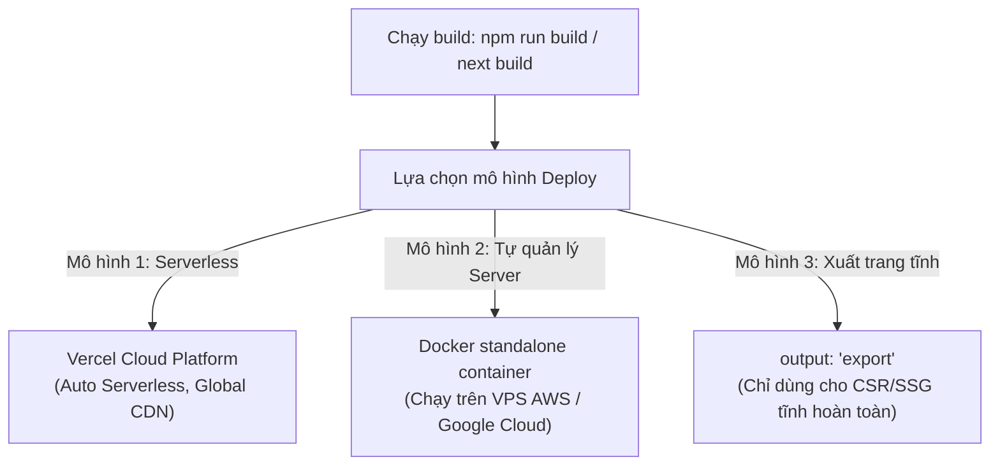

# Bài 12 - Deployment & Production (Triển khai & Sản phẩm hoá)

## I. KHÁI QUÁT (OVERVIEW)

### 1. Thử thách khi triển khai ứng dụng Next.js thực tế
Khác với ứng dụng React SPA thuần túy (vốn chỉ dịch ra các file tĩnh HTML/JS/CSS và có thể host cực kỳ dễ dàng trên bất kỳ hosting tĩnh nào như GitHub Pages, Netlify), Next.js là một **Framework Fullstack**:
*   Nó chứa các logic chạy ở máy chủ Server (Node.js) như Server Components, Server Actions, API Route Handlers, và Middleware.
*   Yêu cầu một máy chủ thực sự chạy ứng dụng 24/7 để lắng nghe các request.

Do đó, việc triển khai (deploy) Next.js đòi hỏi hiểu rõ các mô hình kiến trúc hạ tầng:
1.  **Vercel (Mô hình Serverless tối ưu nhất):** Nền tảng do chính đội ngũ sáng lập Next.js phát triển, hỗ trợ tối đa các tính năng tăng tốc CDN toàn cầu, tự động chuyển đổi API thành Serverless/Edge Functions.
2.  **Self-hosting với Docker (Mô hình tự quản lý máy chủ):** Thích hợp khi doanh nghiệp muốn tự cài đặt ứng dụng trên hạ tầng VPS (như AWS, DigitalOcean) bằng Docker để tiết kiệm chi phí và kiểm soát bảo mật nội bộ.



---

## II. CHI TIẾT KỸ THUẬT (DETAILED DEEP DIVE)

### 1. Mô hình Self-hosting bằng Docker Standalone
Khi tự xây dựng server riêng bằng Docker, Next.js hỗ trợ chế độ build **Standalone**:
*   Next.js sẽ tự động phân tích mã nguồn và đóng gói **chỉ những thư viện bắt buộc phải có** để chạy ứng dụng (loại bỏ toàn bộ các file rác, file devDependencies).
*   *Lợi ích:* Giảm kích thước Docker Image từ hơn 1GB xuống còn khoảng 100MB, tăng tốc thời gian khởi động container và tiết kiệm bộ nhớ RAM.

#### Cấu hình Standalone trong `next.config.js`:
```javascript
module.exports = {
  output: 'standalone', // Bật tính năng nén đóng gói độc lập cho Docker
}
```

---

### 2. Quản lý Biến môi trường (Environment Variables) an toàn
Next.js quản lý biến môi trường qua các file `.env`:
*   `DATABASE_URL`: Chứa tài khoản/mật khẩu DB $\rightarrow$ Chỉ tồn tại ở Server, tuyệt đối bảo mật.
*   `NEXT_PUBLIC_API_URL`: Có tiền tố `NEXT_PUBLIC_` $\rightarrow$ Next.js cho phép đóng gói và gửi giá trị này xuống trình duyệt client để JS sử dụng.

---

### 3. Quy chuẩn xuất bản tĩnh (Static Export)
Nếu ứng dụng của bạn không sử dụng bất kỳ tính năng động nào của server (không có SSR, không có Server Actions):
*   Bạn có thể cấu hình `output: 'export'` trong `next.config.js`.
*   Khi chạy lệnh build, Next.js sẽ xuất ra thư mục `/out` chứa 100% file tĩnh HTML/CSS/JS truyền thống $\rightarrow$ Dễ dàng đẩy lên mọi host tĩnh miễn phí.

---

## III. VÍ DỤ MINH HỌA VÀ PHÂN TÍCH CODE (CODE EXAMPLES & ANALYSIS)

### 1. Dockerfile chuẩn sản phẩm (Production-grade Dockerfile) cho Next.js Standalone
Dưới đây là một Dockerfile tối ưu đa tầng (Multi-stage build) tiêu chuẩn doanh nghiệp, chia quá trình cài đặt thành các pha: Cài dependencies $\rightarrow$ Biên dịch (Builder) $\rightarrow$ Đóng gói chạy thực tế (Runner) để đảm bảo kích thước Image nhỏ gọn nhất.

```dockerfile
# File: Dockerfile
# Stage 1: Cài đặt dependencies dựa trên package.json
FROM node:18-alpine AS deps
WORKDIR /app
RUN apk add --no-cache libc6-compat
COPY package.json package-lock.json ./
RUN npm ci

# Stage 2: Build dự án mã nguồn
FROM node:18-alpine AS builder
WORKDIR /app
COPY --from=deps /app/node_modules ./node_modules
COPY . .
# Chạy build Next.js
RUN npm run build

# Stage 3: Đóng gói gọn nhẹ để chạy thực tế
FROM node:18-alpine AS runner
WORKDIR /app

ENV NODE_ENV=production
# Khởi tạo user riêng để đảm bảo an toàn hệ thống (không chạy quyền root)
RUN addgroup --system --gid 1001 nodejs
RUN adduser --system --uid 1001 nextjs

# Chỉ copy các tệp tin standalone và thư mục public bắt buộc
COPY --from=builder /app/public ./public
COPY --from=builder --chown=nextjs:nodejs /app/.next/standalone ./
COPY --from=builder --chown=nextjs:nodejs /app/.next/static ./.next/static

USER nextjs

EXPOSE 3000
ENV PORT=3000
ENV HOSTNAME="0.0.0.0"

# Chạy server Node.js của bản build standalone trực tiếp
CMD ["node", "server.js"]
```

---

## IV. LƯU Ý, CẠM BẪY VÀ QUY TẮC CỐT LÕI (PITFALLS & BEST PRACTICES)

### 1. Cú pháp Đóng gói Standalone trong Next.js 19
Khi chạy Docker build với cấu hình standalone, tệp tin `server.js` được Next.js tự động tạo ra.
*   *Lưu ý:* Bản build standalone **không tự động copy thư mục `/public` và `/.next/static`** vào trong thư mục server vì mặc định các file này nên được phân phối bởi mạng lưới CDN ngoài hoặc web server Nginx đứng trước để giảm tải cho Node.js. Đoạn code Dockerfile ở trên đã xử lý việc này bằng cách copy thủ công các thư mục này sang.

---

## 💡 5 QUY TẮC VÀNG KHI DEPLOY NEXT.JS
1.  **Dùng Vercel cho các dự án khởi nghiệp:** Tiết kiệm thời gian quản trị hệ thống và tự động tối ưu hóa CDN toàn cầu.
2.  **Sử dụng Multi-stage Dockerfile cho Self-hosting:** Giảm dung lượng Image và tăng độ bảo mật hệ thống bằng cách chạy quyền non-root.
3.  **Bảo mật biến môi trường:** Tuyệt đối không đẩy các file chứa thông tin nhạy cảm dạng `.env.local` lên GitHub.
4.  **Chỉ dùng `NEXT_PUBLIC_` cho thông tin công khai:** Phòng tránh rò rỉ token hoặc mật khẩu database xuống trình duyệt của khách hàng.
5.  **Cấu hình Nginx làm Proxy đứng trước Docker:** Xử lý việc giải mã SSL, giới hạn băng thông (Rate Limiting) và phân phối các tệp tin tĩnh `/static` thay cho máy chủ Node.js để tối ưu hiệu năng.
