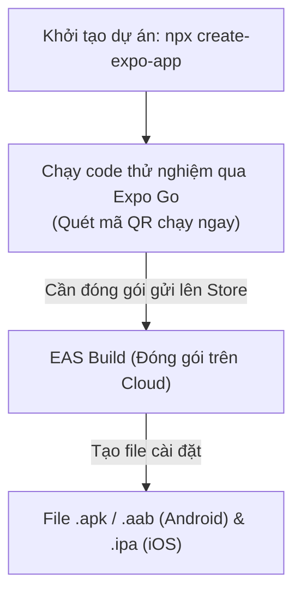

## I. KHÁI QUÁT (OVERVIEW)

### 1. Tại sao Expo trở thành tiêu chuẩn cho phát triển React Native?
Trước đây, việc khởi tạo một dự án React Native truyền thống (Bare Workflow) yêu cầu cài đặt và cấu hình thủ công rất phức tạp các công cụ phát triển gốc bao gồm **Android Studio** (Java/Kotlin Compiler) và **Xcode** (chỉ chạy trên macOS dùng để dịch mã Objective-C/Swift). Điều này cản trở lớn đối với các lập trình viên dùng hệ điều hành Windows/Linux muốn làm app iOS.

**Expo** là một nền tảng (framework) toàn diện xây dựng xoay quanh React Native:
*   Cung cấp bộ công cụ **EAS** (Expo Application Services) hỗ trợ đóng gói app iOS/Android hoàn toàn trên đám mây (cloud build) $\rightarrow$ Bạn có thể làm app iOS từ máy tính Windows/Linux.
*   Cung cấp ứng dụng **Expo Go** giúp chạy thử nghiệm app tức thì trên điện thoại thật chỉ bằng cách quét mã QR.
*   Cung cấp bộ thư viện SDK chuẩn hóa, được kiểm thử kỹ lưỡng cho mọi tính năng thiết bị (Camera, Notification, GPS...).



---

## II. CHI TIẾT KỸ THUẬT (DETAILED DEEP DIVE)

### 1. So sánh: Expo vs Bare React Native

| Tiêu chí | Expo (Managed Workflow hiện đại) | Bare React Native (Truyền thống) |
| :--- | :--- | :--- |
| **Cấu hình thư mục Native**| Tự động tạo và cập nhật ngầm qua `npx expo prebuild` | Có sẵn thư mục `/ios` và `/android` thủ công |
| **Yêu cầu Xcode (macOS)** | Không bắt buộc (nhờ dịch vụ EAS Cloud Build) | Bắt buộc phải có macOS để compile app iOS |
| **Hot Reload thử nghiệm** | Quét QR chạy tức thì qua Expo Go | Phải kết nối cáp, build code qua máy ảo Android/iOS |
| **Khả năng cài thư viện ngoài**| Hỗ trợ 100% tất cả thư viện (kể cả chứa code native) | Hỗ trợ 100% |
| **Độ phức tạp nâng cấp** | Rất thấp (chỉ cần cập nhật Expo SDK phiên bản mới) | Rất cao (dễ bị xung đột thư viện Gradle/Cocoapods) |

---

### 2. Cấu trúc file cấu hình `app.json` / `app.config.ts`
Đây là tệp tin cấu hình trung tâm định nghĩa các thông tin siêu dữ liệu (metadata) của ứng dụng di động:

```json
{
  "expo": {
    "name": "Cửa hàng Di động",
    "slug": "mobile-store",
    "version": "1.0.0",
    "orientation": "portrait", // Khóa xoay màn hình (chỉ hiển thị dọc)
    "icon": "./assets/icon.png",
    "userInterfaceStyle": "automatic", // Hỗ trợ đổi dark/light mode tự động
    "splash": {
      "image": "./assets/splash.png",
      "resizeMode": "contain",
      "backgroundColor": "#ffffff"
    },
    "ios": {
      "supportsTablet": true,
      "bundleIdentifier": "com.company.mobilestore" // ID định danh độc nhất trên App Store
    },
    "android": {
      "adaptiveIcon": {
        "foregroundImage": "./assets/adaptive-icon.png",
        "backgroundColor": "#ffffff"
      },
      "package": "com.company.mobilestore" // ID định danh độc nhất trên Google Play
    }
  }
}
```

---

## III. VÍ DỤ MINH HỌA VÀ PHÂN TÍCH CODE (CODE EXAMPLES & ANALYSIS)

### 1. Quy trình khởi tạo dự án Expo sử dụng Expo Router thế hệ mới
Dưới đây là các bước chuẩn chỉ để bắt đầu một dự án Expo hỗ trợ sẵn TypeScript và hệ thống định tuyến dựa trên file (file-based routing).

#### Bước 1: Khởi tạo dự án
```bash
npx create-expo-app@latest MyMobileApp --template tabs
```
*   *Lưu ý:* Template `tabs` sẽ tự động thiết lập sẵn Expo Router (tương tự App Router của Next.js) giúp quản lý các trang trên mobile cực kỳ tiện lợi.

#### Bước 2: Khởi chạy môi trường phát triển (Development Server)
```bash
cd MyMobileApp
npx expo start
```
*   Sau khi chạy lệnh, màn hình Terminal sẽ hiển thị một mã QR lớn.
*   **Chạy trên điện thoại thật:** Tải app **Expo Go** trên App Store hoặc Google Play, mở camera quét mã QR này $\rightarrow$ Dự án sẽ chạy trực tiếp trên điện thoại của bạn, hỗ trợ Fast Refresh (sửa code lưu lại màn hình tự cập nhật ngay).

#### Bước 3: Xem tệp cấu hình entry point cơ bản
Hệ thống Expo Router thế hệ mới sử dụng cấu trúc định tuyến thư mục `/app` giống hệt Next.js:

```tsx
// File: app/_layout.tsx (Layout cấu hình chung)
import { Stack } from 'expo-router';
import React from 'react';

export default function RootLayout() {
  return (
    // Stack Navigator quản lý các trang xếp chồng (đẩy trang mới lên đầu)
    <Stack>
      {/* Ẩn thanh header mặc định của trang chính */}
      <Stack.Screen name="index" options={{ headerShown: false }} />
      <Stack.Screen name="details" options={{ title: 'Chi tiết sản phẩm' }} />
    </Stack>
  );
}
```

```tsx
// File: app/index.tsx (Trang chủ chính)
import { View, Text, StyleSheet } from 'react-native';
import { Link } from 'expo-router';
import React from 'react';

export default function HomeScreen() {
  return (
    <View style={styles.container}>
      <Text style={styles.title}>Chào mừng tới Expo!</Text>
      {/* Nút bấm chuyển hướng sang trang details */}
      <Link href="/details" style={styles.link}>
        Xem chi tiết sản phẩm
      </Link>
    </View>
  );
}

const styles = StyleSheet.create({
  container: {
    flex: 1,
    alignItems: 'center',
    justifyContent: 'center',
    backgroundColor: '#fff',
  },
  title: {
    fontSize: 20,
    fontWeight: 'bold',
    color: '#333',
  },
  link: {
    marginTop: 15,
    color: '#007AFF',
    fontSize: 16,
  },
});
```

---

## IV. LƯU Ý, CẠM BẪY VÀ QUY TẮC CỐT LÕI (PITFALLS & BEST PRACTICES)

### 1. Cạm bẫy sử dụng thư viện native mà không chạy prebuild
*   **Vấn đề:** Khi bạn cài đặt một thư viện có chứa code native sâu (ví dụ Bluetooth, NFC) vào dự án Expo Managed Workflow.
*   **Hậu quả:** Ứng dụng Expo Go mặc định (được tải từ App Store) không chứa mã máy của các thư viện này và sẽ báo lỗi crash ngay khi bạn gọi tính năng.
*   ✅ *Best practice:* Thay vì sử dụng app Expo Go mặc định, hãy chạy lệnh **`npx expo run:android`** hoặc **`npx expo run:ios`** (hoặc dùng EAS Build Development Profile). Lệnh này sẽ kích hoạt cơ chế `expo prebuild` tạo ra thư mục native tạm thời và dịch toàn bộ code native thành một phiên bản app thử nghiệm tùy biến riêng (Development Build) chạy trên máy ảo hoặc thiết bị thật của bạn.

---

## 💡 5 QUY TẮC VÀNG VỀ SETUP EXPO
1.  **Dùng Expo Managed làm mặc định:** Không chuyển sang Bare Workflow trừ khi có yêu cầu bắt buộc can thiệp trực tiếp vào mã nguồn Java/Objective-C.
2.  **Sử dụng Expo Router cho hệ thống định tuyến:** Tận dụng tư duy file-system routing tương tự Next.js để quản lý trang web sạch sẽ.
3.  **Khai báo đúng thông tin `bundleIdentifier` / `package`:** Đặt định danh duy nhất theo cấu trúc tên ngược (ví dụ `com.dev.myapp`) ngay từ đầu để tránh lỗi khi đóng gói lên Store.
4.  **Tận dụng EAS Build Cloud:** Đóng gói ứng dụng di động an toàn và tiện lợi trên đám mây, giải phóng máy tính của bạn khỏi việc cài đặt Xcode nặng nề.
5.  **Dùng Development Builds cho thư viện chứa code native:** Không dùng Expo Go mặc định nếu dự án sử dụng các phần cứng đặc biệt của thiết bị.
