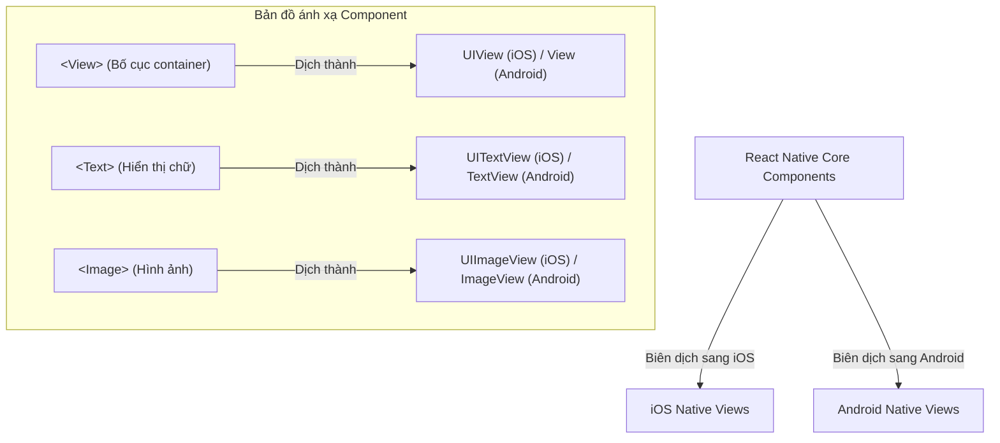

# Bài 03 - Core Components (Các thành phần cốt lõi)

## I. KHÁI QUÁT (OVERVIEW)

### 1. Tại sao không thể sử dụng thẻ HTML trong React Native?
Khi phát triển web bằng React, bạn sử dụng các thẻ HTML chuẩn (như `<div>`, `<span>`, `<p>`, ``) để dựng giao diện. Trình duyệt sẽ đọc các thẻ này và dịch thành DOM nodes.
Tuy nhiên, thiết bị di động iOS và Android **không có khái niệm DOM hay HTML**. Chúng quản lý giao diện dựa trên hệ thống các phần tử gốc (Native Views) của hệ điều hành (ví dụ: `UIView` trên iOS, `android.view.View` trên Android).

React Native cung cấp một bộ **Core Components** (các thành phần cốt lõi). Khi bạn viết code, React Native sẽ tự động đóng vai trò cầu nối dịch các component này thành các phần tử Native tương ứng của từng hệ điều hành.



---

## II. CHI TIẾT KỸ THUẬT (DETAILED DEEP DIVE)

### 1. Phân tích chi tiết các Core Components chủ lực

#### a. `<View>`
*   Component cơ bản nhất dùng để dựng layout, làm khung chứa (container) cho các phần tử khác, tương tự như thẻ `<div>` trên Web.
*   *Lưu ý:* Mọi layout của `<View>` đều sử dụng **Flexbox** làm mặc định và có hướng xếp dọc (`flex-direction: column`).

#### b. `<Text>`
*   Phần tử duy nhất cho phép hiển thị chữ trên mobile. Bạn không thể đặt chữ trần trụi trực tiếp trong `<View>`.
*   *Lưu ý:* Trái với Web nơi CSS font được kế thừa toàn bộ, trong React Native, các style liên quan đến font chữ chỉ kế thừa từ thẻ `<Text>` cha sang thẻ `<Text>` con, không kế thừa từ thẻ `<View>` sang thẻ `<Text>`.

#### c. Thao tác tương tác chạm: `<Pressable>` vs `<TouchableOpacity>`
*   Để bắt sự kiện click (gọi là `onPress` trên mobile), bạn phải bao bọc giao diện bên trong thẻ tương tác chạm.
    *   **`TouchableOpacity`**: Tự động giảm độ mờ (opacity) của phần tử khi người dùng chạm tay vào để tạo phản hồi thị giác.
    *   **`Pressable`**: Component thế hệ mới, linh hoạt hơn, cung cấp các trạng thái chạm chi tiết (`pressed`, `hovered`, `focused`) để bạn tự thiết kế các hiệu ứng tuỳ biến.

#### d. Quản lý vùng hiển thị an toàn: `<SafeAreaView>`
*   Trên các dòng điện thoại hiện đại (như iPhone có "tai thỏ" - Notch, hoặc các máy Android màn hình tràn viền), phần giao diện phía trên cùng có thể bị đè lên thanh trạng thái (StatusBar) hoặc phần dưới cùng bị đè lên thanh điều hướng hệ thống.
*   **`SafeAreaView`** tự động chèn thêm khoảng đệm padding để đẩy nội dung của bạn vào vùng hiển thị an toàn, tránh bị che khuất.

#### e. Tránh bị bàn phím che khuất: `<KeyboardAvoidingView>`
*   Khi người dùng click vào ô nhập liệu (`TextInput`) ở phía dưới màn hình, bàn phím ảo của điện thoại sẽ trồi lên. Nếu không xử lý, bàn phím sẽ đè lên ô input khiến người dùng không thể thấy chữ mình đang gõ.
*   **`KeyboardAvoidingView`** sẽ tự động tính toán kích thước bàn phím ảo và đẩy/co giãn giao diện của bạn lên phía trên một cách mượt mà.

---

## III. VÍ DỤ MINH HỌA VÀ PHÂN TÍCH CODE (CODE EXAMPLES & ANALYSIS)

### 1. Dựng màn hình Đăng nhập (Login Screen) tối ưu hiển thị bàn phím & vùng an toàn
Dưới đây là một màn hình đăng nhập thực tế kết hợp đầy đủ các component cốt lõi: `SafeAreaView`, `KeyboardAvoidingView`, `Image`, `TextInput`, và `Pressable`.

```tsx
// File: app/login.tsx
import React, { useState } from 'react';
import {
  StyleSheet,
  View,
  Text,
  TextInput,
  Image,
  Pressable,
  SafeAreaView,
  KeyboardAvoidingView,
  Platform,
  ActivityIndicator
} from 'react-native';

export default function LoginScreen() {
  const [email, setEmail] = useState('');
  const [password, setPassword] = useState('');
  const [loading, setLoading] = useState(false);

  const handleLogin = () => {
    setLoading(true);
    // Giả lập gọi API đăng nhập
    setTimeout(() => {
      setLoading(false);
      alert('Đăng nhập thành công!');
    }, 1500);
  };

  return (
    // 1. SafeAreaView bảo vệ vùng hiển thị sát tai thỏ và cạnh dưới
    <SafeAreaView style={styles.safeArea}>
      
      {/* 
        2. KeyboardAvoidingView đẩy giao diện lên khi bàn phím ảo trồi lên.
        Kiểu hành vi 'padding' phù hợp nhất cho iOS, 'height' phù hợp cho Android.
      */}
      <KeyboardAvoidingView
        behavior={Platform.OS === 'ios' ? 'padding' : 'height'}
        style={styles.container}
      >
        <View style={styles.innerContainer}>
          {/* Hình ảnh Logo (tải từ assets) */}
          <Image
            source={{ uri: 'https://images.example.com/logo.png' }}
            style={styles.logo}
            resizeMode="contain"
          />

          <Text style={styles.welcomeText}>Chào mừng quay trở lại!</Text>

          {/* Ô nhập liệu Email */}
          <View style={styles.inputContainer}>
            <TextInput
              style={styles.input}
              placeholder="Nhập email của bạn"
              placeholderTextColor="#94a3b8"
              value={email}
              onChangeText={setEmail} // React Native dùng onChangeText thay vì onChange
              keyboardType="email-address"
              autoCapitalize="none"
            />
          </View>

          {/* Ô nhập liệu Mật khẩu */}
          <View style={styles.inputContainer}>
            <TextInput
              style={styles.input}
              placeholder="Mật khẩu"
              placeholderTextColor="#94a3b8"
              value={password}
              onChangeText={setPassword}
              secureTextEntry // Thuộc tính ẩn chữ nhập mật khẩu
            />
          </View>

          {/* Nút Đăng nhập sử dụng Pressable tùy biến trạng thái */}
          <Pressable
            onPress={handleLogin}
            disabled={loading}
            style={({ pressed }) => [
              styles.button,
              pressed ? styles.buttonPressed : null,
              loading ? styles.buttonDisabled : null
            ]}
          >
            {loading ? (
              // Vòng xoay loading của hệ điều hành
              <ActivityIndicator color="#ffffff" />
            ) : (
              <Text style={styles.buttonText}>Đăng nhập</Text>
            )}
          </Pressable>
        </View>
      </KeyboardAvoidingView>
    </SafeAreaView>
  );
}

const styles = StyleSheet.create({
  safeArea: {
    flex: 1,
    backgroundColor: '#f8fafc',
  },
  container: {
    flex: 1,
  },
  innerContainer: {
    flex: 1,
    padding: 24,
    justifyContent: 'center',
    alignItems: 'center',
  },
  logo: {
    width: 120,
    height: 120,
    marginBottom: 24,
  },
  welcomeText: {
    fontSize: 22,
    fontWeight: 'bold',
    color: '#1e293b',
    marginBottom: 32,
  },
  inputContainer: {
    width: '100%',
    marginBottom: 16,
  },
  input: {
    width: '100%',
    height: 50,
    backgroundColor: '#ffffff',
    borderWidth: 1,
    borderColor: '#e2e8f0',
    borderRadius: 12,
    paddingHorizontal: 16,
    fontSize: 16,
    color: '#1e293b',
  },
  button: {
    width: '100%',
    height: 50,
    backgroundColor: '#2563eb',
    borderRadius: 12,
    alignItems: 'center',
    justifyContent: 'center',
    marginTop: 16,
  },
  buttonPressed: {
    opacity: 0.8,
  },
  buttonDisabled: {
    backgroundColor: '#93c5fd',
  },
  buttonText: {
    color: '#ffffff',
    fontSize: 16,
    fontWeight: 'bold',
  },
});
```

---

## IV. LƯU Ý, CẠM BẪY VÀ QUY TẮC CỐT LÕI (PITFALLS & BEST PRACTICES)

### 1. Cạm bẫy thiết lập kích thước cho ảnh từ URL mạng (Remote Images)
*   **Vấn đề:** Khi bạn tải ảnh từ một URL trên mạng (`uri`), nếu bạn không thiết lập thuộc tính `width` và `height` cố định trong style:
*   **Hậu quả:** Hình ảnh sẽ không hiển thị (kích thước mặc định là `0x0`).
*   *Lý do:* React Native không thể biết kích thước của ảnh trước khi tải về từ internet để tự co giãn layout giống như trình duyệt web.
*   ✅ *Best practice:* Luôn định nghĩa rõ chiều rộng và chiều cao cho ảnh mạng, hoặc dùng thư viện chuyên dụng như `expo-image` để có cơ chế cache ảnh nâng cao.

---

## 💡 5 QUY TẮC VÀNG VỀ CORE COMPONENTS
1.  **Luôn bọc text trong thẻ `<Text>`:** Tránh lỗi biên dịch crash app do đặt chữ trần trong thẻ `<View>`.
2.  **Thiết lập kích thước cụ thể cho ảnh mạng:** Tránh lỗi ảnh có kích thước 0x0 biến mất trên màn hình.
3.  **Dùng `SafeAreaView` cho các trang chính:** Bảo vệ giao diện khỏi bị lấn chiếm bởi tai thỏ và thanh trạng thái thiết bị.
4.  **Bọc `KeyboardAvoidingView` quanh Form nhập liệu:** Đảm bảo ô input luôn tự động nổi lên phía trên bàn phím ảo.
5.  **Dùng `Pressable` thay cho TouchableOpacity cũ:** Tận dụng tối đa khả năng tuỳ biến trạng thái chạm micro-interactions thế hệ mới của React Native.
