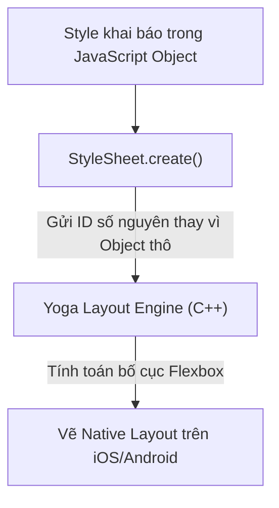

## I. KHÁI QUÁT (OVERVIEW)

### 1. Sự khác biệt về cách Styling trên Thiết bị di động
Styling trong React Native thoạt nhìn rất giống CSS trên Web (sử dụng các thuộc tính quen thuộc như `backgroundColor`, `borderRadius`, `padding`). Tuy nhiên, bản chất dưới hạ tầng hoàn toàn khác biệt:
*   **Không có tệp tin `.css`:** Bạn không thể viết file style ngoài hoặc nhúng thẻ `<style>`. Toàn bộ style được khai báo dưới dạng các đối tượng JavaScript thông qua API **`StyleSheet`**.
*   **Không có công cụ tìm kiếm CSS đầy đủ:** Không hỗ trợ các bộ chọn nâng cao (`:hover`, `:nth-child`, `#id`). Bạn chỉ gán style trực tiếp qua thuộc tính `style`.
*   **Hệ thống Layout dựa hoàn toàn trên Flexbox:** Layout của React Native được cung cấp bởi **Yoga Layout Engine** (viết bằng C++). Hệ thống này kế thừa phần lớn cơ chế Flexbox của web nhưng có một số điểm tinh chỉnh đặc thù phù hợp cho màn hình di động.



---

## II. CHI TIẾT KỸ THUẬT (DETAILED DEEP DIVE)

### 1. Tại sao nên dùng `StyleSheet.create()` thay vì Inline Styles?
Trong React Native, bạn có thể viết style trực tiếp: `<View style={{ padding: 10 }} />` (Inline style). Tuy nhiên, cách này có điểm yếu chí mạng về hiệu năng:
*   Mỗi lần component re-render, một đối tượng JavaScript mới `{ padding: 10 }` sẽ được tạo lại trong bộ nhớ RAM và gửi qua cầu nối JSI xuống phía Native để tính toán lại.
*   **`StyleSheet.create()`** giải quyết bằng cách đóng gói toàn bộ style, đăng ký chúng trực tiếp vào bộ nhớ của phía Native duy nhất 1 lần khi khởi động ứng dụng và trả về một **ID số nguyên (integer reference)** cực nhẹ sang phía JavaScript. Quá trình re-render sau này chỉ truyền ID này đi, giúp tiết kiệm bộ nhớ và tăng tốc độ xử lý UI.

---

### 2. Sự khác biệt của Flexbox trong React Native so với Web

| Thuộc tính | Trên Web | Trong React Native |
| :--- | :--- | :--- |
| **Hướng mặc định (`flex-direction`)** | `row` (ngang) | **`column` (dọc)** |
| **Giá trị của `flex`** | Có thể nhận 3 tham số (`grow shrink basis`) | Chỉ nhận duy nhất 1 số nguyên (ví dụ `flex: 1` sẽ kéo giãn hết chỗ trống) |
| **Đơn vị đo lường** | px, em, rem, % | **Không có đơn vị** (tự động quy đổi ra mật độ điểm ảnh độc lập - Density-independent Pixels - DP/DIP) |
| **Hộp chứa mặc định** | Mọi thẻ block | Mặc định là `display: flex`. Không hỗ trợ `display: grid` hay `inline-block`. |

---

### 3. Thiết kế Responsive đa màn hình & Đa nền tảng

#### a. Platform-specific Styling (Style theo hệ điều hành)
Để viết style riêng biệt cho iOS và Android (ví dụ: đổi font chữ hệ thống hoặc chỉnh bóng đổ):
```typescript
const styles = StyleSheet.create({
  card: {
    ...Platform.select({
      ios: {
        shadowColor: '#000',
        shadowOffset: { width: 0, height: 2 },
        shadowOpacity: 0.25,
      },
      android: {
        elevation: 5, // Android chỉ dùng duy nhất elevation để tạo bóng đổ
      }
    })
  }
});
```

#### b. Đo đạc kích thước màn hình động
*   **`useWindowDimensions` (Khuyên dùng):** Custom hook giúp lấy chiều rộng (`width`) và chiều cao (`height`) thực tế của màn hình điện thoại, tự động cập nhật lại giá trị khi người dùng xoay ngang/xoay dọc điện thoại.

---

## III. VÍ DỤ MINH HỌA VÀ PHÂN TÍCH CODE (CODE EXAMPLES & ANALYSIS)

### 1. Dựng Card sản phẩm hỗ trợ Responsive & Đa hệ điều hành
Dưới đây là một ví dụ hoàn chỉnh về cách dựng một Card sản phẩm có bóng đổ (shadow) hoạt động mượt mà trên cả iOS và Android, tự động co giãn kích thước dựa trên chiều rộng màn hình.

```tsx
// File: src/components/ProductCard.tsx
import React from 'react';
import { 
  StyleSheet, 
  View, 
  Text, 
  Image, 
  Platform, 
  useWindowDimensions 
} from 'react-native';

export const ProductCard: React.FC = () => {
  // Lấy chiều rộng màn hình động
  const { width } = useWindowDimensions();
  
  // Tính toán chiều rộng của card:
  // Nếu màn hình lớn (Tablet) thì card rộng bằng 45% màn hình (hiển thị 2 cột)
  // Nếu màn hình nhỏ (Mobile) thì card rộng 100% màn hình
  const isTablet = width > 600;
  const cardWidth = isTablet ? (width * 0.45) : (width - 32);

  return (
    <View style={[styles.card, { width: cardWidth }]}>
      <Image
        source={{ uri: 'https://images.example.com/phone.jpg' }}
        style={styles.image}
      />
      <View style={styles.content}>
        <Text style={styles.category}>THIẾT BỊ DI ĐỘNG</Text>
        <h4 style={styles.title}>Điện thoại thông minh AI</h4>
        <Text style={styles.price}>24.000.000đ</Text>
      </View>
    </View>
  );
};

const styles = StyleSheet.create({
  card: {
    backgroundColor: '#ffffff',
    borderRadius: 16,
    margin: 8,
    overflow: Platform.OS === 'android' ? 'hidden' : 'visible', // Android cần hidden để bo góc ảnh con
    
    // 1. Xử lý bóng đổ đa nền tảng
    ...Platform.select({
      ios: {
        shadowColor: '#0f172a',
        shadowOffset: { width: 0, height: 4 },
        shadowOpacity: 0.1,
        shadowRadius: 12,
      },
      android: {
        elevation: 4, // Thuộc tính bóng đổ độc quyền của Android
      }
    })
  },
  image: {
    width: '100%',
    height: 180,
    borderTopLeftRadius: 16,
    borderTopRightRadius: 16,
  },
  content: {
    padding: 16,
  },
  category: {
    fontSize: 11,
    fontWeight: 'bold',
    color: '#3b82f6',
    letterSpacing: 0.5,
  },
  title: {
    fontSize: 16,
    fontWeight: '700',
    color: '#1e293b',
    marginTop: 6,
  },
  price: {
    fontSize: 15,
    fontWeight: 'bold',
    color: '#10b981',
    marginTop: 8,
  }
});
```

---

## IV. LƯU Ý, CẠM BẪY VÀ QUY TẮC CỐT LÕI (PITFALLS & BEST PRACTICES)

### 1. Cạm bẫy sử dụng đơn vị phần trăm (%) sai ngữ cảnh
*   **Vấn đề:** Thiết lập `width: '50%'` cho một phần tử con mà không định nghĩa chiều rộng cụ thể cho phần tử cha chứa nó.
*   **Hậu quả:** Giao diện bị co về kích thước 0 hoặc bị vỡ layout ngoài mong muốn.
*   *Giải thích:* Yoga Engine tính toán phần trăm hoàn toàn phụ thuộc vào kích thước của container cha trực tiếp.
*   ✅ *Best practice:* Sử dụng hook `useWindowDimensions` để tính toán chính xác kích thước pixel động thay vì lạm dụng phần trăm chuỗi.

---

## 💡 5 QUY TẮC VÀNG VỀ STYLING TRONG REACT NATIVE
1.  **Luôn khai báo style bằng `StyleSheet.create()`:** Tối ưu hóa bộ nhớ RAM và tốc độ truyền ID qua JSI Bridge.
2.  **Nhớ rằng Flexbox mặc định xếp Dọc (`column`):** Luôn thêm `flex-direction: 'row'` nếu muốn xếp ngang các phần tử con.
3.  **Tách biệt thuộc tính bóng đổ (Shadow) theo OS:** Dùng `elevation` cho Android và tổ hợp `shadowColor`/`shadowOpacity` cho iOS.
4.  **Dùng `useWindowDimensions` cho layout responsive:** Cập nhật chính xác kích thước khi xoay màn hình thiết bị.
5.  **Bo góc thẻ Ảnh an toàn:** Trên Android, thẻ con `<Image>` có thể chồi góc ra ngoài hộp cha `<View>` đã bo góc. Hãy gán `overflow: 'hidden'` cho hộp cha để cắt bỏ phần thừa.
