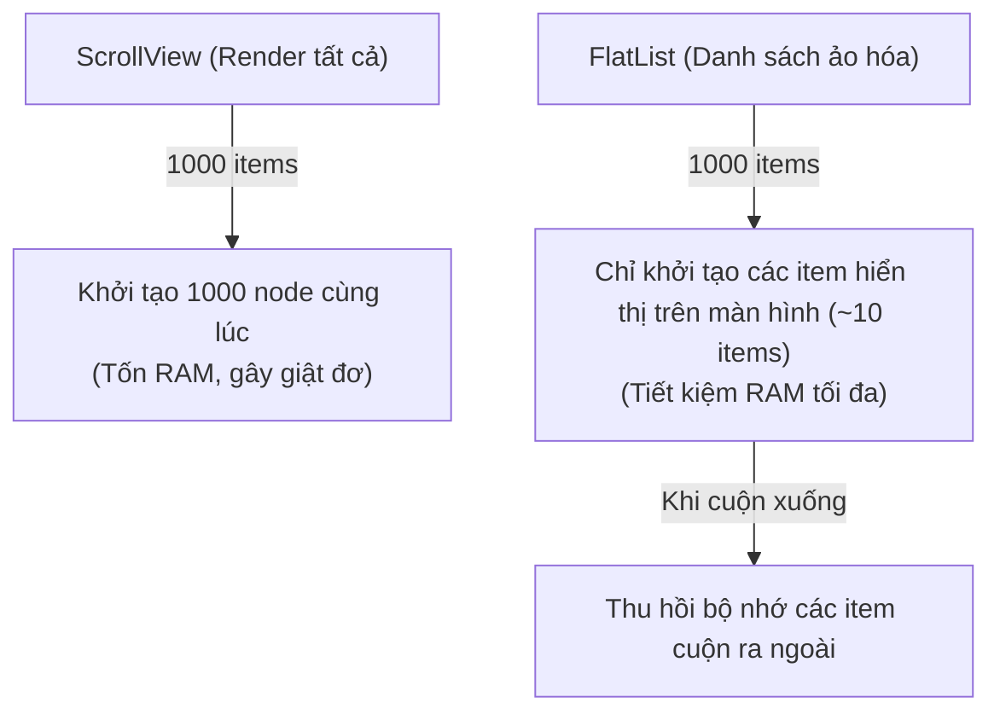

## I. KHÁI QUÁT (OVERVIEW)

### 1. Tại sao không được sử dụng map() hoặc ScrollView cho danh sách dài?
Trong phát triển web, để hiển thị danh sách, bạn thường dùng hàm `map()` để render ra hàng loạt thẻ `<li>` nằm trong một container cuộn.
Nếu bạn làm như vậy trên thiết bị di động (sử dụng component `<ScrollView>` và vòng lặp `map` để render 1.000 items):
*   **Hậu quả sập nguồn / đơ ứng dụng:** Máy ảo hoặc điện thoại thật sẽ bị đóng băng (crash) ngay lập tức hoặc giật lag nghiêm trọng khi cuộn.
*   *Lý do:* `<ScrollView>` sẽ khởi tạo và render **toàn bộ 1,000 items** vào bộ nhớ RAM ngay khi tải trang, bất kể người dùng chỉ nhìn thấy 5 items đầu tiên trên màn hình. Thiết bị di động có dung lượng RAM rất giới hạn và không thể tải nổi lượng lớn DOM nodes như vậy.

**`FlatList`** (và cơ chế **Virtualized List - Danh sách ảo hóa**) ra đời để giải quyết bài toán hiệu năng này bằng cách chỉ render các phần tử đang hiển thị trên màn hình và giải phóng (unmount) các phần tử đã cuộn ra ngoài khu vực nhìn thấy.



---

## II. CHI TIẾT KỸ THUẬT (DETAILED DEEP DIVE)

### 1. Cơ chế hoạt động của Virtualized List
Virtualized List duy trì một cửa sổ hiển thị (**Window**):
1.  **Khu vực hiển thị (Viewport):** Các item hiển thị thực tế trên màn hình (được render đầy đủ).
2.  **Khu vực đệm (Buffer Area):** Một vài item nằm ngay phía trên và phía dưới viewport để đảm bảo khi người dùng cuộn nhanh, giao diện vẫn hiển thị kịp thời.
3.  **Khu vực ảo hóa (Virtualized Area):** Các phần tử nằm ngoài buffer area sẽ bị thay thế bằng các khoảng trống có chiều cao tương ứng (bị unmount khỏi bộ nhớ).

---

### 2. Các tham số cấu hình tối ưu hiệu năng của `FlatList`
Để tinh chỉnh FlatList hoạt động mượt mà ở mức 60 FPS, bạn cần cấu hình các props:

*   **`initialNumToRender`**: Số lượng item tối thiểu cần render ở lượt đầu tiên (nên đặt vừa đủ lấp đầy màn hình để tải trang nhanh nhất).
*   **`maxToRenderPerBatch`**: Số lượng item tối đa được render thêm ở mỗi đợt cuộn (batch). Đặt số lượng quá lớn sẽ gây giật màn hình khi cuộn nhanh.
*   **`windowSize`**: Tổng kích thước cửa sổ đệm (tính theo tỷ lệ chiều cao màn hình). Ví dụ: `windowSize={21}` có nghĩa là render 10 màn hình phía trên, 1 màn hình hiển thị, và 10 màn hình phía dưới. Nên giảm xuống `5` hoặc `7` cho thiết bị yếu.
*   **`getItemLayout`**: Nếu danh sách của bạn có kích thước các item cố định (ví dụ mọi hàng đều cao đúng 80px), hãy khai báo hàm này.
    *   *Ý nghĩa:* Giúp FlatList bỏ qua bước tính toán kích thước động của các node DOM ảo, tăng tốc độ cuộn lên gấp nhiều lần.

---

### 3. Giải pháp thế hệ mới: Shopify FlashList
Mặc dù FlatList rất tốt, nó vẫn gặp lỗi hiển thị khoảng trắng (blank areas) khi người dùng vuốt cuộn cực kỳ nhanh.
*   **FlashList (của Shopify):** Thay vì unmount hoàn toàn phần tử ra khỏi bộ nhớ, FlashList thực hiện **tái chế (Recycling)** các DOM node cũ. Khi một item cuộn lên trên, nó không bị xóa đi mà được đưa xuống dưới, chỉ thay đổi ruột dữ liệu mới vào $\rightarrow$ Hiệu năng nhanh gấp 5-10 lần FlatList, loại bỏ hoàn toàn khoảng trắng khi cuộn.

---

## III. VÍ DỤ MINH HỌA VÀ PHÂN TÍCH CODE (CODE EXAMPLES & ANALYSIS)

### 1. Triển khai FlatList tối ưu hoá tuyệt đối cho Danh mục Sản phẩm
Dưới đây là một ví dụ thực tế sử dụng FlatList với các tùy chọn cấu hình hiệu năng cao, hàm `getItemLayout` cố định chiều cao và tối ưu hóa hàm renderItem.

```tsx
// File: src/components/ProductList.tsx
import React, { useCallback } from 'react';
import { 
  FlatList, 
  View, 
  Text, 
  StyleSheet, 
  ActivityIndicator 
} from 'react-native';

interface Product {
  id: string;
  title: string;
  price: string;
}

const ITEM_HEIGHT = 80; // Thiết lập chiều cao cố định cho mỗi hàng

// Component con hiển thị từng hàng, dùng React.memo để tránh re-render thừa
const ProductRow = React.memo(({ item }: { item: Product }) => {
  return (
    <View style={styles.itemContainer}>
      <Text style={styles.title}>{item.title}</Text>
      <Text style={styles.price}>{item.price}</Text>
    </View>
  );
});

export const ProductList: React.FC = () => {
  // Giả lập 500 sản phẩm
  const products: Product[] = Array.from({ length: 500 }, (_, i) => ({
    id: `p_${i}`,
    title: `Sản phẩm chất lượng cao #${i + 1}`,
    price: `${(100000 + i * 5000).toLocaleString('vi-VN')}đ`
  }));

  // 1. Sử dụng useCallback để giữ ổn định hàm renderItem
  const renderItem = useCallback(({ item }: { item: Product }) => {
    return <ProductRow item={item} />;
  }, []);

  // 2. Sử dụng getItemLayout để bỏ qua bước đo đạc kích thước động của hàng
  const getItemLayout = useCallback((data: any, index: number) => ({
    length: ITEM_HEIGHT,
    offset: ITEM_HEIGHT * index,
    index,
  }), []);

  return (
    <FlatList
      data={products}
      renderItem={renderItem}
      keyExtractor={(item) => item.id} // Tránh dùng index làm key
      
      // Cấu hình tối ưu hiệu năng
      getItemLayout={getItemLayout}
      initialNumToRender={10} // Đủ lấp đầy màn hình ban đầu
      maxToRenderPerBatch={5}  // Chỉ load thêm 5 cái mỗi đợt cuộn
      windowSize={5}           // Thu hẹp cửa sổ đệm để tiết kiệm RAM trên máy yếu
      
      // Pull-to-refresh (Kéo xuống để cập nhật)
      onRefresh={() => console.log('Đang làm mới dữ liệu...')}
      refreshing={false}
      
      // Phụ lục cuối trang
      ListFooterComponent={<ActivityIndicator size="small" style={{ margin: 16 }} />}
    />
  );
};

const styles = StyleSheet.create({
  itemContainer: {
    height: ITEM_HEIGHT, // Khóa chiều cao cố định
    paddingHorizontal: 16,
    justifyContent: 'center',
    borderBottomWidth: 1,
    borderBottomColor: '#f1f5f9',
    backgroundColor: '#ffffff',
  },
  title: {
    fontSize: 15,
    fontWeight: '600',
    color: '#1e293b',
  },
  price: {
    fontSize: 13,
    color: '#10b981',
    marginTop: 4,
  }
});
```

---

## IV. LƯU Ý, CẠM BẪY VÀ QUY TẮC CỐT LÕI (PITFALLS & BEST PRACTICES)

### 1. Viết trực tiếp hàm ẩn danh (Anonymous Function) trong `renderItem`
*   ❌ *Anti-pattern:*
    ```tsx
    <FlatList renderItem={({ item }) => <MyComponent item={item} />} />
    ```
*   **Hậu quả:** Hàm ẩn danh bị tạo mới địa chỉ vùng nhớ ở mỗi lần component cha re-render. Việc này làm phá vỡ hoàn toàn cơ chế tối ưu hóa của FlatList, ép buộc toàn bộ danh sách phải tính toán lại.
*   ✅ *Best practice:* Định nghĩa hàm renderItem bằng `useCallback` hoặc viết nó ra ngoài phạm vi của hàm Component cha.

---

## 💡 5 QUY TẮC VÀNG VỀ HIỆU NĂNG DANH SÁCH
1.  **Bắt buộc dùng `keyExtractor`:** Sử dụng ID độc nhất không đổi để định danh phần tử trên danh sách ảo hóa.
2.  **Khóa chiều cao bằng `getItemLayout`:** Tăng tốc độ cuộn gấp nhiều lần cho danh sách có chiều cao hàng cố định.
3.  **Bọc `React.memo` cho hàng con (`renderItem`):** Ngăn chặn re-render dây chuyền khi danh sách bị biến động.
4.  **Hàm renderItem phải ổn định vùng nhớ:** Sử dụng `useCallback` để giữ địa chỉ hàm renderItem không đổi.
5.  **Cân nhắc chuyển sang Shopify FlashList:** Cho các danh sách lớn phức tạp để tận dụng cơ chế tái sử dụng DOM node siêu mượt.
