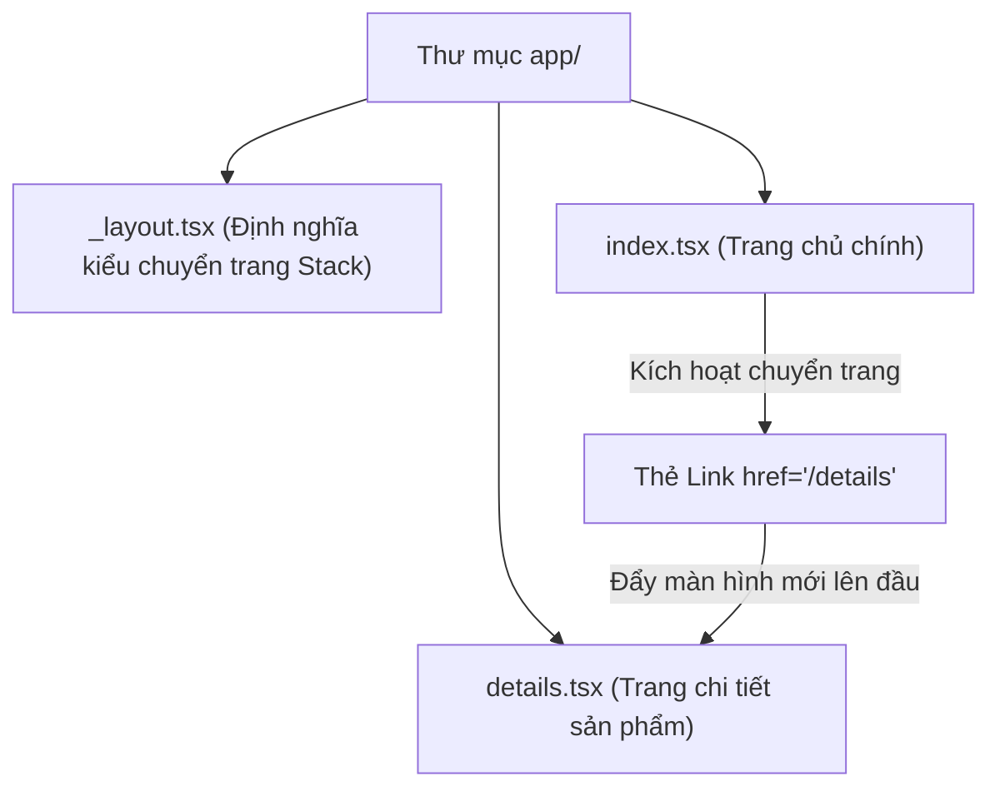

# Bài 06 - Navigation with Expo Router (Điều hướng với Expo Router)

## I. KHÁI QUÁT (OVERVIEW)

### 1. Tại sao Expo Router trở thành cuộc cách mạng định tuyến trên di động?
Trước đây, thư viện định tuyến tiêu chuẩn cho React Native là `React Navigation`. Nó yêu cầu bạn khai báo thủ công các màn hình bằng JavaScript dạng lồng nhau rất cồng kềnh và khó quản lý URL (Deep Linking).

**Expo Router** mang cơ chế **File-system Routing (Định tuyến dựa trên thư mục)** quen thuộc của các Framework Web (như Next.js) vào thế giới di động:
*   Mỗi tệp tin trong thư mục `/app` tự động trở thành một màn hình (Screen) của ứng dụng di động.
*   Cung cấp cơ chế Deep Linking tự động (nhấp vào một liên kết từ web ngoài sẽ tự động mở chính xác màn hình tương ứng bên trong app di động).
*   Quản lý các kiểu chuyển đổi màn hình di động phổ biến (Tabs, Stack, Drawer) bằng cấu trúc phân cấp thư mục trực quan.



---

## II. CHI TIẾT KỸ THUẬT (DETAILED DEEP DIVE)

### 1. Các kiểu cấu hình Navigator cơ bản

Để điều hướng trên di động, Expo Router cung cấp 3 bộ điều phối chính:
1.  **`Stack` (Trượt xếp chồng):** Các màn hình mới được trượt và đè lên màn hình cũ (phổ biến nhất, ví dụ: từ Danh sách bấm vào Chi tiết sản phẩm).
2.  **`Tabs` (Thanh điều hướng dưới):** Chuyển đổi qua lại giữa các trang chính bằng thanh menu ở cạnh dưới màn hình (Bottom Navigation).
3.  **`Drawer` (Trượt bên hông):** Menu trượt ẩn/hiển thị từ mép trái/phải màn hình.

---

### 2. Các quy ước file định tuyến trong Expo Router
*   **`_layout.tsx`**: Khai báo bộ khung layout chung cho thư mục hiện tại. Dùng để định nghĩa kiểu Navigator (Stack hay Tabs).
*   **`index.tsx`**: Trang mặc định hiển thị của thư mục đó (URL `/`).
*   **`[id].tsx`**: Trang động bắt tham số URL (Dynamic Route, ví dụ `/product/123`).

---

## III. VÍ DỤ MINH HỌA VÀ PHÂN TÍCH CODE (CODE EXAMPLES & ANALYSIS)

### 1. Thiết lập cấu trúc Tabs kết hợp Stack lồng nhau
Dưới đây là một dự án thực tế kết hợp: Thanh Tabs chính ở dưới (gồm 2 Tab: Trang chủ và Cài đặt). Khi ở Trang chủ, nếu bấm vào sản phẩm, hệ thống sẽ đẩy lên một màn hình chi tiết dạng Stack đè lên trên.

#### Cấu trúc thư mục:
```text
app/
├── _layout.tsx         (Layout gốc, cấu hình Stack tổng thể)
└── (tabs)/             (Nhóm Tabs không đổi URL)
    ├── _layout.tsx     (Cấu hình thanh Bottom Tab Navigation)
    ├── index.tsx       (Tab Trang chủ: hiển thị danh sách sản phẩm)
    ├── settings.tsx    (Tab Cài đặt)
    └── details.tsx     (Trang chi tiết sản phẩm dạng Stack đè lên)
```

#### File: `/app/_layout.tsx` (Layout gốc)
```tsx
import { Stack } from 'expo-router';
import React from 'react';

export default function RootLayout() {
  return (
    // Stack ngoài cùng chứa toàn bộ ứng dụng
    <Stack screenOptions={{ headerShown: true }}>
      {/* Ẩn header của nhóm tabs để tabs tự quản lý header riêng */}
      <Stack.Screen name="(tabs)" options={{ headerShown: false }} />
      {/* Cấu hình màn hình chi tiết trượt đè lên */}
      <Stack.Screen name="details" options={{ title: 'Chi tiết sản phẩm' }} />
    </Stack>
  );
}
```

#### File: `/app/(tabs)/_layout.tsx` (Bottom Tabs Layout)
```tsx
import { Tabs } from 'expo-router';
import React from 'react';
import { Platform } from 'react-native';

export default function TabsLayout() {
  return (
    <Tabs screenOptions={{
      tabBarActiveTintColor: '#2563eb', // Màu xanh khi tab được chọn
      tabBarStyle: {
        backgroundColor: '#ffffff',
        borderTopWidth: 1,
        borderTopColor: '#e2e8f0',
      }
    }}>
      <Tabs.Screen 
        name="index" 
        options={{ 
          title: 'Trang chủ',
          headerTitle: 'Danh sách sản phẩm'
        }} 
      />
      <Tabs.Screen 
        name="settings" 
        options={{ 
          title: 'Cài đặt',
          headerTitle: 'Cấu hình hệ thống'
        }} 
      />
    </Tabs>
  );
}
```

#### File: `/app/(tabs)/index.tsx` (Tab Trang chủ & Chuyển trang)
```tsx
import React from 'react';
import { StyleSheet, View, Text } from 'react-native';
import { Link, useRouter } from 'expo-router';

export default function HomeScreen() {
  const router = useRouter();

  return (
    <View style={styles.container}>
      <Text style={styles.title}>Trang chủ</Text>
      
      {/* Cách 1: Chuyển trang bằng thẻ Link (Chuẩn SEO & Deep Linking) */}
      <Link 
        href={{
          pathname: "/details",
          params: { id: "sp_iphone_15", name: "iPhone 15 Pro" }
        }} 
        style={styles.link}
      >
        Xem sản phẩm iPhone 15 Pro
      </Link>

      {/* Cách 2: Chuyển trang bằng hàm programmatic chuyển hướng */}
      <Text 
        onPress={() => {
          router.push({
            pathname: "/details",
            params: { id: "sp_macbook", name: "MacBook Air M3" }
          });
        }}
        style={styles.buttonText}
      >
        Xem Macbook Air M3 (Chuyển trang qua code)
      </Text>
    </View>
  );
}

const styles = StyleSheet.create({
  container: {
    flex: 1,
    alignItems: 'center',
    justifyContent: 'center',
    backgroundColor: '#f8fafc',
  },
  title: {
    fontSize: 20,
    fontWeight: 'bold',
    color: '#1e293b',
  },
  link: {
    marginTop: 20,
    color: '#2563eb',
    fontSize: 16,
    textDecorationLine: 'underline',
  },
  buttonText: {
    marginTop: 20,
    color: '#10b981',
    fontSize: 16,
    fontWeight: '600',
  }
});
```

#### File: `/app/details.tsx` (Màn hình Chi tiết - Đọc tham số)
```tsx
import React from 'react';
import { StyleSheet, View, Text } from 'react-native';
import { useLocalSearchParams } from 'expo-router';

export default function DetailsScreen() {
  // Đọc các tham số được truyền qua URL
  const { id, name } = useLocalSearchParams<{ id: string; name: string }>();

  return (
    <View style={styles.container}>
      <Text style={styles.title}>Mã sản phẩm: {id}</Text>
      <Text style={styles.subtitle}>Tên sản phẩm: {name}</Text>
    </View>
  );
}

const styles = StyleSheet.create({
  container: {
    flex: 1,
    alignItems: 'center',
    justifyContent: 'center',
    backgroundColor: '#ffffff',
  },
  title: {
    fontSize: 18,
    fontWeight: 'bold',
    color: '#1e293b',
  },
  subtitle: {
    fontSize: 16,
    color: '#64748b',
    marginTop: 8,
  }
});
```

---

## IV. LƯU Ý, CẠM BẪY VÀ QUY TẮC CỐT LÕI (PITFALLS & BEST PRACTICES)

### 1. Cạm bẫy lỗi Deep Linking khi chuyển hướng qua lại giữa các Stack lồng nhau
*   **Vấn đề:** Nếu bạn sử dụng hàm `router.push('/details')` nhưng màn hình `/details` nằm ở ngoài luồng khai báo phân cấp Navigator hiện tại.
*   **Hậu quả:** Ứng dụng sẽ báo lỗi không tìm thấy đường dẫn hoặc tự động chuyển hướng sai vị trí.
*   ✅ *Best practice:* Luôn khai báo cấu trúc phân cấp cây định tuyến rõ ràng ở các file `_layout.tsx` cha. Sử dụng chính xác định danh đường dẫn tương quan `/details` thay vì đường dẫn động sai cấu trúc.

---

## 💡 5 QUY TẮC VÀNG VỀ EXPO ROUTER
1.  **Sử dụng cấu trúc thư mục sạch:** Quản lý các nhóm định tuyến không ảnh hưởng URL bằng cách sử dụng dấu ngoặc đơn, ví dụ `(tabs)`.
2.  **Khai báo `_layout.tsx` cho từng nhóm:** Quản lý độc lập tiêu đề, màu sắc của từng Navigator con (Stack/Tabs).
3.  **Dùng `Link` cho mọi liên kết thông thường:** Giúp tự động cấu hình Deep Linking cho các liên kết từ bên ngoài vào app.
4.  **Đọc tham số bằng `useLocalSearchParams`:** Đảm bảo kiểu dữ liệu an toàn khi lấy các biến động từ URL.
5.  **Ẩn Header của Layout lồng:** Luôn thiết lập `headerShown: false` ở các màn hình con đóng vai trò layout bọc để tránh hiển thị 2 thanh Header trùng nhau trên màn hình.
