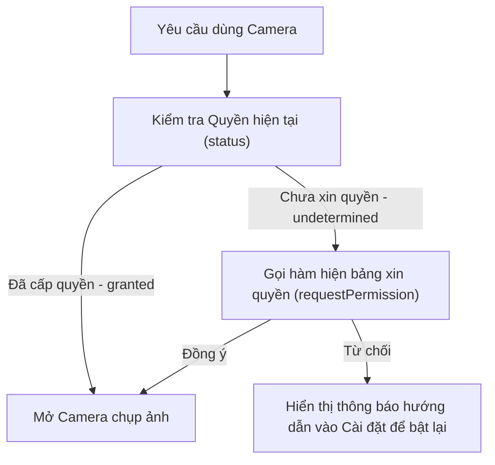

# Bài 07 - Native APIs & Device Features (API Native & Tính năng thiết bị)

## I. KHÁI QUÁT (OVERVIEW)

### 1. Bản chất của việc tương tác phần cứng Thiết bị
Một ứng dụng di động thực thụ luôn cần giao tiếp trực tiếp với phần cứng của điện thoại để đem lại trải nghiệm hữu ích:
*   Chụp ảnh bằng **Camera**.
*   Định vị vị trí bằng **GPS (Location)**.
*   Theo dõi hoạt động vuốt, lắc bằng các cảm biến **Accelerometer (Gia tốc kế)** và **Gyroscope (Cảm biến con quay hồi chuyển)**.
*   Nhận thông báo **Local Notifications**.

#### Thách thức về bảo mật của Hệ điều hành di động (Android & iOS):
Khác với môi trường Web (nơi phần lớn API mở hoặc chỉ cần xác nhận đơn giản), hệ điều hành di động bảo vệ quyền riêng tư người dùng cực kỳ nghiêm ngặt. 
1.  **Khai báo tĩnh:** Bạn phải khai báo rõ mục đích sử dụng phần cứng trong file cấu hình (ví dụ: mô tả tại sao app cần truy cập Camera để Apple duyệt app).
2.  **Xin quyền động (Runtime Permissions):** Khi app đang chạy, bạn phải chủ động gọi hàm hiện bảng thông báo để người dùng đồng ý cấp quyền, nếu không app sẽ bị từ chối truy cập phần cứng và crash lập tức.



---

## II. CHI TIẾT KỸ THUẬT (DETAILED DEEP DIVE)

### 1. Mô hình quản lý Quyền của Expo SDK
Mọi module phần cứng trong Expo SDK đều tuân thủ một mô hình trạng thái quyền chuẩn gồm 3 giá trị (`PermissionStatus`):
1.  **`UNDETERMINED`**: Người dùng chưa từng được hỏi xin quyền đối với tính năng này.
2.  **`GRANTED`**: Người dùng đã nhấn đồng ý cấp quyền $\rightarrow$ Có thể gọi API phần cứng.
3.  **`DENIED`**: Người dùng đã nhấn từ chối cấp quyền. Ở trạng thái này, nếu bạn gọi hàm xin quyền tiếp, hệ điều hành sẽ chặn không hiển thị bảng popup nữa. Bạn phải hướng dẫn người dùng vào mục Cài đặt (Settings) của điện thoại để bật lại thủ công.

---

### 2. Các module phần cứng chủ lực trong Expo SDK
*   **`expo-camera`**: Mở khung ngắm camera, quay phim, chụp ảnh, quét mã QR.
*   **`expo-image-picker`**: Mở thư viện ảnh của điện thoại để người dùng chọn ảnh có sẵn.
*   **`expo-location`**: Đọc toạ độ vĩ độ/kinh độ (Latitude/Longitude) hiện tại từ chip GPS và theo dõi vị trí ngầm (Background Location).
*   **`expo-notifications`**: Quản lý việc gửi và nhận thông báo đẩy (Push/Local Notifications).

---

## III. VÍ DỤ MINH HỌA VÀ PHÂN TÍCH CODE (CODE EXAMPLES & ANALYSIS)

### 1. Triển khai chức năng Chụp ảnh & Đọc toạ độ GPS của Thiết bị
Dưới đây là một ví dụ thực tế tích hợp cả `expo-image-picker` và `expo-location` để cho phép người dùng bấm nút chụp ảnh và tự động đính kèm toạ độ địa lý GPS hiện tại vào dữ liệu.

```tsx
// File: src/components/CaptureWidget.tsx
import React, { useState } from 'react';
import { 
  StyleSheet, 
  View, 
  Text, 
  Image, 
  Pressable, 
  ActivityIndicator, 
  Alert 
} from 'react-native';
import * as ImagePicker from 'expo-image-picker';
import * as Location from 'expo-location';

export const CaptureWidget: React.FC = () => {
  const [imageUri, setImageUri] = useState<string | null>(null);
  const [coords, setCoords] = useState<{ latitude: number; longitude: number } | null>(null);
  const [loading, setLoading] = useState(false);

  // 1. Hàm chụp ảnh bằng Camera
  const handleTakePhoto = async () => {
    // Xin quyền truy cập Camera của hệ thống
    const cameraPermission = await ImagePicker.requestCameraPermissionsAsync();
    
    if (cameraPermission.status !== ImagePicker.PermissionStatus.GRANTED) {
      Alert.alert('Từ chối quyền', 'Bạn cần cấp quyền truy cập Camera để chụp ảnh.');
      return;
    }

    // Mở Camera
    const result = await ImagePicker.launchCameraAsync({
      mediaTypes: ['images'],
      allowsEditing: true, // Cho phép cắt ảnh (crop)
      aspect: [4, 3],
      quality: 0.8, // Nén chất lượng ảnh về 80% để giảm dung lượng tải
    });

    if (!result.canceled) {
      setImageUri(result.assets[0].uri);
    }
  };

  // 2. Hàm đọc toạ độ GPS hiện tại
  const handleGetLocation = async () => {
    setLoading(true);
    // Xin quyền truy cập GPS của hệ thống
    const { status } = await Location.requestForegroundPermissionsAsync();
    
    if (status !== 'granted') {
      Alert.alert('Từ chối quyền', 'Bạn cần cấp quyền vị trí để lấy tọa độ.');
      setLoading(false);
      return;
    }

    try {
      // Đọc toạ độ với độ chính xác cao
      const currentLocation = await Location.getCurrentPositionAsync({
        accuracy: Location.LocationAccuracy.High
      });
      setCoords({
        latitude: currentLocation.coords.latitude,
        longitude: currentLocation.coords.longitude
      });
    } catch (error) {
      Alert.alert('Lỗi', 'Không thể lấy được vị trí hiện tại.');
    } finally {
      setLoading(false);
    }
  };

  return (
    <View style={styles.container}>
      <h3 style={styles.header}>Check-in Vị trí</h3>

      {/* Hiển thị ảnh chụp */}
      {imageUri ? (
        <Image source={{ uri: imageUri }} style={styles.image} />
      ) : (
        <View style={styles.placeholder}><Text style={{ color: '#64748b' }}>Chưa có ảnh</Text></View>
      )}

      {/* Hiển thị toạ độ */}
      {coords && (
        <Text style={styles.coordsText}>
          Tọa độ: {coords.latitude.toFixed(6)}, {coords.longitude.toFixed(6)}
        </Text>
      )}

      <View style={styles.buttonGroup}>
        <Pressable onPress={handleTakePhoto} style={styles.button}>
          <Text style={styles.buttonText}>Chụp ảnh</Text>
        </Pressable>

        <Pressable onPress={handleGetLocation} style={[styles.button, styles.btnLocation]} disabled={loading}>
          {loading ? (
            <ActivityIndicator color="#ffffff" />
          ) : (
            <Text style={styles.buttonText}>Lấy vị trí</Text>
          )}
        </Pressable>
      </View>
    </View>
  );
};

const styles = StyleSheet.create({
  container: {
    padding: 24,
    backgroundColor: '#ffffff',
    borderRadius: 16,
    alignItems: 'center',
    shadowColor: '#000',
    shadowOpacity: 0.05,
    shadowRadius: 10,
    elevation: 3,
  },
  header: {
    fontSize: 18,
    fontWeight: 'bold',
    color: '#1e293b',
    marginBottom: 16,
  },
  image: {
    width: 200,
    height: 150,
    borderRadius: 12,
    marginBottom: 16,
  },
  placeholder: {
    width: 200,
    height: 150,
    backgroundColor: '#f1f5f9',
    borderRadius: 12,
    alignItems: 'center',
    justifyContent: 'center',
    marginBottom: 16,
  },
  coordsText: {
    fontSize: 14,
    color: '#10b981',
    fontWeight: '600',
    marginBottom: 16,
  },
  buttonGroup: {
    flexDirection: 'row',
    gap: 12,
  },
  button: {
    paddingVertical: 10,
    paddingHorizontal: 20,
    backgroundColor: '#2563eb',
    borderRadius: 8,
  },
  btnLocation: {
    backgroundColor: '#10b981',
  },
  buttonText: {
    color: '#ffffff',
    fontSize: 14,
    fontWeight: 'bold',
  }
});
```

---

## IV. LƯU Ý, CẠM BẪY VÀ QUY TẮC CỐT LÕI (PITFALLS & BEST PRACTICES)

### 1. Quên khai báo Plugin mô tả quyền trong `app.json` (iOS Info.plist)
*   **Vấn đề:** Khi bạn đóng gói app cài thực tế (EAS Build) cho hệ điều hành iOS mà không cấu hình mô tả lý do sử dụng Camera trong `app.json`.
*   **Hậu quả:** Apple sẽ tự động từ chối bản build của bạn ngay lập tức hoặc app bị crash khi người dùng bấm nút chụp ảnh.
*   ✅ *Best practice:* Luôn khai báo phần mô tả lý do cấp quyền (Permissions Description) trong đối tượng `plugins` của `app.json`:
    ```json
    "plugins": [
      [
        "expo-image-picker",
        {
          "photosPermission": "Ứng dụng cần truy cập thư viện ảnh để bạn chọn ảnh đại diện."
        }
      ]
    ]
    ```

---

## 💡 5 QUY TẮC VÀNG VỀ NATIVE APIS
1.  **Luôn kiểm tra Quyền trước khi gọi phần cứng:** Tránh lỗi crash app do vi phạm chính sách bảo mật hệ thống.
2.  **Khai báo đầy đủ mục đích sử dụng quyền:** Thiết lập chính xác chuỗi mô tả trong `app.json` cho cả iOS và Android.
3.  **Hướng dẫn người dùng vào Cài đặt khi bị từ chối:** Thiết lập thông báo hướng dẫn rõ ràng nếu trạng thái quyền là `DENIED`.
4.  **Tối ưu hóa tài nguyên camera/GPS:** Luôn tắt theo dõi GPS (Location tracking) khi người dùng rời khỏi trang để tiết kiệm pin điện thoại.
5.  **Nén hình ảnh chụp trước khi tải lên Server:** Sử dụng tùy chọn `quality: 0.8` hoặc `0.5` trong ImagePicker để giảm dung lượng file gửi lên.
