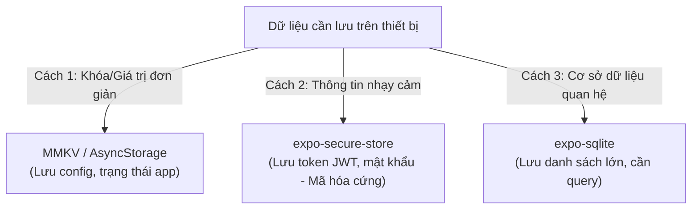

# Bài 08 - Offline Storage & Data Persistence (Lưu trữ ngoại tuyến)

## I. KHÁI QUÁT (OVERVIEW)

### 1. Tại sao cần lưu trữ dữ liệu ngoại tuyến (Offline) trên thiết bị di động?
Khác với trình duyệt Web (nơi máy tính thường có kết nối mạng ổn định qua Wifi/Cáp), điện thoại di động di chuyển liên tục qua các vùng có mạng yếu, mất mạng (như trong thang máy, tàu điện ngầm). Một ứng dụng di động chất lượng cao cần đảm bảo:
*   **Trải nghiệm mượt mà không gián đoạn (Offline-first):** Người dùng vẫn có thể đọc tin tức cũ, xem giỏ hàng đã tải, viết ghi chú mới ngay cả khi không có mạng.
*   **Bảo mật dữ liệu nhạy cảm:** Lưu trữ an toàn các thông tin đăng nhập (JWT Token, Private keys) để không cần bắt người dùng đăng nhập lại ở mỗi lần mở app.

Để giải quyết, React Native và Expo cung cấp các giải pháp lưu trữ dữ liệu cục bộ với nhiều cấp độ hiệu năng và cấu trúc khác nhau.



---

## II. CHI TIẾT KỸ THUẬT (DETAILED DEEP DIVE)

### 1. Phân tích so sánh các giải pháp lưu trữ cục bộ

#### a. AsyncStorage (Legacy)
*   **Cơ chế:** Lưu trữ key-value đơn giản dưới dạng chuỗi (strings).
*   **Hạn chế:** Tốc độ đọc ghi rất chậm vì hoạt động bất đồng bộ qua JSON Bridge cũ. Giới hạn dung lượng lưu trữ tối đa (thường khoảng 6MB trên Android).

#### b. MMKV (Tối ưu nhất cho Key-Value)
*   **Cơ chế:** Thư viện lưu trữ key-value viết bằng C++ kết nối trực tiếp qua JSI.
*   **Ưu điểm:** Tốc độ đọc ghi **nhanh gấp 30 lần** AsyncStorage, gọi hàm đồng bộ (synchronous) giúp loại bỏ từ khóa `await` trong code.
*   *Phù hợp với:* Lưu cấu hình theme, trạng thái cài đặt app, lưu cache tạm thời.

#### c. expo-secure-store (Lưu trữ bảo mật)
*   **Cơ chế:** Tự động gọi các cơ chế mã hóa phần cứng của hệ điều hành: **Keychain** trên iOS và **Keystore** trên Android.
*   *Phù hợp với:* Bắt buộc dùng để lưu trữ JWT Token đăng nhập, mã pin, khóa bảo mật.

#### d. expo-sqlite (Cơ sở dữ liệu quan hệ lớn)
*   **Cơ chế:** Hệ quản trị cơ sở dữ liệu SQLite thực tế nhúng trong app.
*   *Phù hợp với:* Ứng dụng ghi chú lớn, danh sách sản phẩm ngoại tuyến cần truy vấn SQL phức tạp (sort, filter).

---

## III. VÍ DỤ MINH HỌA VÀ PHÂN TÍCH CODE (CODE EXAMPLES & ANALYSIS)

### 1. Quản lý Đăng nhập an toàn & Cache dữ liệu qua SecureStore & MMKV
Dưới đây là một module quản lý Auth thực tế: Khi đăng nhập thành công, token được lưu an toàn trong `SecureStore`, còn thông tin hồ sơ của user được lưu cache nhanh trong `MMKV` (giả lập lưu trữ).

#### File: `/src/utils/storage.ts` (Thiết lập các kho lưu trữ)
```typescript
import * as SecureStore from 'expo-secure-store';

// Giả lập thư viện MMKV (nếu sử dụng thư viện react-native-mmkv thực tế)
class MMKVSimulator {
  private cache = new Map<string, string>();

  set(key: string, value: string) {
    this.cache.set(key, value);
    // Lưu vào bộ nhớ máy ngầm qua JSI
  }

  get(key: string): string | null {
    return this.cache.get(key) || null;
  }

  delete(key: string) {
    this.cache.delete(key);
  }
}

export const appStorage = new MMKVSimulator();

// 1. Hàm lưu token đăng nhập bảo mật (Mã hóa phần cứng)
export async function saveUserToken(token: string) {
  try {
    await SecureStore.setItemAsync('user_jwt_token', token, {
      keychainAccessible: SecureStore.WHEN_UNLOCKED // Chỉ đọc được khi điện thoại đã mở khóa screen lock
    });
  } catch (error) {
    console.error('Không thể lưu token an toàn:', error);
  }
}

// 2. Hàm đọc token bảo mật
export async function getUserToken(): Promise<string | null> {
  try {
    return await SecureStore.getItemAsync('user_jwt_token');
  } catch (error) {
    return null;
  }
}

// 3. Hàm xóa token khi đăng xuất
export async function deleteUserToken() {
  await SecureStore.deleteItemAsync('user_jwt_token');
}
```

#### File: `/src/components/AuthProfile.tsx` (Component sử dụng)
```tsx
import React, { useEffect, useState } from 'react';
import { StyleSheet, View, Text, Pressable } from 'react-native';
import { saveUserToken, getUserToken, appStorage, deleteUserToken } from '../utils/storage';

export const AuthProfile: React.FC = () => {
  const [token, setToken] = useState<string | null>(null);
  const [username, setUsername] = useState<string>('Khách');

  useEffect(() => {
    // Đọc token từ SecureStore bất đồng bộ
    getUserToken().then((savedToken) => {
      setToken(savedToken);
    });

    // Đọc username từ MMKV đồng bộ (không cần await)
    const cachedName = appStorage.get('username');
    if (cachedName) {
      setUsername(cachedName);
    }
  }, []);

  const handleFakeLogin = async () => {
    const fakeToken = 'jwt_secret_token_12345';
    const fakeUser = 'Nguyễn Văn A';

    // Lưu các thông tin tương ứng vào các vùng lưu trữ
    await saveUserToken(fakeToken);
    appStorage.set('username', fakeUser);

    setToken(fakeToken);
    setUsername(fakeUser);
  };

  const handleLogout = async () => {
    await deleteUserToken();
    appStorage.delete('username');
    setToken(null);
    setUsername('Khách');
  };

  return (
    <View style={styles.container}>
      <Text style={styles.text}>Xin chào: <Text style={styles.highlight}>{username}</Text></Text>
      <Text style={styles.tokenText}>
        Token bảo mật: {token ? '••••••••••••' : 'Chưa đăng nhập'}
      </Text>

      {token ? (
        <Pressable onPress={handleLogout} style={[styles.button, styles.btnLogout]}>
          <Text style={styles.btnText}>Đăng xuất</Text>
        </Pressable>
      ) : (
        <Pressable onPress={handleFakeLogin} style={styles.button}>
          <Text style={styles.btnText}>Đăng nhập giả lập</Text>
        </Pressable>
      )}
    </View>
  );
};

const styles = StyleSheet.create({
  container: {
    padding: 24,
    backgroundColor: '#ffffff',
    borderRadius: 16,
    borderWidth: 1,
    borderColor: '#e2e8f0',
    alignItems: 'center',
  },
  text: {
    fontSize: 16,
    color: '#334155',
  },
  highlight: {
    fontWeight: 'bold',
    color: '#2563eb',
  },
  tokenText: {
    fontSize: 13,
    color: '#64748b',
    marginTop: 8,
    marginBottom: 20,
  },
  button: {
    paddingVertical: 10,
    paddingHorizontal: 24,
    backgroundColor: '#2563eb',
    borderRadius: 8,
  },
  btnLogout: {
    backgroundColor: '#ef4444',
  },
  btnText: {
    color: '#ffffff',
    fontWeight: 'bold',
  }
});
```

---

## IV. LƯU Ý, CẠM BẪY VÀ QUY TẮC CỐT LÕI (PITFALLS & BEST PRACTICES)

### 1. Cạm bẫy lưu trữ thông tin nhạy cảm vào AsyncStorage/MMKV
*   **Vấn đề:** Lưu các thông tin nhạy cảm như access token, mật khẩu của người dùng, hoặc khóa API đối tác vào bộ nhớ AsyncStorage hoặc MMKV thông thường.
*   **Hậu quả:** Kẻ xấu có thể bẻ khóa (root máy) và đọc trộm file XML/JSON lưu trữ của app một cách dễ dàng.
*   ✅ *Best practice:* **Bắt buộc** sử dụng `expo-secure-store` cho toàn bộ các thông tin cần bảo mật. Gói này tự động mã hóa dữ liệu ở cấp độ phần cứng phần cứng điện thoại.

---

## 💡 5 QUY TẮC VÀNG VỀ OFFLINE STORAGE
1.  **Dùng SecureStore cho Token/Mật khẩu:** Tận dụng bộ khóa bảo vệ phần cứng (Keychain/Keystore) của hệ điều hành.
2.  **Dùng MMKV cho cache thông thường:** Đạt hiệu năng đọc ghi cao nhất và cú pháp gọi đồng bộ sạch sẽ.
3.  **Tránh dùng AsyncStorage cho dữ liệu lớn:** Giới hạn dung lượng và tốc độ truyền JSON Bridge cũ sẽ làm lag ứng dụng.
4.  **Thiết lập chính sách đồng bộ khi có mạng lại:** Đọc cờ kết nối mạng (NetInfo API) để tự động đẩy dữ liệu offline lên server khi có mạng lại.
5.  **Dùng SQLite cho danh sách dữ liệu có quan hệ:** Tận dụng sức mạnh truy vấn của SQL thay vì tự viết các vòng lặp filter mảng JSON lớn trong bộ nhớ.
