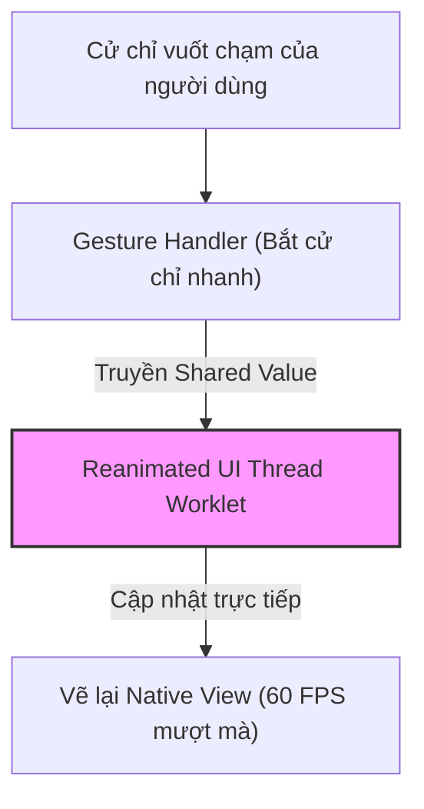

# Bài 09 - Animations & Gestures (Hoạt hình & Cử chỉ chạm)

## I. KHÁI QUÁT (OVERVIEW)

### 1. Sự quan trọng của Chuyển động trong Ứng dụng Di động
Ứng dụng di động được người dùng trực tiếp chạm ngón tay tương tác vào màn hình. Do đó, các chuyển động phản hồi (animations) và nhận diện cử chỉ (gestures) đóng vai trò quyết định giúp ứng dụng mang lại cảm giác mượt mà, tự nhiên và phản hồi nhanh:
*   Các hiệu ứng trượt mở rộng thông tin.
*   Cử chỉ vuốt để xóa (Swipe to delete).
*   Kéo thả các phần tử giao diện (Pan gesture).

#### Điểm nghẽn hiệu năng khi chạy Animation trên React Native:
Trong React Native truyền thống, nếu bạn chạy hiệu ứng bằng cách cập nhật state liên tục:
1.  Sự kiện vuốt từ UI Thread gửi qua Bridge sang JS Thread.
2.  JS Thread chạy hàm re-render tính toán giá trị mới của layout.
3.  Gửi giá trị mới qua Bridge xuống UI Thread vẽ lại.
*   *Hậu quả:* Quá trình truyền tin trễ này làm animation bị giật lag, drop FPS từ 60 xuống 15-20.

Để giải quyết triệt để, chúng ta sử dụng bộ đôi thư viện tiêu chuẩn vàng: **React Native Reanimated** (chạy animation trực tiếp trên UI Thread) và **React Native Gesture Handler** (nhận diện vuốt chạm tốc độ cao).



---

## II. CHI TIẾT KỸ THUẬT (DETAILED DEEP DIVE)

### 1. Cơ chế hoạt động của React Native Reanimated
Reanimated (phiên bản 2 và 3) giới thiệu các khái niệm đột phá:
*   **Shared Values (Giá trị dùng chung):** Các biến lưu trữ giá trị animation tồn tại ở cả môi trường JS và Native. Việc thay đổi Shared Value không gây re-render component React mà cập nhật trực tiếp thuộc tính của Native View.
*   **Worklets:** Các hàm JavaScript nhỏ được biên dịch đặc biệt để **chạy trực tiếp trên UI Thread** (chạy độc lập, không bị ảnh hưởng bởi JS Thread khi đang tính toán nặng).

---

### 2. Các cảm biến vuốt chạm trong Gesture Handler
Thư viện cung cấp các bộ nhận diện cử chỉ chuyên dụng:
*   `Gesture.Tap()`: Bắt click, double click.
*   `Gesture.Pan()`: Bắt thao tác kéo rê ngón tay (di chuyển phần tử).
*   `Gesture.Pinch()`: Bắt thao tác dùng 2 ngón tay thu phóng (zoom ảnh).

---

## III. VÍ DỤ MINH HỌA VÀ PHÂN TÍCH CODE (CODE EXAMPLES & ANALYSIS)

### 1. Triển khai Card kéo thả tự do (Draggable Card) mượt mà 60 FPS
Dưới đây là một ví dụ thực tế hoàn chỉnh, dựng một Card giao diện cho phép người dùng dùng ngón tay kéo thả di chuyển tự do xung quanh màn hình. Khi buông tay, card sẽ tự động nảy đàn hồi (Spring Animation) quay lại vị trí gốc ban đầu.

```tsx
// File: src/components/DraggableCard.tsx
import React from 'react';
import { StyleSheet, View, Text } from 'react-native';
import { Gesture, GestureDetector, GestureHandlerRootView } from 'react-native-gesture-handler';
import Animated, { 
  useSharedValue, 
  useAnimatedStyle, 
  withSpring 
} from 'react-native-reanimated';

export const DraggableCard: React.FC = () => {
  // 1. Khai báo các Shared Values lưu trữ toạ độ X và Y
  const translateX = useSharedValue(0);
  const translateY = useSharedValue(0);
  
  // Lưu lại vị trí khi bắt đầu kéo
  const contextX = useSharedValue(0);
  const contextY = useSharedValue(0);

  // 2. Thiết lập bộ nhận diện cử chỉ kéo rê (Pan Gesture)
  const panGesture = Gesture.Pan()
    .onStart(() => {
      // Lưu lại toạ độ hiện tại khi ngón tay vừa chạm vào
      contextX.value = translateX.value;
      contextY.value = translateY.value;
    })
    .onUpdate((event) => {
      // Cập nhật toạ độ di chuyển liên tục theo ngón tay
      translateX.value = contextX.value + event.translationX;
      translateY.value = contextY.value + event.translationY;
    })
    .onEnd(() => {
      // Khi buông ngón tay, nảy đàn hồi card quay lại vị trí trung tâm (0,0)
      translateX.value = withSpring(0, { damping: 15, stiffness: 120 });
      translateY.value = withSpring(0, { damping: 15, stiffness: 120 });
    });

  // 3. Liên kết Shared Values với Style của Native View thông qua useAnimatedStyle
  const animatedStyle = useAnimatedStyle(() => {
    return {
      transform: [
        { translateX: translateX.value },
        { translateY: translateY.value }
      ]
    };
  });

  return (
    // Bắt buộc phải bọc ngoài cùng bằng GestureHandlerRootView
    <GestureHandlerRootView style={styles.container}>
      <GestureDetector gesture={panGesture}>
        {/* Sử dụng Animated.View của Reanimated thay thế View thường */}
        <Animated.View style={[styles.card, animatedStyle]}>
          <Text style={styles.text}>Vuốt để kéo tôi!</Text>
        </Animated.View>
      </GestureDetector>
    </GestureHandlerRootView>
  );
};

const styles = StyleSheet.create({
  container: {
    flex: 1,
    alignItems: 'center',
    justifyContent: 'center',
    backgroundColor: '#f8fafc',
  },
  card: {
    width: 150,
    height: 150,
    backgroundColor: '#3b82f6',
    borderRadius: 24,
    alignItems: 'center',
    justifyContent: 'center',
    shadowColor: '#1e293b',
    shadowOpacity: 0.1,
    shadowRadius: 10,
    elevation: 5,
  },
  text: {
    color: '#ffffff',
    fontWeight: 'bold',
    fontSize: 14,
    textAlign: 'center',
    padding: 8,
  }
});
```

---

## IV. LƯU Ý, CẠM BẪY VÀ QUY TẮC CỐT LÕI (PITFALLS & BEST PRACTICES)

### 1. Lỗi quên bọc thẻ `GestureHandlerRootView` ở cấp cao nhất
*   **Vấn đề:** Khi bạn sử dụng các bộ nhận diện cử chỉ như `GestureDetector` nhưng không bọc component bên trong thẻ `<GestureHandlerRootView>`.
*   **Hậu quả:** Ứng dụng không báo lỗi biên dịch nhưng toàn bộ các cử chỉ vuốt, kéo, chạm sẽ bị đơ, không phản hồi tương tác.
*   ✅ *Best practice:* Bọc thẻ `<GestureHandlerRootView style={{ flex: 1 }}>` ngay tại file layout gốc của dự án (`app/_layout.tsx`).

---

## 💡 5 QUY TẮC VÀNG VỀ ANIMATIONS & GESTURES
1.  **Luôn dùng Reanimated cho animation phức tạp:** Đảm bảo hiệu năng chạy mượt mà trên UI Thread, tránh làm tắc nghẽn JS Thread.
2.  **Sử dụng Animated.View thay cho View thường:** Để có thể nhận các style động sinh ra từ `useAnimatedStyle`.
3.  **Khai báo `withSpring` cho chuyển động tự nhiên:** Mang lại cảm giác chuyển động đàn hồi giống thực tế vật lý thay vì chuyển động tuyến tính cứng nhắc (`withTiming`).
4.  **Bọc `GestureHandlerRootView` ở root layout:** Đảm bảo các cảm biến vuốt chạm hoạt động chính xác trên toàn bộ phạm vi ứng dụng.
5.  **Dùng Shared Values để thay thế useState:** Khi cần cập nhật giá trị chuyển động liên tục, tránh trigger re-render component React vô ích.
