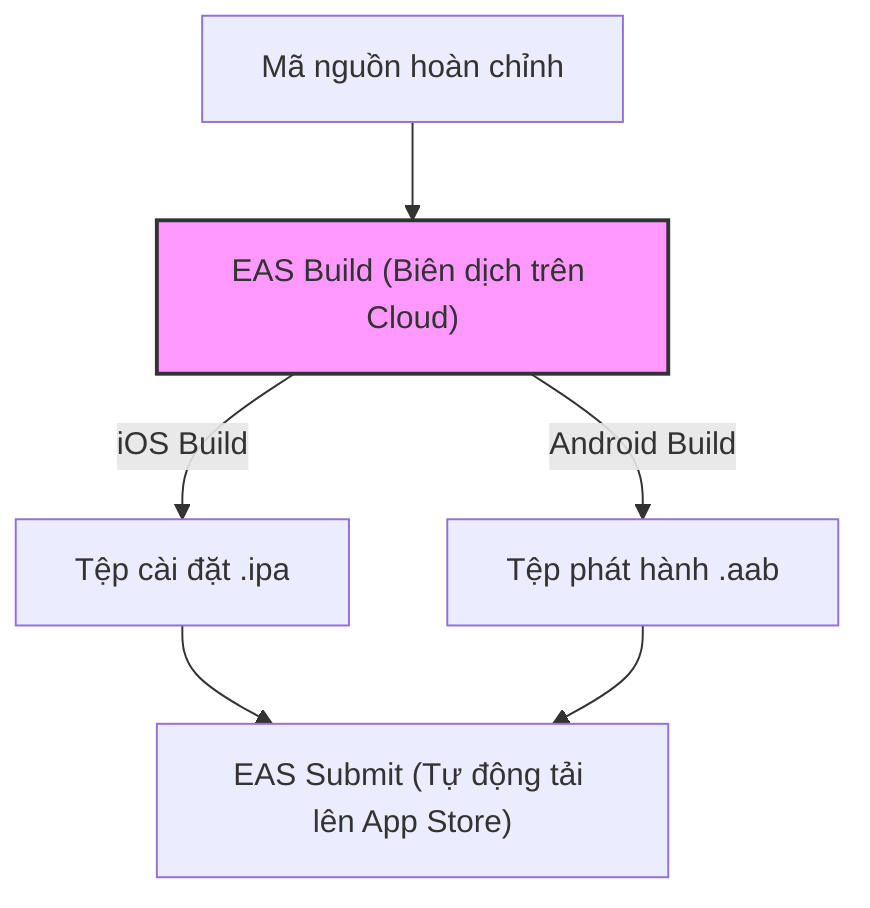

# Bài 10 - Build & Deployment with EAS (Đóng gói & Phát hành ứng dụng)

## I. KHÁI QUÁT (OVERVIEW)

### 1. Thách thức lớn khi phát hành ứng dụng di động lên Store
Sau khi hoàn thành việc phát triển ứng dụng di động bằng React Native, bước khó khăn nhất là đóng gói (build) phần mềm thành các tệp tin cài đặt thực tế (`.apk`/`.aab` cho Android, `.ipa` cho iOS) và phát hành chúng lên **Google Play Store** và **Apple App Store**:
*   **Cấu hình chứng chỉ bảo mật cực kỳ phức tạp:** Android yêu cầu tạo file Keystore và ký số. iOS yêu cầu tạo tài khoản Apple Developer, tạo **Provisioning Profiles**, **Certificates**, và khai báo định danh thiết bị.
*   **Yêu cầu tài nguyên phần cứng lớn:** Biên dịch code Java/Swift yêu cầu máy tính cấu hình mạnh. Biên dịch app iOS bắt buộc phải có máy Mac (Xcode).

**EAS** (Expo Application Services) giải quyết toàn bộ các rào cản trên bằng cách cung cấp hệ thống đóng gói và ký chứng chỉ tự động trên đám mây đám mây (Cloud Build & Auto-credentials management), hỗ trợ cập nhật ứng dụng tức thì không cần qua Store duyệt (OTA Updates).



---

## II. CHI TIẾT KỸ THUẬT (DETAILED DEEP DIVE)

### 1. Cấu hình tệp tin `eas.json`
Tệp tin `eas.json` nằm ở thư mục root của dự án, định nghĩa các hồ sơ đóng gói (**Build Profiles**) cho từng môi trường khác nhau:

```json
{
  "cli": {
    "version": ">= 5.0.0"
  },
  "build": {
    "development": {
      "developmentClient": true,
      "distribution": "internal"
    },
    "preview": {
      "distribution": "internal"
    },
    "production": {}
  },
  "submit": {
    "production": {}
  }
}
```

*   **`development`**: Tạo ra bản build chạy thử nghiệm nội bộ (Development Build), tích hợp sẵn menu gỡ lỗi để thay thế cho app Expo Go mặc định.
*   **`preview`**: Tạo bản build cài thử nghiệm thực tế (Ad-hoc / Internal sharing) để gửi cho các thành viên trong đội nhóm test trước khi đưa lên store.
*   **`production`**: Đóng gói tối ưu hóa mã nguồn ở chế độ sản phẩm, tự động ký số bằng chứng chỉ thật để sẵn sàng đẩy lên Store chính thức.

---

### 2. EAS Submit (Tự động gửi app lên Store)
Công cụ EAS Submit giúp bạn tự động hóa việc tải tệp tin đã build lên hệ thống Google Play Console và App Store Connect (TestFlight) thông qua Terminal mà không cần mở trình duyệt upload thủ công.

---

### 3. Cập nhật tức thì (OTA - Over-The-Air Updates)
Thông thường, mỗi khi sửa một lỗi nhỏ, bạn phải đóng gói lại app, gửi lên Store và chờ Apple/Google duyệt (mất từ 1 đến 3 ngày).
*   **EAS Update (OTA):** Khi bạn thay đổi code JavaScript/CSS/Images, bạn chỉ cần chạy lệnh xuất bản. Khi người dùng mở app trên điện thoại, app sẽ tự động tải phiên bản JS bundle mới nhất từ server Expo về chạy ngầm $\rightarrow$ Sửa lỗi tức thì trong vòng 30 giây.
*   *Hạn chế của OTA:* **Không thể sử dụng OTA** nếu bạn thay đổi cấu hình phần cứng trong `app.json` hoặc cài thêm thư viện mới chứa code Native (lúc này bắt buộc phải build lại tệp cài đặt mới gửi lên Store duyệt).

---

## III. VÍ DỤ MINH HỌA VÀ PHÂN TÍCH CODE (CODE EXAMPLES & ANALYSIS)

### 1. Quy trình từng bước đóng gói bản Release thử nghiệm Android & iOS bằng EAS CLI
Dưới đây là các bước chuẩn chỉ để đăng nhập, cấu hình chứng chỉ tự động và kích hoạt build app trên cloud bằng EAS.

#### Bước 1: Cài đặt công cụ EAS CLI toàn cục
```bash
npm install -g eas-cli
```

#### Bước 2: Đăng nhập tài khoản Expo
```bash
eas login
```

#### Bước 3: Khởi tạo cấu hình EAS cho dự án hiện tại
```bash
eas project:init
```
*   Lệnh này liên kết mã nguồn của bạn với dự án trên bảng điều khiển Expo Dashboard trực tuyến.

#### Bước 4: Kích hoạt đóng gói bản Preview thử nghiệm (Android/iOS)
```bash
# Đóng gói app Android dạng APK để cài trực tiếp lên điện thoại thật test
eas build --platform android --profile preview
```
*   **Quản lý chứng chỉ tự động:** EAS sẽ hỏi: *"Do you want us to generate a new Android Keystore for you?"* $\rightarrow$ Chọn **YES**. Expo sẽ tự động sinh mã khóa, ký số và lưu trữ chứng chỉ bảo mật an toàn trên Cloud của họ, giải phóng bạn khỏi việc tự quản lý file keystore thủ công.
*   Sau khi chạy xong (khoảng 5-10 phút trên server cloud), Terminal sẽ xuất ra một liên kết tải về dạng **mã QR**. Bạn chỉ cần dùng điện thoại quét mã QR này để tải trực tiếp file `.apk` về cài đặt trải nghiệm.

---

## IV. LƯU Ý, CẠM BẪY VÀ QUY TẮC CỐT LÕI (PITFALLS & BEST PRACTICES)

### 1. Cạm bẫy lỗi chứng chỉ iOS Provisioning Profile khi build Production
*   **Vấn đề:** Khi build phiên bản Production cho iOS (`eas build --platform ios --profile production`), bạn bắt buộc phải có tài khoản Apple Developer (phí 99$/năm). Nếu tài khoản của bạn bị hết hạn hoặc cấu hình sai thiết bị test.
*   **Hậu quả:** Tiến trình build cloud sẽ báo lỗi biên dịch mã ký số và thất bại giữa chừng.
*   ✅ *Best practice:* Sử dụng tính năng quản lý tự động của EAS bằng cách cấp quyền kết nối tạm thời tới tài khoản Apple của bạn:
    ```bash
    eas credentials
    ```
    Expo sẽ tự động tương tác với cổng thông tin Apple Developer để cấu hình chuẩn xác các file Provisioning Profiles tương ứng mà không làm lỗi.

---

## 💡 5 QUY TẮC VÀNG VỀ BUILD & DEPLOYMENT
1.  **Giao phó chứng chỉ cho Expo quản lý:** Tránh lỗi làm mất file Keystore Android hoặc cấu hình sai Certificate iOS.
2.  **Dùng bản build Development thay thế Expo Go:** Khi dự án bắt đầu tích hợp các thư viện native tùy biến bên ngoài.
3.  **Tận dụng EAS Update (OTA) để sửa lỗi nhanh:** Cập nhật ngay các lỗi logic JS/CSS cho người dùng trong vòng 30 giây mà không cần qua store duyệt lại.
4.  **Luôn nâng chỉ số `versionCode` trước khi build mới:** Tăng giá trị `versionCode` (Android) và `buildNumber` (iOS) trong `app.json` ở mỗi lượt đóng gói mới để Store không từ chối nhận file trùng phiên bản.
5.  **Chạy test kỹ lưỡng trên bản build Preview:** Đảm bảo hiệu năng hoạt động thực tế trên điện thoại thật luôn mượt mà trước khi kích hoạt lệnh submit lên Store chính thức.
