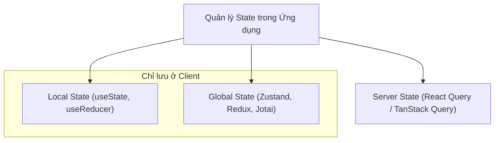

## I. KHÁI QUÁT (OVERVIEW)

### 1. Phân loại Trạng thái (State Taxonomy) trong Ứng dụng Modern Frontend
Trong phát triển ứng dụng Frontend hiện đại, việc quản lý dữ liệu (State) là bài toán phức tạp nhất. Nếu không phân loại rõ ràng, bạn sẽ dễ rơi vào cái bẫy truyền props lòng vòng (**Prop Drilling**) hoặc lạm dụng lưu trữ chung làm ứng dụng chạy cực kỳ chậm chạp.

Chúng ta cần phân biệt rõ 3 nhóm State chính:
1.  **Local State (Trạng thái cục bộ):** Chỉ dùng bên trong 1 component duy nhất (như trạng thái mở/đóng modal, giá trị ô nhập liệu). Khai báo bằng `useState`.
2.  **Global/Client State (Trạng thái toàn cục phía client):** Dữ liệu được chia sẻ giữa nhiều trang hoặc nhiều component không cùng cấp (như theme sáng/tối, thông tin giỏ hàng, ngôn ngữ hiển thị).
3.  **Server Cache State (Trạng thái phản chiếu từ Server):** Dữ liệu được tải về từ database của Server (như danh sách sản phẩm, hồ sơ người dùng). Dữ liệu này có tính chất bất đồng bộ và cần có cơ chế cache, revalidate (làm mới).



---

## II. CHI TIẾT KỸ THUẬT (DETAILED DEEP DIVE)

### 1. Vấn đề Prop Drilling và Giới hạn của Context API
*   **Prop Drilling:** Là việc bạn phải truyền một prop đi qua 5-6 tầng component trung gian chỉ để đưa dữ liệu từ component cha xuống component cháu ở đáy, mặc dù các component trung gian hoàn toàn không dùng đến prop đó.
*   **Hạn chế của React Context API:** Mặc dù giúp giải quyết Prop Drilling, Context API **không phải là công cụ quản lý state hiệu năng cao**. Khi giá trị Context thay đổi, **tất cả các component con có kết nối (useContext) đều bị ép buộc re-render lại từ đầu**, cho dù chúng chỉ sử dụng một phần nhỏ dữ liệu không đổi trong Context đó.

---

### 2. Sự tiến hóa của các kiến trúc Quản lý State

#### a. Redux (Flux Architecture - Cổ điển)
*   **Cơ chế:** Dữ liệu lưu trữ tập trung ở một kho duy nhất (**Single Source of Truth - Store**). Mọi thay đổi dữ liệu bắt buộc phải đi qua một luồng dữ liệu một chiều nghiêm ngặt: Dispatch một `Action` $\rightarrow$ đi qua hàm `Reducer` tính toán $\rightarrow$ tạo ra State mới.
*   *Hạn chế:* Viết quá nhiều code rườm rà (Boilerplate) và khó cấu hình cho người mới.

#### b. Zustand (Flux cải tiến - Tiêu chuẩn hiện đại)
*   **Cơ chế:** Giữ nguyên tư duy store tập trung và luồng dữ liệu một chiều của Redux nhưng tối giản hóa cú pháp tối đa. Sử dụng mô hình **Atomic Selector** giúp các component đăng ký chính xác thuộc tính cần dùng và chỉ re-render khi thuộc tính đó thực sự thay đổi.

#### c. Jotai (Atomic State)
*   **Cơ chế:** Chia nhỏ state thành các phần tử nguyên tử (**Atoms**) nhỏ lẻ độc lập lồng vào nhau, tương tự như các tế bào. Thay đổi atom này chỉ ảnh hưởng trực tiếp đến component dùng nó, không chạm vào các atom khác.

---

## III. VÍ DỤ MINH HỌA VÀ PHÂN TÍCH CODE (CODE EXAMPLES & ANALYSIS)

### 1. Phân biệt re-render giữa React Context và Zustand
Dưới đây là một ví dụ so sánh trực quan. Chúng ta thiết lập một store lưu trữ thông tin Giỏ hàng (chứa 2 thuộc tính: `cartCount` - số lượng sản phẩm và `cartColor` - màu sắc icon giỏ hàng).

#### Cách 1: Sử dụng React Context (Gây dư thừa render)
```tsx
// File: src/context/CartContext.tsx
import React, { createContext, useState, useContext } from 'react';

const CartContext = createContext<any>(null);

export const CartProvider = ({ children }: { children: React.ReactNode }) => {
  const [cartCount, setCartCount] = useState(0);
  const [cartColor, setCartColor] = useState('blue');

  return (
    <CartContext.Provider value={{ cartCount, setCartCount, cartColor, setCartColor }}>
      {children}
    </CartContext.Provider>
  );
};

// Component con chỉ dùng màu sắc icon
export const CartIcon = () => {
  const { cartColor } = useContext(CartContext);
  console.log('CartIcon re-render do Context thay đổi!'); 
  // ⚠️ LỖI: Component này sẽ bị re-render vô ích mỗi khi click tăng số lượng cartCount!
  return <Text style={{ color: cartColor }}>🛒 Giỏ hàng</Text>;
};
```

#### Cách 2: Sử dụng Zustand (Tối ưu tuyệt đối)
```tsx
// File: src/store/useCartStore.ts
import { create } from 'zustand';

interface CartState {
  cartCount: number;
  cartColor: string;
  increaseCount: () => void;
  changeColor: (color: string) => void;
}

export const useCartStore = create<CartState>((set) => ({
  cartCount: 0,
  cartColor: 'blue',
  increaseCount: () => set((state) => ({ cartCount: state.cartCount + 1 })),
  changeColor: (color) => set({ cartColor: color })
}));

// Component con sử dụng Atomic Selector để chọn lọc dữ liệu
export const OptimizedCartIcon = () => {
  // Chỉ lắng nghe duy nhất sự thay đổi của thuộc tính cartColor
  const cartColor = useCartStore((state) => state.cartColor);
  
  console.log('OptimizedCartIcon re-render!');
  // ✅ TỐI ƯU: Khi click tăng số lượng cartCount, log này KHÔNG bị in ra. Component không re-render!
  return <span style={{ color: cartColor }}>🛒 Giỏ hàng</span>;
};
```

---

## IV. LƯU Ý, CẠM BẪY VÀ QUY TẮC CỐT LÕI (PITFALLS & BEST PRACTICES)

### 1. Cạm bẫy lưu trữ Server Cache vào Global Client Store
*   **Vấn đề:** Nhiều lập trình viên cố gắng fetch danh sách sản phẩm từ API và lưu trữ nó vào trong store Zustand/Redux để dùng chung ở nhiều trang.
*   **Hậu quả:** Bạn phải tự viết thêm rất nhiều logic quản lý trạng thái loading, lỗi (error), tự viết code hẹn giờ làm mới dữ liệu (stale time) khi dữ liệu phía server thay đổi.
*   ✅ *Best practice:* **Tách biệt hoàn toàn:** Dùng **Zustand** cho các dữ liệu tương tác cục bộ của client (mở/đóng menu, giỏ hàng tạm, theme) và dùng **React Query** cho các dữ liệu tải về từ API/Server Database.

---

## 💡 5 QUY TẮC VÀNG VỀ QUẢN LÝ STATE
1.  **Luôn bắt đầu bằng Local State:** Chỉ nâng state lên cấp toàn cục (Global) khi có ít nhất 2 component ở các nhánh khác nhau thực sự cần dùng chung dữ liệu đó.
2.  **Dùng Context API cho các cấu hình tĩnh:** Thích hợp cho các dữ liệu hầu như không thay đổi trong vòng đời app (như ngôn ngữ i18n, thông tin User đã đăng nhập).
3.  **Dùng Atomic Selector trong Zustand:** Tránh việc gọi destructing `const { stateA, stateB } = useStore()` vì sẽ làm mất cơ chế so sánh nông và gây re-render thừa.
4.  **Tách biệt Client State và Server State:** Dùng React Query quản lý việc gọi API và lưu cache, dùng Zustand cho các trạng thái giao diện client.
5.  **Luôn giữ cho store mỏng nhẹ:** Tránh lưu các dữ liệu tính toán phái sinh (ví dụ: không lưu tổng tiền giỏ hàng `totalPrice`, hãy chỉ lưu mảng sản phẩm và tự tính tổng tiền bằng biến thường lúc render).
