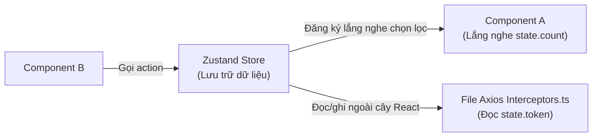

## I. KHÁI QUÁT (OVERVIEW)

### 1. Triết lý thiết kế của Zustand
Trong tiếng Đức, **Zustand** có nghĩa là "trạng thái". Đây là một thư viện quản lý state toàn cục siêu nhẹ (dung lượng chỉ khoảng **1.5 KB** sau khi nén), hoạt động dựa trên triết lý **tự do và tối giản**:
*   **Không cần Provider bọc ngoài:** Bạn có thể gọi đọc/ghi dữ liệu từ store ở bất kỳ đâu mà không cần bọc toàn bộ ứng dụng trong một thẻ `<Provider>` giống như Redux hay Context API.
*   **Không dùng React Hook dưới gầm:** Zustand hoạt động độc lập ở tầng JavaScript thuần túy, cho phép bạn đọc và thay đổi state ngay cả bên ngoài phạm vi của các React Component (ví dụ: đọc token đăng nhập từ store trực tiếp trong file cấu hình Axios Interceptors).
*   **Cơ chế Atomic Selectors:** Các component tự đăng ký chính xác thuộc tính cần dùng $\rightarrow$ Tối ưu hóa hiệu năng re-render tuyệt đối.



---

## II. CHI TIẾT KỸ THUẬT (DETAILED DEEP DIVE)

### 1. Cách thức hoạt động của Atomic Selectors và So sánh Nông (Shallow)
Khi bạn gọi hook của Zustand, bạn truyền vào một hàm lọc (**selector**):
```typescript
const count = useCounterStore((state) => state.count);
```
Zustand sử dụng cơ chế so sánh nông (**Shallow Comparison**) để kiểm tra xem giá trị được lọc ra có thay đổi so với lần render trước hay không.
*   *Lưu ý:* Nếu selector của bạn trả về một **đối tượng mới** hoặc mảng mới ở mỗi lần chạy:
    ```typescript
    // ⚠️ LỖI: Selector trả về object mới, gây re-render liên tục cho component!
    const { name, age } = useUserStore((state) => ({ name: state.name, age: state.age }));
    ```
    Hãy chuyển sang sử dụng hàm so sánh nông **`shallow`** được cung cấp bởi Zustand để ép buộc so sánh giá trị bên trong object thay vì so sánh địa chỉ vùng nhớ:
    ```typescript
    import { useStore } from 'zustand';
    import { useShallow } from 'zustand/react/shallow';
    
    const { name, age } = useUserStore(useShallow((state) => ({ name: state.name, age: state.age })));
    ```

---

### 2. Các Middleware tích hợp sẵn mạnh mẽ
Zustand hỗ trợ mở rộng tính năng thông qua cơ chế bọc các Middleware:
1.  **`persist`**: Tự động lưu trữ và đồng bộ hóa toàn bộ hoặc một phần dữ liệu của store xuống bộ nhớ máy (`localStorage` trên Web hoặc `AsyncStorage`/`MMKV` trên Mobile).
2.  **`immer`**: Cho phép bạn viết code thay đổi state theo kiểu đột biến (mutating code) giống như viết JS thuần, Immer sẽ tự động chuyển đổi nó thành state bất biến (immutable) dưới gầm.
3.  **`devtools`**: Tích hợp trực tiếp với công cụ Redux DevTools trên trình duyệt để bạn theo dõi lịch sử thay đổi của store (Time-travel debugging).

---

## III. VÍ DỤ MINH HỌA VÀ PHÂN TÍCH CODE (CODE EXAMPLES & ANALYSIS)

### 1. Triển khai Giỏ hàng lưu trữ tự động (Persistent Cart Store) tích hợp Immer
Dưới đây là một ví dụ thực tế hoàn chỉnh dựng store Giỏ hàng (Cart) hỗ trợ thêm/xóa sản phẩm, tự động tính toán tổng số lượng, tự động lưu thông tin giỏ hàng vào `localStorage` và viết code mutate mượt mà bằng Immer.

```tsx
// File: src/store/useCartStore.ts
import { create } from 'zustand';
import { persist, createJSONStorage } from 'zustand/middleware';
import { immer } from 'zustand/middleware/immer';

interface CartItem {
  id: string;
  name: string;
  quantity: number;
}

interface CartState {
  items: CartItem[];
  addItem: (item: Omit<CartItem, 'quantity'>) => void;
  removeItem: (id: string) => void;
  clearCart: () => void;
  // Getters (Tính toán phái sinh)
  getTotalItems: () => number;
}

// Kết hợp cả Middleware persist và immer
export const useCartStore = create<CartState>()(
  persist(
    immer((set, get) => ({
      items: [],

      // 1. Thêm sản phẩm (Viết code dạng mutate trực tiếp nhờ Immer)
      addItem: (newItem) =>
        set((state) => {
          const existingItem = state.items.find((i) => i.id === newItem.id);
          if (existingItem) {
            existingItem.quantity += 1; // Sửa trực tiếp thuộc tính, không cần spread array
          } else {
            state.items.push({ ...newItem, quantity: 1 });
          }
        }),

      // 2. Xóa sản phẩm
      removeItem: (id) =>
        set((state) => {
          state.items = state.items.filter((i) => i.id !== id);
        }),

      clearCart: () =>
        set((state) => {
          state.items = [];
        }),

      // 3. Sử dụng get() để truy cập các giá trị hiện tại trong store
      getTotalItems: () => {
        return get().items.reduce((total, item) => total + item.quantity, 0);
      }
    })),
    {
      name: 'shopping-cart-storage', // Tên khóa lưu trong localStorage
      storage: createJSONStorage(() => localStorage) // Sử dụng localStorage
    }
  )
);
```

#### Sử dụng store trong Component React:
```tsx
// File: src/components/CartWidget.tsx
import React from 'react';
import { useCartStore } from '../store/useCartStore';

export const CartWidget = () => {
  // Chỉ render lại component này khi độ dài mảng items thay đổi
  const totalItems = useCartStore((state) => state.getTotalItems());
  const clearCart = useCartStore((state) => state.clearCart);

  return (
    <div className="p-4 bg-slate-100 rounded-lg flex items-center justify-between">
      <span className="font-bold text-slate-700">Giỏ hàng: {totalItems} sản phẩm</span>
      <button 
        onClick={clearCart}
        className="px-3 py-1 bg-red-500 text-white rounded text-sm font-semibold hover:bg-red-600"
      >
        Xóa sạch
      </button>
    </div>
  );
};
```

---

## IV. LƯU Ý, CẠM BẪY VÀ QUY TẮC CỐT LÕI (PITFALLS & BEST PRACTICES)

### 1. Đọc và Ghi dữ liệu Store bên ngoài React Component (Non-React Context)
*   **Vấn đề:** Đôi khi bạn cần thay đổi hoặc đọc dữ liệu từ store ở các file helper JS thuần (nhập token vào header Axios khi gọi API).
*   ✅ *Best practice:* Sử dụng trực tiếp các hàm API của store:
    *   **`useCartStore.getState()`**: Đọc trạng thái hiện tại (đồng bộ).
    *   **`useCartStore.setState()`**: Ghi/cập nhật trực tiếp dữ liệu.
    *   **`useCartStore.subscribe()`**: Lắng nghe sự thay đổi của store từ bên ngoài.

```typescript
// File: src/api/client.ts
import axios from 'axios';
import { useAuthStore } from '../store/useAuthStore';

export const apiClient = axios.create({
  baseURL: 'https://api.example.com'
});

// Chèn token vào header request
apiClient.interceptors.request.use((config) => {
  // Đọc trực tiếp từ store Zustand không cần react hook!
  const token = useAuthStore.getState().token;
  if (token) {
    config.headers.Authorization = `Bearer ${token}`;
  }
  return config;
});
```

---

## 💡 5 QUY TẮC VÀNG VỀ ZUSTAND
1.  **Dùng selector đơn lẻ:** Lọc chính xác giá trị cần hiển thị để ngăn chặn re-render dây chuyền vô ích.
2.  **Sử dụng `useShallow` khi lấy nhiều giá trị:** Ép buộc so sánh nông các thuộc tính bên trong object.
3.  **Tách biệt Actions ra khỏi State dữ liệu:** Thiết kế các hàm action rõ ràng và gom nhóm để dễ quản lý.
4.  **Tận dụng immer để viết code mutate:** Giảm thiểu sự phức tạp của cú pháp spread objects (`...state`) lồng nhau.
5.  **Dùng `getState()` bên ngoài React:** Tương tác linh hoạt với store ở mọi tầng hệ thống từ helper, API client đến Router Guards.
